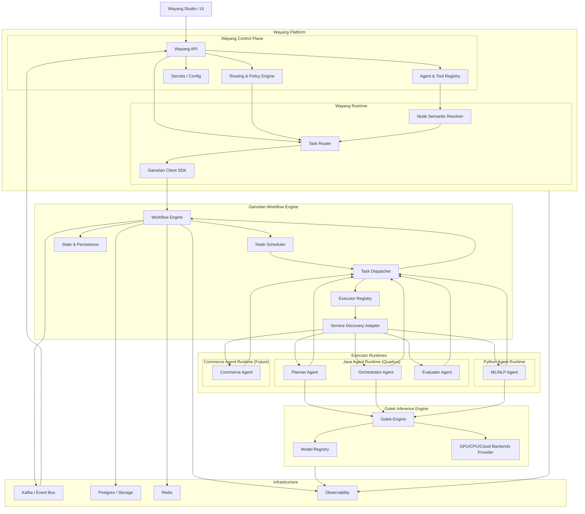
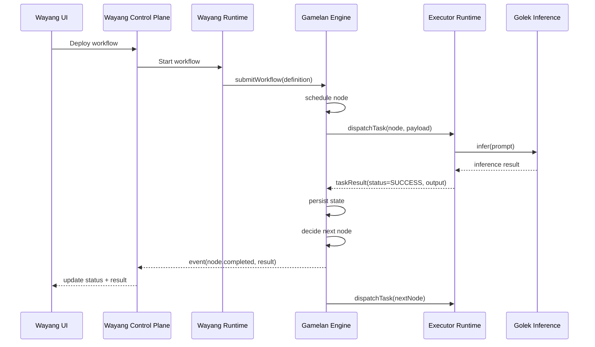
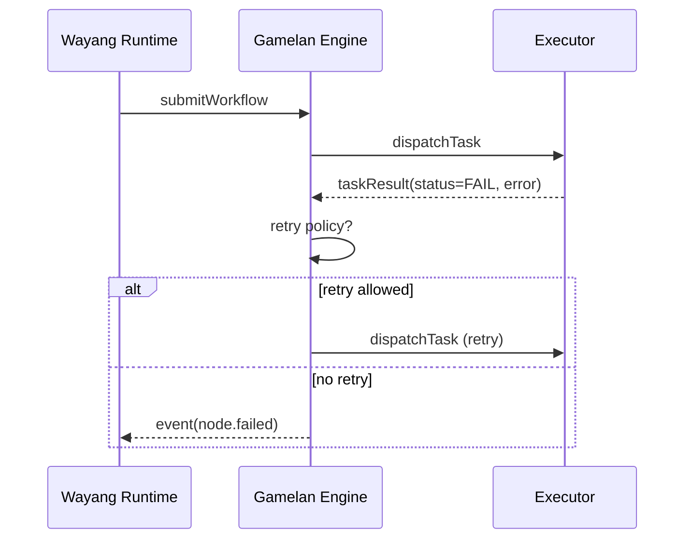
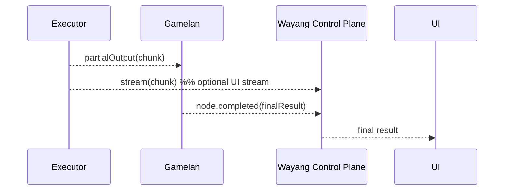
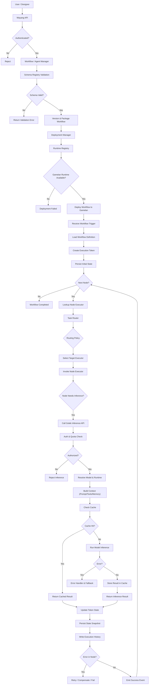

---

## ✅  BIG PICTURE ARCHITECTURE 



---

## 🧠 Core Rules Embedded in This Diagram

* **Executors NEVER talk to Wayang directly**
* **All results go:**

  ```
  Executor → Gamelan → Wayang
  ```
* **Wayang = semantic brain**
* **Gamelan = execution brain**
* **Golek = inference brain**

---

Alright, next step: let’s make the **runtime behavior crystal clear** with a
👉 **SEQUENCE DIAGRAM (Executor → Gamelan → Wayang)**

This answers your earlier confusion about:

* who sends result
* who sends status
* who notifies UI

---

## ✅ SEQUENCE DIAGRAM — NORMAL EXECUTION



---

## ❌ WHAT DOES NOT HAPPEN

```
Executor ──X──► Wayang   (NO)
Executor ──X──► UI       (NO)
```

Executor ONLY talks to:

```
Executor → Gamelan
```

---

## 🟥 FAILURE & RETRY SCENARIO



Wayang:

* sees failure
* updates UI
* may request human intervention
* but does NOT retry itself

---

## 🟡 STREAMING (chat / HITL case)

Optional side-channel:



Authority is still:

```
final result = from Gamelan
```

---

## 🧠 FINAL RULES (LOCK THESE)

1. **Executor → Gamelan** = result + status
2. **Gamelan → Wayang** = state + semantic result
3. **Wayang → UI** = visualization + policy
4. **Retries live in Gamelan**
5. **Routing lives in Wayang**
6. **Inference lives in Golek**

---

---

## 🔁 Wayang → Gamelan → Golek — Combined Flowchart



---

## 🧠 Mental model

### Wayang (Control Plane)

```
Design → Validate → Package → Deploy
```

### Gamelan (Execution Plane)

```
Token → Node → Route → Execute → Persist → Loop
```

### Golek (Inference Plane)

```
Auth → Model → Context → Infer → Cache → Return
```

---

## 🧩 What this diagram proves architecturally

✔ Clean separation of concerns
✔ Works in microservices OR single-JVM
✔ Supports retries, fallbacks, and async
✔ Multi-model & multi-provider
✔ Fully agentic + BPMN + EIP compatible

This is a **very strong architecture story** for:

* docs
* investors
* OSS README
* thesis / paper
* conference talk

---

