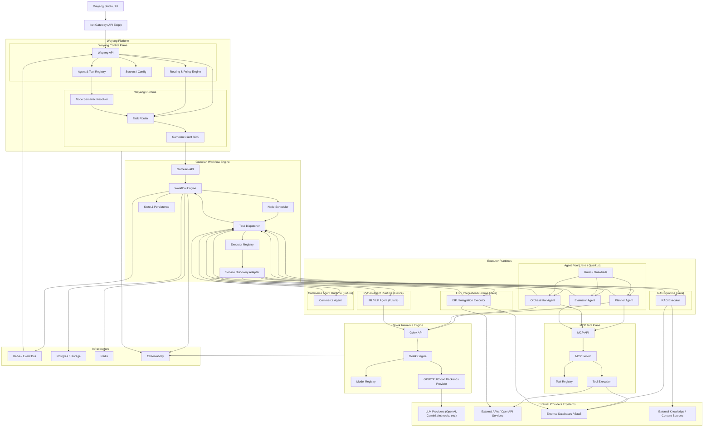
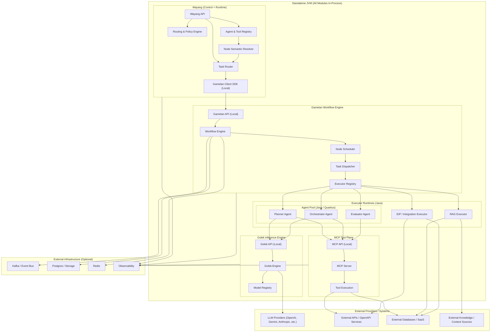
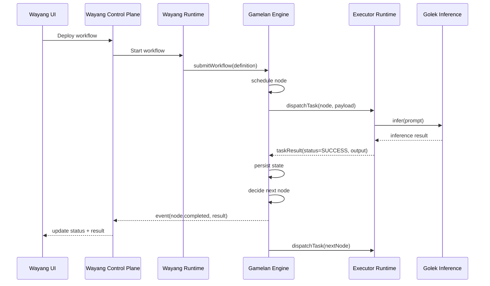
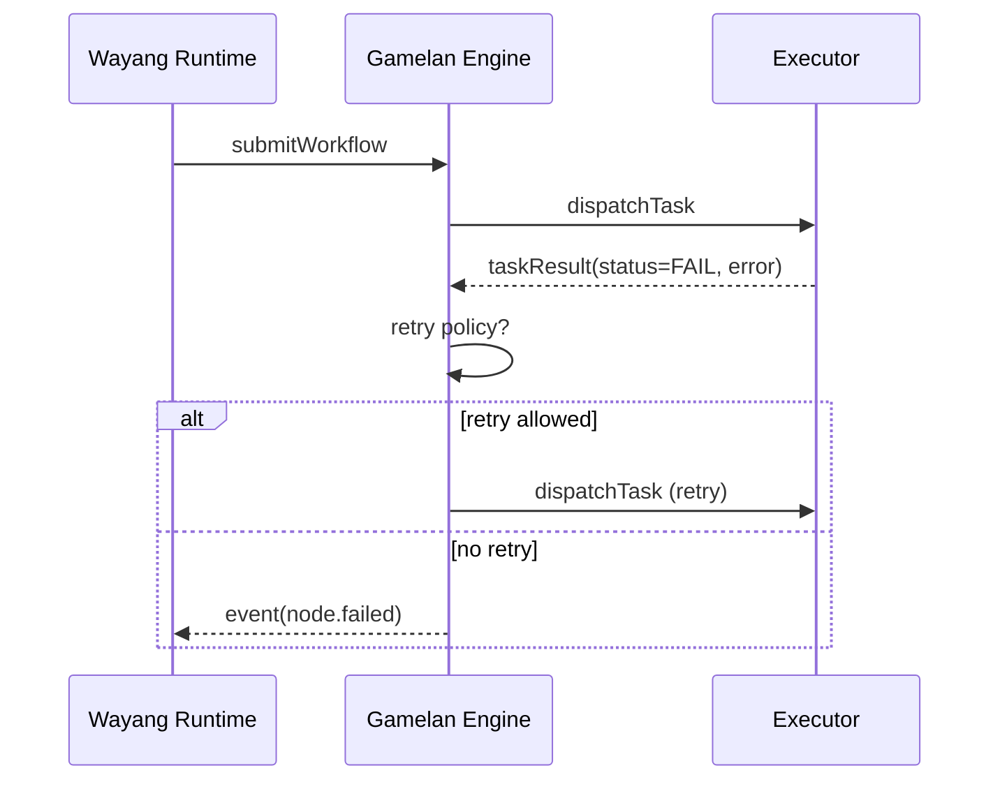
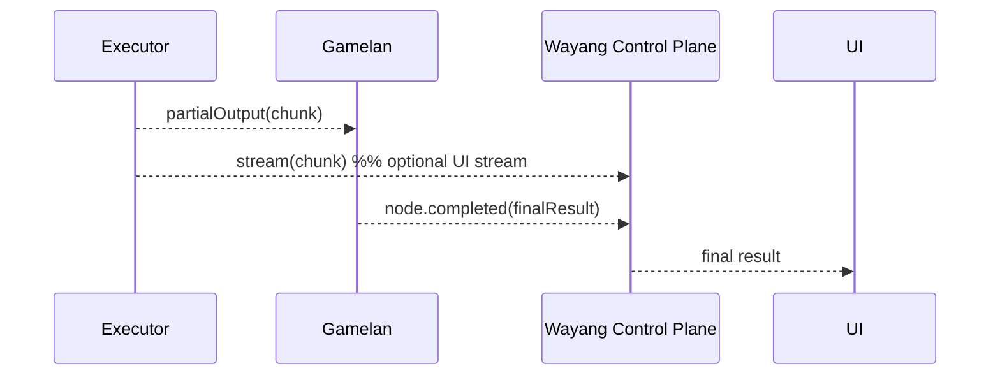
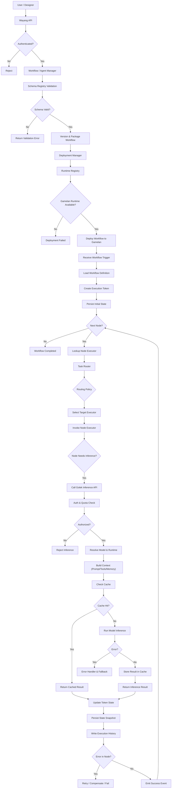
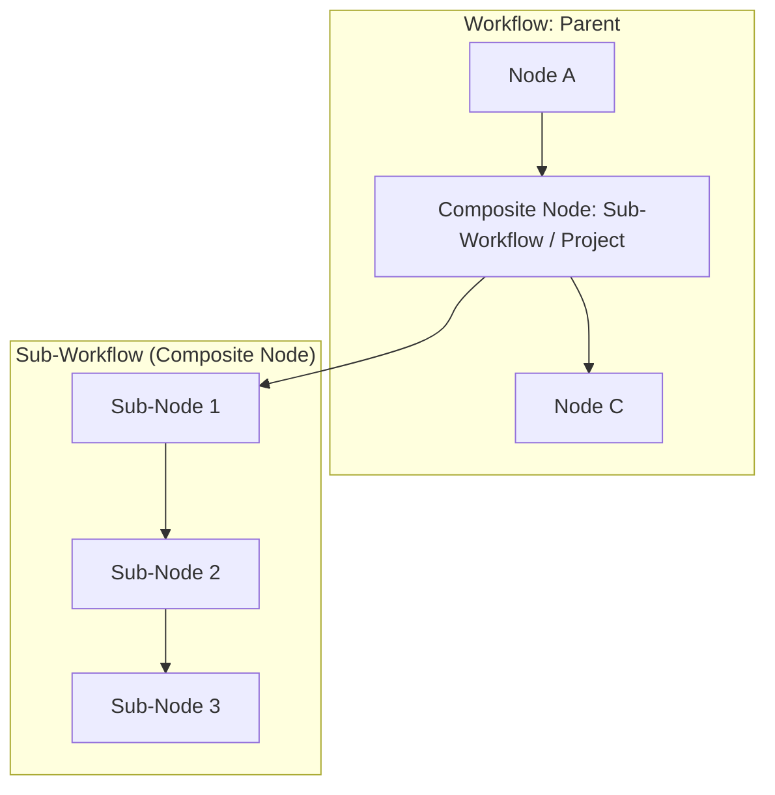
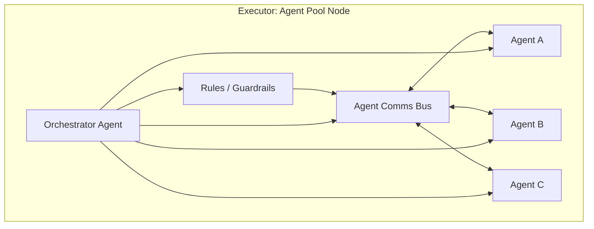
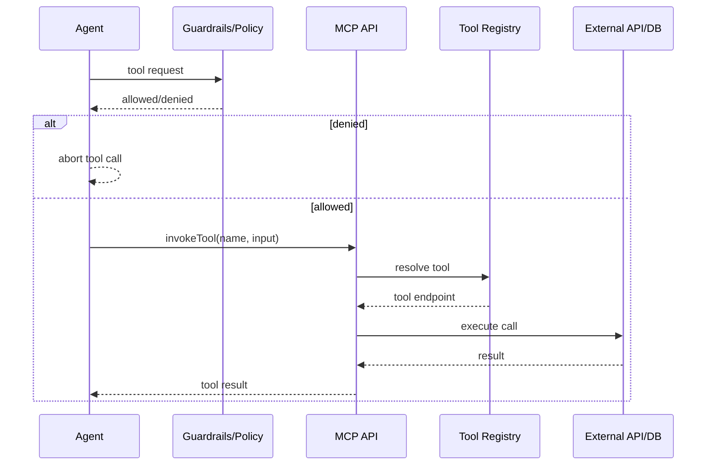

---

## ✅  BIG PICTURE ARCHITECTURE 



---

## ✅ BIG PICTURE (Standalone / Single-JVM Mode)

All core modules run in the same JVM process for minimal latency and simpler deployment.



Notes:
* In standalone mode, APIs are local interfaces (no network hop).
* Gateway (Iket) can be optional or used as an external edge if needed.
* External infra can be embedded or mocked for dev, but is typically external in prod.

---

## 🗺️ Legend

* **(Future)** = planned but not yet implemented in this repo

---

## 🧠 Core Rules Embedded in This Diagram

* **Executors NEVER talk to Wayang directly**
* **All results go:**

  ```
  Executor → Gamelan → Wayang
  ```
* **Wayang = semantic brain**
* **Gamelan = execution brain**
* **Golek = inference brain**
* **Iket = gateway edge**
* **MCP = tool plane**

---

Alright, next step: let’s make the **runtime behavior crystal clear** with a
👉 **SEQUENCE DIAGRAM (Executor → Gamelan → Wayang)**

This answers your earlier confusion about:

* who sends result
* who sends status
* who notifies UI

---

## ✅ SEQUENCE DIAGRAM — NORMAL EXECUTION



---

## ❌ WHAT DOES NOT HAPPEN

```
Executor ──X──► Wayang   (NO)
Executor ──X──► UI       (NO)
```

Executor ONLY talks to:

```
Executor → Gamelan
```

---

## 🟥 FAILURE & RETRY SCENARIO



Wayang:

* sees failure
* updates UI
* may request human intervention
* but does NOT retry itself

---

## 🟡 STREAMING (chat / HITL case)

Optional side-channel:



Authority is still:

```
final result = from Gamelan
```

---

## 🧠 FINAL RULES (LOCK THESE)

1. **Executor → Gamelan** = result + status
2. **Gamelan → Wayang** = state + semantic result
3. **Wayang → UI** = visualization + policy
4. **Retries live in Gamelan**
5. **Routing lives in Wayang**
6. **Inference lives in Golek**
7. **API edge lives in Iket**
8. **Tools live in MCP**

---

---

## 🔁 Wayang → Gamelan → Golek — Combined Flowchart



---

## 🧠 Mental model

### Wayang (Control Plane)

```
Design → Validate → Package → Deploy
```

### Gamelan (Execution Plane)

```
Token → Node → Route → Execute → Persist → Loop
```

### Golek (Inference Plane)

```
Auth → Model → Context → Infer → Cache → Return
```

---

## 🧩 What this diagram proves architecturally

✔ Clean separation of concerns
✔ Works in microservices OR single-JVM
✔ Supports retries, fallbacks, and async
✔ Multi-model & multi-provider
✔ Fully agentic + BPMN + EIP compatible

---

## 🧭 Current Implementation Mapping (Repo)

This section ties diagram nodes to concrete folders in this repo so the diagram stays grounded in code.

* **Wayang UI** → `wayang-ui/` (designer, admin, CLI, core UI libs)
* **Iket Gateway** → `gateway-iket/` (Go gateway + enterprise variant + admin UI)
* **Wayang Control Plane** → `wayang/core/wayang-control-plane-core`
* **Wayang Orchestrator / Gamelan Client** → `wayang/core/wayang-orchestrator-*`
* **Gamelan API** → `workflow-gamelan/core/gamelan-runtime-core`, `workflow-gamelan/protocol/*`
* **Gamelan Engine** → `workflow-gamelan/core/gamelan-engine`
* **Gamelan Registry & Runtime** → `workflow-gamelan/core/gamelan-executor-registry`, `workflow-gamelan/core/gamelan-runtime-core`
* **Executor Runtimes (Java)** → `wayang/executors/` (agent, rag, tool, eip, guardrails, memory, vector, etc.)
* **Golek API / Inference Engine** → `inference-golek/` (core, provider, adapter, runtime)
* **MCP API / Tool Plane** → `mcp-kulit/`

This is a **very strong architecture story** for:

* docs
* investors
* OSS README
* thesis / paper
* conference talk

---

## 🧩 Complex Cases

### 1) Composite Node (Sub-Workflow / Project as a Node)



### 2) Agent Pool Coordination (Orchestrator + Agent-to-Agent)



### 3) Tool Invocation (Agent → MCP → External System)


