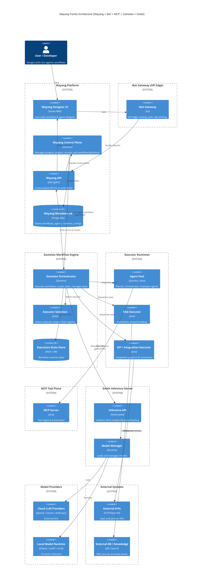
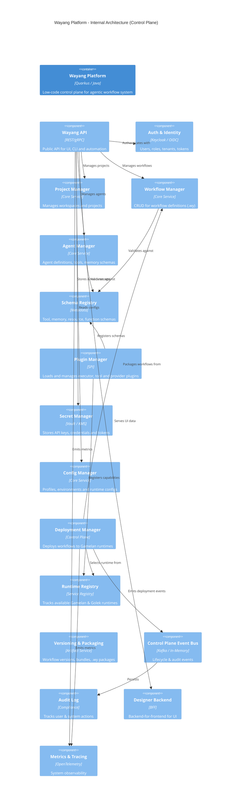
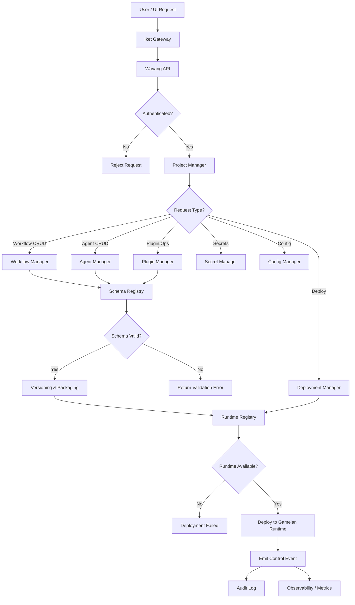
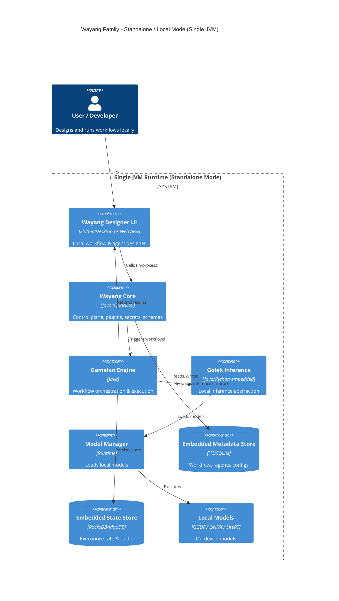
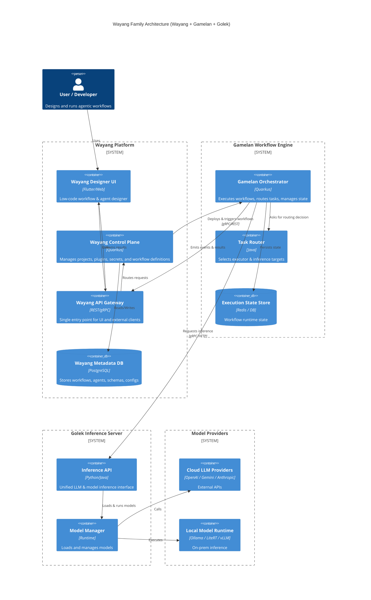
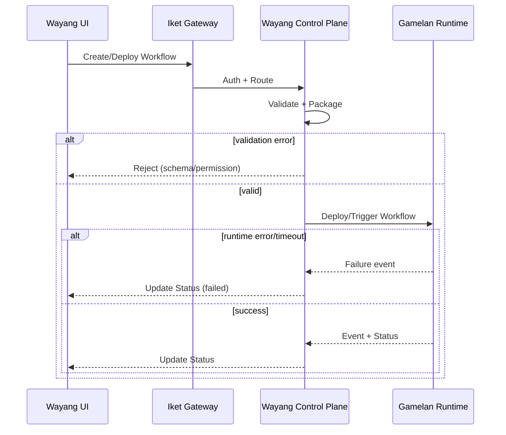

# WAYANG AGENTIC AI BUILDER


## Wayang family

* Users + UI
* Iket Gateway (API Edge)
* Wayang Control Plane
* MCP Tool Plane
* Gamelan Workflow Engine
* Executor Runtimes (Agent Pool, RAG, EIP)
* Golek Inference Server
* Model Providers (cloud & local)
* External Systems (APIs, DBs, Knowledge)
* Storage + Messaging




---

### How this maps to your product vision

**Wayang = Control Plane**

* UI designer
* Plugin system
* Workflow definition (`.wy`)
* Secrets & schema registry
* Runs behind Iket Gateway (API edge)

**Gamelan = Data Plane / Orchestration**

* Executes nodes
* Executor selection & dispatch
* Retry, circuit breaker, compensation
* Multi-executor (agent, BPMN, EIP, NLP, time-series)

**MCP = Tool Plane**

* Tool registry & execution
* Shared tool surface for agents, RAG, and integrations

**Golek = Inference Plane**

* LLM + ML inference
* Multi-provider abstraction
* Local & cloud models
* Future: batching, KV cache, LoRA, quantized models

---


### Wayang Internal Modules




### Wayang Flowchart




## Wayang Deployment Standalone Mode


- ✅ Wayang + Gamelan + Golek
- ✅ All run **inside one JVM process**
- ✅ No network hops
- ✅ Uses embedded DB & local models
- ✅ Ideal for: dev, desktop, edge, offline

---

### 🧩 Wayang Family — Standalone / Local (Single JVM)



---

## 🧠 Key Architectural Meaning

### 🔹 Single Process

Everything runs inside:

```
wayang-standalone.jar
```

No:
- ❌ Kubernetes
- ❌ gRPC
- ❌ API Gateway
- ❌ External DB

---

### 🔹 Embedded Replacements

| Distributed Mode | Standalone Mode     |
| ---------------- | ------------------- |
| PostgreSQL       | H2 / SQLite         |
| Redis            | RocksDB / MapDB     |
| Golek service    | In-process lib      |
| REST/gRPC        | Direct method calls |
| Ollama/vLLM      | LiteRT / ONNX / JNI |

---

### 🔹 Use cases

✅ Local workflow testing
✅ Desktop AI apps
✅ Edge devices
✅ Offline agent runtime
✅ Developer mode
✅ “Portable Wayang” (USB / ZIP runtime)

---


## Wayang Deployment Cloud Mode



---

## 🧭 Current Implementation Mapping (Repo)

* **Wayang UI** → `wayang-ui/`
* **Iket Gateway** → `gateway-iket/`
* **Wayang Control Plane** → `wayang/core/wayang-control-plane-core`
* **Wayang Orchestrator / Gamelan Client** → `wayang/core/wayang-orchestrator-*`
* **MCP Tool Plane** → `mcp-kulit/`
* **Gamelan Engine** → `workflow-gamelan/core/gamelan-engine`
* **Gamelan Runtime API** → `workflow-gamelan/core/gamelan-runtime-core`
* **Executor Runtimes (Java)** → `wayang/executors/`
* **Golek Inference Engine** → `inference-golek/`

---

## 🔁 Wayang Control Plane — Sequence Diagram


