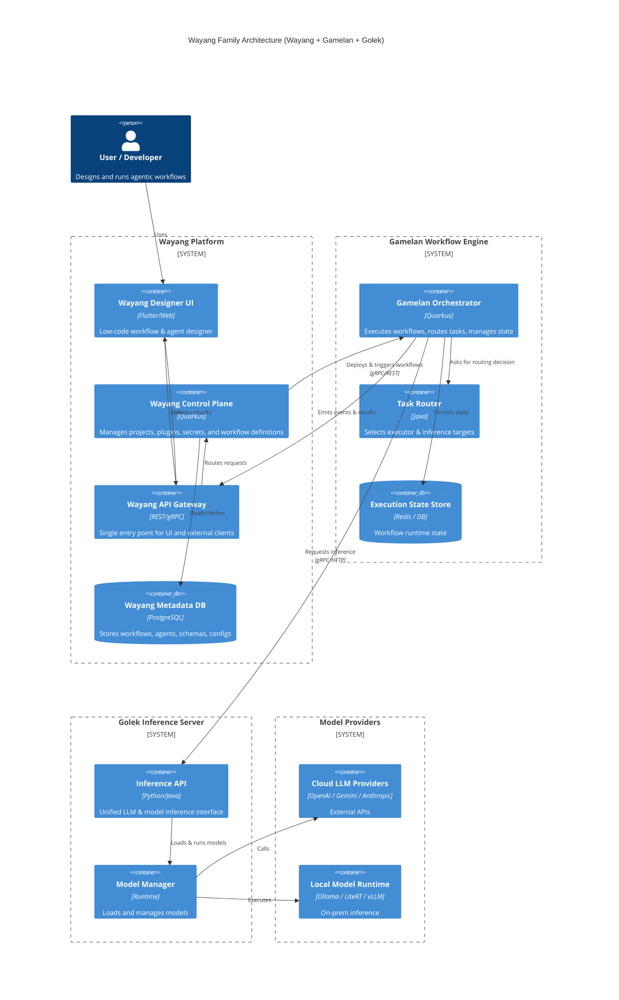
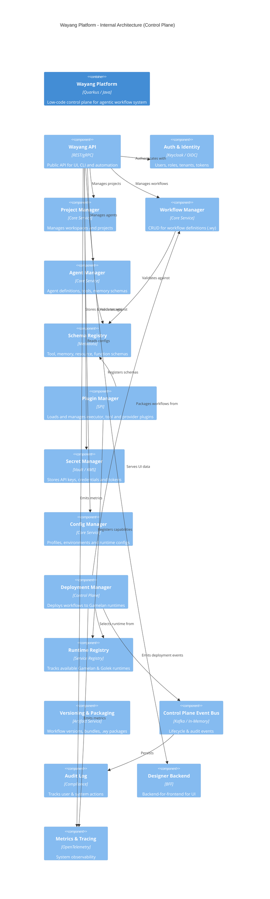
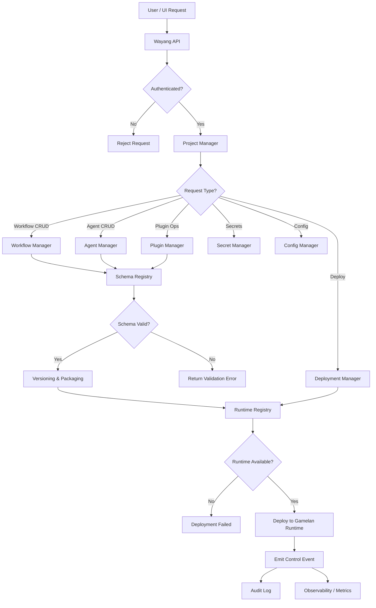
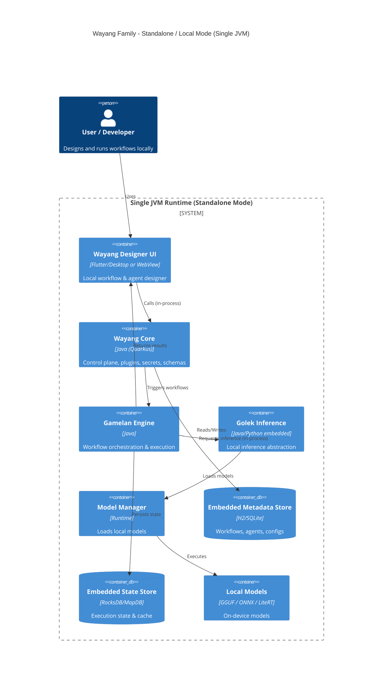

# WAYANG AGENTIC AI BUILDER


## Wayang family

* Users + UI
* Wayang Control Plane
* Gamelan Workflow Engine
* Golek Inference Server
* Model Providers (cloud & local)
* Storage + Messaging



```mermaid
C4Container
title Wayang Family Architecture (Wayang + Gamelan + Golek)

Person(user, "User / Developer", "Designs and runs agentic workflows")

System_Boundary(wayang, "Wayang Platform") {

    Container(ui, "Wayang Designer UI", "Flutter/Web", "Low-code workflow & agent designer")

    Container(control, "Wayang Control Plane", "Quarkus", "Manages projects, plugins, secrets, and workflow definitions")

    Container(api, "Wayang API Gateway", "REST/gRPC", "Single entry point for UI and external clients")

    ContainerDb(meta, "Wayang Metadata DB", "PostgreSQL", "Stores workflows, agents, schemas, configs")
}

System_Boundary(gamelan, "Gamelan Workflow Engine") {
    Container(orchestrator, "Gamelan Orchestrator", "Quarkus", "Executes workflows, routes tasks, manages state")
    Container(router, "Task Router", "Java", "Selects executor & inference targets")
    ContainerDb(state, "Execution State Store", "Redis / DB", "Workflow runtime state")
}

System_Boundary(golek, "Golek Inference Server") {
    Container(inference, "Inference API", "Python/Java", "Unified LLM & model inference interface")
    Container(modelmgr, "Model Manager", "Runtime", "Loads and manages models")
}

System_Boundary(models, "Model Providers") {
    Container(cloud, "Cloud LLM Providers", "OpenAI / Gemini / Anthropic", "External APIs")
    Container(local, "Local Model Runtime", "Ollama / LiteRT / vLLM", "On-prem inference")
}

Rel(user, ui, "Uses")
Rel(ui, api, "Calls")
Rel(api, control, "Routes requests")
Rel(control, meta, "Reads/Writes")

Rel(control, orchestrator, "Deploys & triggers workflows", "gRPC/REST")
Rel(orchestrator, router, "Asks for routing decision")
Rel(orchestrator, state, "Persists state")

Rel(orchestrator, inference, "Requests inference", "gRPC/HTTP")
Rel(inference, modelmgr, "Loads & runs models")

Rel(modelmgr, cloud, "Calls")
Rel(modelmgr, local, "Executes")

Rel(orchestrator, api, "Emits events & results")
Rel(api, ui, "Streams results")
```

---

### How this maps to your product vision

**Wayang = Control Plane**

* UI designer
* Plugin system
* Workflow definition (`.wy`)
* Secrets & schema registry

**Gamelan = Data Plane / Orchestration**

* Executes nodes
* Routing policies
* Retry, circuit breaker, compensation
* Multi-executor (agent, BPMN, EIP, NLP, time-series)

**Golek = Inference Plane**

* LLM + ML inference
* Multi-provider abstraction
* Local & cloud models
* Future: batching, KV cache, LoRA, quantized models

---


### Wayang Internal Modules


```mermaid
C4Component
title Wayang Platform - Internal Architecture (Control Plane)

Container(wayang, "Wayang Platform", "Quarkus / Java", "Low-code control plane for agentic workflow system")

Component(api, "Wayang API", "REST/gRPC", "Public API for UI, CLI and automation")

Component(auth, "Auth & Identity", "Keycloak / OIDC", "Users, roles, tenants, tokens")

Component(projectMgr, "Project Manager", "Core Service", "Manages workspaces and projects")

Component(workflowMgr, "Workflow Manager", "Core Service", "CRUD for workflow definitions (.wy)")

Component(agentMgr, "Agent Manager", "Core Service", "Agent definitions, tools, memory schemas")

Component(schemaRegistry, "Schema Registry", "Metadata", "Tool, memory, resource, function schemas")

Component(pluginMgr, "Plugin Manager", "SPI", "Loads and manages executor, tool and provider plugins")

Component(secretMgr, "Secret Manager", "Vault / KMS", "Stores API keys, credentials and tokens")

Component(configMgr, "Config Manager", "Core Service", "Profiles, environments and runtime configs")

Component(deployMgr, "Deployment Manager", "Control Plane", "Deploys workflows to Gamelan runtimes")

Component(runtimeRegistry, "Runtime Registry", "Service Registry", "Tracks available Gamelan & Golek runtimes")

Component(versionMgr, "Versioning & Packaging", "Artifact Service", "Workflow versions, bundles, .wy packages")

Component(eventBus, "Control Plane Event Bus", "Kafka / In-Memory", "Lifecycle & audit events")

Component(auditLog, "Audit Log", "Compliance", "Tracks user & system actions")

Component(uiBackend, "Designer Backend", "BFF", "Backend-for-frontend for UI")

Component(observability, "Metrics & Tracing", "OpenTelemetry", "System observability")

Rel(api, auth, "Authenticates with")
Rel(api, projectMgr, "Manages projects")
Rel(api, workflowMgr, "Manages workflows")
Rel(api, agentMgr, "Manages agents")

Rel(workflowMgr, schemaRegistry, "Validates against")
Rel(agentMgr, schemaRegistry, "Validates against")

Rel(pluginMgr, schemaRegistry, "Registers schemas")
Rel(pluginMgr, runtimeRegistry, "Registers capabilities")

Rel(api, secretMgr, "Stores & reads secrets")
Rel(api, configMgr, "Reads configs")

Rel(deployMgr, runtimeRegistry, "Selects runtime from")
Rel(deployMgr, workflowMgr, "Packages workflows from")

Rel(deployMgr, eventBus, "Emits deployment events")
Rel(eventBus, auditLog, "Persists")

Rel(api, uiBackend, "Serves UI data")
Rel(api, observability, "Emits metrics")
Rel(deployMgr, observability, "Emits metrics")

```


### Wayang Flowchart


```mermaid
flowchart TD
    A[User / UI Request] --> B[Wayang API]

    B --> C{Authenticated?}
    C -- No --> C1[Reject Request]
    C -- Yes --> D[Project Manager]

    D --> E{Request Type?}

    E -- Workflow CRUD --> F[Workflow Manager]
    E -- Agent CRUD --> G[Agent Manager]
    E -- Plugin Ops --> H[Plugin Manager]
    E -- Secrets --> I[Secret Manager]
    E -- Config --> J[Config Manager]
    E -- Deploy --> K[Deployment Manager]

    F --> L[Schema Registry]
    G --> L

    L --> M{Schema Valid?}
    M -- No --> M1[Return Validation Error]
    M -- Yes --> N[Versioning & Packaging]

    N --> O[Runtime Registry]
    O --> P{Runtime Available?}

    P -- No --> P1[Deployment Failed]
    P -- Yes --> Q[Deploy to Gamelan Runtime]

    Q --> R[Emit Control Event]

    R --> S[Audit Log]
    R --> T[Observability / Metrics]

    H --> L
    K --> O

```


## Wayang Deployment Standalone Mode


- ‚úÖ Wayang + Gamelan + Golek
- ‚úÖ All run **inside one JVM process**
- ‚úÖ No network hops
- ‚úÖ Uses embedded DB & local models
- ‚úÖ Ideal for: dev, desktop, edge, offline

---

### 🧩 Wayang Family — Standalone / Local (Single JVM)


```mermaid
C4Container
title Wayang Family - Standalone / Local Mode (Single JVM)

Person(user, "User / Developer", "Designs and runs workflows locally")

System_Boundary(jvm, "Single JVM Runtime (Standalone Mode)") {

    Container(ui, "Wayang Designer UI", "Flutter/Desktop or WebView", "Local workflow & agent designer")

    Container(core, "Wayang Core", "Java (Quarkus)", "Control plane, plugins, secrets, schemas")

    Container(workflow, "Gamelan Engine", "Java", "Workflow orchestration & execution")

    Container(inference, "Golek Inference", "Java/Python embedded", "Local inference abstraction")

    Container(modelmgr, "Model Manager", "Runtime", "Loads local models")

    ContainerDb(meta, "Embedded Metadata Store", "H2/SQLite", "Workflows, agents, configs")

    ContainerDb(state, "Embedded State Store", "RocksDB/MapDB", "Execution state & cache")

    Container(localModels, "Local Models", "GGUF / ONNX / LiteRT", "On-device models")
}

Rel(user, ui, "Uses")
Rel(ui, core, "Calls (in-process)")
Rel(core, meta, "Reads/Writes")

Rel(core, workflow, "Triggers workflows")
Rel(workflow, state, "Persists state")

Rel(workflow, inference, "Requests inference (in-process)")
Rel(inference, modelmgr, "Loads models")
Rel(modelmgr, localModels, "Executes")

Rel(workflow, ui, "Returns results")
```

---

## 🧠 Key Architectural Meaning

### üîπ Single Process

Everything runs inside:

```
wayang-standalone.jar
```

No:
- ‚ùå Kubernetes
- ‚ùå gRPC
- ‚ùå API Gateway
- ‚ùå External DB

---

### üîπ Embedded Replacements

| Distributed Mode | Standalone Mode     |
| ---------------- | ------------------- |
| PostgreSQL       | H2 / SQLite         |
| Redis            | RocksDB / MapDB     |
| Golek service    | In-process lib      |
| REST/gRPC        | Direct method calls |
| Ollama/vLLM      | LiteRT / ONNX / JNI |

---

### üîπ Use cases

‚úÖ Local workflow testing
‚úÖ Desktop AI apps
‚úÖ Edge devices
‚úÖ Offline agent runtime
‚úÖ Developer mode
✅ “Portable Wayang” (USB / ZIP runtime)

---


## Wayang Deployment Cloud Mode


```mermaid

C4Container
title Wayang Family Architecture (Wayang + Gamelan + Golek)

Person(user, "User / Developer", "Designs and runs agentic workflows")

System_Boundary(wayang, "Wayang Platform") {

    Container(ui, "Wayang Designer UI", "Flutter/Web", "Low-code workflow & agent designer")

    Container(control, "Wayang Control Plane", "Quarkus", "Manages projects, plugins, secrets, and workflow definitions")

    Container(api, "Wayang API Gateway", "REST/gRPC", "Single entry point for UI and external clients")

    ContainerDb(meta, "Wayang Metadata DB", "PostgreSQL", "Stores workflows, agents, schemas, configs")
}

System_Boundary(gamelan, "Gamelan Workflow Engine") {
    Container(orchestrator, "Gamelan Orchestrator", "Quarkus", "Executes workflows, routes tasks, manages state")
    Container(router, "Task Router", "Java", "Selects executor & inference targets")
    ContainerDb(state, "Execution State Store", "Redis / DB", "Workflow runtime state")
}

System_Boundary(golek, "Golek Inference Server") {
    Container(inference, "Inference API", "Python/Java", "Unified LLM & model inference interface")
    Container(modelmgr, "Model Manager", "Runtime", "Loads and manages models")
}

System_Boundary(models, "Model Providers") {
    Container(cloud, "Cloud LLM Providers", "OpenAI / Gemini / Anthropic", "External APIs")
    Container(local, "Local Model Runtime", "Ollama / LiteRT / vLLM", "On-prem inference")
}

Rel(user, ui, "Uses")
Rel(ui, api, "Calls")
Rel(api, control, "Routes requests")
Rel(control, meta, "Reads/Writes")

Rel(control, orchestrator, "Deploys & triggers workflows", "gRPC/REST")
Rel(orchestrator, router, "Asks for routing decision")
Rel(orchestrator, state, "Persists state")

Rel(orchestrator, inference, "Requests inference", "gRPC/HTTP")
Rel(inference, modelmgr, "Loads & runs models")

Rel(modelmgr, cloud, "Calls")
Rel(modelmgr, local, "Executes")

Rel(orchestrator, api, "Emits events & results")
Rel(api, ui, "Streams results")

```


