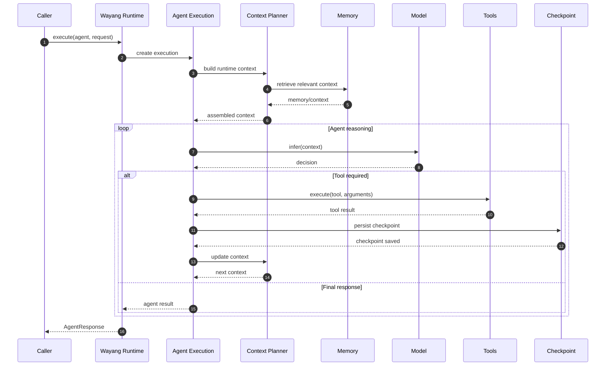
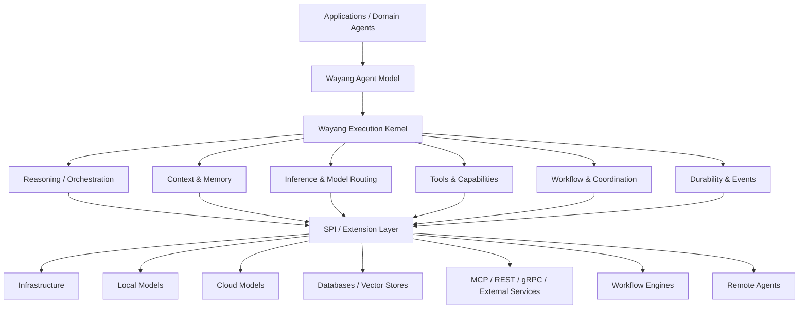
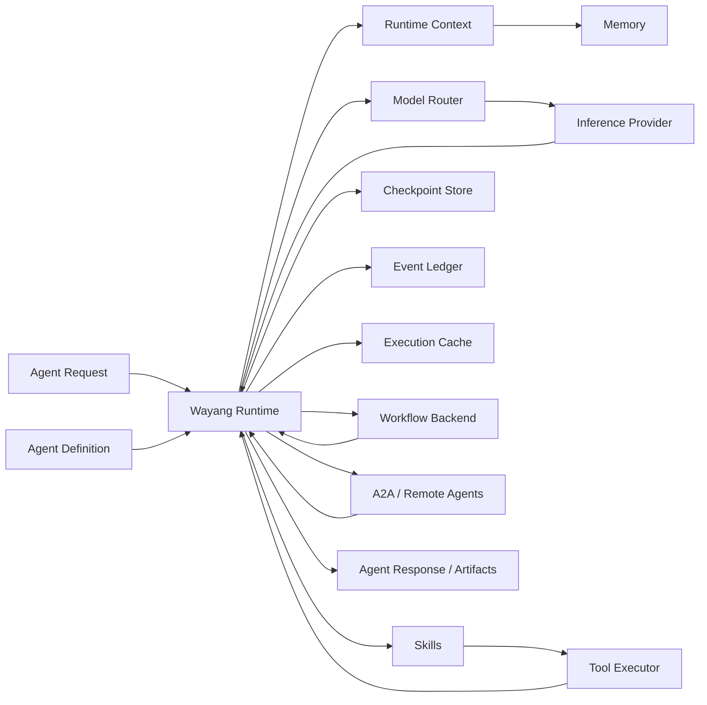

# 1. What is Wayang?

> **Wayang** is an extensible agent runtime and framework for building, executing, coordinating, and integrating intelligent agents through a modular execution architecture.

Wayang provides the runtime foundation between an **agent definition** and the systems required to execute that agent: models, tools, memory, context, orchestration, workflows, checkpoints, events, and external agents.

The central idea is that an agent should not be implemented as a monolithic application.

Instead, an agent is assembled from a set of reusable runtime capabilities:

```text
                    ┌──────────────────────┐
                    │      Agent           │
                    │  Definition + Goal   │
                    └──────────┬───────────┘
                               │
                               ▼
                    ┌──────────────────────┐
                    │   Wayang Runtime     │
                    │                      │
                    │  Execution Kernel    │
                    └──────────┬───────────┘
                               │
             ┌─────────────────┼─────────────────┐
             │                 │                 │
             ▼                 ▼                 ▼
        ┌─────────┐       ┌─────────┐      ┌──────────┐
        │ Models  │       │  Tools  │      │  Memory  │
        └─────────┘       └─────────┘      └──────────┘
             │                 │                 │
             └─────────────────┼─────────────────┘
                               │
                               ▼
                    ┌──────────────────────┐
                    │     Agent Result     │
                    │ Response / Artifact  │
                    └──────────────────────┘
```

The runtime implementation currently exposes `DefaultWayangRuntime` as the top-level Wayang execution entry point. Its synchronous execution path creates an execution context, delegates to the execution engine, and maps the resulting execution result into an `AgentResponse`; asynchronous execution runs the same path asynchronously.

---

## 1.1 The Problem Wayang Solves

Building an intelligent agent normally requires much more than connecting an application to an LLM.

A production agent may need:

* an inference model;
* model/provider selection;
* runtime context construction;
* tools;
* tool permissions;
* memory;
* retrieval;
* orchestration;
* execution budgets;
* retries and timeouts;
* checkpoints;
* event history;
* caching;
* workflows;
* distributed agents;
* authentication and tenancy;
* observability;
* external protocols;
* durable execution.

Without a runtime abstraction, these concerns tend to become tightly coupled inside individual applications.

Wayang separates these concerns into runtime components and extension points.

Conceptually:

$$
\text{Agent Application}
\neq
\text{Agent Runtime}
\neq
\text{Model}
\neq
\text{Tool}
\neq
\text{Memory}
$$

Instead:

$$
\boxed{
\text{Agent}
=
\text{Definition}
+
\text{Execution Policy}
+
\text{Capabilities}
+
\text{Runtime Context}
}
$$

This separation is one of the foundations of Wayang.

---

# 1.2 Wayang in One Sentence

A concise definition is:

> **Wayang is a modular runtime kernel that turns agent definitions and requests into controlled, observable, extensible executions.**

The runtime is responsible for coordinating the execution environment rather than forcing every agent implementation to reinvent that infrastructure.

---

# 1.3 Wayang Is a Runtime, Not Just an LLM Wrapper

Wayang should not be understood as simply:

```text
Application
    │
    ▼
LLM API
```

Its execution model is closer to:

```text
Application
    │
    ▼
┌───────────────────────────────┐
│         Wayang Runtime        │
│                               │
│  Agent Definition             │
│  Execution Context            │
│  Context Planning             │
│  Memory                       │
│  Model Routing                │
│  Tool Execution               │
│  Orchestration                │
│  Checkpointing                │
│  Event Ledger                 │
│  Execution Cache              │
│  Resource / Budget Controls   │
└───────────────┬───────────────┘
                │
        ┌───────┼────────┐
        ▼       ▼        ▼
      Model    Tools   Workflow
```

The current execution service explicitly wires together providers, model routing, runtime-context planning, memory management, execution caching, context providers, event ledger support, checkpoints, and tool execution.

This means Wayang is intended to provide the **execution substrate** on which different agents and higher-level products can be built.

---

# 1.4 The Core Wayang Abstraction

At the highest level, an execution can be represented as:

$$
E = F(A, R, C, P, B)
$$

where:

* \(A\) = Agent Definition
* \(R\) = Agent Request
* \(C\) = Runtime Context
* \(P\) = available providers/capabilities
* \(B\) = execution budget/policy
* \(E\) = Agent Execution

The execution then produces:

$$
E \rightarrow Result
$$

where the result may contain:

* textual response;
* structured response;
* artifacts;
* execution metadata;
* error information;
* execution identifiers;
* state information.

The current runtime maps execution results into `AgentResponse`, preserving generated content and error information.

---

# 1.5 The Wayang Execution Stack

The current runtime source documents the principal execution chain as:

```text
DefaultWayangRuntime
        │
        ▼
DefaultExecutionEngine
        │
        ▼
AgentExecutionService
        │
        ▼
DefaultAgentExecution
        │
        ▼
ReActAgent
        │
        ├──────────────► Model
        │
        ├──────────────► Tool Pipeline
        │
        ├──────────────► Checkpoint
        │
        └──────────────► Model ...
        │
        ▼
DefaultAgentToolExecutor
        │
        ├── Circuit Breaker
        ├── Retry
        └── Timeout
        │
        ▼
Tool.execute()
```

This execution chain is explicitly described by the current `DefaultWayangRuntime` implementation.

The important architectural observation is that **the model is only one component of the execution loop**.

---

# 1.6 Wayang's Agent-Centric Model

Wayang treats the agent as a runtime entity rather than merely a prompt.

An agent can be thought of as:

```text
                   Agent
                     │
       ┌─────────────┼─────────────┐
       │             │             │
       ▼             ▼             ▼
   Identity        Goal       Capabilities
       │             │             │
       └─────────────┼─────────────┘
                     │
                     ▼
               Execution Policy
                     │
          ┌──────────┼──────────┐
          ▼          ▼          ▼
       Context     Memory     Models
          │          │          │
          └──────────┼──────────┘
                     │
                     ▼
                  Runtime
                     │
              ┌──────┴──────┐
              ▼             ▼
            Tools       Workflows
```

This allows the same runtime to host very different kinds of agents.

For example:

```text
Support Agent
     │
     ├── support skill
     ├── ticket tools
     ├── customer memory
     └── knowledge base

Data Scientist Agent
     │
     ├── analysis skill
     ├── Python/data tools
     ├── dataset memory
     └── artifact generation

Integration Agent
     │
     ├── integration skills
     ├── HTTP/database tools
     ├── workflow backend
     └── distributed agents
```

The runtime remains the common foundation.

---

# 1.7 Skills and Tools

Wayang distinguishes between an agent's **capabilities** and the mechanisms used to execute those capabilities.

The runtime architecture contains a skill-oriented model and tool execution infrastructure.

The broader agent architecture documented in the runtime materials includes capabilities such as:

* inference;
* RAG;
* code execution;
* HTTP calls;
* summarization;
* embeddings;
* memory access;
* SQL queries.

The architecture also defines an extension-oriented tool model capable of integrating external systems.

A useful conceptual distinction is:

```text
Skill
  │
  │ describes what the agent can do
  ▼
Capability
  │
  │ may require one or more tools
  ▼
Tool
  │
  │ performs an operation
  ▼
External System
```

For example:

```text
"Retrieve customer order"
        │
        ▼
     Skill
        │
        ▼
   Tool Selection
        │
        ▼
    Database Tool
        │
        ▼
     PostgreSQL
```

---

# 1.8 Memory Is Part of Runtime Execution

Wayang's agent runtime includes a memory abstraction rather than requiring every agent to implement memory independently.

The runtime materials describe multiple memory layers, including:

| Memory Layer        | Primary Purpose                            |
| ------------------- | ------------------------------------------ |
| Working Memory      | Temporary state during reasoning/execution |
| Conversation Memory | Session/conversation history               |
| Vector Memory       | Semantic retrieval                         |
| Episodic Memory     | Longer-term execution/session knowledge    |

The runtime also contains a `MemoryManager` integration point within `AgentExecutionService`.

This makes memory a runtime capability:

$$
\text{Agent Context}
=
\text{Request}
+
\text{Working State}
+
\text{Conversation}
+
\text{Relevant Knowledge}
$$

rather than simply:

$$
\text{Agent Context} = \text{Prompt}
$$

---

# 1.9 Context Is an Explicit Runtime Concern

A production agent needs more context than the raw user message.

Wayang therefore provides context-related abstractions including:

* `AgentContext`;
* `ContextProvider`;
* `RuntimeContextPlanner`.

The execution service discovers and wires these components when creating an `AgentExecution`.

Conceptually:

```text
                  Agent Request
                       │
                       ▼
              ┌─────────────────┐
              │ Context Planner │
              └────────┬────────┘
                       │
        ┌──────────────┼──────────────┐
        ▼              ▼              ▼
    Request          Memory        Providers
        │              │              │
        └──────────────┼──────────────┘
                       ▼
                Runtime Context
                       │
                       ▼
                 Agent Execution
```

This distinction becomes important later when discussing context engineering, inference planning, memory compression, and token budgets.

---

# 1.10 Model Independence

Wayang is designed around provider and model-routing abstractions rather than embedding a single model implementation into the agent kernel.

The execution service discovers `Provider` implementations and can resolve a `ModelRouter`; if no custom router is supplied, the runtime has a `DefaultModelRouter` fallback.

Conceptually:

```text
                 Wayang Agent
                      │
                      ▼
                Model Router
                      │
          ┌───────────┼───────────┐
          ▼           ▼           ▼
       Local        Cloud       Specialized
       Model        Model         Model
```

This enables deployments where the model strategy can vary without changing the fundamental agent execution model.

---

# 1.11 Local and Cloud Execution

Wayang's architecture is suitable for deployments where inference may be performed locally or through an external provider.

The important architectural boundary is:

```text
             ┌────────────────────┐
             │    Wayang Agent    │
             └─────────┬──────────┘
                       │
                       ▼
                 Model Router
                       │
             ┌─────────┴─────────┐
             │                   │
             ▼                   ▼
      Local / Offline       Cloud Provider
         Inference             Inference
```

The agent runtime should not need to change simply because the selected inference backend changes.

This is particularly important for resource-constrained deployments where execution budgets, context size, memory strategy, and model selection need to be controlled.

---

# 1.12 Execution Is a First-Class Object

Wayang does not conceptually treat an execution as a single function call.

An execution has identity and lifecycle.

The runtime creates an execution identity and an `AgentContext` when an `AgentExecution` is created.

Conceptually:

```text
Agent Request
     │
     ▼
Execution Identity
     │
     ▼
Agent Context
     │
     ▼
Agent Execution
     │
     ├── events
     ├── checkpoints
     ├── memory
     ├── tool calls
     ├── model calls
     └── result
```

This is what allows later Wayang subsystems to reason about:

* execution state;
* durability;
* observability;
* retries;
* cancellation;
* distributed execution;
* recovery.

---

# 1.13 The Runtime Execution Loop

For an agent that uses reasoning and tools, the conceptual loop is:



The current runtime implementation describes the actual agent loop in similar terms: model interaction, tool pipeline, checkpointing, and subsequent model execution.

---

# 1.14 Wayang and Workflows

Wayang is not limited to one conversational agent turn.

The architecture also contains a workflow backend abstraction, with the current runtime including a Gamelan backend integration.

The Gamelan adapter maps Wayang's backend-neutral `WorkflowBackend` contract onto the Gamelan SDK and exposes workflow operations such as:

* create run;
* start;
* suspend;
* resume;
* cancel;
* signal;
* retrieve history;
* retrieve status.

Therefore, a useful architectural distinction is:

```text
                 Wayang
                   │
       ┌───────────┴───────────┐
       │                       │
       ▼                       ▼
   Agent Execution        Workflow Execution
       │                       │
       ▼                       ▼
   Agent Loop              Workflow Backend
                               │
                               ▼
                            Gamelan
```

Wayang can therefore provide an agent runtime while delegating durable workflow execution to an external or replaceable workflow backend.

---

# 1.15 Wayang and Distributed Agents

Wayang also contains A2A-oriented infrastructure for exposing and communicating with agents.

The A2A layer provides concepts including:

* agent cards;
* agent capabilities;
* agent skills;
* remote endpoints;
* client/server interaction;
* task lifecycle;
* task cancellation;
* durable A2A tasks;
* distributed event relaying.

For example, the A2A adapter maps incoming A2A messages into Wayang `AgentRequest` objects and invokes `WayangRuntime.executeAsync(...)`.

This gives the following architecture:

```text
             Agent A
                │
                │ A2A
                ▼
        ┌─────────────────┐
        │   Agent B       │
        │ Wayang Runtime  │
        └────────┬────────┘
                 │
                 ▼
          Agent Execution
```

Thus Wayang can operate both as:

1. a local agent execution runtime; and
2. a participant in a distributed agent system.

---

# 1.16 Wayang Is Designed Around Abstraction Boundaries

One of the most important architectural characteristics of Wayang is that infrastructure capabilities are represented by abstractions.

Examples include:

```text
Agent Definition
       │
       ▼
Execution
       │
       ├── ModelRouter
       ├── Provider
       ├── ContextProvider
       ├── RuntimeContextPlanner
       ├── MemoryManager
       ├── ExecutionCache
       ├── EventLedger
       ├── Checkpoint Store
       ├── Tool Executor
       └── WorkflowBackend
```

The current `AgentExecutionService` explicitly composes many of these interfaces into the execution object.

This architecture allows implementations to be replaced without forcing the agent definition itself to depend on infrastructure details.

---

# 1.17 Wayang's Layered Architecture

At a conceptual level, the framework can be divided into several layers.



The important boundary is between the **Wayang kernel** and the systems surrounding it.

---

# 1.18 What Belongs in Wayang?

Wayang should provide generic runtime infrastructure.

Examples include:

* agent definition;
* agent execution;
* execution identity;
* runtime context;
* context planning;
* model/provider abstraction;
* model routing;
* skills;
* tools;
* memory abstractions;
* orchestration;
* execution budgets;
* checkpoints;
* event infrastructure;
* workflow backend abstraction;
* distributed-agent abstraction;
* security boundaries;
* observability;
* extension SPIs.

These are reusable across many kinds of agents.

---

# 1.19 What Should Not Be Hard-Coded into the Core

Domain-specific business logic should remain outside the generic Wayang kernel.

For example:

```text
                    Wayang Core
                         │
          ┌──────────────┼──────────────┐
          │              │              │
          ▼              ▼              ▼
       Support        Data Science   Integration
       Product          Agent         Product
          │              │              │
          ▼              ▼              ▼
       Domain          Domain         Domain
       Skills          Skills         Skills
       & Tools         & Tools        & Tools
```

The runtime should provide the mechanism for these domains to plug in.

This keeps the core reusable and prevents Wayang from becoming a framework containing every possible business domain.

---

# 1.20 Wayang as a Platform Foundation

The resulting architecture can be summarized as:

$$
\boxed{
\text{Wayang}
=
\text{Agent Runtime Kernel}
+
\text{Capability Abstractions}
+
\text{Execution Infrastructure}
+
\text{Extension SPIs}
}
$$

Products and specialized agents can then be built on top:

$$
\text{Specialized Agent}
=
\text{Wayang}
+
\text{Domain Skills}
+
\text{Domain Tools}
+
\text{Domain Knowledge}
$$

For example:

$$
\text{Support Agent}
=
\text{Wayang}
+
\text{Support Skills}
+
\text{Ticket Tools}
+
\text{Support Knowledge}
$$

or:

$$
\text{Integration Agent}
=
\text{Wayang}
+
\text{Integration Skills}
+
\text{Integration Tools}
+
\text{Workflow Backend}
$$

---

# 1.21 Wayang's Execution Philosophy

The framework can be understood through five fundamental ideas.

### 1. Execution over prompting

An agent is an executable runtime entity, not simply a prompt sent to an LLM.

### 2. Capabilities over monoliths

Agent capabilities are composed from skills, tools, providers, memory, and other runtime services.

### 3. Abstractions over infrastructure lock-in

Models, memory stores, workflows, tools, and communication mechanisms should be replaceable through runtime abstractions.

### 4. Controlled execution over unrestricted loops

Execution budgets, checkpoints, retries, timeouts, caching, and event tracking provide operational controls.

### 5. Generic core over domain coupling

Wayang provides the reusable execution substrate; domain applications provide domain-specific behavior.

---

# 1.22 Minimal Mental Model

A developer can initially understand Wayang using this model:

```text
                 ┌───────────────┐
                 │ Agent         │
                 │ Definition    │
                 └───────┬───────┘
                         │
                         ▼
                 ┌───────────────┐
                 │ Wayang        │
                 │ Runtime       │
                 └───────┬───────┘
                         │
          ┌──────────────┼──────────────┐
          ▼              ▼              ▼
       Context          Model          Tools
          │              │              │
          └──────────────┼──────────────┘
                         ▼
                    Execution
                         │
                         ▼
                     Response
```

Everything else in the framework elaborates this model.

---

# 1.23 A More Complete Mental Model

For production systems:



This is the conceptual map that the following chapters will progressively expand.

---

# 1.24 Scope of This Documentation

This documentation describes Wayang as a complete runtime architecture, including:

1. architecture;
2. execution lifecycle;
3. agent model;
4. skills;
5. tools;
6. memory;
7. orchestration;
8. inference planning;
9. workflow integration;
10. distributed agents;
11. durability;
12. knowledge;
13. policy and rules;
14. security;
15. observability;
16. extension SPIs;
17. APIs;
18. configuration;
19. tutorials;
20. deployment;
21. testing;
22. troubleshooting.

The complete documentation structure is intentionally organized from **architecture → execution → capabilities → integration → operation → development**.

---

# 1.25 Documentation Status

This chapter establishes the terminology used throughout the remaining Wayang documentation.

Some capabilities already have concrete runtime implementations, while others are represented by abstractions, partial implementations, adapters, or extension points.

Therefore, later chapters will distinguish between:

| Status          | Meaning                                                       |
| --------------- | ------------------------------------------------------------- |
| **Implemented** | Concrete implementation exists in the current source          |
| **Integrated**  | Wayang abstraction is connected to another runtime/backend    |
| **SPI**         | Extension contract exists for implementations                 |
| **Partial**     | Some functionality exists but requires further implementation |
| **Planned**     | Architectural direction, not yet implemented                  |

This distinction is important because the documentation should describe the actual Wayang architecture without presenting future capabilities as already complete.

---

# 1.26 Summary

Wayang is an **agent execution framework and runtime kernel** designed to provide a reusable foundation for intelligent agents.

Its fundamental architecture is:

$$
\boxed{
\text{Request}
\rightarrow
\text{Wayang Runtime}
\rightarrow
\text{Context}
\rightarrow
\text{Reasoning}
\rightarrow
\text{Model / Tools}
\rightarrow
\text{Execution State}
\rightarrow
\text{Result}
}
$$

Around that execution loop, Wayang provides or abstracts:

$$
\boxed{
\text{Memory}
+
\text{Tools}
+
\text{Skills}
+
\text{Model Routing}
+
\text{Workflows}
+
\text{Durability}
+
\text{Events}
+
\text{Distributed Agents}
}
$$

The result is not merely an LLM integration library.

It is a runtime foundation on which specialized agents and higher-level agentic products can be constructed.

---

## Next Chapter

**[2. Design Principles](#2-design-principles)**

The next chapter will define the architectural principles that govern Wayang: modularity, abstraction boundaries, provider neutrality, local/cloud inference, deterministic runtime behavior, extensibility, domain separation, resource governance, durability, and the relationship between the runtime kernel and specialized agent products.
