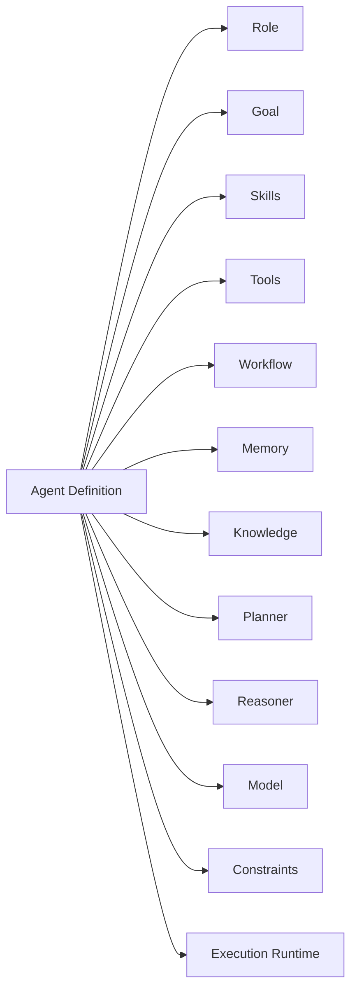
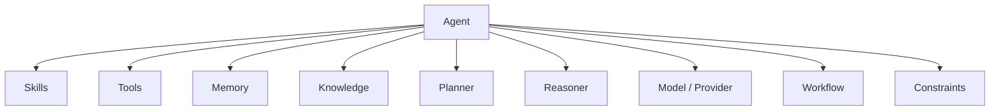
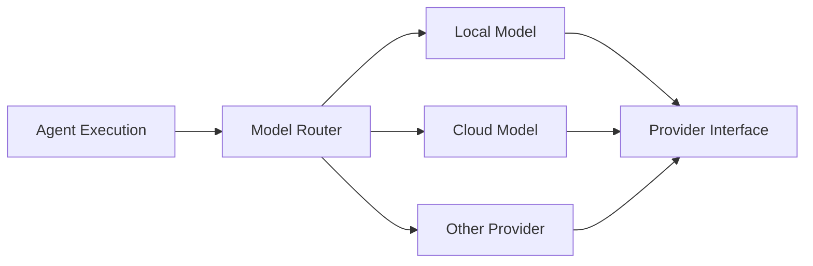
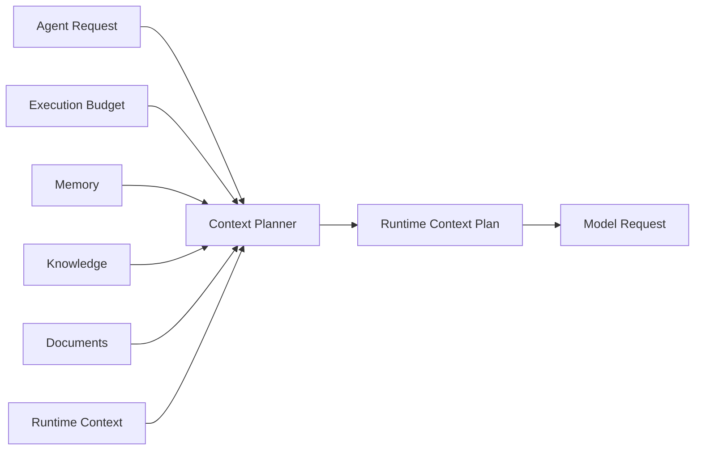
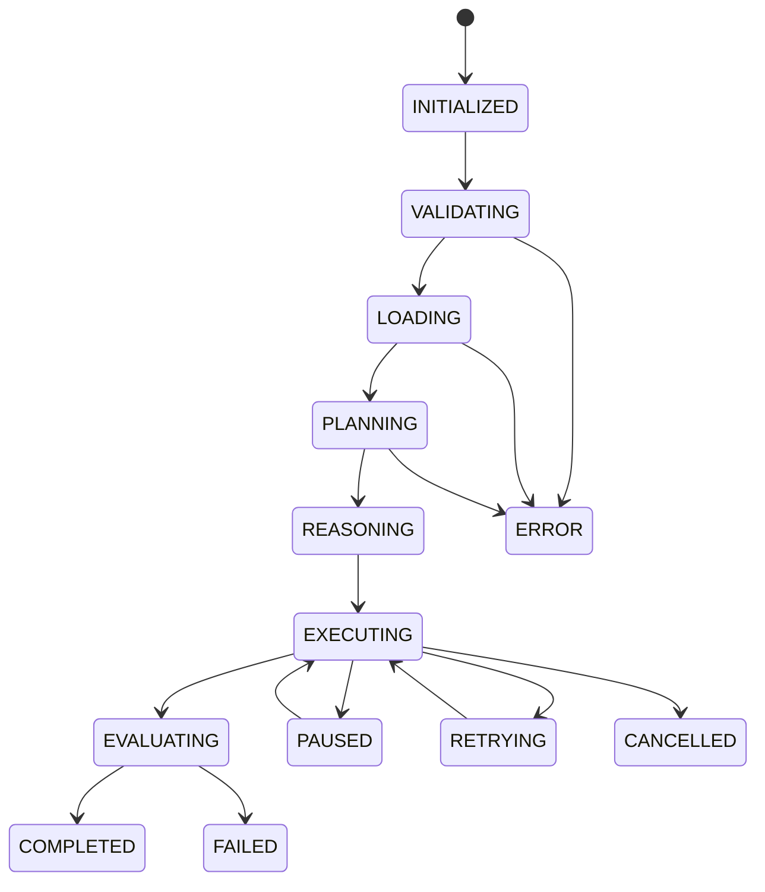
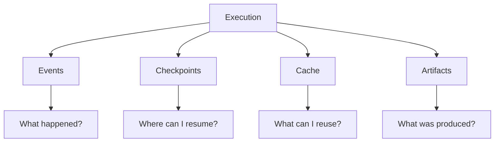

# 2. Design Principles

## 2.1 Purpose

Wayang is designed as a **general-purpose agent runtime and framework**, rather than as a single agent implementation or a framework tightly coupled to one model provider.

The source architecture reflects this through explicit abstractions for agents, pipelines, providers, memory, context planning, tools, execution state, checkpoints, events, routing, and extensions. For example, `AgentDefinition` describes an agent through references to skills, tools, workflow, memory, knowledge, planner, reasoner, and model rather than embedding those implementations directly.

The fundamental design objective can therefore be expressed as:

$$
\boxed{
\text{Wayang} =
\text{Execution Core}
+
\text{Abstractions}
+
\text{Pluggable Implementations}
}
$$

The runtime should provide the execution machinery while allowing applications and extensions to determine the specific intelligence, tools, knowledge, workflows, and infrastructure used by an agent.

---

## 2.2 Principle 1 — Separation of Definition and Execution

Wayang separates:

1. **what an agent is**, from
2. **how an execution of that agent is performed**.

An `AgentDefinition` describes an agent's identity and dependencies, including:

* role
* goal
* skills
* tools
* workflow
* memory
* knowledge
* planner
* reasoner
* model
* constraints
* configuration

These are represented through references and configuration rather than forcing a particular implementation into the definition.

Conceptually:



This means an agent definition can remain relatively stable while the runtime environment determines how that definition is actually executed.

### Why this matters

The same conceptual agent can potentially be executed:

* locally,
* through a cloud model,
* synchronously,
* asynchronously,
* inside a workflow,
* through an A2A interaction,
* with different memory implementations,
* with different tool implementations,
* with different execution budgets.

The definition is therefore a **declarative description**, while the runtime is responsible for **operational execution**.

---

## 2.3 Principle 2 — Abstraction Before Implementation

Wayang places important system boundaries behind interfaces and SPIs.

The source contains explicit abstractions for concepts such as:

```text
Agent
AgentPipeline
Memory
MemoryProvider
Provider
Tool
Execution
EventLedger
Checkpoint
ContextPlanner
ModelRouter
```

For example, the `Agent` abstraction represents an autonomous entity configured with tools and skills, while `AgentPipeline` represents the generic execution pipeline responsible for reasoning, planning, tool execution, and output generation.

Similarly, memory is represented through a `Memory<T>` SPI rather than requiring a specific storage implementation.

The architectural rule is:

$$
\text{Core} \rightarrow \text{Interface}
$$

rather than:

$$
\text{Core} \rightarrow \text{Concrete Implementation}
$$

This allows implementations to evolve independently.

---

## 2.4 Principle 3 — Composition Over Monolithic Agents

Wayang does not require every capability to be implemented inside one enormous agent class.

Instead, an agent is assembled from cooperating capabilities.

A simplified composition model is:



This enables specialized projects to build on Wayang without modifying the core runtime.

For example, a domain-specific agent can provide its own:

* skills,
* tools,
* knowledge providers,
* workflow,
* memory implementation,
* model configuration,

while continuing to use the same Wayang execution foundation.

---

## 2.5 Principle 4 — Provider and Model Independence

Wayang should not make the execution engine fundamentally dependent on one model vendor or inference implementation.

The runtime resolves providers and can use model-routing infrastructure when available. The current runtime implementation includes an optional `ModelRouter`, with a default router used when no explicit router is configured.

Conceptually:



This allows the runtime to separate:

$$
\text{Agent Logic}
\neq
\text{Inference Infrastructure}
$$

A model provider becomes an implementation detail behind the provider/routing boundary.

---

## 2.6 Principle 5 — Budget-Aware Execution

Agent execution is potentially unbounded.

A reasoning loop can consume:

* model tokens,
* tool calls,
* execution time,
* memory,
* retries,
* external resources.

Wayang therefore models execution budgets explicitly.

At runtime creation, an `ExecutionBudget` is associated with the execution context; if one is not supplied, the runtime can use a balanced default.

A conceptual execution constraint is:

$$
C_{execution} =
(T_{max},\,
N_{steps},\,
N_{tools},\,
B_{tokens},\,
R_{retries},\,
M_{memory})
$$

where the individual dimensions represent possible limits on execution resources.

The exact available dimensions depend on the implementation of the budget abstraction.

### Design objective

The runtime should be able to answer:

> How much work is this execution allowed to perform?

rather than allowing an agent loop to consume resources without an explicit boundary.

---

## 2.7 Principle 6 — Context Is Compiled, Not Simply Concatenated

Wayang treats runtime context as something that can be **planned and compiled**.

The runtime has a `RuntimeContextPlanner` and supports planning context against an `ExecutionBudget` and available `ContextProvider` instances.

Conceptually:



This is important because an intelligent agent does not necessarily need every available piece of information in every model request.

The conceptual transformation is:

$$
\text{Available Context}
\rightarrow
\text{Relevant Context}
\rightarrow
\text{Budgeted Context}
\rightarrow
\text{Model Input}
$$

This creates an architectural foundation for efficient local/SLM inference while remaining compatible with larger cloud models.

---

## 2.8 Principle 7 — Execution Is Stateful

Wayang treats execution as more than a single function call.

An execution has lifecycle state and phases.

The source defines execution/context states including:

```text
INITIALIZED
VALIDATING
LOADING
PLANNING
REASONING
EXECUTING
EVALUATING
COMPLETED
FAILED
CANCELLED
PAUSED
RETRYING
ERROR
```

and execution phases including:

```text
INIT
TRIGGER
INPUT
CONTEXT
PLANNING
REASONING
INFERENCE
TOOLS
MEMORY
EVALUATION
GUARDRAIL
OUTPUT
COMPLETE
CUSTOM
```

Therefore, execution can be represented conceptually as a state machine:



This stateful model is fundamental for durable execution, observability, cancellation, pause/resume, and recovery.

---

## 2.9 Principle 8 — Durable Execution Semantics

Wayang distinguishes several concepts that are often incorrectly treated as the same thing:

| Concept    | Question answered           |
| ---------- | --------------------------- |
| Event      | What happened?              |
| Checkpoint | Where can execution resume? |
| Cache      | What work can be reused?    |
| Artifact   | What did execution produce? |

The source explicitly defines this distinction.

This gives Wayang a clean execution model:



This separation prevents a common architectural problem where logs, state snapshots, cached results, and generated outputs become mixed together.

---

## 2.10 Principle 9 — Event-Driven Observability

Wayang has a durable event abstraction through `EventLedger`.

The event ledger is explicitly different from ephemeral callbacks and is intended to support persistent execution history and auditing. Implementations may use in-memory storage, relational/time-series databases, or distributed streams without changing the SPI contract.

The canonical event model includes events for:

* execution lifecycle,
* context compilation,
* model requests/responses,
* model routing,
* tool requests,
* tool approval,
* tool execution,
* tool failure,
* tool timeout,
* retries,
* memory retrieval/storage,
* checkpoints,
* artifacts,
* A2A activity,
* cache
