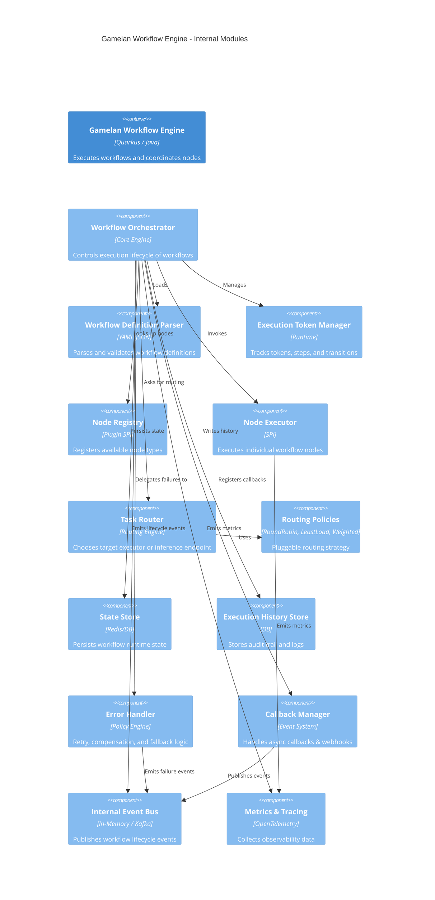

# GAMELAN WORKFLOW ENGINE


## Gamelan Internal Modules

- ✔ Orchestrator
- ✔ Router & Policies
- ✔ Node Executors
- ✔ State & History
- ✔ Error handling
- ✔ Callback / Eventing
- ✔ Plugin-based extensibility

---

## 🎼 Gamelan Workflow Engine — Internal Modules (C4 Component)



---

## 🧩 Module Responsibilities (short & sharp)

**Workflow Orchestrator**
→ brain of the engine

**Definition Parser**
→ validates `.wy` / JSON / YAML

**Execution Token Manager**
→ manages flow control (fork/join/loop)

**Node Registry (SPI)**
→ plugin system for:

* Agent nodes
* EIP nodes
* BPMN nodes
* NLP nodes
* Time-series nodes

**Task Router + Policies**
→ decides:

* local executor
* remote executor
* inference backend

**State Store**
→ runtime snapshot

**History Store**
→ audit trail

**Error Handler**
→ retry, backoff, circuit breaker, compensation

**Callback Manager**
→ async node completion (webhook, message queue)

**Event Bus**
→ decoupled signaling

**Metrics Collector**
→ observability

---


## Gamelan Flowchart
Nice, let’s move on to the **next one: Gamelan internal flowchart** 🎼
This shows **how a workflow is executed inside Gamelan**, step by step (runtime behavior, not structure).

---

## 🔁 Gamelan Workflow Engine — Internal Flowchart


---

## 🧠 How to read this

Main loop:

```
Trigger → Token → Node → Route → Execute → Persist → Next Node
```

---

### 🔹 Important control points

**Routing decision**

```
Routing Policy
```

**Async vs Sync**

```
Async Node?
```

**Error strategy**

```
Retry / Compensate / Fail
```

---

### 🔹 This supports

✔ BPMN-style flows
✔ EIP patterns
✔ Agent chains
✔ Fan-out / fan-in
✔ Human-in-the-loop (via callbacks)
✔ Long-running workflows


---

## 🔄 Gamelan Workflow Execution — State Machine


---

## 🧠 How to read this

**Main happy path**

```
Created → Initialized → Running → Completed
```

**Async path**

```
Running → Waiting → Running
```

**Failure handling**

```
Running → Retrying → Running
Running → Compensating → Running
Running → Failed
```

**Human control**

```
Running → Suspended → Running
```

---

## 🎯 Features

✔ Formal execution semantics
✔ Deterministic lifecycle
✔ Clear recovery points
✔ Support for long-running workflows
✔ Human-in-the-loop
✔ Compensation (Saga pattern)
✔ Retry & backoff
✔ Pausing & resuming


---

