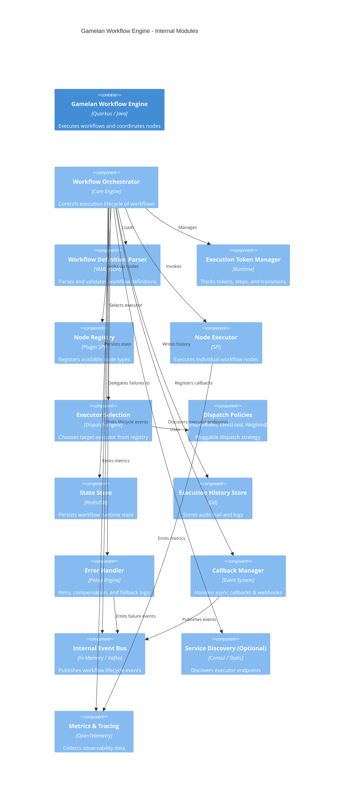
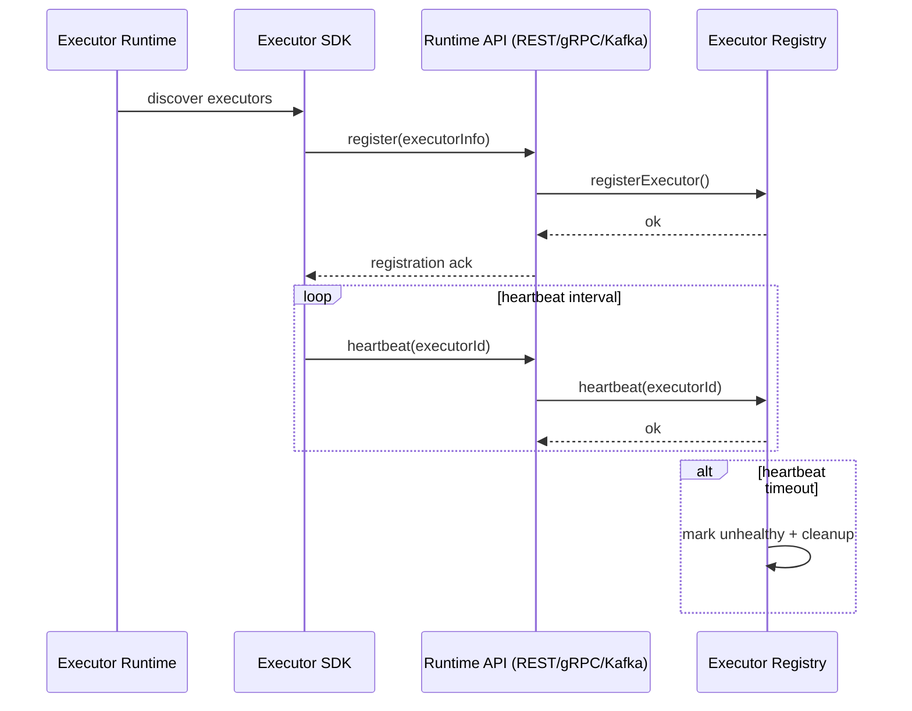
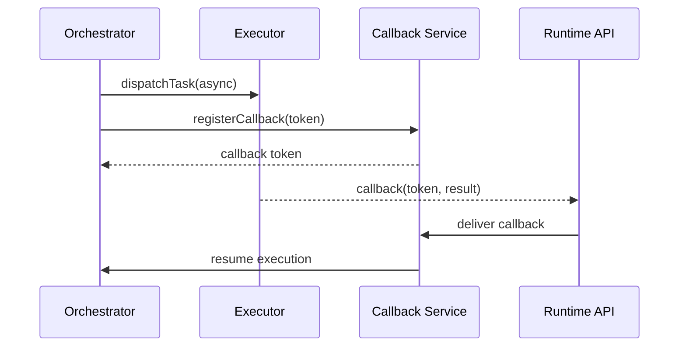

# GAMELAN WORKFLOW ENGINE


## Gamelan Internal Modules

- ✔ Orchestrator
- ✔ Executor Selection & Dispatch
- ✔ Node Executors
- ✔ State & History
- ✔ Error handling
- ✔ Callback / Eventing
- ✔ Plugin-based extensibility
- ✔ Service Discovery (optional)
- ✔ DAG specialization (optional module)

---

## Multi-Tenancy Activation

Multi-tenancy is disabled by default and enabled per component via extensions.

* Gamelan: `tenant-gamelan-ext`
* Wayang: `tenant-wayang-ext`
* Gollek: `tenant-gollek-ext`

The extensions automatically set `wayang.multitenancy.enabled=true`. See `wayang-enterprise/modules/tenant/README.md` for details.

## 🎼 Gamelan Workflow Engine — Internal Modules (C4 Component)



---

## 🧩 Module Responsibilities (short & sharp)

**Workflow Orchestrator**
→ brain of the engine

**Definition Parser**
→ validates `.wy` / JSON / YAML

**Execution Token Manager**
→ manages flow control (fork/join/loop)

**Node Registry (SPI)**
→ plugin system for:

* Agent nodes
* EIP nodes
* BPMN nodes
* NLP nodes
* Time-series nodes

**Executor Selection + Dispatch Policies**
→ decides:

* local executor
* remote executor
* executor instance

**State Store**
→ runtime snapshot

**History Store**
→ audit trail

**Error Handler**
→ retry, backoff, circuit breaker, compensation

**Callback Manager**
→ async node completion (webhook, message queue)

**Event Bus**
→ decoupled signaling

**Metrics Collector**
→ observability

---


## Gamelan Flowchart
Nice, let’s move on to the **next one: Gamelan internal flowchart** 🎼
This shows **how a workflow is executed inside Gamelan**, step by step (runtime behavior, not structure).

---

## 🔁 Gamelan Workflow Engine — Internal Flowchart


---

## 🔁 Composite Node (Sub-Workflow) — Sequence Diagram


## 🧠 How to read this

Main loop:

```
Trigger → Token → Node → Route → Execute → Persist → Next Node
```

---

### 🔹 Important control points

**Routing decision**

```
Routing Policy
```

**Async vs Sync**

```
Async Node?
```

**Error strategy**

```
Retry / Compensate / Fail
```

---

### 🔹 This supports

✔ BPMN-style flows
✔ EIP patterns
✔ Agent chains
✔ Fan-out / fan-in
✔ Human-in-the-loop (via callbacks)
✔ Long-running workflows


---

## 🔄 Gamelan Workflow Execution — State Machine


---

## 🧠 How to read this

**Main happy path**

```
Created → Initialized → Running → Completed
```

**Async path**

```
Running → Waiting → Running
```

**Failure handling**

```
Running → Retrying → Running
Running → Compensating → Running
Running → Failed
```

**Human control**

```
Running → Suspended → Running
```

---

## 🎯 Features

✔ Formal execution semantics
✔ Deterministic lifecycle
✔ Clear recovery points
✔ Support for long-running workflows
✔ Human-in-the-loop
✔ Compensation (Saga pattern)
✔ Retry & backoff
✔ Pausing & resuming


---

## 🧭 Current Implementation Mapping (Repo)

* **Gamelan Engine** → `workflow-gamelan/core/gamelan-engine`
* **Executor Registry** → `workflow-gamelan/core/gamelan-executor-registry`
* **Runtime API (REST/gRPC/Kafka)** → `workflow-gamelan/core/gamelan-runtime-core`, `workflow-gamelan/protocol/`
* **SDK Client** → `workflow-gamelan/sdk/gamelan-sdk-client-*`
* **Executor SDKs** → `workflow-gamelan/sdk/gamelan-sdk-executor-*`
* **Service Discovery (optional)** → `workflow-gamelan/plugins/` (e.g., Consul plugin)

---

## 🧩 Gamelan SDK Mechanism (Client + Executor)


---

## 🔁 Gamelan Execution — Sequence Diagram


---

## ✅ Workflow Mode (DAG | FLOW | STATE)

By default, workflows run as **FLOW** (agentic loops allowed).  
Use `mode: DAG` only when you want strict acyclic validation.

```yaml
id: example_workflow
mode: FLOW  # FLOW | DAG | STATE
```

### DAG Example (Pipeline)

```yaml
id: nightly_pipeline
mode: DAG
nodes:
  - id: extract
    type: http
  - id: transform
    type: tool
    dependsOn: [extract]
  - id: load
    type: storage
    dependsOn: [transform]
```

Recommended runtime flags:
* `gamelan.dag.plugin.enabled=true`
* `gamelan.dag.scheduler.enabled=true` (topological ordering)

---

## 🔁 Executor Registration & Heartbeat — Sequence Diagram



---

## 🔁 Async Callback / HITL — Sequence Diagram



---

## ✅ Production-Ready Implementation Trail (Code Pointers)

1. Runtime API executor endpoints: `workflow-gamelan/core/gamelan-runtime-core/src/main/java/tech/kayys/gamelan/runtime/resource/ExecutorRegistryResource.java`
2. Executor registry core: `workflow-gamelan/core/gamelan-executor-registry/src/main/java/tech/kayys/gamelan/registry/ExecutorRegistry.java`
3. gRPC executor registration/heartbeat: `workflow-gamelan/core/gamelan-engine/src/main/java/tech/kayys/gamelan/grpc/ExecutorServiceImpl.java`
4. Executor SDK registration + heartbeat loop: `workflow-gamelan/core/gamelan-sdk-executor-core/src/main/java/tech/kayys/gamelan/sdk/executor/core/ExecutorRegistrationService.java`
5. Dispatch transports: `workflow-gamelan/core/gamelan-engine/src/main/java/tech/kayys/gamelan/dispatcher/GrpcTaskDispatcher.java`
6. Dispatch transports: `workflow-gamelan/core/gamelan-engine/src/main/java/tech/kayys/gamelan/dispatcher/KafkaTaskDispatcher.java`
7. Dispatch transports: `workflow-gamelan/core/gamelan-engine/src/main/java/tech/kayys/gamelan/dispatcher/RestTaskDispatcher.java`
8. Dispatch transports: `workflow-gamelan/core/gamelan-engine/src/main/java/tech/kayys/gamelan/dispatcher/LocalTaskDispatcher.java`
9. Executor base contracts: `workflow-gamelan/core/gamelan-sdk-executor-core/src/main/java/tech/kayys/gamelan/sdk/executor/core/WorkflowExecutor.java`
10. Executor base implementation: `workflow-gamelan/core/gamelan-sdk-executor-core/src/main/java/tech/kayys/gamelan/sdk/executor/core/AbstractWorkflowExecutor.java`
11. Callback service contract: `workflow-gamelan/core/gamelan-engine/src/main/java/tech/kayys/gamelan/engine/CallbackService.java`
12. Callback registration path: `workflow-gamelan/core/gamelan-engine/src/main/java/tech/kayys/gamelan/engine/impl/DefaultWorkflowRunManager.java`
13. Executor adapters: `workflow-gamelan/core/gamelan-runtime-core/src/main/java/tech/kayys/gamelan/runtime/adapter/GrpcExecutorAdapter.java`
14. Executor adapters: `workflow-gamelan/core/gamelan-runtime-core/src/main/java/tech/kayys/gamelan/runtime/adapter/HttpExecutorAdapter.java`
15. Executor adapters: `workflow-gamelan/core/gamelan-runtime-core/src/main/java/tech/kayys/gamelan/runtime/adapter/LocalExecutorAdapter.java`

---

## ✅ Step-By-Step Build Order (Minimal → Production)

1. **Boot the core engine**  
   Focus: core orchestration loop and state transitions.  
   Code: `workflow-gamelan/core/gamelan-engine`

2. **Add the runtime API**  
   Focus: external control plane entry points.  
   Code: `workflow-gamelan/core/gamelan-runtime-core`

3. **Introduce executor registration + heartbeat**  
   Focus: discovery and liveness for distributed executors.  
   Code: `workflow-gamelan/core/gamelan-executor-registry`, `workflow-gamelan/core/gamelan-sdk-executor-core`

4. **Enable transports (local + remote)**  
   Focus: dispatchers and adapters for real execution.  
   Code: `workflow-gamelan/core/gamelan-engine/src/main/java/tech/kayys/gamelan/dispatcher/`, `workflow-gamelan/core/gamelan-runtime-core/src/main/java/tech/kayys/gamelan/runtime/adapter/`

5. **Add callback + HITL support**  
   Focus: async nodes, waiting states, external signals.  
   Code: `workflow-gamelan/core/gamelan-engine/src/main/java/tech/kayys/gamelan/engine/CallbackService.java`, `workflow-gamelan/core/gamelan-engine/src/main/java/tech/kayys/gamelan/engine/impl/DefaultWorkflowRunManager.java`

6. **Layer in SDKs**  
   Focus: developer experience for client and executor runtimes.  
   Code: `workflow-gamelan/sdk/`

---

## ✅ Production Readiness Checklist (Gamelan)

* Executor registry health + heartbeat timeouts configured
* Dispatch transports (REST/gRPC/Kafka) validated
* Retry/compensation policies tested per node type
* Callback/HITL tokens are signed and expiring
* Idempotency enforced for task results
* State store + history store durability verified
* Dead-letter handling for failed tasks
* Metrics + traces exported (OpenTelemetry)
