# 3. Architecture

## 3.1 Overview

Wayang is organized as a layered execution architecture.

At the highest level, the system can be understood as:

$$
\boxed{
Application
\rightarrow
Wayang Runtime
\rightarrow
Execution Kernel
\rightarrow
Agent Pipeline
\rightarrow
Providers / Tools / Memory / Extensions
}
$$

## The current implementation has a top-level `DefaultWayangRuntime`, which delegates execution to `DefaultExecutionEngine`. That engine creates an `AgentExecution` through `AgentExecutionService`, which in turn wires providers, model routing, context planning, memory, caching, events, checkpoints, and tool execution into `DefaultAgentExecution`.

# 3.2 Architectural View

The conceptual Wayang architecture is:

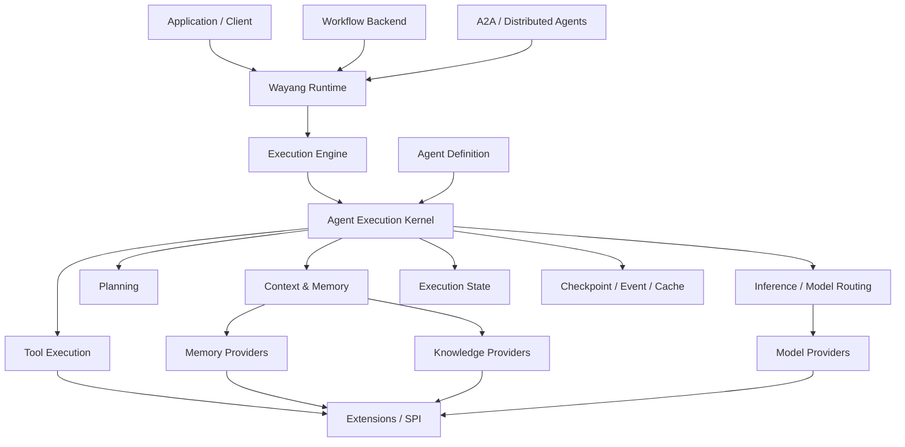

This diagram represents the architectural intent. Not every box is a separate Maven module or process; several are runtime services or SPIs.

---

# 3.3 Architectural Layers

Wayang can be described through the following layers.

| Layer                | Responsibility                               |
| -------------------- | -------------------------------------------- |
| Application Layer    | Applications consuming Wayang                |
| Integration Layer    | Workflow, A2A, external runtime integrations |
| Runtime Layer        | Public runtime entry point                   |
| Execution Layer      | Execution lifecycle and agent execution      |
| Intelligence Layer   | Planning, reasoning, inference and routing   |
| Capability Layer     | Skills and tools                             |
| Context Layer        | Memory, knowledge and contextual information |
| State Layer          | Execution state, checkpoints and recovery    |
| Observability Layer  | Events, telemetry and execution history      |
| SPI Layer            | Pluggable implementations                    |
| Infrastructure Layer | Models, databases, queues, external systems  |

The important architectural property is that dependencies should generally flow **toward abstractions**, rather than forcing the core runtime to depend on one infrastructure implementation.

---

# 3.4 Runtime Layer

The runtime is the primary entry point for executing an agent.

The current implementation uses:

```text
DefaultWayangRuntime
```

as the top-level CDI implementation of:

```text
WayangRuntime
```

It exposes asynchronous execution and internally provides a synchronous execution path. The asynchronous method uses a virtual-thread executor and delegates to the synchronous path.

Conceptually:

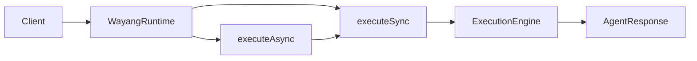

The runtime is deliberately thin.

It should not contain the actual reasoning loop.

---

# 3.5 Execution Engine Layer

The next layer is the execution engine.

The current implementation is:

```text
DefaultExecutionEngine
```

which implements the execution-engine contract.

Its agent execution path:

1. receives an `AgentDefinition`,
2. receives an `ExecutionContext`,
3. extracts the request,
4. creates an `AgentExecution`,
5. executes it,
6. maps the result into an `ExecutionResult`.

The source currently implements agent execution while workflow and direct skill execution remain marked as future/placeholder paths in this particular implementation.

The architecture is therefore:

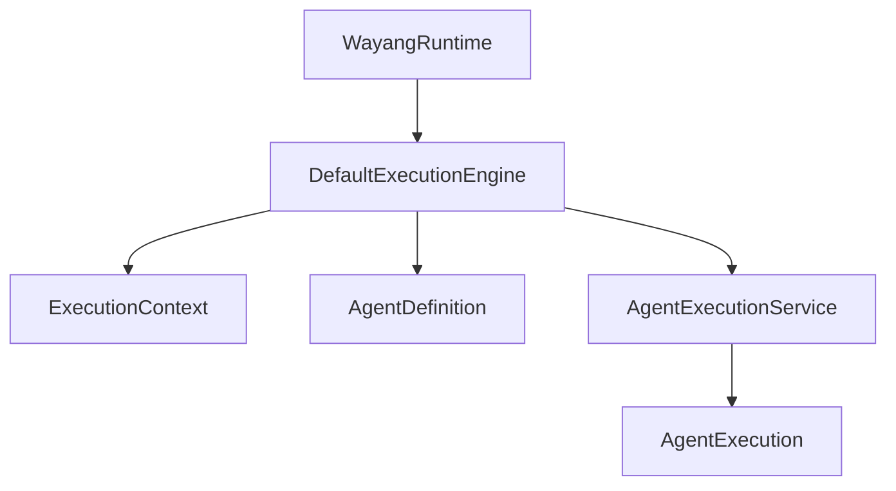

The separation is valuable because the public runtime does not need to know how an execution object is constructed.

---

# 3.6 Agent Execution Service

`AgentExecutionService` is the composition point for the execution kernel.

The current service discovers CDI-managed components including:

* `Provider`
* `ModelRouter`
* `RuntimeContextPlanner`
* `MemoryManager`
* `ExecutionCache`
* `ContextProvider`
* `EventLedger`
* `ExecutionCheckpointStore`
* `CheckpointStore`
* `AgentToolExecutor`

This is one of the most important architectural components because it assembles the runtime dependencies required by an individual execution.

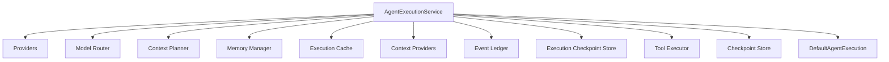

This creates an important boundary:

$$
\text{Dependency Resolution}
\rightarrow
\text{Execution Construction}
$$

rather than:

$$
\text{AgentExecution}
\rightarrow
\text{Global Static Infrastructure}
$$

---

# 3.7 Agent Definition Layer

An agent is represented by `AgentDefinition`.

The current definition contains references for:

```text
role
goal
skills
tools
workflow
memory
knowledge
planner
reasoner
model
constraints
```

This makes `AgentDefinition` a composition descriptor rather than a monolithic executable object.

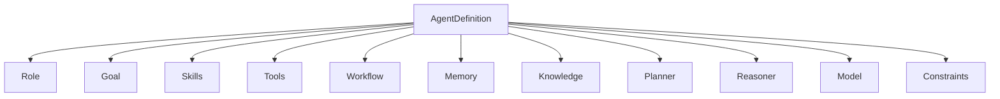

References are used for these dependencies, which allows the implementation behind a capability to change without changing the agent definition itself.

---

# 3.8 Agent SPI Layer

Wayang also exposes an `Agent` SPI.

The SPI describes an autonomous entity configured with tools and skills and provides operations including:

```java
initialize()
process(...)
resume(...)
getPipeline()
```

The `AgentPipeline` SPI represents the execution pipeline responsible for reasoning, planning, tool execution and output generation.

The relationship is:

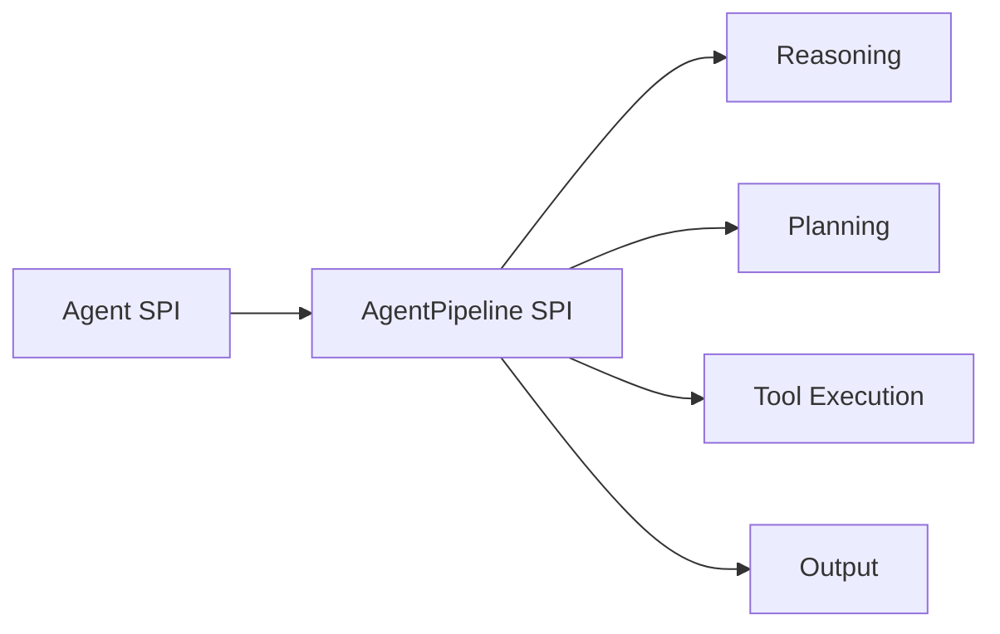

This gives Wayang two complementary concepts:

### AgentDefinition

Describes **what the agent is configured with**.

### Agent / AgentPipeline

Describes **how an agent implementation executes**.

---

# 3.9 Execution Kernel

The execution kernel is represented by `DefaultAgentExecution`.

The current implementation receives:

* agent definition,
* agent context,
* execution budget,
* checkpoint store,
* execution checkpoint store,
* tool executor,
* providers,
* model router,
* context planner,
* memory manager,
* execution cache,
* tenant/user context,
* event ledger.

This makes the execution object the central coordination point.

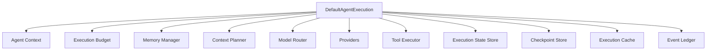

The kernel does not need to own the concrete implementations of these subsystems.

It coordinates them.

---

# 3.10 Execution State

Every execution has state.

The current state model includes information such as:

```text
executionId
status
phase
attempt
iteration
checkpointId
lastEventId
modelId
inputTokens
outputTokens
```

This enables Wayang to represent execution as a first-class runtime object.

Conceptually:

$$
ExecutionState =
f(
ID,
Status,
Phase,
Attempt,
Iteration,
Checkpoint,
Events,
Model,
Usage
)
$$

---

# 3.11 Execution Lifecycle

The execution lifecycle can be represented as:

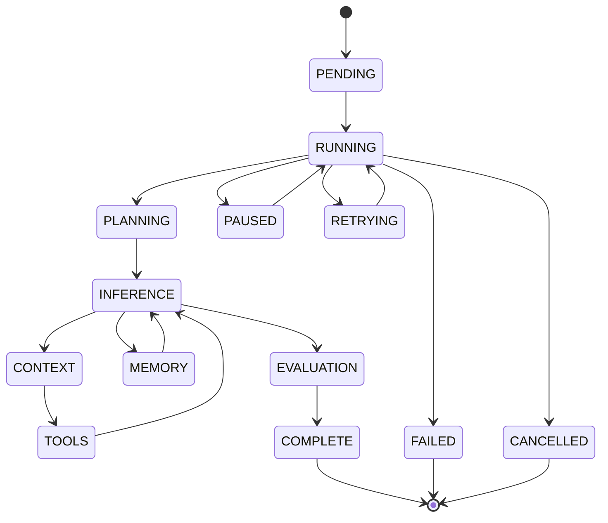

The exact state transitions depend on the active execution path, but the architecture explicitly models execution state rather than treating an agent call as an opaque function.

---

# 3.12 Intelligence Layer

Wayang separates several intelligence-related responsibilities.

```text
Planning
Reasoning
Inference
Model Routing
Context Planning
```

These should not be treated as one monolithic "LLM service."

A simplified architecture is:

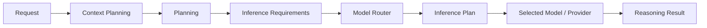

The current execution implementation explicitly derives inference requirements, maps the execution budget into an inference policy, asks the `ModelRouter` for an `InferencePlan`, and records routing telemetry into execution state.

---

# 3.13 Model Provider Layer

The provider abstraction separates model infrastructure from execution logic.

The execution service discovers all CDI-managed `Provider` instances and passes them into the execution kernel.

The model router can then select an appropriate provider/model.

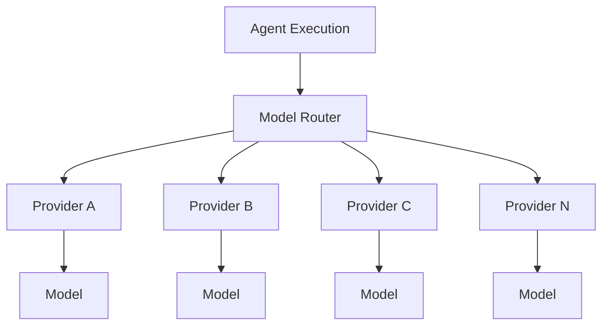

This permits multiple deployment strategies without changing the agent execution contract.

---

# 3.14 Local / Hybrid / Cloud Model Architecture

The provider abstraction allows the same Wayang execution model to operate across different inference environments.

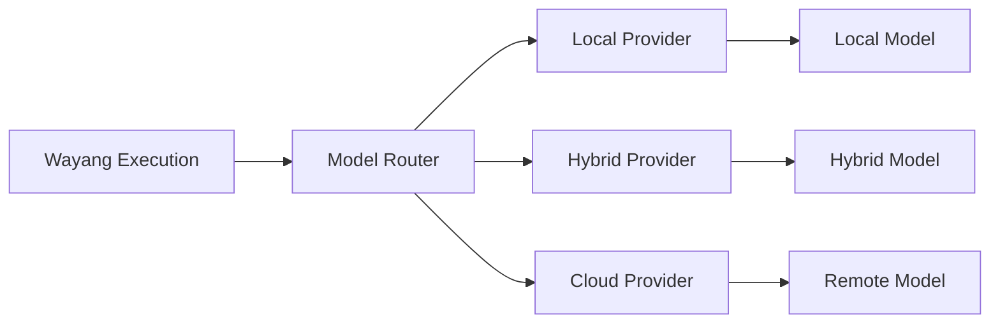

The runtime therefore does not need to know whether inference happens:

* in-process,
* on the same machine,
* on another local service,
* in a private cluster,
* or through an external model provider.

---

# 3.15 Context Architecture

Context is assembled from multiple possible sources.

The current execution service discovers `ContextProvider` instances and a `RuntimeContextPlanner`.

A conceptual context pipeline is:

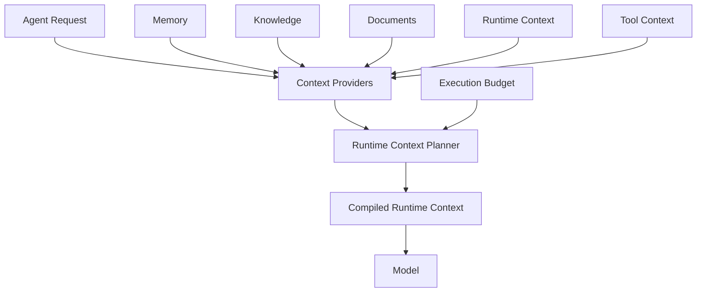

This architecture allows the context planner to decide what information should be supplied to the inference layer.

---

# 3.16 Memory Architecture

Wayang exposes memory as an abstraction rather than tying it to one storage engine.

The SPI includes a generic `Memory<T>` interface with operations such as:

```java
addMessage(...)
getHistory()
clear()
```

and a `MemoryProvider` abstraction for creating or retrieving memory for a session.

Conceptually:

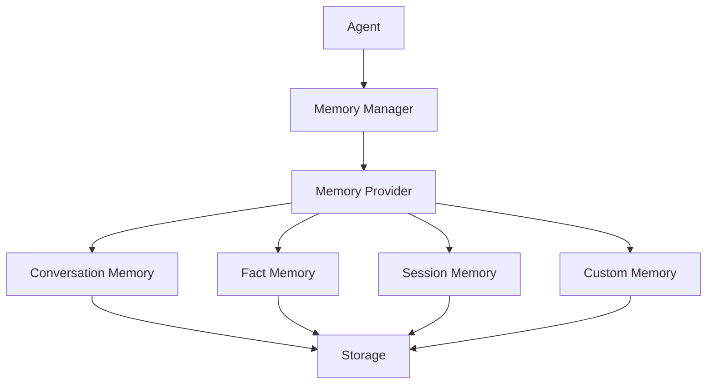

The storage implementation is therefore separated from the agent.

---

# 3.17 Knowledge Architecture

Knowledge is represented as an agent dependency/reference rather than hard-coded into the core execution engine.

The `AgentDefinition` contains a dedicated `knowledge` reference.

This creates a useful architectural distinction:

```text
Memory
    = information associated with execution/session history

Knowledge
    = information supplied as reusable agent/domain knowledge
```

The architecture can therefore support different knowledge implementations without embedding a particular domain into Wayang.

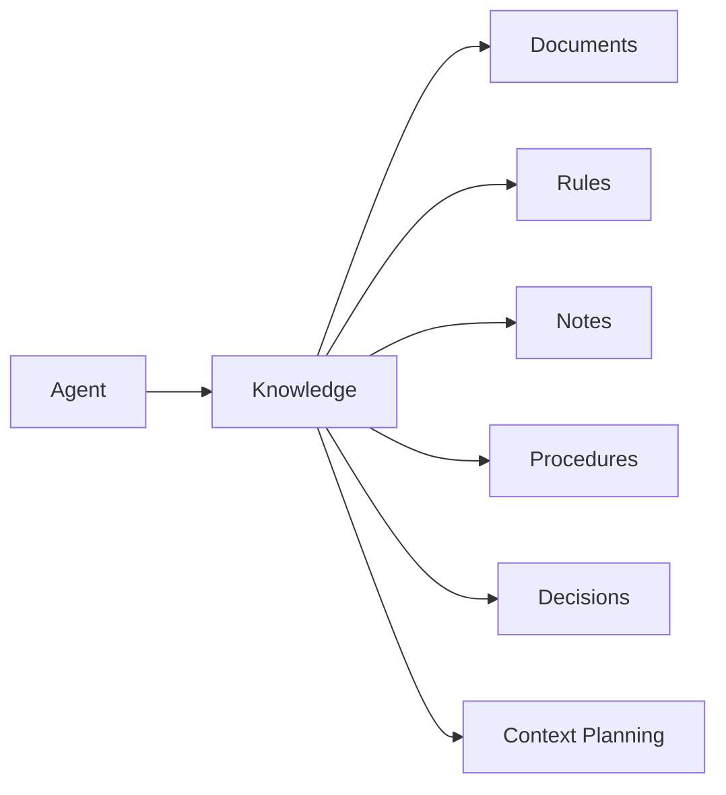

The specific semantics of those knowledge types belong to extensions and applications.

---

# 3.18 Tool Architecture

Tools represent executable capabilities.

The execution chain documented by the runtime is:

```text
ReActAgent
    →
DefaultAgentToolExecutor
    →
Tool.execute()
```

with the tool executor providing circuit-breaker, retry and timeout behavior.

The architecture is:

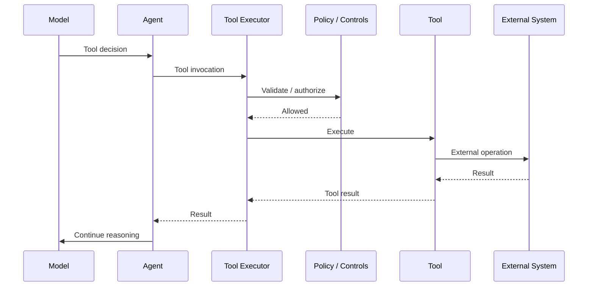

This is the primary side-effect boundary in the runtime.

---

# 3.19 Skills Architecture

Skills are capabilities associated with an agent definition.

The definition supports one or more skill references, just as it supports tool references.

Conceptually:

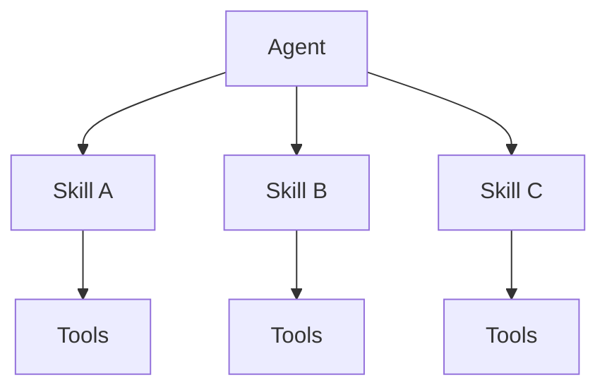

A skill should generally describe a higher-level capability or behavior, while a tool represents an executable operation.

A useful conceptual distinction is:

$$
Skill = \text{Capability / Method}
$$

$$
Tool = \text{Executable Operation}
$$

The exact boundary may be specialized by an extension.

---

# 3.20 State, Checkpoint and Event Architecture

Wayang separates execution state from durable history.

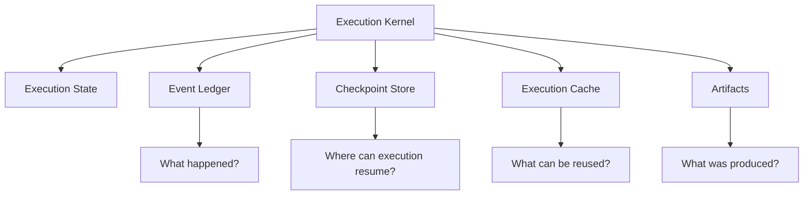

The current execution implementation creates an `ExecutionStateStore` using checkpoint and event infrastructure, and can restore state from an execution checkpoint when one exists.

---

# 3.21 Event Architecture

The event ledger provides durable execution history when configured.

The runtime treats it as optional, allowing minimal/test deployments to operate without persistent event infrastructure.

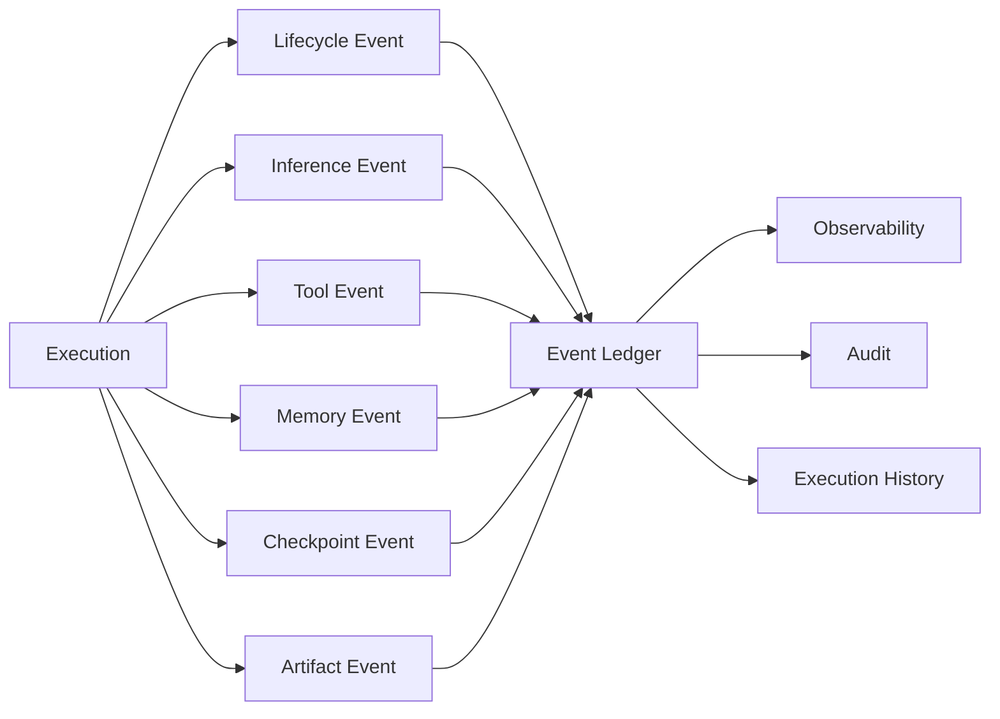

---

# 3.22 Checkpoint Architecture

Checkpointing provides recoverable execution state.

The execution service can resolve an `ExecutionCheckpointStore`; when one is unavailable, the execution object can fall back to an in-memory checkpoint store.

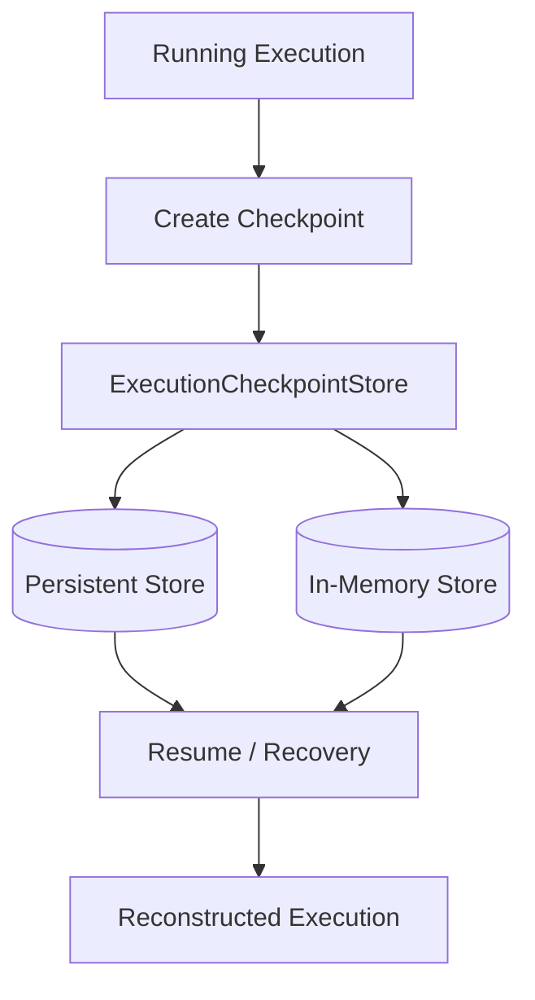

This architecture is particularly important for:

* long-running agents,
* human approval,
* pause/resume,
* failures,
* distributed execution,
* durable workflows.

---

# 3.23 Cache Architecture

Execution caching is another independent subsystem.

The execution service resolves an optional `ExecutionCache`. If no cache implementation is configured, caching can remain disabled.

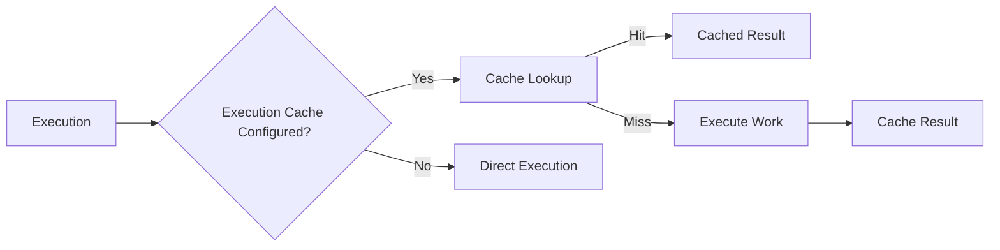

Caching must not be confused with checkpointing.

$$
Cache \neq Checkpoint
$$

A cache optimizes reuse.

A checkpoint enables recovery.

---

# 3.24 Workflow Architecture

Wayang has a workflow abstraction and an integration path for Gamelan.

The architecture allows Gamelan workflow nodes to invoke Wayang agents through a `WayangAgentNodeExecutor`. The executor resolves workflow inputs, constructs an `AgentRequest`, resolves an agent definition, and invokes `DefaultWayangRuntime.executeAsync(...)`.

Conceptually:

```mermaid
flowchart LR

    G[Gamelan Workflow]

    G --> N[Wayang Agent Node]

    N --> B[Workflow Binding Resolver]

    B --> R[Wayang Runtime]

    R --> A[Agent Execution]

    A --> OUT[Agent Output]

    OUT --> G
```

This means Wayang can act as an intelligent execution node inside a broader workflow engine.

---

# 3.25 Distributed Agent Architecture

The runtime can also be exposed through an agent-to-agent boundary.

Conceptually:

```mermaid
flowchart LR

    A1[Agent A]

    A1 --> A2A[A2A Transport]

    A2A --> R[Wayang Runtime]

    R --> A2[Agent B]

    A2 --> R

    R --> A2A

    A2A --> A1
```

The important architectural point is that remote communication should terminate at the Wayang runtime boundary rather than bypassing the execution kernel.

---

# 3.26 Extension Architecture

Wayang is designed to allow external implementations to plug into the runtime.

```mermaid
flowchart TB

    CORE[Wayang Core]

    SPI[Wayang SPI]

    CORE --> SPI

    SPI --> AGENT[Agent Extensions]
    SPI --> TOOL[Tool Extensions]
    SPI --> MEMORY[Memory Extensions]
    SPI --> MODEL[Model Provider Extensions]
    SPI --> KNOW[Knowledge Extensions]
    SPI --> WORKFLOW[Workflow Extensions]
    SPI --> OBS[Observability Extensions]
```

The dependency direction should be:

$$
Extension \rightarrow SPI
$$

not:

$$
Core \rightarrow Every Extension
$$

This is essential to keeping the core lightweight.

---

# 3.27 CDI as Runtime Composition Mechanism

The current runtime uses CDI to discover runtime components.

For example:

```java
@Inject
Instance<Provider> providerInstances;
```

and corresponding instances for memory, routing, context planning, caching, events, and checkpoints are injected into `AgentExecutionService`.

This provides runtime composition without requiring the execution kernel to instantiate every subsystem itself.

Conceptually:

```mermaid
flowchart TB

    CDI[CDI Container]

    CDI --> P[Providers]
    CDI --> MR[Model Router]
    CDI --> CP[Context Planner]
    CDI --> MM[Memory Manager]
    CDI --> EC[Execution Cache]
    CDI --> EL[Event Ledger]
    CDI --> CPS[Checkpoint Store]
    CDI --> TE[Tool Executor]

    P --> X[Agent Execution]
    MR --> X
    CP --> X
    MM --> X
    EC --> X
    EL --> X
    CPS --> X
    TE --> X
```

---

# 3.28 Optional Infrastructure

A significant architectural characteristic is graceful degradation.

The current execution implementation allows several services to be absent:

```text
Memory Manager
Execution Cache
Event Ledger
Execution Checkpoint Store
```

and provides defaults for some services, including:

```text
ModelRouter
RuntimeContextPlanner
```

Therefore a minimal runtime can look like:

```mermaid
flowchart TB

    R[Wayang Runtime]

    R --> E[Execution Engine]
    E --> X[Agent Execution]

    X --> P[Provider]
    X --> T[Tool Executor]

    X -. optional .-> M[Memory]
    X -. optional .-> C[Cache]
    X -. optional .-> EL[Event Ledger]
    X -. optional .-> CP[Persistent Checkpoint]
```

This is important for local and embedded deployments.

---

# 3.29 Full Architecture

Combining the major components gives the following system view:

```mermaid
flowchart TB

    APP[Application]

    subgraph API["Wayang API"]
        RT[WayangRuntime]
        DEF[AgentDefinition]
        REQ[AgentRequest]
    end

    subgraph EXECUTION["Execution Layer"]
        EE[DefaultExecutionEngine]
        ES[AgentExecutionService]
        AE[DefaultAgentExecution]
        STATE[Execution State Store]
    end

    subgraph INTELLIGENCE["Intelligence Layer"]
        CP[Context Planner]
        MR[Model Router]
        IP[Inference Plan]
        REASON[Reasoner]
        PLAN[Planner]
    end

    subgraph CAPABILITY["Capability Layer"]
        SK[Skills]
        TE[Tool Executor]
        TOOLS[Tools]
    end

    subgraph CONTEXT["Context Layer"]
        MEM[Memory Manager]
        KNOW[Knowledge]
        CX[Context Providers]
    end

    subgraph DURABILITY["Durability Layer"]
        CHECK[Checkpoint Store]
        ECP[Execution Checkpoint Store]
        EVENTS[Event Ledger]
        CACHE[Execution Cache]
        ART[Artifacts]
    end

    subgraph PROVIDERS["Provider Layer"]
        P[Provider]
        MODELS[Models]
    end

    subgraph INTEGRATION["Integration Layer"]
        GAM[Gamelan]
        A2A[A2A]
    end

    subgraph EXTENSIONS["Extension Layer"]
        SPI[Wayang SPI]
    end

    APP --> RT
    APP --> DEF
    APP --> REQ

    RT --> EE
    DEF --> ES
    REQ --> ES

    EE --> ES
    ES --> AE
    AE --> STATE

    AE --> CP
    AE --> MR
    AE --> PLAN
    AE --> REASON

    DEF --> SK
    DEF --> TE
    DEF --> MEM
    DEF --> KNOW

    SK --> TOOLS
    TE --> TOOLS

    CP --> CX
    CP --> MEM
    CP --> KNOW

    MR --> IP
    IP --> P
    P --> MODELS

    AE --> CHECK
    AE --> ECP
    AE --> EVENTS
    AE --> CACHE
    AE --> ART

    GAM --> RT
    A2A --> RT

    SPI --> P
    SPI --> TOOLS
    SPI --> MEM
    SPI --> KNOW
    SPI --> GAM
```

---

# 3.30 Runtime Execution Sequence

The principal execution sequence is:

```mermaid
sequenceDiagram

    participant APP as Application
    participant RT as WayangRuntime
    participant EE as ExecutionEngine
    participant ES as AgentExecutionService
    participant AE as AgentExecution
    participant MEM as Memory
    participant CP as ContextPlanner
    participant MR as ModelRouter
    participant MODEL as Model/Provider
    participant TOOL as ToolExecutor
    participant T as Tool
    participant STATE as State/Checkpoint

    APP->>RT: executeAsync(agent, request)

    RT->>EE: executeAgent(agent, context)

    EE->>ES: create(agent, request, budget)

    ES->>MEM: Resolve memory
    ES->>MR: Resolve model router
    ES->>CP: Resolve context planner
    ES->>STATE: Resolve checkpoint/event infrastructure

    ES-->>EE: AgentExecution

    EE->>AE: execute()

    AE->>STATE: RUNNING / INPUT

    AE->>MEM: Recall context
    MEM-->>AE: Memory

    AE->>MR: Plan inference
    MR->>MODEL: Select provider/model
    MODEL-->>MR: Inference plan

    AE->>CP: Plan runtime context
    CP-->>AE: Context plan

    AE->>MODEL: Inference
    MODEL-->>AE: Agent decision

    alt Tool required
        AE->>TOOL: Execute tool
        TOOL->>T: execute()
        T-->>TOOL: Tool result
        TOOL-->>AE: Result
        AE->>MODEL: Continue reasoning
        MODEL-->>AE: Final decision
    end

    AE->>STATE: Checkpoint / events
    AE-->>EE: AgentResponse
    EE-->>RT: ExecutionResult
    RT-->>APP: AgentResponse
```

The source explicitly documents the top-level chain from `DefaultWayangRuntime` through `DefaultExecutionEngine`, `AgentExecutionService`, `DefaultAgentExecution`, the ReAct loop, and the tool executor.

---

# 3.31 Dependency Direction

A healthy Wayang dependency graph should look approximately like:

```mermaid
flowchart BT

    INFRA[Infrastructure]

    EXT[Extensions]

    SPI[SPIs / Abstractions]

    RUNTIME[Runtime]

    EXEC[Execution Kernel]

    AGENT[Agent Definitions]

    APP[Applications]

    INFRA --> EXT
    EXT --> SPI

    RUNTIME --> SPI
    EXEC --> SPI
    AGENT --> SPI

    APP --> RUNTIME
    APP --> AGENT
```

The key rule is:

$$
\boxed{
\text{Core abstractions should not depend on application-specific implementations.}
}
$$

---

# 3.32 Embedded Deployment

Wayang can be embedded into an application.

Conceptually:

```mermaid
flowchart LR

    APP[Java Application]

    APP --> WAYANG[Embedded Wayang Runtime]

    WAYANG --> AGENT[Agent]
    WAYANG --> MODEL[Local / Remote Model]
    WAYANG --> TOOLS[Tools]
```

This is appropriate when Wayang is used as a library rather than as a standalone service.

---

# 3.33 Standalone Runtime Deployment

The same architecture can be exposed as a service:

```mermaid
flowchart LR

    CLIENT[Client]

    CLIENT --> API[Wayang API]

    API --> RUNTIME[Wayang Runtime]

    RUNTIME --> EXEC[Execution Kernel]

    EXEC --> PROVIDER[Model Provider]
    EXEC --> TOOLS[Tools]
    EXEC --> MEMORY[Memory]
    EXEC --> STATE[State]
```

The application-facing API can therefore remain independent from the internal execution implementation.

---

# 3.34 Minimal Runtime

A minimal deployment does not necessarily need every subsystem.

```text
Wayang Runtime
 ├── Execution Engine
 ├── Agent Execution
 ├── Provider
 └── Tool Executor
```

Optional:

```text
 ├── Memory
 ├── Knowledge
 ├── Model Router
 ├── Context Planner
 ├── Cache
 ├── Event Ledger
 └── Persistent Checkpoints
```

The current implementation explicitly supports optional resolution of several of these services.

---

# 3.35 Production Runtime

A production deployment may add:

```text
Wayang Runtime
 ├── Execution Engine
 ├── Agent Execution
 ├── Model Router
 ├── Context Planner
 ├── Memory
 ├── Knowledge
 ├── Tools
 ├── Policy
 ├── Event Ledger
 ├── Persistent Checkpoints
 ├── Cache
 ├── Observability
 └── Distributed Integration
```

This creates a spectrum:

$$
Minimal
\rightarrow
Standard
\rightarrow
Production
\rightarrow
Distributed
$$

without requiring the core execution model to change.

---

# 3.36 Architecture Boundary: What Belongs in Wayang Core?

The following generally belongs in the core architecture:

```text
Execution lifecycle
Agent abstractions
Execution state
Context abstraction
Memory abstraction
Tool abstraction
Provider abstraction
Model routing abstraction
Checkpoint abstraction
Event abstraction
Extension/SPI contracts
Runtime APIs
```

The following should normally be extensions:

```text
Specific business domains
Specific company procedures
Specific legal systems
Specific religious jurisprudence
Specific enterprise products
Specific UI implementations
Specific model vendors
Specific external databases
```

The architectural rule is:

$$
\boxed{
\text{Generic mechanism in Wayang}
\quad+\quad
\text{specialized semantics in extensions}
}
$$

---

# 3.37 Architecture Summary

Wayang's architecture can ultimately be summarized as:

```mermaid
flowchart TB

    W[WAYANG]

    W --> R[Runtime]

    R --> E[Execution Kernel]

    E --> A[Agent]

    A --> C[Context]
    A --> I[Intelligence]
    A --> T[Capabilities]

    C --> M[Memory]
    C --> K[Knowledge]

    I --> P[Planning]
    I --> MR[Model Routing]
    I --> INF[Inference]

    T --> S[Skills]
    T --> TO[Tools]

    E --> D[Durability]
    D --> CP[Checkpoints]
    D --> EV[Events]
    D --> CA[Cache]

    E --> EXT[Extensions]

    EXT --> G[Gamelan]
    EXT --> A2[A2A]
    EXT --> MP[Model Providers]
    EXT --> DS[Domain Systems]
```

The central architectural equation is:

$$
\boxed{
Wayang =
Runtime +
Execution\ Kernel +
Agent\ Model +
Capability\ SPIs +
Context\ Infrastructure +
Durability +
Extensions
}
$$

And the fundamental execution relationship is:

$$
\boxed{
Request
\rightarrow
Runtime
\rightarrow
Execution
\rightarrow
Context
\rightarrow
Inference
\rightarrow
Tools
\rightarrow
State
\rightarrow
Response
}
$$

This architecture provides the foundation for the next chapters, where each subsystem can be described independently and then connected back to the execution lifecycle.

---

## Next Chapter

**Chapter 4 — Runtime Execution Model**

The next chapter will go deeper into the actual runtime behavior:

* request ingestion,
* execution identity,
* execution context,
* budget creation,
* execution creation,
* lifecycle transitions,
* memory recall,
* inference planning,
* context compilation,
* ReAct execution,
* tool invocation,
* checkpointing,
* events,
* retries,
* failures,
* completion,
* pause/resume,
* and the complete runtime sequence diagram.
