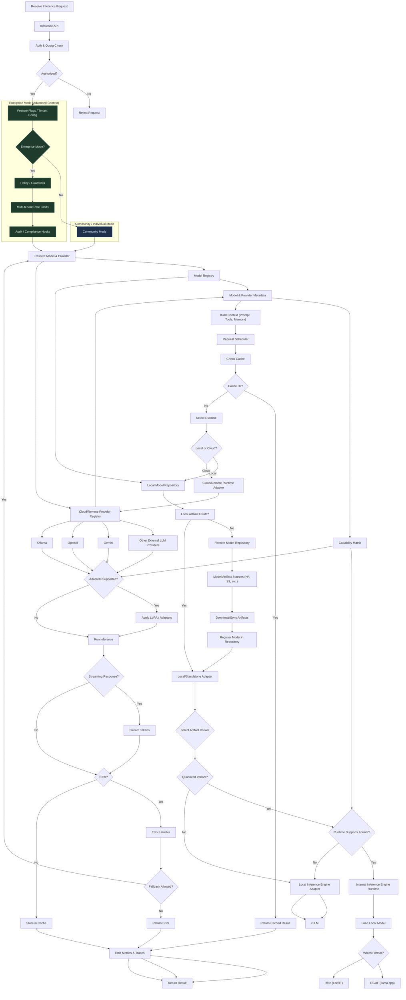
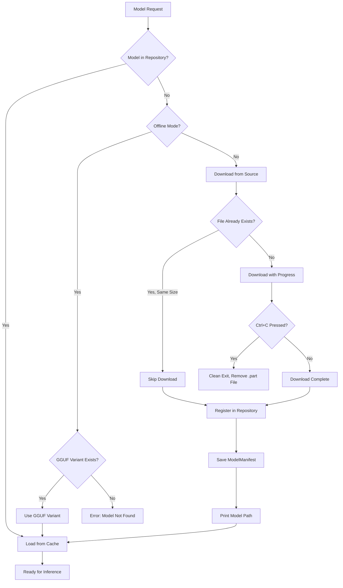
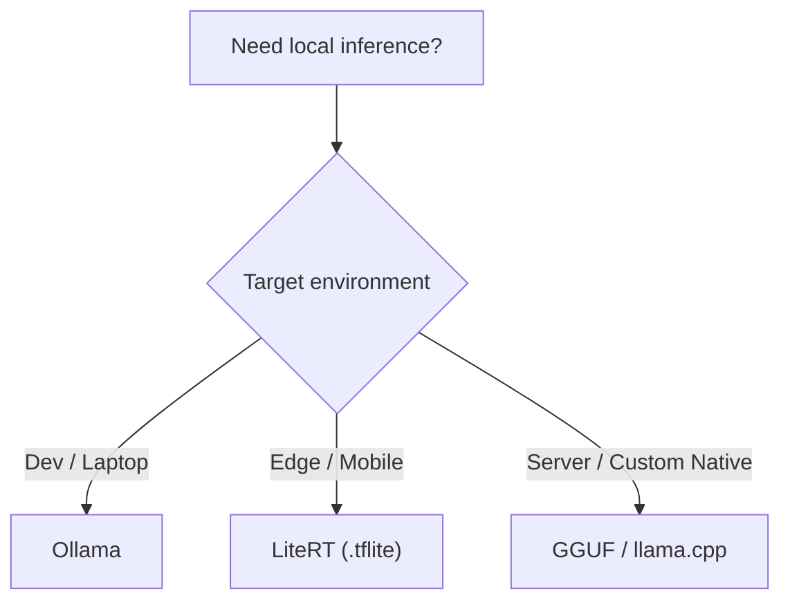
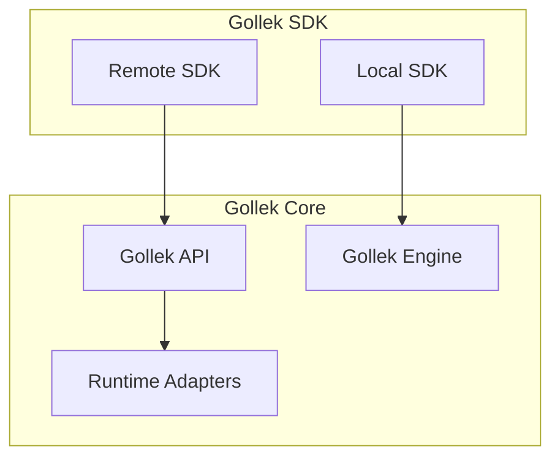
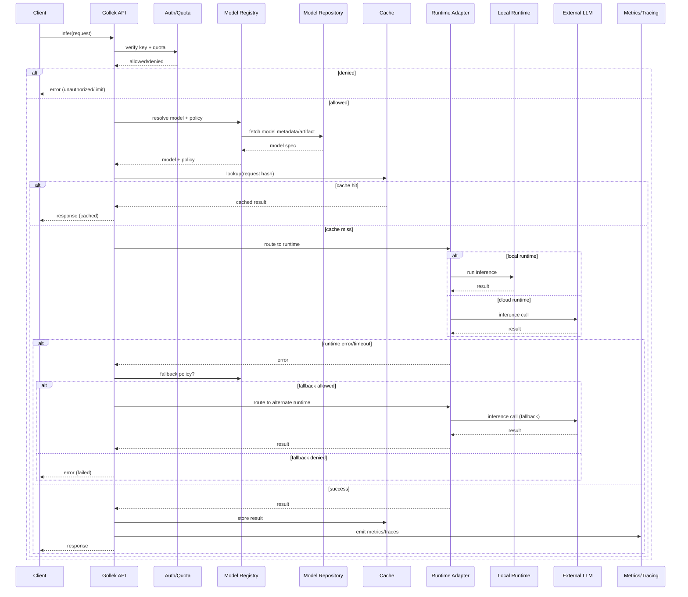

---
# GOLEK INFERENCE SERVER

---

## Multi-Tenancy Activation

Multi-tenancy is disabled by default and enabled per component via extensions.

* Gollek: `tenant-gollek-ext`
* Gamelan: `tenant-gamelan-ext`
* Wayang: `tenant-wayang-ext`

The extensions automatically set `wayang.multitenancy.enabled=true`. See `wayang-enterprise/modules/tenant/README.md` for details.

## 🔁 Gollek Inference Server — Internal Flowchart


---

## � Model Download & Persistence Flow

### Download Process

When a model is requested but not found locally, Gollek automatically downloads it from configured sources (Hugging Face, S3, etc.) and registers it in the local repository for future use.



### Key Features

**Model Persistence**
- Downloaded models are registered with `LocalModelRepository`
- `ModelManifest` created with artifact location and metadata
- No re-downloads on subsequent runs

**Smart Download Skipping**
- Checks file existence and size before downloading
- Skips download if file matches expected size

**Robust Cancellation**
- Ctrl+C immediately terminates download (exit code 130)
- Partial `.part` files are cleaned up automatically
- Shutdown hook ensures clean exit

**User Feedback**
- Download progress bar with percentage
- Model save location printed with ✓ checkmark
- Clear error messages for offline mode failures

**Custom Model Paths**
- `--model-path` flag to use custom model files
- Bypasses repository lookup entirely
- Validates file existence before use

### CLI Usage Examples

**First Download**:
```bash
$ gollek run --model Qwen/Qwen2.5-0.5B-Instruct-GGUF --prompt "Hello"
Checking model: Qwen/Qwen2.5-0.5B-Instruct-GGUF... not found
Downloading from Hugging Face...
[========================================] 100%

✓ Model saved to: ~/.gollek/models/gguf/Qwen_Qwen2.5-0.5B-Instruct-GGUF
```

**Subsequent Runs** (no re-download):
```bash
$ gollek run --model Qwen/Qwen2.5-0.5B-Instruct-GGUF --prompt "Hello"
Checking model: Qwen/Qwen2.5-0.5B-Instruct-GGUF... found
Model path: ~/.gollek/models/gguf/Qwen_Qwen2.5-0.5B-Instruct-GGUF
```

**Custom Model Path**:
```bash
$ gollek run --model-path /my/models/custom.gguf --prompt "Hello"
Using model from: /my/models/custom.gguf
```

**Offline Mode**:
```bash
$ gollek run --offline --model Qwen/Qwen2.5-0.5B-Instruct-GGUF --prompt "Hello"
Checking model: Qwen/Qwen2.5-0.5B-Instruct-GGUF... found
# Uses local model, no download attempt
```

---

## �🔧 Local Runtime Focus 

### LiteRT (.tflite)
* **Role**: Mobile/edge‑friendly inference for .tflite models.
* **Path**: Request → Local Runtime Adapter → LiteRT → Model → Result
* **Strengths**: Small footprint, hardware acceleration via delegates.
* **Considerations**: Quantization validation, delegate compatibility, device‑specific constraints.

### GGUF / llama.cpp
* **Role**: Native local inference for GGUF/ggml models (CPU/CUDA).
* **Path**: Request → Local Runtime Adapter → llama.cpp → Model → Result
* **Strengths**: High performance, local control, GGUF support, automatic model conversion.
* **Considerations**: Context isolation, KV cache safety, ABI pinning.
* **Model Formats**: Supports GGUF natively, can convert from PyTorch, SafeTensors, TensorFlow, Flax.
* **Download**: Automatic download from Hugging Face with progress tracking and persistence.

### Ollama (Local Model Runtime)
* **Role**: Local model serving with GGUF/ggml support, optimized for developer machines and edge.
* **Path**: Request → Local Runtime Adapter → Ollama → Model → Result
* **Strengths**: Simple ops, fast local iteration, consistent CLI + server.
* **Considerations**: Model cache location, per‑model concurrency limits, streaming SSE support.


### Local Runtime Comparison (Quick Guide)
| Runtime | Best For | Strengths | Constraints |
|---|---|---|---|
| GGUF (llama.cpp) | Custom native control | High performance, GGUF support | ABI drift, context isolation |
| TFLite (LiteRT) | Mobile/edge | Small footprint, delegate acceleration | Delegate compatibility, quantization |
| Ollama | Fast local iteration | Simple ops, streaming, model caching | Needs local daemon, per‑model limits |

### Local Runtime Decision Guide


---

## 🧠 How to read this

Main flow:

```
Request → Auth → Model → Schedule → Context → Runtime → Infer → Cache → Return
```

---

### 🔹 Key decision points

**Authorization**

```
Authorized?
```

**Cache**

```
Cache Hit?
```

**Runtime selection**

```
Local or Cloud?
```

**Fallback**

```
Fallback Allowed?
```

---

### 🔹 Supports your vision

- ✔ Hybrid local + cloud
- ✔ Cost-aware routing
- ✔ LoRA & adapters
- ✔ Prompt orchestration
- ✔ Embedding cache
- ✔ Failover providers
- ✔ Batching & scheduling
- ✔ External provider integrations (OpenAI, Gemini, Anthropic, etc.)
- ✔ Local inference runtimes (Ollama, llama.cpp/gguf, LiteRT/.tflite, TensorRT, vLLM)
- ✔ Automatic model download & persistence (Hugging Face, S3)
- ✔ Model format conversion (PyTorch/SafeTensors → GGUF)
- ✔ Smart download skipping & cancellation
- ✔ Custom model path support
- ✔ Offline mode with GGUF variant fallback
- ✔ Future MCP integration

---

## 🧭 Current Implementation Mapping (Repo)

* **Gollek Core / Engine** → `inference-gollek/core/`
  - `gollek-spi` - Service Provider Interface with `ModelFormat` enum
  - `gollek-engine` - Core inference orchestration
  - `gollek-provider-core` - Provider abstraction layer
* **Providers** → `inference-gollek/provider/`
  - `gollek-ext-cloud-ollama` - Ollama integration
  - `gollek-ext-cloud-gemini` - Google Gemini integration
  - `gollek-ext-cloud-cerebras` - Cerebras integration
* **Adapters** → `inference-gollek/inference/format/`
  - `gollek-ext-format-gguf` - GGUF/llama.cpp adapter
  - `gollek-gguf-converter` - Model format conversion service
* **Runtime** → `inference-gollek/runtime/`
* **Repositories** → `inference-gollek/repository/`
  - `gollek-model-repo-local` - Local model storage & manifest management
  - `gollek-model-repo-hf` - Hugging Face download client with progress tracking
* **SDK** → `inference-gollek/sdk/`
  - `gollek-sdk-java-local` - Local SDK with model registration
  - `gollek-sdk-core` - Core SDK interfaces
* **CLI** → `inference-gollek/ui/gollek-cli`
  - Command-line interface with `--model-path` and `--offline` flags

---

## 🧩 Gollek SDK Mechanism (Local + Remote)



---

## 🔁 Gollek Inference — Sequence Diagram



---

## ✅ Step-By-Step Build Order (Minimal → Production)

1. **Boot Gollek Core**  
   Focus: inference pipeline orchestration.  
   Code: `inference-gollek/core/`

2. **Add Model Registry + Repositories**  
   Focus: model metadata + artifact resolution.  
   Code: `inference-gollek/core/gollek-model-repo-core`, `inference-gollek/repository/`

3. **Enable Provider SPI**  
   Focus: pluggable inference backends.  
   Code: `inference-gollek/core/gollek-provider-core`, `inference-gollek/provider/`

4. **Attach Runtime Adapters**  
   Focus: local vs cloud runtime selection.  
   Code: `inference-gollek/runtime/`, `inference-gollek/adapter/`

5. **Add SDKs**  
   Focus: local/remote developer integration.  
   Code: `inference-gollek/sdk/`

---

## ✅ Production Readiness Checklist (Gollek)

* Auth/quota enforcement per tenant
* Provider fallback policy configured
* Model registry cache warmed
* Local runtimes validated (Ollama, llama.cpp, LiteRT, TensorRT, vLLM)
* External provider rate limits handled
* Prompt/context redaction + safety checks
* Metrics + traces exported (OpenTelemetry)
