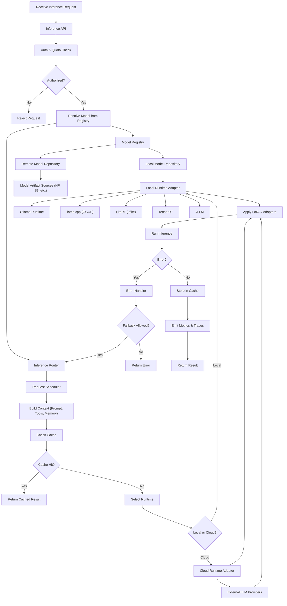
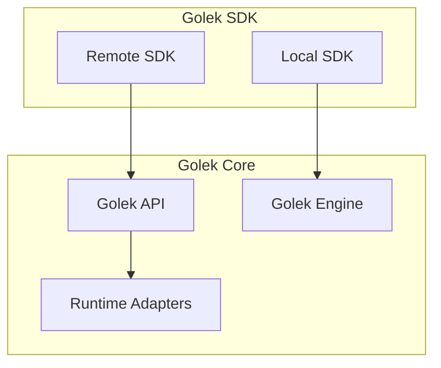
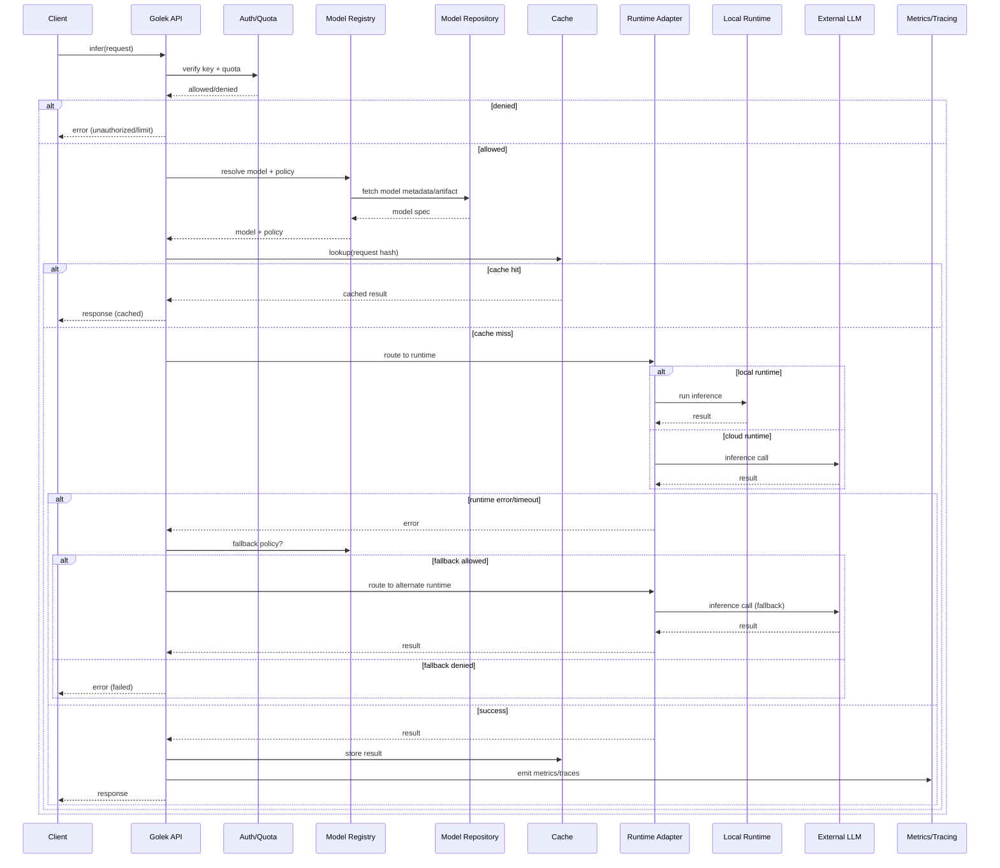

---
# GOLEK INFERENCE SERVER

---

## 🔁 Golek Inference Server — Internal Flowchart



---

## 🧠 How to read this

Main flow:

```
Request → Auth → Model → Schedule → Context → Runtime → Infer → Cache → Return
```

---

### 🔹 Key decision points

**Authorization**

```
Authorized?
```

**Cache**

```
Cache Hit?
```

**Runtime selection**

```
Local or Cloud?
```

**Fallback**

```
Fallback Allowed?
```

---

### 🔹 Supports your vision

✔ Hybrid local + cloud
✔ Cost-aware routing
✔ LoRA & adapters
✔ Prompt orchestration
✔ Embedding cache
✔ Failover providers
✔ Batching & scheduling
✔ External provider integrations (OpenAI, Gemini, Anthropic, etc.)
✔ Local inference runtimes (Ollama, llama.cpp/gguf, LiteRT/.tflite, TensorRT, vLLM)
✔ Future MCP integration

---

## 🧭 Current Implementation Mapping (Repo)

* **Golek Core / Engine** → `inference-golek/core/`
* **Providers** → `inference-golek/provider/`
* **Adapters** → `inference-golek/adapter/`
* **Runtime** → `inference-golek/runtime/`
* **Repositories** → `inference-golek/repository/`
* **SDK** → `inference-golek/sdk/`

---

## 🧩 Golek SDK Mechanism (Local + Remote)



---

## 🔁 Golek Inference — Sequence Diagram


