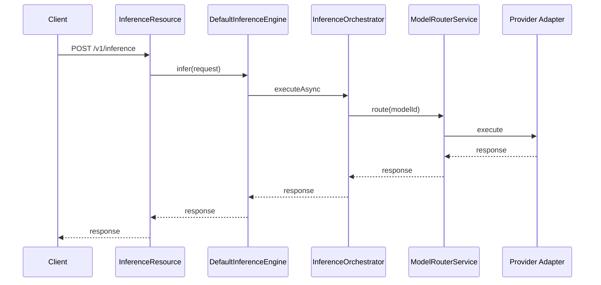
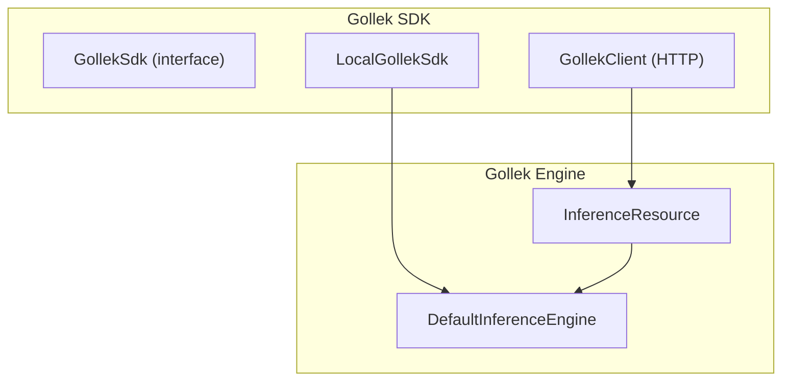
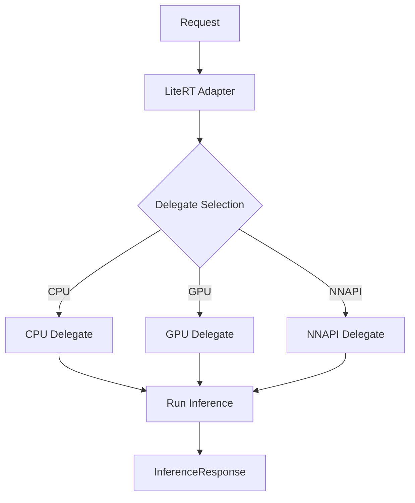
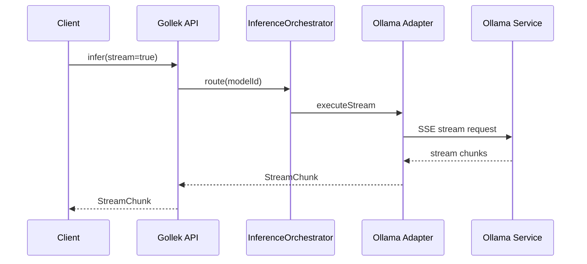

# Gollek Core Implementation Guide (Production-Ready)

This guide explains how Gollek core + SDK are wired today and provides a concrete upgrade path to production readiness. It is intended as an engineering playbook.

## 1) Execution Entry Points

**API and engine flow**

1. Inference requests enter via the engine resources.  
   Code: `inference-gollek/core/gollek-engine/src/main/java/tech/kayys/gollek/engine/inference/InferenceResource.java`
2. Requests are handled by the inference engine (state + retries).  
   Code: `inference-gollek/core/gollek-engine/src/main/java/tech/kayys/gollek/engine/inference/DefaultInferenceEngine.java`
3. Orchestration delegates routing and provider selection.  
   Code: `inference-gollek/core/gollek-engine/src/main/java/tech/kayys/gollek/engine/inference/InferenceOrchestrator.java`

## 2) Routing & Provider Selection

1. `ModelRouterService` loads model metadata, builds routing context, and selects a provider.  
   Code: `inference-gollek/core/gollek-engine/src/main/java/tech/kayys/gollek/engine/routing/ModelRouterService.java`
2. Selection policy scores candidates (latency, cost, preference, availability).  
   Code: `inference-gollek/core/gollek-engine/src/main/java/tech/kayys/gollek/engine/routing/policy/SelectionPolicy.java`
3. Provider registry resolves concrete provider instances.  
   Code: `inference-gollek/core/gollek-engine/src/main/java/tech/kayys/gollek/engine/registry/ProviderRegistry.java`

## 3) Model Registry & Repository

1. Model manifests are stored and resolved through the model repository.  
   Code: `inference-gollek/core/gollek-engine/src/main/java/tech/kayys/gollek/engine/model/ModelRepository.java`
2. Cached model repository provides a cache layer for manifests.  
   Code: `inference-gollek/core/gollek-engine/src/main/java/tech/kayys/gollek/engine/model/CachedModelRepository.java`
3. Artifact download and storage:  
   Code: `inference-gollek/core/gollek-model-repo-core/src/main/java/tech/kayys/gollek/model/download/DownloadManager.java`

## 4) Provider SPI + Runtime Adapters

1. Provider SPI contract (pluggable providers).  
   Code: `inference-gollek/core/gollek-provider-core/src/main/java/tech/kayys/gollek/provider/core/spi/LLMProvider.java`
2. Streaming provider support.  
   Code: `inference-gollek/core/gollek-provider-core/src/main/java/tech/kayys/gollek/provider/core/spi/StreamingProvider.java`
3. Local vs cloud provider adapters.  
   Code: `inference-gollek/core/gollek-engine/src/main/java/tech/kayys/gollek/engine/provider/adapter/LocalProviderAdapter.java`  
   Code: `inference-gollek/core/gollek-engine/src/main/java/tech/kayys/gollek/engine/provider/adapter/CloudProviderAdapter.java`

## 5) Quota & Tenant Enforcement

1. Quota enforcement service (rate limits + quotas).  
   Code: `inference-gollek/core/gollek-engine/src/main/java/tech/kayys/gollek/engine/tenant/QuotaEnforcer.java`
2. Tenant context filtering.  
   Code: `inference-gollek/core/gollek-engine/src/main/java/tech/kayys/gollek/engine/tenant/TenantContextFilter.java`

**Activation note**: Multi-tenancy is disabled by default. Add `tenant-gollek-ext` (or set `wayang.multitenancy.enabled=true`) to enforce tenant headers and enable tenant-aware routing/quotas. See `wayang-enterprise/modules/tenant/README.md`.

## 6) SDK (Local + Remote)

1. SDK interface contract.  
   Code: `inference-gollek/sdk/gollek-sdk-core/src/main/java/tech/kayys/gollek/sdk/core/GollekSdk.java`
2. Local SDK (in-process, CDI).  
   Code: `inference-gollek/sdk/gollek-sdk-java-local/src/main/java/tech/kayys/gollek/sdk/local/LocalGollekSdk.java`
3. Remote SDK (HTTP client + streaming).  
   Code: `inference-gollek/sdk/gollek-sdk-java-remote/src/main/java/tech/kayys/gollek/client/GollekClient.java`  
   Code: `inference-gollek/sdk/gollek-sdk-java-remote/src/main/java/tech/kayys/gollek/client/StreamingHelper.java`
4. SDK factory (local/remote wiring).  
   Code: `inference-gollek/sdk/gollek-sdk-core/src/main/java/tech/kayys/gollek/sdk/factory/GollekSdkFactory.java`

---

## ✅ Production Upgrade Checklist (Step-by-Step)

### P0 – Correctness & Safety
1. **Local SDK CDI wiring**
   - Ensure `LocalGollekSdk` is created from CDI (Arc) not `new`.
   - Fix in `GollekSdkFactory`.
2. **Engine timeout enforcement**
   - Apply `syncTimeout` and enforce cancellation in `DefaultInferenceEngine`.
3. **Retry classification**
   - Only retry on network/provider errors, not validation or model-not-found.

### P1 – Reliability
1. **Bound routing cache**
   - Replace unbounded `decisionCache` with TTL/LRU.
2. **Model cache invalidation**
   - Evict cache on model updates.
3. **Fail-open quota policy**
   - Make fail-open behavior configurable per tenant/environment.

### P2 – Performance + DX
1. **Non-blocking streaming**
   - Replace blocking SSE loop with async/streaming client.
2. **SDK request validation**
   - Enforce `RequestValidator` in remote client.
3. **Unified exception mapping**
   - Consolidate error codes across core/provider/sdk.

---

## 🔧 Local Runtime Deep Dive — GGUF / llama.cpp

### 1) Adapter Responsibilities
* Resolve GGUF artifact from model repository
* Load native llama.cpp library (CPU/CUDA)
* Initialize model + context safely (per‑request or pooled)
* Generate tokens and normalize into `InferenceResponse`

### 2) Operational Concerns
* **Thread safety**: llama.cpp context is not concurrent‑safe
* **KV cache isolation**: clear between requests
* **Model ABI**: pin llama.cpp version to avoid binding drift
* **Sampling**: temperature/top‑p/top‑k + repeat penalties

### 3) Implementation Steps
1. Use GGUF model repository lookup
2. Load native library and set model/context params
3. Add proper sampling (non‑greedy)
4. Add streaming (token chunks) + cancel support

### 4) Suggested Paths (Repo)
* GGUF adapter module: `inference-gollek/adapter/gollek-ext-format-gguf/`
* Binding: `inference-gollek/adapter/gollek-ext-format-gguf/src/main/java/tech/kayys/gollek/inference/gguf/LlamaCppBinding.java`
* Runner: `inference-gollek/adapter/gollek-ext-format-gguf/src/main/java/tech/kayys/gollek/inference/gguf/LlamaCppRunner.java`

---

## 🔧 Local Runtime Deep Dive — LiteRT (.tflite)

### 1) Adapter Responsibilities
* Resolve `.tflite` artifact from model repository
* Load model via LiteRT runtime + delegate config
* Execute inference with resource bounds
* Normalize outputs to `InferenceResponse`

### 2) Operational Concerns
* **Delegate compatibility**: CPU/GPU/NNAPI availability
* **Quantization**: enforce quantized model requirements
* **Memory constraints**: strict memory budget and eviction

### 3) Implementation Steps
1. Add a LiteRT provider adapter implementing `LLMProvider`.
2. Support delegate selection (CPU/GPU/NNAPI).
3. Add model validation for required input/output tensors.
4. Emit runtime metrics for latency + memory.

### 4) Suggested Paths (Repo)
* Provider SPI: `inference-gollek/core/gollek-provider-core/src/main/java/tech/kayys/gollek/provider/core/spi/LLMProvider.java`
* Model repo core: `inference-gollek/core/gollek-model-repo-core/`
* LiteRT adapter module: `inference-gollek/provider/gollek-provider-litert/`

---

## 🔧 Local Runtime Deep Dive — Ollama

### 1) Adapter Responsibilities
* Build provider request from `InferenceRequest`
* Route to local Ollama endpoint (HTTP)
* Handle streaming (SSE) + non‑streaming responses
* Normalize response into `InferenceResponse`

### 2) Operational Concerns
* **Model lifecycle**: pull/load model once, reuse for requests
* **Concurrency**: per‑model queue + max concurrent settings
* **Caching**: warmup for hot models
* **Health checks**: model availability + latency sanity check

### 3) Implementation Steps
1. Add a local provider adapter that implements `LLMProvider`.
2. Map request params to Ollama options (temperature, top‑p, max tokens).
3. Implement streaming by translating Ollama SSE to `StreamChunk`.
4. Register adapter in provider registry (local mode).

### 4) Suggested Paths (Repo)
* Provider SPI: `inference-gollek/core/gollek-provider-core/src/main/java/tech/kayys/gollek/provider/core/spi/LLMProvider.java`
* Local adapter base: `inference-gollek/core/gollek-engine/src/main/java/tech/kayys/gollek/engine/provider/adapter/LocalProviderAdapter.java`
* Streaming SPI: `inference-gollek/core/gollek-provider-core/src/main/java/tech/kayys/gollek/provider/core/spi/StreamingProvider.java`
* Ollama adapter module: `inference-gollek/provider/gollek-ext-cloud-ollama/`

---
