# Wayang Platform — Complete Documentation (Continued)

> **Version:** 1.0.0-SNAPSHOT
> **Chapters:** 11–20 + Appendices

---

## Table of Contents

- [Chapter 11 — Context Compiler Deep Dive](#chapter-11--context-compiler-deep-dive)
- [Chapter 12 — Workflow & Graph Engine](#chapter-12--workflow--graph-engine)
- [Chapter 13 — Advanced Security](#chapter-13--advanced-security)
- [Chapter 14 — Knowledge Exchange Protocol](#chapter-14--knowledge-exchange-protocol)
- [Chapter 15 — Distributed Coordination](#chapter-15--distributed-coordination)
- [Chapter 16 — Performance & Optimization](#chapter-16--performance--optimization)
- [Chapter 17 — Testing & Quality](#chapter-17--testing--quality)
- [Chapter 18 — Migration & Upgrade Guide](#chapter-18--migration--upgrade-guide)
- [Chapter 19 — API Reference](#chapter-19--api-reference)
- [Chapter 20 — Roadmap & Future](#chapter-20--roadmap--future)

---

# Chapter 11 — Context Compiler Deep Dive

## 11.1 The Philosophy

The Wayang context compiler solves one specific problem: **given a Java file being edited, and a token budget, assemble the most useful verbatim context — never a summary.**

The design is grounded in a hard constraint: **every character the compiler emits is a substring of the original source.** Scope narrows (which members are shown); fidelity never drops (how they're shown). There is no "here's a summary of what this file does" tier. Ever.

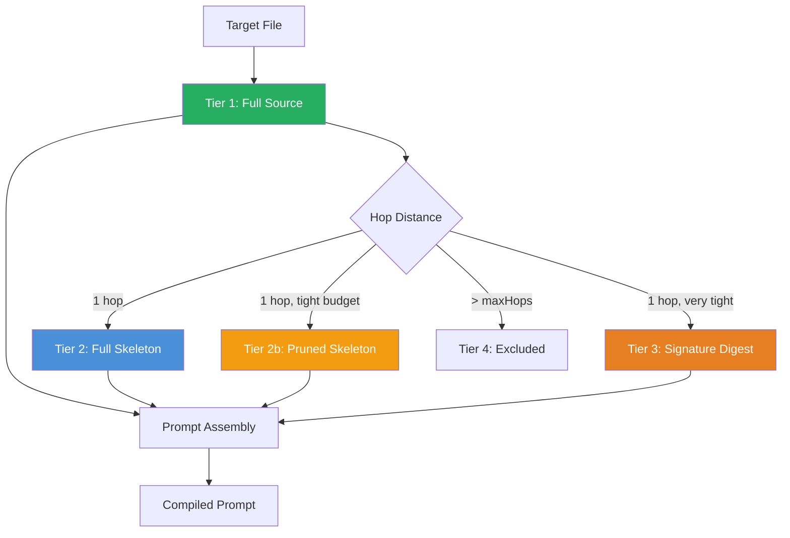
```mermaid
flowchart TB
    TARGET[Target File] --> TIER1[Tier 1: Full Source]
    TIER1 --> DIFF{Hop Distance}

    DIFF -->|1 hop| TIER2[Tier 2: Full Skeleton]
    DIFF -->|1 hop, tight budget| TIER2P[Tier 2b: Pruned Skeleton]
    DIFF -->|1 hop, very tight| TIER3[Tier 3: Signature Digest]
    DIFF -->|> maxHops| TIER4[Tier 4: Excluded]

    TIER1 --> ASM[Prompt Assembly]
    TIER2 --> ASM
    TIER2P --> ASM
    TIER3 --> ASM
    ASM --> PROMPT[Compiled Prompt]

    style TIER1 fill:#27AE60,color:#fff
    style TIER2 fill:#4A90D9,color:#fff
    style TIER2P fill:#F39C12,color:#fff
    style TIER3 fill:#E67E22,color:#fff
```

## 11.2 The Six Tiers

| Tier | Name | What's shown | Fidelity |
|------|------|--------------|----------|
| **1** | `FULL_SOURCE` | The file being edited | 100% verbatim |
| **1b** | `SOURCE_CHUNK` | Line window of a large file | 100% verbatim |
| **2** | `SKELETON` | Reachable file: every member's signature + Javadoc, bodies stripped | 100% verbatim (bodies replaced with stubs) |
| **2b** | `SKELETON_PRUNED` | Only members confidently attributed as *used* | 100% verbatim |
| **3** | `SIGNATURE_DIGEST` | Bare signatures, one line per member | 100% verbatim |
| **4** | `EXCLUDED` | Nothing | N/A |

## 11.3 The Compilation Pipeline

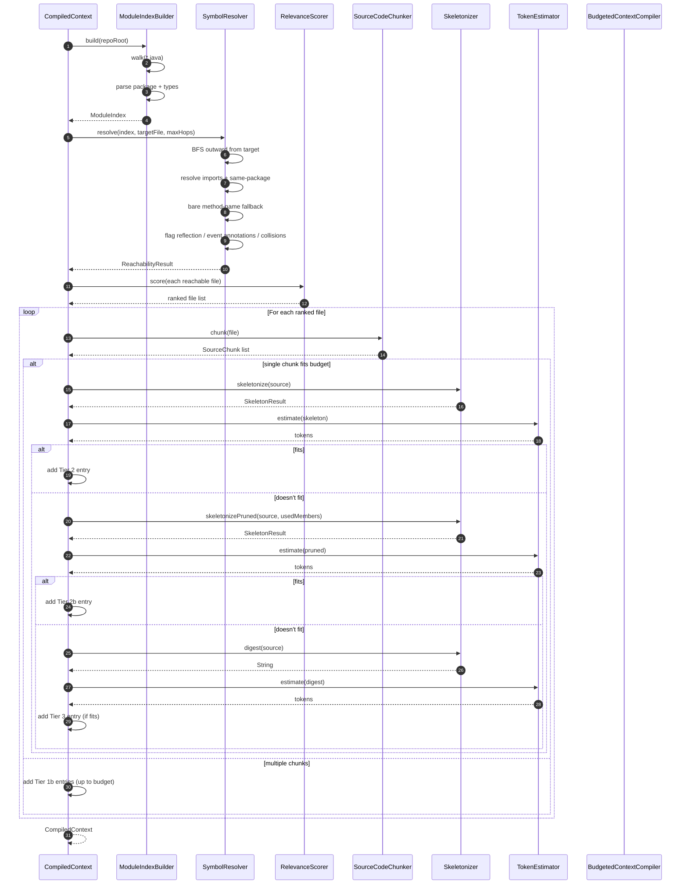
```mermaid
sequenceDiagram
    autonumber
    participant C as CompiledContext
    participant MB as ModuleIndexBuilder
    participant SR as SymbolResolver
    participant RS as RelevanceScorer
    participant SC as SourceCodeChunker
    participant SK as Skeletonizer
    participant TE as TokenEstimator
    participant BC as BudgetedContextCompiler

    C->>MB: build(repoRoot)
    MB->>MB: walk(*.java)
    MB->>MB: parse package + types
    MB-->>C: ModuleIndex

    C->>SR: resolve(index, targetFile, maxHops)
    SR->>SR: BFS outward from target
    SR->>SR: resolve imports + same-package
    SR->>SR: bare method-name fallback
    SR->>SR: flag reflection / event annotations / collisions
    SR-->>C: ReachabilityResult

    C->>RS: score(each reachable file)
    RS-->>C: ranked file list

    loop For each ranked file
        C->>SC: chunk(file)
        SC-->>C: SourceChunk list

        alt single chunk fits budget
            C->>SK: skeletonize(source)
            SK-->>C: SkeletonResult
            C->>TE: estimate(skeleton)
            TE-->>C: tokens

            alt fits
                C->>C: add Tier 2 entry
            else doesn't fit
                C->>SK: skeletonizePruned(source, usedMembers)
                SK-->>C: SkeletonResult
                C->>TE: estimate(pruned)
                TE-->>C: tokens

                alt fits
                    C->>C: add Tier 2b entry
                else doesn't fit
                    C->>SK: digest(source)
                    SK-->>C: String
                    C->>TE: estimate(digest)
                    TE-->>C: tokens
                    C->>C: add Tier 3 entry (if fits)
                end
            end
        else multiple chunks
            C->>C: add Tier 1b entries (up to budget)
        end
    end

    C-->>C: CompiledContext
```

## 11.4 Symbol Resolution — The Three Blind Spots

The `HeuristicSymbolResolver` trades soundness for speed. Three blind spots follow from that trade-off, and each is **disclosed** rather than hidden.

### Blind Spot 1: Reflection-Based Dispatch

```java
Class<?> clazz = Class.forName(className);
clazz.getDeclaredMethod("run").invoke(clazz.getDeclaredConstructor().newInstance());
```

The resolver detects `forName`, `getMethod`, `getDeclaredMethod`, `invoke`, `newInstance` and adds the file to `dynamicDispatchFiles`.

**Reported as:**
```
Warning: 1 file(s) use reflection-based dynamic dispatch — targets may be missing from tier 2.
```

### Blind Spot 2: Event-Style Annotations

```java
@ConsumeEvent
public void onOrderPlaced(String orderId) {
    // ...
}
```

The resolver detects `@Observes`, `@ObservesAsync`, `@ConsumeEvent`, `@Incoming`, `@Outgoing`, `@Scheduled` and records them as `eventAnnotationHints`.

**Reported as:**
```
Warning: 1 file(s) use event-style annotations (e.g. @Observes, @ConsumeEvent) — handlers may be missing from tier 2.
```

### Blind Spot 3: Name Collisions

```java
// UserRepository.java
public void save() { ... }

// OrderRepository.java
public void save() { ... }
```

A bare `save()` call matches both. The resolver adds both files to Tier 2 and records the collision.

**Reported as:**
```
Note: 1 call name(s) resolved to more than one file (name-only resolution) — tier 2 may include false positives.
```

## 11.5 The Type-Aware Resolver (Optional Upgrade)

`TypeAwareSymbolResolver` wraps `HeuristicSymbolResolver` and uses JavaParser's symbol solver to narrow name-collision candidates when a project-wide type solver is available.

```java
Path sourceRoot = Path.of("src/main/java");
SymbolResolver resolver = new TypeAwareSymbolResolver(sourceRoot);
```

When the symbol solver resolves a call, it narrows to the declaring type's file. When it can't (unresolved imports, external jars), it falls back to the heuristic result — never silently guesses.

## 11.6 Skeletonization Levels

### Tier 2 — Full Skeleton

Every member's signature + Javadoc preserved. Bodies replaced with stubs:

```java
public class UserService {
    /**
     * Persists the current user.
     */
    public void save() {
        // body stripped
    }

    public User findById(String id) {
        return null; // body stripped, default value inserted
    }
}
```

### Tier 2b — Pruned Skeleton

Only members in the `keepMemberNames` set are shown. Constructors and fields are always kept.

```java
public class UserService {
    // pruned: 8 member(s) not reachable from target, omitted

    private final UserRepository userRepository;

    /**
     * Persists the current user.
     */
    public void save() {
        // body stripped
    }
}
```

### Tier 3 — Signature Digest

One line per member, no Javadoc, no annotations:

```java
public class UserService {
    private UserRepository userRepository;
    public void save();
    public User findById(String id);
    public List<User> findAll();
}
```

## 11.7 Budget-Aware Greedy Knapsack

The `DefaultBudgetedContextCompiler` uses a greedy knapsack algorithm:

1. **Rank** reachable files by `RelevanceScorer.score()`
2. **For each file** (in rank order), try the richest representation that fits remaining budget
3. **Spill** to the next leaner tier if the richer one doesn't fit
4. **Exclude** if even the digest doesn't fit

The scorer is deliberately explainable — every score is derivable from `ReachabilityResult` alone:

```
score = 1/hop + 0.1 × callSiteCount + 0.05 × usedMemberCount
```

No embeddings, no LLM calls. Just hop distance, call-site count, and member attribution confidence.

## 11.8 The Context Planner

`DefaultContextPlanner` maps task intent to `ContextPlan`:

| Intent | maxHops | Budget | Rationale |
|--------|---------|--------|-----------|
| `BUG_FIX` | 2 | 65% of window | Shallow and precise — defect is near the symptom |
| `REFACTOR` | 3 | 65% of window | Wider blast radius — callers 2-3 hops out need visibility |
| `NEW_FEATURE` | 2 | 52% of window | Moderate depth, budget held for new code generation |
| `EXPLORATION` | 4 | 65% of window | Cast wide, coverage > precision |

`GENERATION_RESERVE = 0.35` — 35% of the window is always reserved for the model's own reasoning and output tokens.

## 11.9 Source Chunking

For large files, `SourceCodeChunker` splits into overlapping line windows:

- **Default:** 200 lines per chunk, 20 lines overlap
- **Overlap** ensures context isn't lost at chunk boundaries
- **Chunks** are the unit for `SOURCE_CHUNK` (Tier 1b)

```java
SourceCodeChunker chunker = new SourceCodeChunker();
List<SourceChunk> chunks = chunker.chunk(path);
// Each chunk has: path, range (start/end/index), content, metadata (language, checksum, tokens)
```

---

# Chapter 12 — Workflow & Graph Engine

## 12.1 Two Workflow Engines

Wayang ships two distinct workflow engines, serving different needs:

| Engine | Module | Model | Best for |
|--------|--------|-------|----------|
| **State-Machine Graph** | `wayang-orchestration` | Nodes + edges + reducers | Agent coordination, LLM-driven flows |
| **Workflow Definition** | `wayang-workflow` | Steps + transitions | Business process, deterministic flows |

Both can delegate to a `WorkflowBackend` (e.g., Gamelan) for durable execution.

## 12.2 The State-Machine Graph

### 12.2.1 Core Concepts

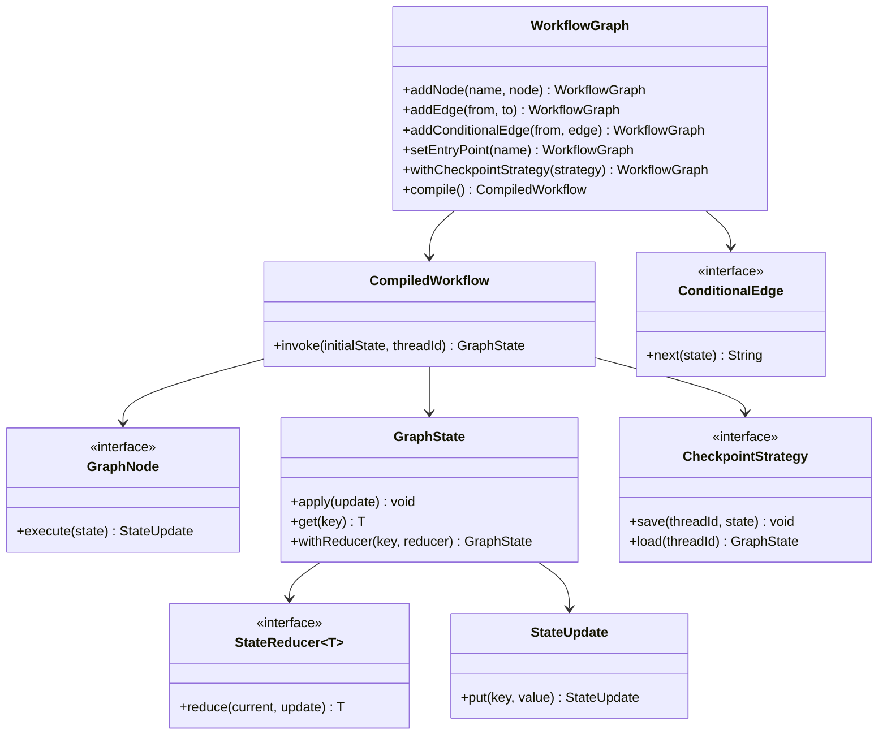
```mermaid
classDiagram
    class WorkflowGraph {
        +addNode(name, node) WorkflowGraph
        +addEdge(from, to) WorkflowGraph
        +addConditionalEdge(from, edge) WorkflowGraph
        +setEntryPoint(name) WorkflowGraph
        +withCheckpointStrategy(strategy) WorkflowGraph
        +compile() CompiledWorkflow
    }

    class CompiledWorkflow {
        +invoke(initialState, threadId) GraphState
    }

    class GraphNode {
        <<interface>>
        +execute(state) StateUpdate
    }

    class GraphState {
        +apply(update) void
        +get(key) T
        +withReducer(key, reducer) GraphState
    }

    class StateUpdate {
        +put(key, value) StateUpdate
    }

    class StateReducer~T~ {
        <<interface>>
        +reduce(current, update) T
    }

    class ConditionalEdge {
        <<interface>>
        +next(state) String
    }

    class CheckpointStrategy {
        <<interface>>
        +save(threadId, state) void
        +load(threadId) GraphState
    }

    WorkflowGraph --> CompiledWorkflow
    CompiledWorkflow --> GraphNode
    CompiledWorkflow --> GraphState
    CompiledWorkflow --> CheckpointStrategy
    GraphState --> StateReducer
    GraphState --> StateUpdate
    WorkflowGraph --> ConditionalEdge
```

### 12.2.2 Reducers

Reducers define how state updates merge into existing state. The default is `OverwriteReducer` (last write wins).

```java
// Append reducer — accumulate messages
GraphState state = new GraphState()
    .withReducer("messages", new AppendReducer<ChatMessage>());
```

Custom reducer:

```java
public class SumReducer implements StateReducer<Integer> {
    @Override
    public Integer reduce(Integer current, Integer update) {
        return (current == null ? 0 : current) + (update == null ? 0 : update);
    }
}
```

### 12.2.3 The Execution Loop

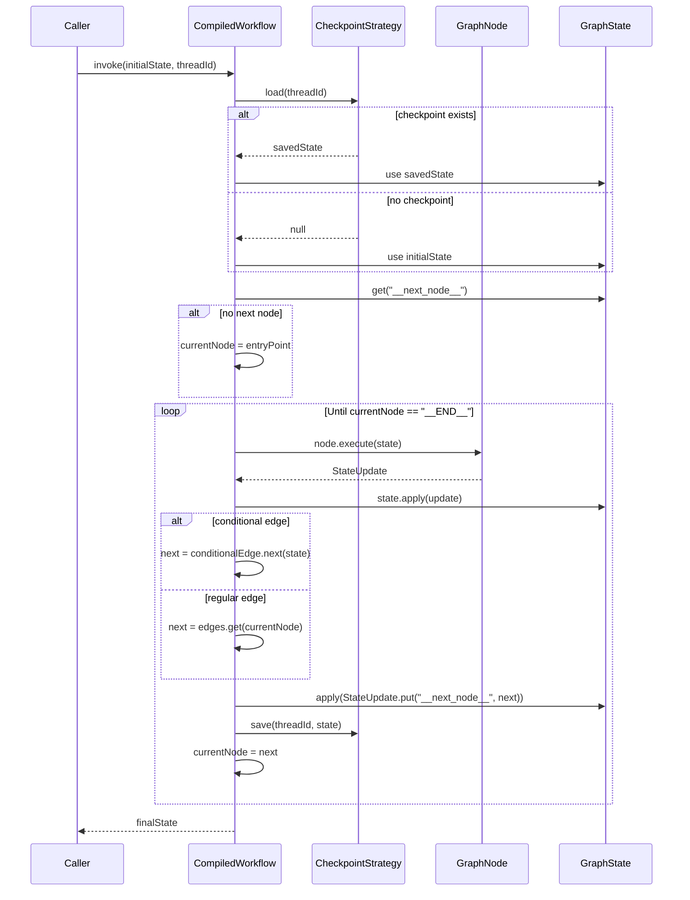
```mermaid
sequenceDiagram
    participant C as Caller
    participant W as CompiledWorkflow
    participant CS as CheckpointStrategy
    participant N as GraphNode
    participant S as GraphState

    C->>W: invoke(initialState, threadId)
    W->>CS: load(threadId)

    alt checkpoint exists
        CS-->>W: savedState
        W->>S: use savedState
    else no checkpoint
        CS-->>W: null
        W->>S: use initialState
    end

    W->>S: get("__next_node__")
    alt no next node
        W->>W: currentNode = entryPoint
    end

    loop Until currentNode == "__END__"
        W->>N: node.execute(state)
        N-->>W: StateUpdate
        W->>S: state.apply(update)

        alt conditional edge
            W->>W: next = conditionalEdge.next(state)
        else regular edge
            W->>W: next = edges.get(currentNode)
        end

        W->>S: apply(StateUpdate.put("__next_node__", next))
        W->>CS: save(threadId, state)
        W->>W: currentNode = next
    end

    W-->>C: finalState
```

### 12.2.4 AgentNode — The Bridge to Agents

`AgentNode` wraps a `Agent` and delegates execution:

```java
AgentNode researcher = new AgentNode(researchAgent, "input", "research_output");
// On execute(state):
//   1. Read state.get("input")
//   2. Call agent.process(input)
//   3. Return StateUpdate.put("research_output", result)
```

### 12.2.5 Checkpoint Strategies

| Strategy | Module | Persistence |
|----------|--------|-------------|
| `InMemoryCheckpointStrategy` | `wayang-orchestration` | JVM heap |
| `JdbcCheckpointStrategy` | `wayang-orchestration` | PostgreSQL (stub) |

For production, implement `CheckpointStrategy` against your store (Redis, Postgres, S3).

## 12.3 The Workflow Definition Engine

### 12.3.1 Builder API

```java
WorkflowDefinition workflow = WorkflowBuilder.named("order-processing")
    .describedAs("Processes customer orders end-to-end")
    .version("1.2.0")
    .step("validate", "Validate Order", "validation-skill")
    .step("charge", "Charge Card", "payment-tool")
    .step("fulfill", "Fulfill Order", "warehouse-tool")
    .step("notify", "Notify Customer", "email-tool")
    .transition("validate", "charge", "validation.success")
    .transition("charge", "fulfill", "payment.success")
    .transition("fulfill", "notify")
    .parallel(false)
    .maxConcurrency(10)
    .build();
```

### 12.3.2 Execution

```java
WorkflowEngine engine = ...;
WorkflowResult result = engine.execute(workflow, context, Map.of("orderId", "12345"));

// result.stepResults() — per-step outcomes
// result.outputs() — final artifacts
// result.status() — COMPLETED | FAILED | CANCELLED
```

### 12.3.3 Lifecycle

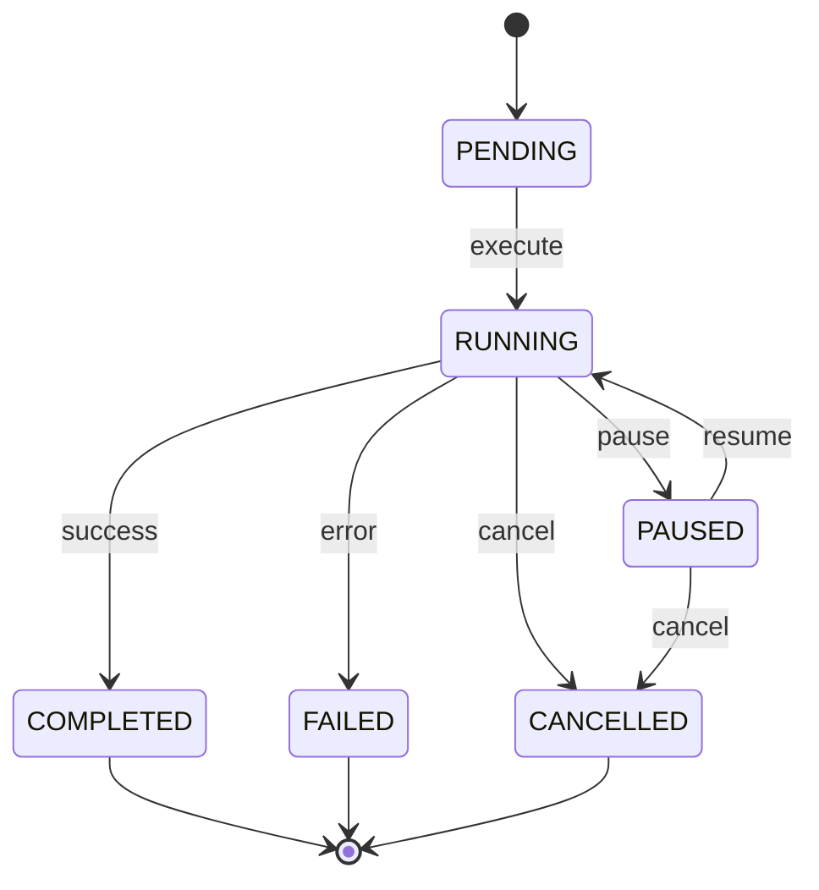
```mermaid
stateDiagram-v2
    [*] --> PENDING
    PENDING --> RUNNING: execute
    RUNNING --> PAUSED: pause
    PAUSED --> RUNNING: resume
    RUNNING --> COMPLETED: success
    RUNNING --> FAILED: error
    RUNNING --> CANCELLED: cancel
    PAUSED --> CANCELLED: cancel
    COMPLETED --> [*]
    FAILED --> [*]
    CANCELLED --> [*]
```

## 12.4 Gamelan Backend Integration

The `GamelanBackendAdapter` bridges Wayang's `WorkflowBackend` SPI to the Gamelan SDK.

### 12.4.1 Capabilities

```java
WorkflowCapabilities caps = backend.capabilities();
// caps.supportsSuspension()
// caps.supportsSignals()
// caps.supportsHistory()
// caps.supportsVersioning()
// caps.maxConcurrentRuns()
// caps.supportedTransports() — ["GRPC", "REST", ...]
```

### 12.4.2 Run Operations

```java
// Create a run
WorkflowRun run = backend.createRun(CreateRunRequest.builder()
    .workflowId("order-processing")
    .tenantId("acme")
    .runId("run-12345")
    .metadata(Map.of("orderId", "12345"))
    .build()).await().indefinitely();

// Start it
RunResponse started = backend.startRun(run.runId(), Map.of()).await().indefinitely();

// Suspend / resume
backend.suspendRun(run.runId()).await().indefinitely();
backend.resumeRun(run.runId(), Map.of("approved", true)).await().indefinitely();

// Send a signal
backend.signalRun(run.runId(), new Signal("payment-received", Map.of())).await().indefinitely();

// Get history
RunHistory history = backend.getRunHistory(run.runId()).await().indefinitely();
```

### 12.4.3 Coordination Workflow Registry

The `GamelanCoordinationWorkflowRegistry` compiles a `CoordinationPlan` into a native Gamelan `WorkflowDefinition`, using SHA-256 fingerprinting for deduplication:

```java
CoordinationPlan plan = strategy.plan(request);
CoordinationWorkflowDefinition compiled = compiler.compile(plan);
String definitionId = registry.getOrCreate(compiled, "acme").await().indefinitely();
```

The registry reuses existing definitions when the fingerprint matches, avoiding duplicate deployments.

### 12.4.4 Wayang Agent Node Executor

`WayangAgentNodeExecutor` lets Gamelan invoke Wayang agents as workflow steps:

```java
// In a Gamelan workflow, a node of type "wayang-agent" with config:
{
  "agentId": "code-reviewer",
  "parameters": {
    "content": "${workflow.prDiff}"
  }
}
// Gamelan calls WayangAgentNodeExecutor.execute(task)
// The executor resolves bindings, builds AgentRequest, invokes runtime
```

## 12.5 Comparing the Two Engines

| Aspect | State-Machine Graph | Workflow Definition |
|--------|---------------------|---------------------|
| **Model** | Nodes + edges + reducers | Steps + transitions |
| **State** | `GraphState` (Map + reducers) | Context map |
| **Branching** | `ConditionalEdge` | Condition strings |
| **Persistence** | `CheckpointStrategy` | `WorkflowEngine` |
| **HITL** | Native via exception | Via step retry |
| **Best for** | LLM-driven, dynamic flows | Business process, deterministic |

---

# Chapter 13 — Advanced Security

## 13.1 The Threat Model

Wayang assumes the following threats:

| Threat | Mitigation |
|--------|------------|
| **Prompt injection via tool args** | Guardrails pre-check + schema validation |
| **Privilege escalation via delegation** | Strict attenuation (child ⊆ parent) |
| **Cross-tenant data leakage** | Tenant isolation policies on every protocol |
| **Audit evasion** | Append-only event ledger + audit sink |
| **Sensitive data exfiltration** | PII detection + redaction obligations |
| **Untrusted downstream agents** | Trust service + propagation modes |
| **Replay attacks** | Nonces + request binding fingerprints |
| **Supply chain (tools)** | Capability declarations + approval gates |

## 13.2 Authentication Deep Dive

### 13.2.1 Authentication Service SPI

```java
public interface AuthenticationService {
    CompletionStage<AuthenticationResult> authenticate(AuthenticationRequest request);
}
```

### 13.2.2 Authentication Request

```java
public record AuthenticationRequest(
    String credential,        // raw credential
    String scheme,            // "Bearer", "ApiKey", "DID"
    Map<String, Object> attributes
) {
    public static AuthenticationRequest bearer(String token) { ... }
}
```

### 13.2.3 Identity Types

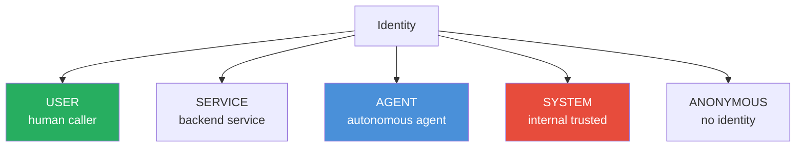
```mermaid
graph TB
    IDENT[Identity] --> USER[USER<br/>human caller]
    IDENT --> SERVICE[SERVICE<br/>backend service]
    IDENT --> AGENT[AGENT<br/>autonomous agent]
    IDENT --> SYSTEM[SYSTEM<br/>internal trusted]
    IDENT --> ANON[ANONYMOUS<br/>no identity]

    style USER fill:#27AE60,color:#fff
    style AGENT fill:#4A90D9,color:#fff
    style SYSTEM fill:#E74C3C,color:#fff
```

### 13.2.4 DID:WBA Authentication (ANP)

For ANP protocol, authentication uses DID:WBA identities with HTTP signatures:

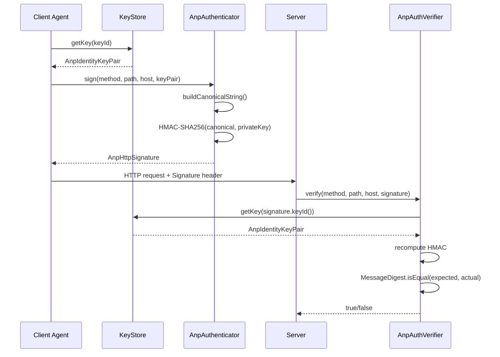
```mermaid
sequenceDiagram
    participant C as Client Agent
    participant KS as KeyStore
    participant A as AnpAuthenticator
    participant S as Server
    participant V as AnpAuthVerifier

    C->>KS: getKey(keyId)
    KS-->>C: AnpIdentityKeyPair
    C->>A: sign(method, path, host, keyPair)
    A->>A: buildCanonicalString()
    A->>A: HMAC-SHA256(canonical, privateKey)
    A-->>C: AnpHttpSignature
    C->>S: HTTP request + Signature header

    S->>V: verify(method, path, host, signature)
    V->>KS: getKey(signature.keyId())
    KS-->>V: AnpIdentityKeyPair
    V->>V: recompute HMAC
    V->>V: MessageDigest.isEqual(expected, actual)
    V-->>S: true/false
```

## 13.3 Authorization Deep Dive

### 13.3.1 Authorization Request

```java
public record AuthorizationRequest(
    SecurityContext securityContext,
    String capability,        // what they want to do
    String action,            // "execute", "read", "write"
    String resource,          // what they want to do it to
    Map<String, Object> attributes
) {
    public static AuthorizationRequest execute(SecurityContext ctx, String capability) { ... }
}
```

### 13.3.2 The Policy Engine

`DefaultPolicyEngine` uses **first-applicable** semantics:

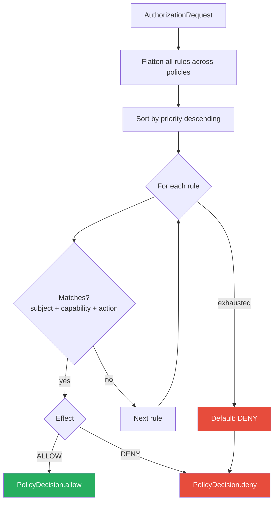
```mermaid
flowchart TD
    REQ[AuthorizationRequest] --> FLATTEN[Flatten all rules across policies]
    FLATTEN --> SORT[Sort by priority descending]
    SORT --> LOOP{For each rule}
    LOOP --> MATCH{Matches?<br/>subject + capability + action}
    MATCH -->|yes| EFFECT{Effect}
    MATCH -->|no| NEXT[Next rule]
    NEXT --> LOOP
    EFFECT -->|ALLOW| ALLOW[PolicyDecision.allow]
    EFFECT -->|DENY| DENY[PolicyDecision.deny]
    LOOP -->|exhausted| DEFAULT[Default: DENY]
    DEFAULT --> DENY

    style ALLOW fill:#27AE60,color:#fff
    style DENY fill:#E74C3C,color:#fff
    style DEFAULT fill:#E74C3C,color:#fff
```

### 13.3.3 Rule Matching

Rules use glob-style wildcards:

| Pattern | Matches |
|---------|---------|
| `*` | Anything |
| `**` | Anything (explicit) |
| `read*` | `read`, `readFile`, `readPii` |
| `file?.txt` | `file1.txt`, `fileA.txt` |

Example rules:

```java
Policy policy = Policy.of("default", List.of(
    PolicyRule.allow("allow-read", "*", "read**"),
    PolicyRule.deny("deny-shell", "*", "shell**"),
    new PolicyRule("allow-admin-write", "admin", "write**", "*",
        PolicyEffect.ALLOW, List.of(), 100)
));
```

## 13.4 Delegation Attenuation

### 13.4.1 The Invariant

**Child authority ⊆ parent authority** across every dimension:

- Capabilities: `child.caps ⊆ parent.caps`
- Actions: `child.actions ⊆ parent.actions`
- Hops: `child.maxHops ≤ parent.maxHops - 1`

### 13.4.2 The Attenuator

```java
public final class DefaultDelegationAttenuator implements DelegationAttenuator {
    @Override
    public DelegationConstraints attenuate(
            DelegationConstraints parent,
            DelegationConstraints requested) {

        List<String> capabilities = intersect(parent.allowedCapabilities(), requested.allowedCapabilities());
        List<String> actions = intersect(parent.allowedActions(), requested.allowedActions());
        int maxHops = Math.min(Math.max(0, parent.maxHops() - 1), requested.maxHops());

        return new DelegationConstraints(capabilities, actions, maxHops);
    }

    private List<String> intersect(List<String> parent, List<String> requested) {
        if (parent.contains("*")) return requested;
        if (requested.contains("*")) return parent;
        List<String> result = new ArrayList<>(parent);
        result.retainAll(requested);
        return List.copyOf(result);
    }
}
```

### 13.4.3 Delegation Request Validation

```java
DelegationRequest request = new DelegationRequest(
    DelegationAudience.of("skill-123", "tool-456"),
    DelegationConstraints.of(List.of("read", "search"), 3),
    Duration.ofMinutes(5),
    Map.of()
);

if (!service.canDelegate(parentSnapshot, request)) {
    throw new SecurityException("Delegation denied");
}

DelegationContext child = service.delegate(parentSnapshot, request).await().indefinitely();
```

## 13.5 Obligation Pipeline

### 13.5.1 Obligation Types

| Type | Phase | Executor |
|------|-------|----------|
| `AUDIT` | BEFORE | `AuditObligationExecutor` |
| `RATE_LIMIT` | BEFORE | `RateLimitObligationExecutor` |
| `HITL` | BEFORE | (HITL module) |
| `REDACT` | AFTER | `TransformObligationExecutor` |
| `MASK` | AFTER | `TransformObligationExecutor` |
| `SANDBOX` | DURING | (Sandbox module) |

### 13.5.2 The Pipeline

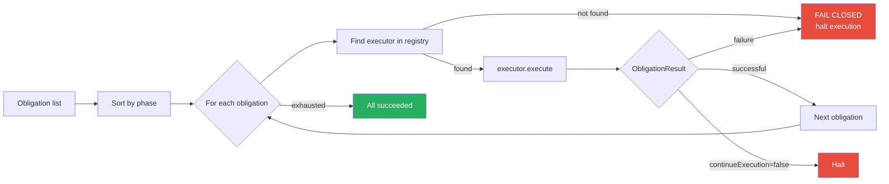
```mermaid
flowchart LR
    REQ[Obligation list] --> SORT[Sort by phase]
    SORT --> LOOP{For each obligation}
    LOOP --> FIND[Find executor in registry]
    FIND -->|not found| FAIL[FAIL CLOSED<br/>halt execution]
    FIND -->|found| EXEC[executor.execute]
    EXEC --> RESULT{ObligationResult}
    RESULT -->|successful| NEXT[Next obligation]
    RESULT -->|continueExecution=false| STOP[Halt]
    RESULT -->|failure| FAIL
    NEXT --> LOOP
    LOOP -->|exhausted| DONE[All succeeded]

    style FAIL fill:#E74C3C,color:#fff
    style STOP fill:#E74C3C,color:#fff
    style DONE fill:#27AE60,color:#fff
```

### 13.5.3 Rate Limiter

```java
InMemoryRateLimiter limiter = new InMemoryRateLimiter(100); // 100 permits
RateLimitObligationExecutor executor = new RateLimitObligationExecutor(limiter);

Obligation ob = Obligation.before(StandardObligations.RATE_LIMIT)
    .withParameters(Map.of(
        "key", "user-123",
        "permits", 1
    ));
```

### 13.5.4 Audit Sink

```java
public interface AuditSink {
    CompletionStage<Void> write(AuditEvent event);
}

public record AuditEvent(
    Instant timestamp,
    String action,
    String capability,
    Principal principal,
    String tenantId,
    Map<String, Object> attributes
) { ... }
```

Implement against Splunk, Datadog, CloudWatch, or any SIEM.

## 13.6 Data Transformation

### 13.6.1 Transformation Operations

```java
public enum TransformationOperation {
    FILTER,      // Remove entries by predicate
    PROJECT,     // Keep only listed fields
    REDACT,      // Remove sensitive fields
    MASK,        // Replace with ****
    REPLACE,     // Replace with custom value
    ENCRYPT,     // Encrypt field values
    TOKENIZE     // Replace with tokens (reversible)
}
```

### 13.6.2 Default Transformer

```java
DefaultDataTransformer transformer = new DefaultDataTransformer();

TransformationRequest req = TransformationRequest.of(
    Map.of("name", "Alice", "ssn", "123-45-6789", "balance", 1000),
    TransformationOperation.REDACT,
    Map.of("fields", List.of("ssn"))
);

TransformationResult result = transformer.transform(req)
    .toCompletableFuture().join();
// result.data() → {name=Alice, balance=1000} (ssn removed)
// result.modified() → true
```

## 13.7 Tenant Isolation

### 13.7.1 Isolation at Multiple Layers

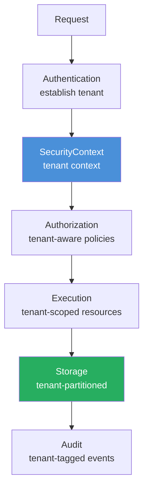
```mermaid
graph TB
    REQ[Request] --> AUTHN[Authentication<br/>establish tenant]
    AUTHN --> CTX[SecurityContext<br/>tenant context]
    CTX --> AUTHZ[Authorization<br/>tenant-aware policies]
    AUTHZ --> EXEC[Execution<br/>tenant-scoped resources]
    EXEC --> STORE[Storage<br/>tenant-partitioned]
    STORE --> AUDIT[Audit<br/>tenant-tagged events]

    style CTX fill:#4A90D9,color:#fff
    style STORE fill:#27AE60,color:#fff
```

### 13.7.2 Tenant Policies

```java
public final class KnowledgeEvidenceTenantIsolationPolicy
        implements KnowledgeEvidenceExchangeAuthorizer {

    @Override
    public KnowledgeEvidenceExchangeAuthorizationDecision authorize(
            KnowledgeEvidenceExchangeAuthorizationContext context) {

        String requestedTenant = context.request().metadata().get("tenantId");
        KnowledgeEvidenceExchangePrincipal principal = context.principal();

        if (requestedTenant == null) {
            return deny("Tenant context is required");
        }

        if (principal == null || !requestedTenant.equals(principal.tenantId())) {
            return deny("Cross-tenant evidence access denied");
        }

        return new Allow("tenant-isolation", Map.of());
    }
}
```

## 13.8 Security Context Propagation

### 13.8.1 Carrier Abstraction

```java
public interface SecurityContextCarrier {
    void set(SecurityContextSnapshot context);
    Optional<SecurityContextSnapshot> get();
    void clear();
}
```

Implementations:

| Carrier | Use case |
|---------|----------|
| `ThreadLocalSecurityContextCarrier` | Synchronous / blocking |
| `ReactiveSecurityContextCarrier` | Mutiny / CompletionStage |
| `QuarkusSecurityContextCarrier` | CDI-scoped |

### 13.8.2 Scope Pattern

```java
try (SecurityContextScope scope = SecurityContextScope.of(carrier, snapshot)) {
    // code runs with security context in scope
    agent.process(request);
}
// context automatically cleared
```

### 13.8.3 Propagation Modes

```java
PropagationRequest req = PropagationRequest.of(
    sourceContext,
    "target-agent-456",
    DelegationConstraints.of(List.of("read"), 2)
);

PropagationResult result = propagator.propagate(req);
// result.context() — attenuated context
// result.delegation() — optional child delegation
```

---

# Chapter 14 — Knowledge Exchange Protocol

## 14.1 Overview

The Knowledge Exchange Protocol (KEP) is Wayang's wire-level protocol for exchanging **verified knowledge artifacts** between runtimes. It is layered:

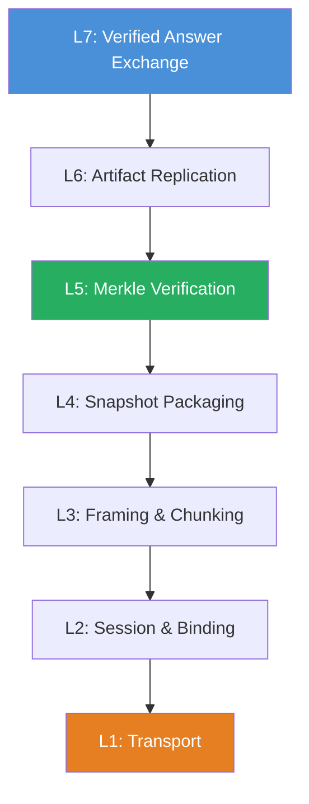
```mermaid
graph TB
    L7[L7: Verified Answer Exchange]
    L6[L6: Artifact Replication]
    L5[L5: Merkle Verification]
    L4[L4: Snapshot Packaging]
    L3[L3: Framing & Chunking]
    L2[L2: Session & Binding]
    L1[L1: Transport]

    L7 --> L6
    L6 --> L5
    L5 --> L4
    L4 --> L3
    L3 --> L2
    L2 --> L1

    style L7 fill:#4A90D9,color:#fff
    style L5 fill:#27AE60,color:#fff
    style L1 fill:#E67E22,color:#fff
```

## 14.2 Layer 1 — Transport

### 14.2.1 Transport Types

```java
public enum KnowledgeEvidenceExchangeTransportType {
    IN_PROCESS,
    LOCAL_IPC,
    HTTP,
    HTTPS,
    GRPC,
    WEBSOCKET,
    TCP,
    CUSTOM
}
```

### 14.2.2 Transport Capabilities

```java
public enum KnowledgeEvidenceExchangeTransportCapability {
    REQUEST_RESPONSE,
    BIDIRECTIONAL_STREAMING,
    UNIDIRECTIONAL_STREAMING,
    MULTIPLEXING,
    CANCELLATION,
    DEADLINES,
    FLOW_CONTROL,
    BACKPRESSURE,
    LARGE_PAYLOADS,
    BINARY_PAYLOADS,
    LOCAL_ONLY
}
```

### 14.2.3 Transport SPI

```java
public interface KnowledgeEvidenceExchangeTransport {
    KnowledgeEvidenceExchangeTransportType type();
    KnowledgeEvidenceExchangeTransportDescriptor descriptor();
    CompletableFuture<KnowledgeEvidenceExchangeTransportConnection> connect(
        KnowledgeEvidenceExchangeTransportAddress address);
}
```

## 14.3 Layer 2 — Session & Binding

### 14.3.1 Session Lifecycle

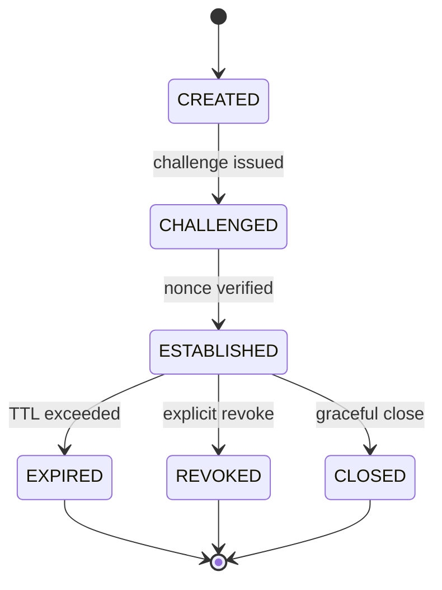
```mermaid
stateDiagram-v2
    [*] --> CREATED
    CREATED --> CHALLENGED: challenge issued
    CHALLENGED --> ESTABLISHED: nonce verified
    ESTABLISHED --> EXPIRED: TTL exceeded
    ESTABLISHED --> REVOKED: explicit revoke
    ESTABLISHED --> CLOSED: graceful close
    EXPIRED --> [*]
    REVOKED --> [*]
    CLOSED --> [*]
```

### 14.3.2 Request Binding

Every request is bound to a session with a nonce:

```java
public record KnowledgeEvidenceExchangeRequestBinding(
    String requestId,
    String sessionId,
    String nonce,
    String runtimeId,
    String remoteRuntimeId,
    String tenantId,
    String workspaceId,
    String projectId,
    KnowledgeEvidenceExchangeOperation operation,
    String artifactId,
    String resourceId,
    Instant issuedAt,
    Instant expiresAt,
    String correlationId,
    String bindingFingerprint,
    Map<String, String> metadata
) { ... }
```

### 14.3.3 Replay Guard

```java
public interface KnowledgeEvidenceExchangeReplayGuard {
    KnowledgeEvidenceExchangeReplayStatus checkAndRecord(
        KnowledgeEvidenceExchangeRequestBinding binding,
        String principalId,
        Instant now);
    void removeExpired(Instant now);
}

public enum KnowledgeEvidenceExchangeReplayStatus {
    NEW,
    ACCEPTED,
    REPLAYED,      // ← attack detected
    EXPIRED,
    INVALID_BINDING,
    UNKNOWN_SESSION
}
```

## 14.4 Layer 3 — Framing & Chunking

### 14.4.1 The Frame

```java
public record KnowledgeEvidenceExchangeFrame(
    byte version,
    KnowledgeEvidenceExchangeFrameType type,
    Set<KnowledgeEvidenceExchangeFrameFlags> flags,
    String sessionId,
    String streamId,
    String requestId,
    long sequence,
    long payloadLength,
    byte[] payload,
    String payloadFingerprint,
    Map<String, String> metadata
) { ... }
```

### 14.4.2 Frame Types

| Type | Purpose |
|------|---------|
| `HELLO` | Initial greeting |
| `PROTOCOL` | Protocol negotiation |
| `REQUEST` | Request |
| `RESPONSE` | Response |
| `DATA` | Data payload |
| `CHUNK` | Data chunk |
| `ACK` | Acknowledgment |
| `WINDOW_UPDATE` | Flow control window |
| `CANCEL` | Cancel request |
| `CLOSE` | Graceful close |
| `ERROR` | Error |
| `HEARTBEAT` | Keep-alive |

### 14.4.3 Frame Flags

```java
public enum KnowledgeEvidenceExchangeFrameFlags {
    FIRST,          // First frame in stream
    LAST,           // Last frame in stream
    FIN,            // Final frame (close after)
    ACK_REQUIRED,   // Acknowledgment required
    COMPRESSED,     // Payload compressed
    ENCRYPTED,      // Payload encrypted
    SIGNED,         // Payload signed
    CHECKSUMMED,    // Payload checksummed
    RESUMABLE,      // Stream resumable
    RETRANSMIT      // Retransmission
}
```

### 14.4.4 Binary Codec

`BinaryKnowledgeEvidenceExchangeFrameCodec` uses a compact binary format:

```
[4 bytes magic] [1 byte version] [1 byte type]
[4 bytes flags] [string sessionId] [string streamId]
[string requestId] [8 bytes sequence] [8 bytes payloadLength]
[4 bytes metadataSize] [metadata pairs]
[string fingerprint] [4 bytes payloadLen] [payload]
```

Strings are length-prefixed UTF-8. Max frame size: 64 MB.

### 14.4.5 Flow Control

```java
public final class KnowledgeEvidenceExchangeFlowControlWindow {
    private final AtomicLong availableBytes;

    public boolean tryConsume(long bytes) {
        while (true) {
            long current = availableBytes.get();
            if (current < bytes) return false;
            if (availableBytes.compareAndSet(current, current - bytes)) return true;
        }
    }

    public void update(long bytes) { availableBytes.addAndGet(bytes); }
}
```

### 14.4.6 Resume Tokens

```java
public record KnowledgeEvidenceExchangeResumeToken(
    String tokenId,
    String sessionId,
    String streamId,
    String artifactId,
    String resourceId,
    long offset,
    long nextSequence,
    String resourceFingerprint,
    Instant createdAt,
    Instant expiresAt,
    Map<String, String> metadata
) { ... }
```

## 14.5 Layer 4 — Snapshot Packaging

### 14.5.1 The Manifest

```java
public record KnowledgeSnapshotVerificationManifest(
    String manifestId,
    String snapshotId,
    String snapshotFingerprint,
    String schemaVersion,
    String runtimeVersion,
    String knowledgeEngineVersion,
    List<KnowledgeSnapshotEvidenceEntry> evidence,
    List<KnowledgeSnapshotLineageEntry> lineage,
    List<KnowledgeSnapshotReferenceEntry> policies,
    List<KnowledgeSnapshotReferenceEntry> rules,
    KnowledgeSnapshotGovernanceManifest governance,
    KnowledgeSnapshotIntegrityManifest integrity,
    KnowledgeSnapshotSealManifest seal,
    List<KnowledgeSnapshotDependencyEntry> dependencies,
    KnowledgeSnapshotMerkleManifest merkle,
    Instant createdAt,
    Map<String, String> metadata
) { ... }
```

### 14.5.2 The Package

```java
public record KnowledgeSnapshotEvidencePackage(
    String packageId,
    KnowledgeSnapshotVerificationManifest manifest,
    KnowledgeSnapshotVerificationInstructions instructions,
    List<KnowledgeSnapshotPackageResource> resources,
    Map<String, String> metadata
) { ... }
```

### 14.5.3 Package Verification

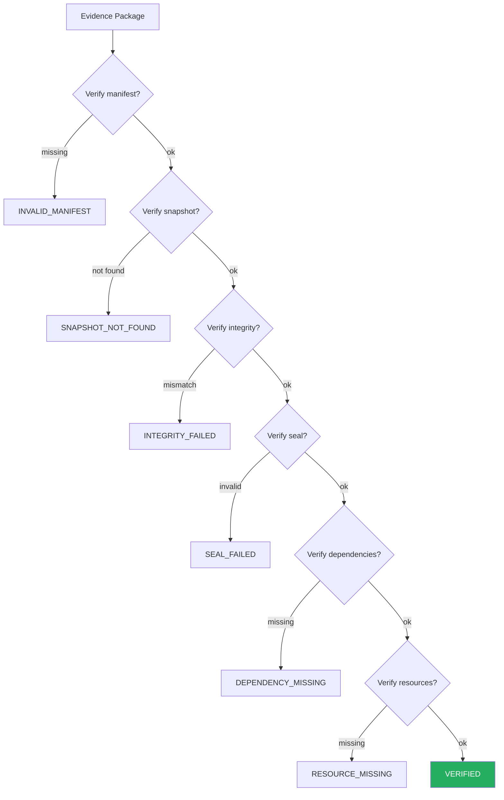
```mermaid
flowchart TD
    PKG[Evidence Package] --> V1{Verify manifest?}
    V1 -->|missing| FAIL1[INVALID_MANIFEST]
    V1 -->|ok| V2{Verify snapshot?}
    V2 -->|not found| FAIL2[SNAPSHOT_NOT_FOUND]
    V2 -->|ok| V3{Verify integrity?}
    V3 -->|mismatch| FAIL3[INTEGRITY_FAILED]
    V3 -->|ok| V4{Verify seal?}
    V4 -->|invalid| FAIL4[SEAL_FAILED]
    V4 -->|ok| V5{Verify dependencies?}
    V5 -->|missing| FAIL5[DEPENDENCY_MISSING]
    V5 -->|ok| V6{Verify resources?}
    V6 -->|missing| FAIL6[RESOURCE_MISSING]
    V6 -->|ok| VERIFIED[VERIFIED]

    style VERIFIED fill:#27AE60,color:#fff
```

## 14.6 Layer 5 — Merkle Verification

### 14.6.1 The Merkle Tree

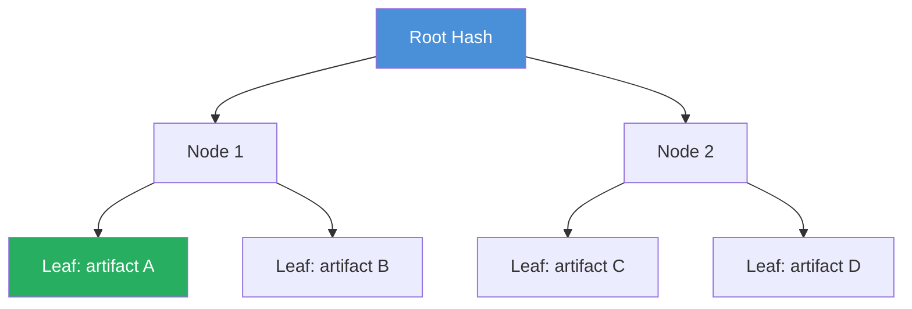
```mermaid
graph TB
    ROOT[Root Hash]
    N1[Node 1]
    N2[Node 2]
    L1[Leaf: artifact A]
    L2[Leaf: artifact B]
    L3[Leaf: artifact C]
    L4[Leaf: artifact D]

    ROOT --> N1
    ROOT --> N2
    N1 --> L1
    N1 --> L2
    N2 --> L3
    N2 --> L4

    style ROOT fill:#4A90D9,color:#fff
    style L1 fill:#27AE60,color:#fff
```

### 14.6.2 Merkle Proof

```java
public record KnowledgeEvidenceMerkleProof(
    String leafId,
    String leafHash,
    String rootHash,
    List<KnowledgeEvidenceMerkleProofStep> steps,
    Map<String, String> metadata
) { ... }

public record KnowledgeEvidenceMerkleProofStep(
    String siblingHash,
    Direction direction
) {
    public enum Direction { LEFT, RIGHT }
}
```

### 14.6.3 Partial Verification

```java
public interface KnowledgeEvidencePartialVerificationService {
    KnowledgeEvidencePartialVerificationResult verify(KnowledgeEvidenceMerkleProof proof);
}
```

Partial verification lets a runtime verify a single leaf without downloading the entire tree — crucial for large artifacts.

## 14.7 Layer 6 — Artifact Replication

### 14.7.1 Replication Flow

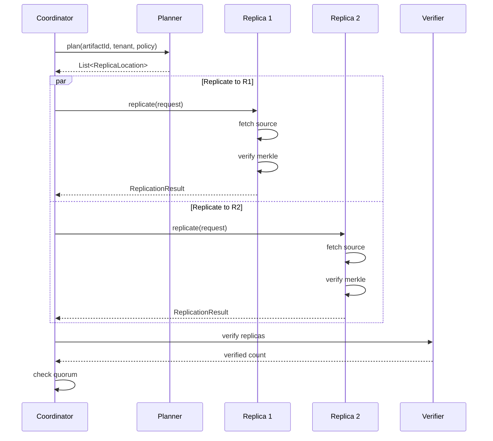
```mermaid
sequenceDiagram
    participant C as Coordinator
    participant P as Planner
    participant R1 as Replica 1
    participant R2 as Replica 2
    participant V as Verifier

    C->>P: plan(artifactId, tenant, policy)
    P-->>C: List<ReplicaLocation>

    par Replicate to R1
        C->>R1: replicate(request)
        R1->>R1: fetch source
        R1->>R1: verify merkle
        R1-->>C: ReplicationResult
    and Replicate to R2
        C->>R2: replicate(request)
        R2->>R2: fetch source
        R2->>R2: verify merkle
        R2-->>C: ReplicationResult
    end

    C->>V: verify replicas
    V-->>C: verified count
    C->>C: check quorum
```

### 14.7.2 Replication Policy

```java
public record KnowledgeEvidenceArtifactReplicationPolicy(
    int minimumReplicas,
    int targetReplicas,
    boolean requireVerification,
    boolean allowRemoteReplication,
    boolean allowOfflineQueue,
    long maxArtifactBytes
) {
    public static KnowledgeEvidenceArtifactReplicationPolicy defaults() {
        return new KnowledgeEvidenceArtifactReplicationPolicy(
            1, 2, true, true, true, 4L * 1024 * 1024 * 1024
        );
    }
}
```

### 14.7.3 Anti-Entropy

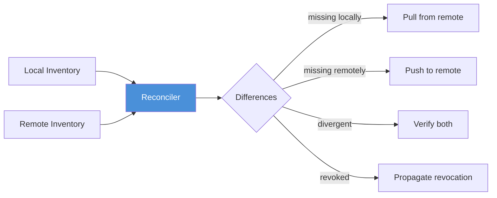
```mermaid
flowchart LR
    L[Local Inventory] --> REC[Reconciler]
    R[Remote Inventory] --> REC
    REC --> DIFF{Differences}
    DIFF -->|missing locally| PULL[Pull from remote]
    DIFF -->|missing remotely| PUSH[Push to remote]
    DIFF -->|divergent| VERIFY[Verify both]
    DIFF -->|revoked| PROP[Propagate revocation]

    style REC fill:#4A90D9,color:#fff
```

## 14.8 Layer 7 — Verified Answer Exchange

### 14.8.1 The Verified Response

```java
public record KnowledgeVerifiedResponse(
    KnowledgeVerifiedResponseMetadata metadata,
    String answer,
    KnowledgeVerifiedResponseStatus status,
    KnowledgeVerifiedResponseDisposition disposition,
    double confidence,
    List<KnowledgeVerifiedClaim> claims,
    List<KnowledgeVerifiedEvidenceReference> evidence,
    List<String> blockedClaimIds,
    List<String> warnings,
    Map<String, String> metadataMap
) { ... }
```

### 14.8.2 Statuses

| Status | Meaning |
|--------|---------|
| `VERIFIED` | All claims supported |
| `PARTIALLY_VERIFIED` | Some claims unsupported |
| `UNVERIFIED` | No verification possible |
| `CONTRADICTED` | Claims contradict evidence |
| `BLOCKED` | Blocked by policy |
| `FAILED` | Verification failed |

### 14.8.3 Dispositions

| Disposition | Meaning |
|-------------|---------|
| `RELEASE` | Release as-is |
| `RELEASE_WITH_QUALIFICATION` | Release with warning |
| `HOLD` | Hold for review |
| `REJECT` | Reject outright |

### 14.8.4 The Envelope

```java
public record KnowledgeVerifiedResponseEnvelope(
    String envelopeId,
    String responseId,
    String executionId,
    String runtimeId,
    String agentId,
    KnowledgeVerifiedResponseStatus status,
    KnowledgeVerifiedResponseDisposition disposition,
    String responseFingerprint,
    KnowledgeVerifiedResponse response,
    Instant issuedAt,
    Instant expiresAt,
    Map<String, String> metadata
) { ... }
```

### 14.8.5 Verification Flow

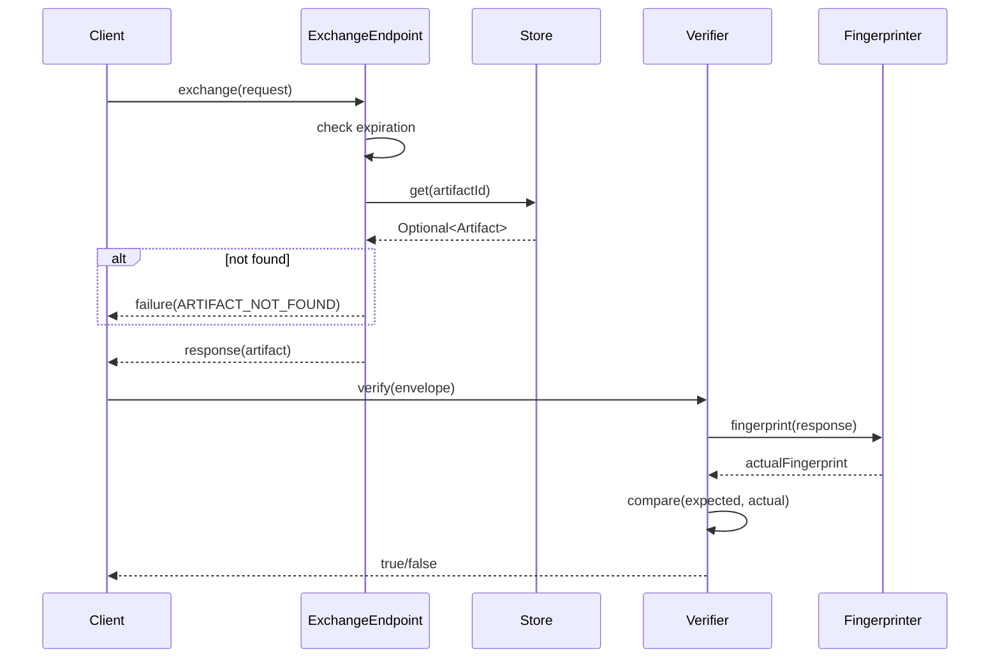
```mermaid
sequenceDiagram
    participant C as Client
    participant E as ExchangeEndpoint
    participant S as Store
    participant V as Verifier
    participant F as Fingerprinter

    C->>E: exchange(request)
    E->>E: check expiration
    E->>S: get(artifactId)
    S-->>E: Optional<Artifact>

    alt not found
        E-->>C: failure(ARTIFACT_NOT_FOUND)
    end

    E-->>C: response(artifact)

    C->>V: verify(envelope)
    V->>F: fingerprint(response)
    F-->>V: actualFingerprint
    V->>V: compare(expected, actual)
    V-->>C: true/false
```

## 14.9 Capability Negotiation

### 14.9.1 Capability Manifest

```java
public record KnowledgeEvidenceExchangeCapabilityManifest(
    String runtimeId,
    String identityVersion,
    String identityFingerprint,
    KnowledgeEvidenceExchangeProtocolVersion protocolVersion,
    List<KnowledgeEvidenceExchangeRuntimeCapability> capabilities,
    Instant issuedAt,
    Instant expiresAt,
    String manifestFingerprint,
    Map<String, String> metadata
) { ... }
```

### 14.9.2 Capability Types

| Capability | Purpose |
|------------|---------|
| `EVIDENCE_EXCHANGE` | Base evidence exchange |
| `ARTIFACT_RESOLUTION` | Resolve artifact by ID |
| `MANIFEST_RETRIEVAL` | Retrieve manifests |
| `RESOURCE_RETRIEVAL` | Retrieve resources |
| `MERKLE_PROOF` | Merkle proof retrieval |
| `PARTIAL_VERIFICATION` | Verify single leaves |
| `INTEGRITY_VERIFICATION` | Verify integrity |
| `SECURE_SEAL_VERIFICATION` | Verify seals |
| `SNAPSHOT_VERIFICATION` | Verify snapshots |
| `SNAPSHOT_REPLAY` | Replay snapshots |
| `STREAMING` | Streaming transfer |
| `COMPRESSION` | Compression support |
| `MCP` | MCP adapter support |
| `REMOTE_KNOWLEDGE` | Remote knowledge |
| `GOVERNED_RETRIEVAL` | Governed retrieval |

### 14.9.3 Negotiation

```java
public interface KnowledgeEvidenceExchangeCapabilityNegotiator {
    KnowledgeEvidenceExchangeCapabilityNegotiationResult negotiate(
        KnowledgeEvidenceExchangeCapabilityManifest local,
        KnowledgeEvidenceExchangeCapabilityManifest remote,
        Instant now);
}
```

The default negotiator:

1. Checks both manifests are active at `now`
2. Negotiates protocol version (major must match, minor backward compatible)
3. For each local capability, finds matching remote capability
4. Intersects algorithms and formats
5. Uses min of max artifact bytes
6. Fails if required capability is missing

---

# Chapter 15 — Distributed Coordination

## 15.1 Consensus Membership

### 15.1.1 Membership Set

```java
public record KnowledgeAnswerResolutionMembershipSet(
    String epochId,
    long sequence,
    List<KnowledgeAnswerResolutionMembership> members,
    int quorum,
    String participantSetFingerprint,
    Instant effectiveFrom,
    Instant effectiveUntil
) { ... }
```

### 15.1.2 Joint Consensus

When membership changes, Wayang uses **joint consensus** (Raft-style): both old and new configurations must reach quorum before the transition finalizes.

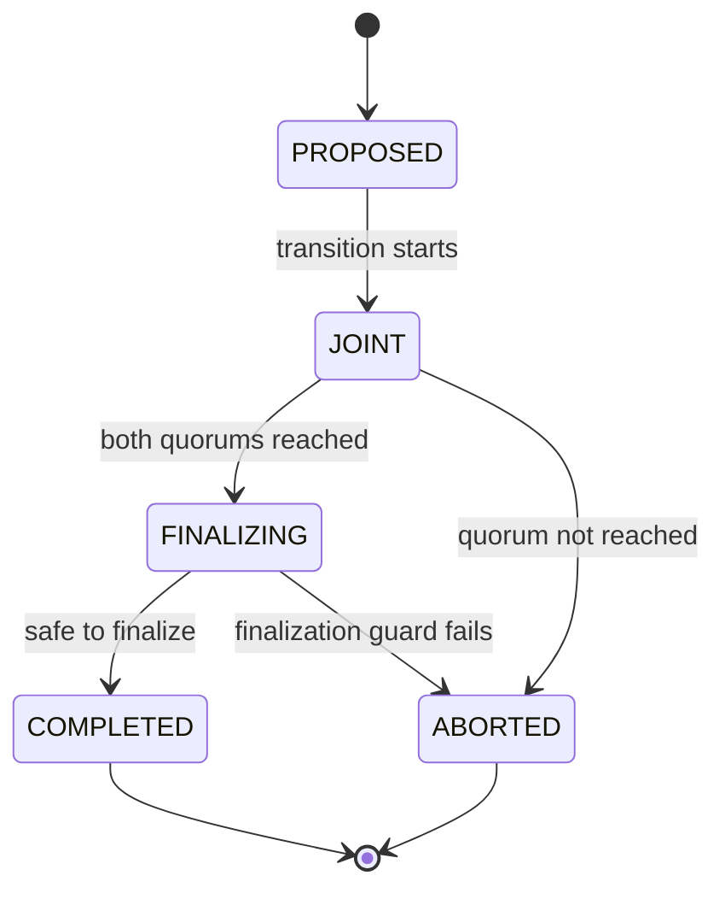
```mermaid
stateDiagram-v2
    [*] --> PROPOSED
    PROPOSED --> JOINT: transition starts
    JOINT --> FINALIZING: both quorums reached
    FINALIZING --> COMPLETED: safe to finalize
    JOINT --> ABORTED: quorum not reached
    FINALIZING --> ABORTED: finalization guard fails
    COMPLETED --> [*]
    ABORTED --> [*]
```

### 15.1.3 Joint Quorum Evaluation

```java
public record KnowledgeAnswerResolutionJointQuorumDecision(
    boolean oldQuorumReached,
    boolean newQuorumReached,
    int oldVotes,
    int newVotes,
    int oldRequired,
    int newRequired,
    List<String> oldAgreeingRuntimeIds,
    List<String> newAgreeingRuntimeIds
) {
    public boolean reached() { return oldQuorumReached && newQuorumReached; }
}
```

### 15.1.4 Membership Transition

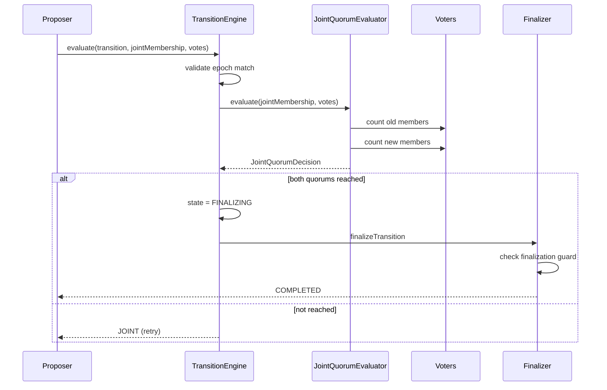
```mermaid
sequenceDiagram
    participant P as Proposer
    participant E as TransitionEngine
    participant J as JointQuorumEvaluator
    participant V as Voters
    participant F as Finalizer

    P->>E: evaluate(transition, jointMembership, votes)
    E->>E: validate epoch match
    E->>J: evaluate(jointMembership, votes)
    J->>V: count old members
    J->>V: count new members
    J-->>E: JointQuorumDecision

    alt both quorums reached
        E->>E: state = FINALIZING
        E->>F: finalizeTransition
        F->>F: check finalization guard
        F-->>P: COMPLETED
    else not reached
        E-->>P: JOINT (retry)
    end
```

## 15.2 Epoch Management

### 15.2.1 Consensus Epoch

```java
public record KnowledgeAnswerResolutionConsensusEpoch(
    String epochId,
    long sequence,
    String participantSetFingerprint,
    String previousEpochId,
    Instant createdAt,
    Instant effectiveFrom,
    Instant effectiveUntil
) { ... }
```

### 15.2.2 Epoch Service

```java
public interface KnowledgeAnswerResolutionEpochService {
    KnowledgeAnswerResolutionConsensusEpoch create(
        KnowledgeAnswerResolutionMembershipSet membershipSet,
        KnowledgeAnswerResolutionConsensusEpoch previous,
        Instant now);

    boolean validate(
        KnowledgeAnswerResolutionConsensusEpoch epoch,
        KnowledgeAnswerResolutionMembershipSet membershipSet,
        Instant now);
}
```

## 15.3 Resolution Replication

### 15.3.1 Replication Flow

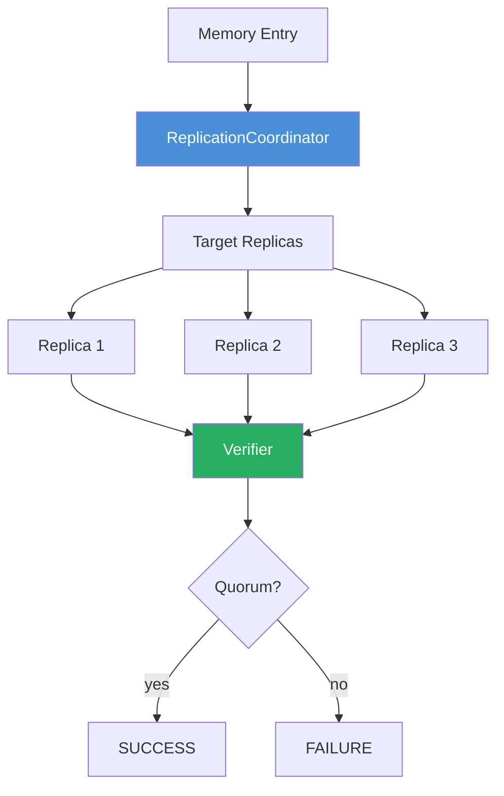
```mermaid
flowchart TB
    ENTRY[Memory Entry] --> COORD[ReplicationCoordinator]
    COORD --> TARGETS[Target Replicas]
    TARGETS --> R1[Replica 1]
    TARGETS --> R2[Replica 2]
    TARGETS --> R3[Replica 3]
    R1 --> VERIFY[Verifier]
    R2 --> VERIFY
    R3 --> VERIFY
    VERIFY --> QUORUM{Quorum?}
    QUORUM -->|yes| SUCCESS[SUCCESS]
    QUORUM -->|no| FAILURE[FAILURE]

    style COORD fill:#4A90D9,color:#fff
    style VERIFY fill:#27AE60,color:#fff
```

### 15.3.2 Replication Request

```java
public record KnowledgeAnswerResolutionReplicationRequest(
    String replicationId,
    String keyFingerprint,
    String sourceRuntimeId,
    List<String> targetRuntimeIds,
    String tenantId,
    String workspaceId,
    String projectId,
    boolean requireVerification,
    Instant issuedAt,
    Instant expiresAt,
    Map<String, String> metadata
) { ... }
```

### 15.3.3 Replication Result

```java
public record KnowledgeAnswerResolutionReplicationResult(
    String replicationId,
    String keyFingerprint,
    int requestedReplicas,
    int successfulReplicas,
    int verifiedReplicas,
    List<String> successfulRuntimeIds,
    List<String> failedRuntimeIds,
    boolean quorumSatisfied,
    Map<String, String> diagnostics
) { ... }
```

## 15.4 Replication Conflicts

### 15.4.1 Conflict Types

```java
public enum KnowledgeAnswerResolutionReplicationConflictType {
    NONE,
    CONCURRENT_RESOLUTION,      // Two runtimes resolved concurrently
    DIFFERENT_SNAPSHOT,         // Different snapshot basis
    DIFFERENT_POLICY,           // Different resolution policy
    DIFFERENT_GOVERNANCE,       // Different governance context
    DIFFERENT_RUNTIME,          // Different runtime version
    INVALID_REPLICA,            // Failed verification
    TENANT_MISMATCH             // Cross-tenant conflict
}
```

### 15.4.2 Conflict Resolution Policy

The default resolver is deliberately conservative:

```java
public final class DefaultKnowledgeAnswerResolutionReplicationConflictResolver
        implements KnowledgeAnswerResolutionReplicationConflictResolver {

    @Override
    public KnowledgeAnswerResolutionMemoryEntry resolve(
            List<KnowledgeAnswerResolutionMemoryEntry> candidates) {

        if (candidates == null || candidates.isEmpty()) return null;
        if (candidates.size() == 1) return candidates.get(0);

        /*
         * Do not silently choose between concurrent
         * authoritative resolutions.
         *
         * A higher-level resolution process should
         * compare their underlying answer artifacts.
         */
        return null;
    }
}
```

This forces the caller to escalate to a higher-level resolution process rather than silently picking one.

## 15.5 Version Vectors

### 15.5.1 The Vector

```java
public record KnowledgeAnswerResolutionVersionVector(
    Map<String, Long> versions
) {
    public long versionOf(String runtimeId) {
        return versions.getOrDefault(runtimeId, 0L);
    }

    public KnowledgeAnswerResolutionVersionVector increment(String runtimeId) {
        var updated = new java.util.HashMap<>(versions);
        updated.merge(runtimeId, 1L, Long::sum);
        return new KnowledgeAnswerResolutionVersionVector(updated);
    }
}
```

### 15.5.2 Comparison

```mermaid
flowchart TD
    A[Vector A] --> CMP[Comparator]
    B[Vector B] --> CMP
    CMP --> LOOP{For each runtime}
    LOOP --> L{left < right?}
    LOOP --> R{left > right?}
    L -->|yes| LEFT_LESS[set leftLess]
    R -->|yes| RIGHT_LESS[set rightLess]
    LEFT_LESS --> LOOP
    RIGHT_LESS --> LOOP
    LOOP -->|exhausted| EVAL{Evaluate}
    EVAL -->|neither| EQUAL[EQUAL]
    EVAL -->|leftLess only| BEFORE[BEFORE]
    EVAL -->|rightLess only| AFTER[AFTER]
    EVAL -->|both| CONCURRENT[CONCURRENT]

    style EQUAL fill:#27AE60,color:#fff
    style CONCURRENT fill:#E74C3C,color:#fff
```

## 15.6 Freshness Evaluation

### 15.6.1 Freshness Policy

```java
public record KnowledgeAnswerResolutionFreshnessPolicy(
    Duration leaseDuration,
    Duration gracePeriod,
    Duration heartbeatTimeout,
    Duration maximumClockSkew,
    int minimumLiveParticipants,
    boolean requireParticipantLiveness,
    boolean requireLease,
    boolean allowGracePeriod,
    boolean allowOfflineGrace
) {
    public static KnowledgeAnswerResolutionFreshnessPolicy defaults() {
        return new KnowledgeAnswerResolutionFreshnessPolicy(
            Duration.ofMinutes(15),
            Duration.ofMinutes(5),
            Duration.ofMinutes(2),
            Duration.ofSeconds(30),
            1, true, true, true, false
        );
    }
}
```

### 15.6.2 Freshness States

```mermaid
stateDiagram-v2
    [*] --> FRESH: lease active, participants live
    FRESH --> GRACE_PERIOD: lease expired, grace active
    GRACE_PERIOD --> STALE: grace expired
    FRESH --> STALE: participants offline
    STALE --> EXPIRED: beyond recovery
    GRACE_PERIOD --> BLOCKED: quorum lost
    FRESH --> BLOCKED: explicit block
    EXPIRED --> [*]
    BLOCKED --> [*]
```

### 15.6.3 Freshness Decision

```java
public record KnowledgeAnswerResolutionFreshnessDecision(
    KnowledgeAnswerResolutionFreshnessStatus status,
    KnowledgeAnswerResolutionLivenessStatus liveness,
    String consensusId,
    String keyFingerprint,
    int participantCount,
    int liveParticipantCount,
    int requiredLiveParticipants,
    Instant evaluatedAt,
    Instant leaseExpiresAt,
    Instant graceExpiresAt,
    List<String> liveRuntimeIds,
    List<String> diagnostics
) {
    public boolean usable() {
        return status == FRESH || status == GRACE_PERIOD;
    }
}
```

## 15.7 Leases

### 15.7.1 Lease Structure

```java
public record KnowledgeAnswerResolutionLease(
    String leaseId,
    String consensusId,
    String keyFingerprint,
    String runtimeId,
    Instant issuedAt,
    Instant expiresAt,
    Instant lastRenewedAt,
    long renewalSequence,
    String metadata
) {
    public boolean activeAt(Instant instant) {
        return !instant.isBefore(issuedAt) && instant.isBefore(expiresAt);
    }
}
```

### 15.7.2 Lease Lifecycle

```mermaid
sequenceDiagram
    participant S as Service
    participant L as LeaseStore
    participant R as Runtime

    S->>L: issue(consensusId, keyFp, runtimeId, policy, now)
    L-->>S: Lease(expiresAt = now + leaseDuration)
    S->>R: grant lease

    loop Until expires
        R->>S: renew(lease, policy, now)
        S->>L: put(updatedLease)
        L-->>S: Lease(newExpiresAt)
    end

    Note over R,S: lease expires
    S->>L: find(consensusId, keyFp)
    L-->>S: Lease(expired)
```

## 15.8 Heartbeats

### 15.8.1 Heartbeat Structure

```java
public record KnowledgeAnswerResolutionParticipantHeartbeat(
    String runtimeId,
    String tenantId,
    String workspaceId,
    String projectId,
    Instant observedAt,
    Instant expiresAt,
    long sequence,
    boolean healthy,
    String metadata
) {
    public boolean aliveAt(Instant instant) {
        return healthy && !instant.isBefore(observedAt) && instant.isBefore(expiresAt);
    }
}
```

### 15.8.2 Heartbeat Store

```java
public interface KnowledgeAnswerResolutionHeartbeatStore {
    void put(KnowledgeAnswerResolutionParticipantHeartbeat heartbeat);
    Optional<KnowledgeAnswerResolutionParticipantHeartbeat> find(String runtimeId);
    Collection<KnowledgeAnswerResolutionParticipantHeartbeat> all();
}
```

## 15.9 Invalidation

### 15.9.1 Invalidation Reasons

```java
public enum KnowledgeAnswerResolutionInvalidationReason {
    KNOWLEDGE_CHANGED,
    KNOWLEDGE_SUPERSEDED,
    KNOWLEDGE_CORRECTED,
    KNOWLEDGE_DEPRECATED,
    POLICY_CHANGED,
    GOVERNANCE_CHANGED,
    RUNTIME_CHANGED,
    RESOLUTION_POLICY_CHANGED,
    EVIDENCE_CHANGED,
    GRAPH_CHANGED,
    MANUAL_INVALIDATION
}
```

### 15.9.2 Invalidation Flow

```mermaid
sequenceDiagram
    participant T as Trigger
    participant I as InvalidationService
    participant M as MemoryStore
    participant R as ReplicaRegistry
    participant E as EventSink

    T->>I: invalidate(key, reason)
    I->>M: invalidate(keyFingerprint)
    M-->>I: void

    I->>R: findAll(keyFingerprint)
    R-->>I: List<Replica>

    loop For each replica
        I->>R: remove(keyFingerprint, runtimeId)
        I->>E: publish(InvalidationEvent)
    end
```

### 15.9.3 Selective Invalidation

For dependency-based invalidation (e.g., "knowledge item X changed"), the `KnowledgeAnswerResolutionSelectiveInvalidationService` traces dependencies:

```java
KnowledgeAnswerResolutionInvalidationImpact impact =
    selectiveInvalidation.invalidateByDependency(
        KnowledgeAnswerResolutionDependencyType.KNOWLEDGE_VERSION,
        "knowledge-item-123"
    );
// impact.affectedResolutionKeys() — all resolutions depending on that item
```

## 15.10 Journal & State Machine

### 15.10.1 The Journal

```java
public interface KnowledgeAnswerResolutionJournal {
    KnowledgeAnswerResolutionLogEntry append(KnowledgeAnswerResolutionLogEntry entry);
    Optional<KnowledgeAnswerResolutionLogEntry> get(long index);
    List<KnowledgeAnswerResolutionLogEntry> range(long fromInclusive, long toInclusive);
    long lastIndex();
    void truncateFrom(long index);
}
```

### 15.10.2 Log Entry Types

```java
public enum KnowledgeAnswerResolutionLogEntryType {
    PROPOSAL_CREATED,
    VOTE_RECORDED,
    CONSENSUS_REACHED,
    CONSENSUS_REJECTED,
    ATTESTATION_CREATED,
    CONSENSUS_ACTIVATED,
    CONSENSUS_SUPERSEDED,
    CONSENSUS_REVOKED,
    LEASE_ISSUED,
    LEASE_RENEWED,
    LEASE_EXPIRED,
    MEMBERSHIP_CHANGE_PROPOSED,
    JOINT_CONFIGURATION_ACTIVATED,
    MEMBERSHIP_TRANSITION_FINALIZED,
    MEMBERSHIP_TRANSITION_ABORTED,
    SNAPSHOT_INVALIDATED,
    DEPENDENCY_INVALIDATED
}
```

### 15.10.3 State Machine

```mermaid
flowchart LR
    ENTRY[Log Entry] --> SM[State Machine]
    SM --> APPLY{Entry type}
    APPLY -->|PROPOSAL_CREATED| A1[Add to consensuses as PROPOSED]
    APPLY -->|CONSENSUS_ACTIVATED| A2[Update consensus to ACTIVE]
    APPLY -->|CONSENSUS_REVOKED| A3[Add to revoked set]
    APPLY -->|LEASE_ISSUED/RENEWED| A4[Add to active leases]
    APPLY -->|LEASE_EXPIRED| A5[Remove from active leases]
    APPLY -->|MEMBERSHIP_TRANSITION_FINALIZED| A6[Add runtime to active set]
    SM --> STATE[KnowledgeAnswerResolutionState]

    style SM fill:#4A90D9,color:#fff
    style STATE fill:#27CE60,color:#fff
```

### 15.10.4 State Canonicalization

```java
public interface KnowledgeAnswerResolutionStateCanonicalizer {
    String canonicalize(KnowledgeAnswerResolutionState state);
}
```

The canonical form sorts all IDs and produces a deterministic string. This is hashed to produce the state fingerprint.

### 15.10.5 State Fingerprinting

```java
public interface KnowledgeAnswerResolutionStateFingerprinter {
    String fingerprint(KnowledgeAnswerResolutionState state);
}
```

Fingerprints are used for:

- Checkpoint equality checks
- Divergence detection
- Audit trail integrity

## 15.11 Snapshots

### 15.11.1 Snapshot Structure

```java
public record KnowledgeAnswerResolutionStateCheckpoint(
    long lastAppliedIndex,
    long term,
    String epochId,
    String stateFingerprint,
    KnowledgeAnswerResolutionState state,
    Instant createdAt,
    KnowledgeAnswerResolutionCheckpointStatus status
) { ... }
```

### 15.11.2 Snapshot Compaction

```java
public interface KnowledgeAnswerResolutionCompactor {
    long compact(
        KnowledgeAnswerResolutionJournal journal,
        KnowledgeAnswerResolutionCheckpointStore checkpointStore,
        KnowledgeAnswerResolutionCheckpointPolicy policy);
}
```

The compactor truncates journal entries that are already reflected in a checkpoint, bounding journal growth.

### 15.11.3 Snapshot Transfer

```mermaid
sequenceDiagram
    participant S as Source
    participant R as Receiver
    participant SS as SnapshotSource
    participant TS as TransferStore
    participant SN as SnapshotSink

    R->>S: descriptor(snapshotId)
    S-->>R: SnapshotDescriptor
    R->>TS: save(state)
    R->>S: read(chunk 1)
    S-->>R: Chunk(offset=0, data)
    R->>SN: write(chunk)
    R->>TS: update(state)
    R->>S: read(chunk 2)
    S-->>R: Chunk(offset=N, data)
    R->>SN: write(chunk)
    R->>TS: update(state)
    Note over R: ... until complete ...
    R->>SN: complete()
    SN-->>R: Checkpoint
    R->>TS: delete(transferId)
```

### 15.11.4 Block Packing

For large snapshots, `KnowledgeAnswerResolutionBlockPacker` combines logical blocks into physical blocks:

```java
public interface KnowledgeAnswerResolutionBlockPacker {
    List<KnowledgeAnswerResolutionPackedStateBlock> pack(
        List<KnowledgeAnswerResolutionLogicalStateBlock> logicalBlocks);
}
```

Packing policy:

```java
public record KnowledgeAnswerResolutionBlockPackingPolicy(
    long targetBlockBytes,           // 4 MB default
    long minimumBlockBytes,          // 256 KB
    long maximumBlockBytes,          // 8 MB
    long maximumPackEntries,         // 4096
    boolean enablePacking,           // true
    boolean enableSplitting,         // true
    boolean enableCompression,       // true
    double minimumCompressionSavingsRatio  // 0.10
) { ... }
```

### 15.11.5 Compression

```java
public interface KnowledgeAnswerResolutionBlockCompressor {
    String algorithm();
    byte[] compress(byte[] input);
    byte[] decompress(byte[] input);
}
```

Default: `GzipKnowledgeAnswerResolutionBlockCompressor`.

Compression is only applied when savings exceed `minimumCompressionSavingsRatio`.

### 15.11.6 Merkle DAG

```java
public final class KnowledgeAnswerResolutionStateMerkleDagBuilder {
    public KnowledgeAnswerResolutionStateMerkleDag build(
        List<KnowledgeAnswerResolutionStateBlock> blocks) {
        // Leaves: block hashes
        // Internal: hash(left.hash + ":" + right.hash)
        // Root: top of tree
    }
}
```

The Merkle DAG enables efficient partial verification: a receiver can verify a single block by checking its proof path up to the root, without downloading the whole snapshot.

---

# Chapter 16 — Performance & Optimization

## 16.1 Latency Budgets

Wayang targets the following latency budgets (P50/P95):

| Operation | P50 | P95 |
|-----------|-----|-----|
| Tool execution (local) | 10 ms | 50 ms |
| Tool execution (network) | 100 ms | 500 ms |
| Model invocation | 800 ms | 3000 ms |
| Knowledge resolution | 50 ms | 200 ms |
| Context compilation | 30 ms | 100 ms |
| A2A round-trip (LAN) | 20 ms | 80 ms |
| A2A round-trip (WAN) | 150 ms | 600 ms |

## 16.2 Caching Strategies

### 16.2.1 Multi-Layer Cache

```mermaid
flowchart TB
    REQ[Request] --> L1[L1: In-Process<br/>ConcurrentHashMap]
    L1 -->|miss| L2[L2: Execution Cache<br/>Redis / local]
    L2 -->|miss| L3[L3: Project Cache<br/>Database]
    L3 -->|miss| EXEC[Execute]

    EXEC --> W1[Write L1]
    W1 --> W2[Write L2]
    W2 --> W3[Write L3]
    W3 --> RESP[Response]

    style L1 fill:#27AE60,color:#fff
    style L2 fill:#4A90D9,color:#fff
    style L3 fill:#F39C12,color:#fff
```

### 16.2.2 Cache Key Design

The `ExecutionCache.hashInputs` method produces a deterministic SHA-256 from a sorted map:

```java
static String hashInputs(Map<String, Object> arguments) {
    var sorted = new TreeMap<>(arguments);
    String canonical = sorted.toString();
    var digest = MessageDigest.getInstance("SHA-256");
    return hex(digest.digest(canonical.getBytes(UTF_8)));
}
```

Sorting keys means argument order doesn't affect the hash.

### 16.2.3 Cache Invalidation

Three invalidation strategies:

1. **TTL-based** — entries expire after `ttl`
2. **Execution-based** — `invalidateByExecution(executionId)`
3. **Namespace-based** — `invalidateByNamespace(namespace, tenantId)`

## 16.3 Connection Pooling

### 16.3.1 HTTP Connections

The `HttpMcpToolClient` uses `java.net.http.HttpClient` which pools connections by default. Tune:

```java
HttpClient client = HttpClient.newBuilder()
    .connectTimeout(Duration.ofSeconds(5))
    .executor(Executors.newVirtualThreadPerTaskExecutor())
    .build();
```

### 16.3.2 Database Connections

Quarkus Hibernate Reactive uses Vert.x pool:

```properties
quarkus.datasource.reactive.max-size=20
quarkus.datasource.reactive.min-size=5
quarkus.datasource.reactive.idle-timeout=PT10M
```

## 16.4 Virtual Threads

Wayang leverages Java 21 virtual threads extensively:

```java
private final Executor pool = Executors.newVirtualThreadPerTaskExecutor();
```

Benefits:

- **Cheap blocking** — I/O-bound work doesn't waste platform threads
- **Simple code** — no reactive complexity for most paths
- **Scalable** — millions of virtual threads, thousands of actual threads

Used in:

- `AgentOrchestrator.parallel` — fan-out execution
- `HttpMcpToolClient` — async HTTP
- `RemoteAgentWaitState` — parked executions

## 16.5 Batch Processing

### 16.5.1 Embedding Batching

`EmbeddingBatchPipeline` batches embedding requests:

```java
EmbeddingBatchPipeline pipeline = new EmbeddingBatchPipeline(
    embeddingService,
    32,   // batchSize
    256,  // queueCapacity
    2,    // maxRetries
    2     // workerThreads
);

CompletableFuture<EmbeddingResponse> future =
    pipeline.submit("tenant-1", request);
```

Requests are queued, batched by worker threads, and dispatched to the embedding provider.

### 16.5.2 Batch Deduplication

Before dispatching, the pipeline deduplicates inputs by cache key:

```java
Map<String, List<Integer>> missingByKey = new LinkedHashMap<>();
for (int i = 0; i < inputs.size(); i++) {
    String key = buildCacheKey(...);
    if (cacheEnabled) {
        float[] cached = vectorCache.get(key);
        if (cached != null) {
            resolved.put(i, cached);
            continue;
        }
    }
    missingByKey.computeIfAbsent(key, k -> new ArrayList<>()).add(i);
}
```

This means duplicate inputs only hit the provider once, and cache hits short-circuit entirely.

## 16.6 Streaming

### 16.6.1 Streaming Model Responses

`Provider.streamChat` emits `StreamEvent`s incrementally:

```mermaid
sequenceDiagram
    participant A as Agent
    participant P as Provider
    participant UI as Listener

    A->>P: streamChat(messages, ...)
    P->>P: open HTTP connection
    loop For each chunk
        P->>UI: StreamEvent.TextDelta
        UI->>UI: append to output
    end
    P->>UI: StreamEvent.ToolUseStart
    loop For each input chunk
        P->>UI: StreamEvent.ToolUseInputDelta
    end
    P->>UI: StreamEvent.ToolUseEnd
    P->>UI: StreamEvent.MessageStop
```

### 16.6.2 Streaming Tool Results

Large tool results can be streamed via `KnowledgeEvidenceExchangeChunkPublisher`:

```java
InputStreamKnowledgeEvidenceExchangeChunkPublisher publisher =
    new InputStreamKnowledgeEvidenceExchangeChunkPublisher(
        source, policy, artifactId, resourceId, streamId
    );

Flow.Subscriber<KnowledgeEvidenceExchangeChunk> subscriber = ...;
publisher.subscribe(subscriber);
```

Backpressure is handled via `Flow.Subscription.request(n)`.

## 16.7 Backpressure

### 16.7.1 Backpressure Policy

```java
public record KnowledgeEvidenceExchangeBackpressurePolicy(
    int maxBufferedMessages,
    long maxBufferedBytes,
    boolean rejectWhenFull,
    boolean blockProducer
) {
    public static KnowledgeEvidenceExchangeBackpressurePolicy conservative() {
        return new KnowledgeEvidenceExchangeBackpressurePolicy(
            256, 16L * 1024L * 1024L, true, false
        );
    }
}
```

### 16.7.2 Flow Control Window

```java
public final class KnowledgeEvidenceExchangeFlowControlWindow {
    private final AtomicLong availableBytes;

    public boolean tryConsume(long bytes) {
        while (true) {
            long current = availableBytes.get();
            if (current < bytes) return false;
            if (availableBytes.compareAndSet(current, current - bytes)) return true;
        }
    }

    public void update(long bytes) { availableBytes.addAndGet(bytes); }
}
```

Receivers send `WINDOW_UPDATE` frames to grant more capacity.

## 16.8 Circuit Breaking

### 16.8.1 Circuit Breaker States

```mermaid
stateDiagram-v2
    [*] --> CLOSED
    CLOSED --> OPEN: failureThreshold exceeded
    OPEN --> HALF_OPEN: waitDuration elapsed
    HALF_OPEN --> CLOSED: successThreshold reached
    HALF_OPEN --> OPEN: failure
```

### 16.8.2 Configuration

```java
CircuitBreakerConfig config = new CircuitBreakerConfig(
    5,      // failureThreshold
    3,      // successThreshold
    30000,  // timeoutMs
    60000,  // waitDurationMs
    10      // maxConcurrentRequests
);

CircuitBreaker cb = registry.getOrCreate("my-service", config);

try {
    T result = cb.execute(() -> callRemoteService());
} catch (CircuitBreakerOpenException e) {
    // Circuit is open, fall back
}
```

## 16.9 Retry Strategies

### 16.9.1 Built-in Policies

```java
RetryPolicy.noRetry();                                    // No retry
RetryPolicy.fixed(3, Duration.ofSeconds(1));              // Fixed 1s delay
RetryPolicy.exponential(5, Duration.ofMillis(100), 2.0);  // Exponential backoff
RetryPolicy.linear(3, Duration.ofSeconds(1), Duration.ofSeconds(1)); // Linear
```

### 16.9.2 Retry Template

```java
RetryTemplate template = new RetryTemplate(
    RetryPolicy.exponential(5, Duration.ofMillis(100), 2.0),
    circuitBreaker
);

T result = template.execute(() -> riskyOperation());
```

## 16.10 Rate Limiting

### 16.10.1 Token Bucket

```java
TokenBucketRateLimiter limiter = new TokenBucketRateLimiter(
    100.0,  // rate: tokens per second
    200     // capacity: max tokens
);

if (limiter.tryAcquire()) {
    // proceed
} else if (limiter.tryAcquire(1000)) {  // wait up to 1s
    // proceed
} else {
    // reject
}
```

### 16.10.2 Stats

```java
RateLimiterStats stats = limiter.getStats();
// stats.acquired(), stats.rejected(), stats.currentTokens(), ...
```

## 16.11 Memory Optimization

### 16.11.1 Memory Hierarchy

The four-tier memory model naturally optimizes memory:

- **Working** — small, token-budgeted, cleared per task
- **Episodic** — conversation history, bounded by maxMessages
- **Semantic** — extracted concepts/facts, deduplicated
- **Procedural** — task patterns, proficiency-scored

### 16.11.2 Conversation Windowing

`ConversationMemory` trims history to fit both message count and token budget:

```java
ConversationMemory memory = new ConversationMemory(
    50,    // maxMessages
    8000   // maxTokenBudget
);
```

When either limit is exceeded, oldest messages are dropped first.

### 16.11.3 Tool Result Compression

Large tool results are compressed before being added to memory:

```java
if (result.length() > 6000) {
    stored = result.substring(0, 3000)
        + "\n\n...[result compressed]...\n\n"
        + result.substring(result.length() - 1500);
}
```

This keeps the first and last portions (typically most informative) while dropping the middle.

## 16.12 JVM Tuning

### 16.12.1 Recommended JVM Flags

```bash
# For virtual threads
-Djdk.virtualThreadScheduler.parallelism=16

# For larger heap (research agents)
-Xms2g -Xmx8g

# For G1 (default, good for most)
-XX:+UseG1GC
-XX:MaxGCPauseMillis=200

# For ZGC (low latency)
-XX:+UseZGC
-XX:+ZGenerational

# For GraalVM native
--enable-preview
```

### 16.12.2 Memory Profiling

Key metrics to watch:

- **Heap usage** — should stabilize, not grow unbounded
- **GC pause time** — should be < 200 ms for P95
- **Virtual thread count** — should be bounded by work, not leaking
- **Tool result size** — large results are the usual memory culprit

---

# Chapter 17 — Testing & Quality

## 17.1 Testing Strategy

Wayang uses a layered testing strategy:

```mermaid
flowchart TB
    UNIT[Unit Tests<br/>70%]
    INTEG[Integration Tests<br/>20%]
    E2E[End-to-End Tests<br/>8%]
    PERF[Performance Tests<br/>2%]

    UNIT --> INTEG
    INTEG --> E2E
    E2E --> PERF

    style UNIT fill:#27AE60,color:#fff
    style INTEG fill:#4A90D9,color:#fff
    style E2E fill:#F39C12,color:#fff
    style PERF fill:#E74C3C,color:#fff
```

### 17.1.1 Test Categories

| Category | Scope | Speed | Tools |
|----------|-------|-------|-------|
| **Unit** | Single class | ms | JUnit 5, AssertJ |
| **Integration** | Multi-module | s | Quarkus Test, Testcontainers |
| **E2E** | Full runtime | min | REST Assured, WireMock |
| **Performance** | Load | min | JMeter, Gatling |

## 17.2 Testing Agents

### 17.2.1 Mock Provider

```java
public class MockProvider implements Provider {
    private final List<StreamEvent> events;

    public MockProvider(List<StreamEvent> events) {
        this.events = events;
    }

    @Override
    public void streamChat(
            List<ChatMessage> messages,
            String systemPrompt,
            List<ToolSpec> tools,
            double temperature,
            int maxTokens,
            Consumer<StreamEvent> onEvent) {
        events.forEach(onEvent);
    }
}
```

### 17.2.2 Testing a ReAct Loop

```java
@Test
void shouldExecuteToolAndReturnResult() {
    // Arrange
    MockProvider provider = new MockProvider(List.of(
        new StreamEvent.TextDelta("Let me calculate that."),
        new StreamEvent.ToolUseStart("call-1", "calculator"),
        new StreamEvent.ToolUseEnd("call-1", Json.parse("{\"expression\":\"17*23\"}")),
        new StreamEvent.MessageStop("tool_use")
    ));

    ReActAgent agent = new ReActAgent();
    agent.setProvider(provider);
    agent.setMemory(new InMemoryMemory());
    agent.setTools(List.of(new CalculatorTool()));

    TestListener listener = new TestListener();

    // Act
    agent.send("What is 17 * 23?", listener);

    // Assert
    assertThat(listener.toolCalls()).containsExactly("calculator");
    assertThat(listener.toolResults()).hasSize(1);
}
```

### 17.2.3 Testing Tool Permission

```java
@Test
void shouldRequestApprovalForDestructiveTool() {
    ReActAgent agent = new ReActAgent();
    agent.setTools(List.of(new DestructiveTool()));

    TestListener listener = new TestListener();
    listener.onPermission = decision -> PermissionDecision.DENY;

    agent.send("Delete all files", listener);

    assertThat(listener.toolResults()).isEmpty();
    assertThat(listener.errors()).contains("Permission denied");
}
```

## 17.3 Testing the Execution Kernel

### 17.3.1 Checkpoint Testing

```java
@Test
void shouldResumeFromCheckpoint() {
    CheckpointStore store = new InMemoryCheckpointStore();
    String execId = "exec-123";

    AgentContext ctx = AgentContext.builder()
        .sessionId("sess-1")
        .variable("step", 5)
        .build();

    store.save(execId, ctx);

    Optional<AgentContext> restored = store.load(execId);
    assertThat(restored).isPresent();
    assertThat(restored.get().getVariable("step")).isEqualTo(5);
}
```

### 17.3.2 Budget Testing

```java
@Test
void shouldStopAfterMaxSteps() {
    MockProvider provider = new MockProvider(alwaysToolCall("search"));
    ReActAgent agent = new ReActAgent();
    agent.setProvider(provider);
    agent.setTools(List.of(new AlwaysSearchTool()));

    ExecutionBudget budget = new ExecutionBudget(
        Duration.ofMinutes(1), 3, 100,
        1000, 1000, 1000,
        0, 1,
        false, null, false, null, false, null,
        0, 0
    );

    TestListener listener = new TestListener();
    agent.send("Search forever", listener);

    assertThat(listener.toolCalls()).hasSize(3); // exactly maxSteps
}
```

## 17.4 Testing Guardrails

### 17.4.1 PII Detection Test

```java
@Test
void shouldDetectSSN() {
    PIIDetector detector = new PIIDetector();

    Uni<DetectionResult> result = detector.detect(
        "My SSN is 123-45-6789",
        Map.of()
    );

    DetectionResult dr = result.await().indefinitely();
    assertThat(dr.safe()).isFalse();
    assertThat(dr.findings()).hasSize(1);
    assertThat(dr.findings().get(0).type()).isEqualTo("SSN");
}
```

### 17.4.2 Custom Detector Test

```java
@Test
void customDetectorShouldFlagKeyword() {
    CustomDetector detector = new CustomDetector();

    DetectionResult result = detector.detect("This contains FORBIDDEN", Map.of())
        .await().indefinitely();

    assertThat(result.safe()).isTrue(); // warning, not blocked
    assertThat(result.findings()).hasSize(1);
}
```

## 17.5 Testing Knowledge

### 17.5.1 In-Memory Store Test

```java
@Test
void shouldStoreAndRetrieveKnowledge() {
    InMemoryVersionedKnowledgeStore store = new InMemoryVersionedKnowledgeStore();

    KnowledgeItem item = new KnowledgeItem(
        "k-1", "src-1", "policy", "Test Policy", "Content",
        Map.of(), KnowledgeProvenance.of("http://example.com"),
        KnowledgeAuthority.informational(),
        KnowledgeValidity.active()
    );

    store.save(item).toCompletableFuture().join();

    Optional<KnowledgeItem> retrieved = store.get("k-1")
        .toCompletableFuture().join();

    assertThat(retrieved).isPresent();
    assertThat(retrieved.get().title()).isEqualTo("Test Policy");
}
```

### 17.5.2 Temporal Validity Test

```java
@Test
void shouldNotReturnExpiredKnowledge() {
    InMemoryVersionedKnowledgeStore store = new InMemoryVersionedKnowledgeStore();

    Instant past = Instant.now().minus(Duration.ofDays(1));
    KnowledgeValidity expired = new KnowledgeValidity(past, past, "SUPERSEDED");

    KnowledgeItem item = new KnowledgeItem(
        "k-1", "src-1", "policy", "Old Policy", "Content",
        Map.of(), KnowledgeProvenance.of("http://example.com"),
        KnowledgeAuthority.informational(), expired
    );

    store.save(item).toCompletableFuture().join();

    Optional<KnowledgeItem> retrieved = store.getAsOf("k-1", Instant.now())
        .toCompletableFuture().join();

    assertThat(retrieved).isEmpty();
}
```

## 17.6 Testing A2A

### 17.6.1 Agent Card Mapping Test

```java
@Test
void shouldMapDescriptorToAgentCard() {
    AgentDescriptor descriptor = new AgentDescriptor(
        AgentRef.remote("agent-1", "Test Agent", URI.create("https://example.com")),
        "A test agent",
        List.of(AgentCapability.of("search", "Web search")),
        List.of(AgentEndpointDescriptor.of(
            RemoteAgentEndpoint.of(URI.create("https://example.com/a2a")),
            "HTTP+JSON", "1.0"
        )),
        Map.of("version", "1.2.0")
    );

    A2AAgentCard card = A2AAgentCardMapper.fromWayang(descriptor, "https://example.com");

    assertThat(card.name()).isEqualTo("Test Agent");
    assertThat(card.protocolVersion()).isEqualTo("1.0");
    assertThat(card.skills()).hasSize(1);
    assertThat(card.skills().get(0).id()).isEqualTo("search");
}
```

### 17.6.2 Durable Task Test

```java
@Test
void shouldPersistTaskAcrossRestarts() {
    DurableA2ATaskLedger ledger = new DurableA2ATaskLedger();
    DurableA2ATask task = ledger.create("exec-1", "https://remote", null);

    // Simulate restart by creating a new ledger
    DurableA2ATaskLedger ledger2 = new DurableA2ATaskLedger();
    // (In production, ledger2 would read from persistent storage)

    Optional<DurableA2ATask> found = ledger2.find(task.taskId());
    assertThat(found).isEmpty(); // In-memory ledger doesn't persist
    // For persistence tests, use a database-backed ledger
}
```

## 17.7 Testing Context Compiler

### 17.7.1 Tier Selection Test

```java
@Test
void shouldSelectFullSourceForTarget() {
    Path repo = createTempRepo();
    Path target = repo.resolve("app/UserController.java");

    ContextCompiler compiler = new DefaultContextCompiler(
        new HeuristicSymbolResolver(),
        new JavaParserSkeletonizer(),
        new DefaultTokenEstimator()
    );

    CompiledContext ctx = compiler.compile(repo, target, 2);

    assertThat(ctx.entries()).anyMatch(e ->
        e.tier() == Tier.FULL_SOURCE && e.path().equals(target));
}
```

### 17.7.2 Budget Spillover Test

```java
@Test
void shouldSpillToPrunedSkeletonUnderTightBudget() {
    Path repo = createLargeRepo();
    Path target = repo.resolve("app/UserController.java");

    BudgetedContextCompiler compiler = new DefaultBudgetedContextCompiler(...);
    CompiledContext ctx = compiler.compile(repo, target, 2, 100); // very tight

    assertThat(ctx.entries()).anyMatch(e -> e.tier() == Tier.SKELETON_PRUNED);
}
```

### 17.7.3 Blind Spot Disclosure Test

```java
@Test
void shouldReportReflectionBlindSpot() {
    Path repo = createRepoWithReflection();
    Path target = repo.resolve("app/PluginDispatcher.java");

    CompiledContext ctx = compiler.compile(repo, target, 2);

    assertThat(ctx.diagnostics().dynamicDispatchFiles()).isNotEmpty();
    assertThat(ctx.summary()).contains("reflection-based dynamic dispatch");
}
```

## 17.8 Integration Testing

### 17.8.1 Quarkus Test

```java
@QuarkusTest
class AgentResourceTest {

    @Inject
    AgentExecutionService executionService;

    @Test
    void shouldExecuteAgentViaRest() {
        given()
            .contentType(ContentType.JSON)
            .body("""
                {"input": "What is 2+2?"}
                """)
            .when().post("/api/v1/agents/math-agent/execute")
            .then()
            .statusCode(200)
            .body("success", is(true));
    }
}
```

### 17.8.2 Testcontainers

```java
@Testcontainers
class PostgresKnowledgeStoreTest {

    @Container
    static PostgreSQLContainer<?> postgres = new PostgreSQLContainer<>("postgres:16");

    @Test
    void shouldPersistKnowledgeItem() {
        // Configure store with postgres.getJdbcUrl()
        // ...
    }
}
```

## 17.9 Performance Testing

### 17.9.1 Load Test with JMeter

```xml
<ThreadGroup>
  <stringProp name="ThreadGroup.num_threads">100</stringProp>
  <stringProp name="ThreadGroup.ramp_time">10</stringProp>
  <elementProp name="ThreadGroup.main_controller">
    <stringProp name="LoopController.loops">100</stringProp>
  </elementProp>
</ThreadGroup>
```

### 17.9.2 Microbenchmark with JMH

```java
@Benchmark
@BenchmarkMode(Mode.AverageTime)
@OutputTimeUnit(TimeUnit.MICROSECONDS)
public CompiledContext benchmarkCompile() {
    return compiler.compile(repo, target, 2);
}
```

## 17.10 Test Utilities

### 17.10.1 TestListener

```java
public class TestListener implements WayangAgentListener {
    private final List<String> textDeltas = new ArrayList<>();
    private final List<String> toolCalls = new ArrayList<>();
    private final List<ToolResult> toolResults = new ArrayList<>();
    private final List<String> errors = new ArrayList<>();
    private String stopReason;
    public Consumer<PermissionDecision> onPermission = d -> d;

    @Override public void onTextDelta(String text) { textDeltas.add(text); }
    @Override public void onToolCallStart(String id, String name) { toolCalls.add(name); }
    @Override public void onToolCallReady(String id, String name, Map<String, Object> input) {}
    @Override public void onToolPermissionNeeded(String id, String name,
            Map<String, Object> input, Consumer<PermissionDecision> responder) {
        responder.accept(onPermission.apply(null));
    }
    @Override public void onToolResult(String id, String name, ToolResult result) {
        toolResults.add(result);
    }
    @Override public void onUsage(int in, int out) {}
    @Override public void onDone(String reason) { stopReason = reason; }
    @Override public void onError(String msg) { errors.add(msg); }

    // Getters
    public List<String> textDeltas() { return textDeltas; }
    public List<String> toolCalls() { return toolCalls; }
    public List<ToolResult> toolResults() { return toolResults; }
    public List<String> errors() { return errors; }
    public String stopReason() { return stopReason; }
    public String fullText() { return String.join("", textDeltas); }
}
```

### 17.10.2 Synthetic Repo Builder

```java
public class SyntheticRepoBuilder {
    public static Path build() throws IOException {
        Path root = Files.createTempDirectory("wayang-test");
        Files.createDirectories(root.resolve("app"));

        write(root.resolve("app/UserController.java"), """
            package app;
            public class UserController {
                private final UserService userService = new UserService();
                public void handleSave() { userService.save(); }
            }
            """);

        // ... more files ...

        return root;
    }
}
```

## 17.11 Quality Gates

### 17.11.1 Coverage Requirements

| Module | Line Coverage | Branch Coverage |
|--------|---------------|-----------------|
| `wayang-core` | 85% | 75% |
| `wayang-agent` | 80% | 70% |
| `wayang-communication-api` | 90% | 80% |
| `wayang-a2a` | 75% | 65% |
| `wayang-knowledge` | 80% | 70% |

### 17.11.2 Static Analysis

- **SpotBugs** — bug patterns
- **PMD** — code quality
- **Checkstyle** — style
- **Error Prone** — compiler-integrated checks

### 17.11.3 Mutation Testing

PIT (Pitest) mutation testing ensures tests actually catch bugs:

```xml
<plugin>
    <groupId>org.pitest</groupId>
    <artifactId>pitest-maven</artifactId>
    <configuration>
        <mutationThreshold>70</mutationThreshold>
    </configuration>
</plugin>
```

---

# Chapter 18 — Migration & Upgrade Guide

## 18.1 Version Compatibility

Wayang follows semantic versioning with a strict compatibility policy:

| Version | Compatibility |
|---------|---------------|
| **Patch** (1.0.x) | Bug fixes only, no API changes |
| **Minor** (1.x.0) | Backward-compatible additions |
| **Major** (x.0.0) | Breaking changes, migration required |

### 18.1.1 Compatibility Matrix

| From \ To | 1.0.x | 1.1.x | 2.0.x |
|-----------|-------|-------|-------|
| **1.0.x** | ✅ | ✅ | ⚠️ Migration |
| **1.1.x** | ❌ | ✅ | ⚠️ Migration |
| **2.0.x** | ❌ | ❌ | ✅ |

## 18.2 Migrating from 1.0 to 1.1

### 18.2.1 Agent API Changes

**Before (1.0):**
```java
WayangAgent agent = new WayangAgent(provider, memory);
agent.send("Hello", listener);
```

**After (1.1):**
```java
ReActAgent agent = new ReActAgent();
agent.setProvider(provider);
agent.setMemory(memory);
agent.send("Hello", listener);
```

The `WayangAgent` class was renamed to `ReActAgent` and moved from `tech.kayys.wayang.agent` to `tech.kayys.wayang.agent.react`.

### 18.2.2 Tool API Changes

**Before (1.0):**
```java
public interface Tool {
    String name();
    String description();
    Object execute(Map<String, Object> args);
}
```

**After (1.1):**
```java
public interface Tool extends Extension {
    ToolDescriptor descriptor();
    CompletableFuture<ToolResult> execute(ToolInvocation invocation, ToolContext context);
}
```

Migration steps:

1. Replace `name()` and `description()` with a `descriptor()` method
2. Change `execute` return type from `Object` to `CompletableFuture<ToolResult>`
3. Wrap results in `SimpleToolResult.success(...)` or `.failure(...)`
4. Add `id()`, `type()`, `metadata()` methods (or extend `AbstractEipTool`)

### 18.2.3 Communication API Changes

**Before (1.0):**
```java
AgentRequest request = new AgentRequest(target, payload);
communicator.send(request);
```

**After (1.1):**
```java
AgentRequest request = new AgentRequest(
    target,
    CapabilityId.of("default"),
    payload,
    RequestMode.AUTO,
    Duration.ofSeconds(60),
    CommunicationOptions.automatic(),
    Map.of()
);
communicator.send(request, ProtocolContext.empty());
```

## 18.3 Migrating from 1.1 to 2.0

### 18.3.1 Execution Kernel API

The biggest change in 2.0 is the introduction of the `ExecutionPipeline` interceptor model. Direct calls to `ExecutionEngine.executeAgent` are deprecated.

**Before (1.1):**
```java
ExecutionEngine engine = ...;
ExecutionResult result = engine.executeAgent(definition, context);
```

**After (2.0):**
```java
ExecutionPipeline pipeline = ...;
AgentInvocation invocation = invocationFactory.root(request, security);
AgentResult result = pipeline.execute(invocation).toCompletableFuture().join();
```

### 18.3.2 Security Model

**Before (1.1):**
```java
// Security was per-communicator
AgentCommunicator communicator = new SecuredAgentCommunicator(delegate, authz);
```

**After (2.0):**
```java
// Security is on the invocation path
ExecutionPipeline pipeline = new DefaultExecutionPipeline(
    interceptorPipeline,
    terminalHandler
);
// Interceptors include AuthorizationInterceptor
```

### 18.3.3 Migration Checklist

- [ ] Replace `ExecutionEngine.executeAgent` with `ExecutionPipeline.execute`
- [ ] Replace `SecuredAgentCommunicator` with `AuthorizationInterceptor`
- [ ] Update `AgentRequest` construction to include `CapabilityId` and `CommunicationOptions`
- [ ] Migrate `Tool.execute` to `CompletableFuture<ToolResult>`
- [ ] Update `Agent` implementations to extend `BaseReActAgent`
- [ ] Replace `AgentListener` with `WayangAgentListener`
- [ ] Update A2A models to 1.0 spec (`AgentCard` → `A2AAgentCard`)
- [ ] Update ANP models to 1.1 spec (`DID:WBA` prefix required)
- [ ] Migrate memory from `Memory<ChatMessage>` to the four-tier model
- [ ] Update knowledge models to include `KnowledgeItem` with provenance
- [ ] Replace `GuardrailsService.preCheck(String, Map)` with the plugin API

## 18.4 Deprecation Policy

Deprecated APIs are marked with `@Deprecated` and remain functional for **one major version**. The `@Deprecated` annotation includes:

- `since` — version when deprecated
- `forRemoval` — whether it will be removed
- `description` — replacement API

Example:

```java
@Deprecated(since = "1.1.0", forRemoval = true)
public void oldMethod() {
    // Replacement: newMethod()
}
```

## 18.5 Upgrade Procedure

### 18.5.1 Pre-Upgrade Checklist

1. **Backup** all data stores (PostgreSQL, Redis, Neo4j)
2. **Snapshot** all durable A2A tasks
3. **Export** all knowledge snapshots
4. **Record** current versions of all dependencies
5. **Review** release notes for breaking changes
6. **Test** upgrade in staging environment

### 18.5.2 Upgrade Steps

```mermaid
flowchart TD
    START[Start] --> STOP[Stop all Wayang instances]
    STOP --> BACKUP[Backup data stores]
    BACKUP --> UPDATE[Update dependencies in pom.xml]
    UPDATE --> BUILD[Build new version]
    BUILD --> MIGRATE[Run DB migrations]
    MIGRATE --> START1[Start one instance]
    START1 --> HEALTH{Health check?}
    HEALTH -->|fail| ROLLBACK[Rollback]
    HEALTH -->|ok| START_ALL[Start all instances]
    START_ALL --> VERIFY[Verify functionality]
    VERIFY --> DONE[Done]
    ROLLBACK --> DONE

    style HEALTH fill:#F39C12,color:#fff
    style ROLLBACK fill:#E74C3C,color:#fff
    style DONE fill:#27AE60,color:#fff
```

### 18.5.3 Rollback Procedure

If upgrade fails:

1. **Stop** new instances
2. **Restore** data stores from backup
3. **Revert** dependency versions
4. **Rebuild** old version
5. **Restart** old instances
6. **Verify** functionality

## 18.6 Data Migration

### 18.6.1 Knowledge Store Migration

```java
public class KnowledgeStoreMigration {

    public void migrateV1ToV2(DataSource dataSource) {
        // 1. Add new columns
        execute(dataSource, """
            ALTER TABLE knowledge_items
            ADD COLUMN provenance_uri TEXT,
            ADD COLUMN authority_kind VARCHAR(50),
            ADD COLUMN trust_level VARCHAR(20) DEFAULT 'REVIEWED',
            ADD COLUMN revision BIGINT DEFAULT 1
            """);

        // 2. Backfill provenance
        execute(dataSource, """
            UPDATE knowledge_items
            SET provenance_uri = source_url
            WHERE provenance_uri IS NULL AND source_url IS NOT NULL
            """);

        // 3. Backfill authority
        execute(dataSource, """
            UPDATE knowledge_items
            SET authority_kind = 'informational'
            WHERE authority_kind IS NULL
            """);

        // 4. Add indexes
        execute(dataSource, """
            CREATE INDEX idx_knowledge_validity
            ON knowledge_items(effective_from, effective_until)
            """);
    }

    private void execute(DataSource ds, String sql) {
        try (var conn = ds.getConnection();
             var stmt = conn.createStatement()) {
            stmt.execute(sql);
        } catch (SQLException e) {
            throw new RuntimeException("Migration failed: " + sql, e);
        }
    }
}
```

### 18.6.2 Durable A2A Task Migration

```java
public class DurableA2ATaskMigration {

    public void migrateV1ToV2(DataSource dataSource) {
        execute(dataSource, """
            ALTER TABLE durable_a2a_tasks
            ADD COLUMN last_event_seq BIGINT DEFAULT 0,
            ADD COLUMN retry_count INT DEFAULT 0,
            ADD COLUMN remote_endpoint VARCHAR(500)
            """);

        // Backfill remote_endpoint from agent_card_url
        execute(dataSource, """
            UPDATE durable_a2a_tasks
            SET remote_endpoint = agent_card_url
            WHERE remote_endpoint IS NULL
            """);
    }
}
```

## 18.7 API Compatibility Shims

For major version upgrades, Wayang provides compatibility shims in a separate module:

```xml
<dependency>
    <groupId>tech.kayys.wayang</groupId>
    <artifactId>wayang-compat-1x</artifactId>
    <version>2.0.0</version>
</dependency>
```

The shim provides:

- `WayangAgent` as a wrapper around `ReActAgent`
- `Tool` legacy interface as a default method on the new interface
- `AgentListener` adapter to `WayangAgentListener`
- `Memory<ChatMessage>` adapter to the four-tier model

## 18.8 Configuration Migration

Configuration keys are versioned. The `ConfigurationMigration` service auto-migrates old keys:

```java
public class ConfigurationMigration {

    private static final Map<String, String> KEY_MAPPINGS = Map.of(
        "wayang.agent.model", "wayang.provider.model",
        "wayang.agent.provider", "wayang.provider.name",
        "wayang.tools.directory", "wayang.tool.directory",
        "wayang.memory.type", "wayang.memory.default-tier"
    );

    public Configuration migrate(Configuration old) {
        Map<String, Object> migrated = new LinkedHashMap<>();
        old.asMap().forEach((key, value) -> {
            String newKey = KEY_MAPPINGS.getOrDefault(key, key);
            migrated.put(newKey, value);
        });
        return new DefaultConfiguration(migrated);
    }
}
```

## 18.9 Testing the Upgrade

### 18.9.1 Compatibility Test Suite

```java
@Test
void shouldLoadOldSerializedAgentContext() throws Exception {
    // Old format (v1.0)
    String oldJson = """
        {"id":"ctx-1","sessionId":"sess-1","variables":{"step":5}}
        """;

    // Deserialize with new code
    AgentContext ctx = objectMapper.readValue(oldJson, AgentContext.class);

    assertThat(ctx.getVariable("step")).isEqualTo(5);
}
```

### 18.9.2 End-to-End Upgrade Test

```java
@Test
void shouldUpgradeFromV1ToV2() {
    // 1. Set up v1 state
    // 2. Run migration
    // 3. Verify v2 state
    // 4. Run agent end-to-end
}
```

## 18.10 Long-Term Support

| Version | Release Date | EOL Date | Support Level |
|---------|--------------|----------|---------------|
| 1.0.x | 2026-01 | 2027-01 | Security only |
| 1.1.x | 2026-06 | 2027-06 | Full |
| 2.0.x | 2026-12 | 2028-12 | Full |

LTS versions receive:

- Security patches for 2 years
- Bug fixes for 1 year
- New features: no

---

# Chapter 19 — API Reference

## 19.1 Core Interfaces

### 19.1.1 Agent

```java
package tech.kayys.wayang.agent;

public interface Agent {
    void send(String userInput, WayangAgentListener listener);
    Memory<ChatMessage> getMemory();
    void setMemory(Memory<ChatMessage> memory);
    void setProvider(Provider provider);
    void setModelId(String modelId);
    String getModelId();
    void setSystemPrompt(String sp);
    Collection<Tool> tools();
    void setTools(List<Tool> tools);
    boolean autoApproveTools();
    void setAutoApproveTools(boolean v);
    Path workspace();
}
```

### 19.1.2 WayangAgentListener

```java
public interface WayangAgentListener {
    void onTextDelta(String text);
    void onToolCallStart(String id, String name);
    void onToolCallReady(String id, String name, Map<String, Object> input);
    void onToolPermissionNeeded(String id, String name, Map<String, Object> input,
                                Consumer<PermissionDecision> responder);
    void onToolResult(String id, String name, ToolResult result);
    void onUsage(int inputTokens, int outputTokens);
    void onDone(String stopReason);
    void onError(String message);
    default void onThinkingDelta(String text) {}
    default void onThinkingEnd() {}
}
```

### 19.1.3 Provider

```java
package tech.kayys.wayang.provider;

public interface Provider {
    String id();
    void streamChat(
        List<ChatMessage> messages,
        String systemPrompt,
        List<ToolSpec> tools,
        double temperature,
        int maxTokens,
        Consumer<StreamEvent> onEvent
    ) throws IOException, InterruptedException;
    default Set<Modality> supportedModalities() { return Set.of(Modality.TEXT); }
}
```

### 19.1.4 Tool

```java
package tech.kayys.wayang.tool;

public interface Tool extends Extension {
    ToolDescriptor descriptor();
    CompletableFuture<ToolResult> execute(ToolInvocation invocation, ToolContext context);
    default Collection<Capability> toolCapabilities() { return Collections.emptyList(); }
}
```

### 19.1.5 AgentRequest / AgentResponse (core)

```java
package tech.kayys.wayang.agent;

public record AgentRequest(
    String id,
    String sessionId,
    String tenantId,
    String userId,
    InputType type,
    String content,
    Map<String, Object> metadata,
    List<Artifact> artifacts,
    Map<String, Object> parameters,
    Instant timestamp
) {
    public static AgentRequest of(String content) { ... }
    public static AgentRequestBuilder builder() { ... }
}

public record AgentResponse(
    String id,
    String sessionId,
    String content,
    String type,
    List<Artifact> artifacts,
    Map<String, Object> metadata,
    Map<String, Object> data,
    boolean success,
    String error,
    long responseTimeMs,
    Instant timestamp
) {
    public static AgentResponse success(String content) { ... }
    public static AgentResponse failure(String error) { ... }
}
```

## 19.2 Communication API

### 19.2.1 AgentCommunicator

```java
package tech.kayys.wayang.communication.api;

public interface AgentCommunicator {
    CompletionStage<AgentResponse> send(AgentRequest request, ProtocolContext context);
    default CompletionStage<AgentResponse> send(AgentRequest request) {
        return send(request, ProtocolContext.empty());
    }
    AgentTask submit(AgentRequest request, ProtocolContext context);
    Flow.Publisher<AgentEvent> stream(AgentRequest request, ProtocolContext context);
}
```

### 19.2.2 AgentRequest / AgentResponse (communication)

```java
package tech.kayys.wayang.communication.api;

public record AgentRequest(
    AgentRef target,
    CapabilityId capability,
    MessagePayload payload,
    RequestMode mode,
    Duration timeout,
    CommunicationOptions communication,
    Map<String, Object> metadata
) {
    public static AgentRequest of(AgentRef target, CapabilityId capability, MessagePayload payload) { ... }
}

public record AgentResponse(
    boolean success,
    MessagePayload payload,
    Map<String, Object> metadata,
    AgentError error
) {
    public static AgentResponse success(MessagePayload payload) { ... }
    public static AgentResponse failure(AgentError error) { ... }
}
```

### 19.2.3 AgentProtocol

```java
package tech.kayys.wayang.communication.protocol;

public interface AgentProtocol {
    ProtocolId id();
    ProtocolVersion version();
    Set<ProtocolCapability> capabilities();
    boolean supports(AgentEndpoint endpoint, AgentRequest request);
    ProtocolClient client(ProtocolContext context);
    default ProtocolServer server() { return null; }
}
```

### 19.2.4 ProtocolClient / ProtocolServer

```java
public interface ProtocolClient {
    CompletionStage<AgentResponse> send(AgentRequest request, ProtocolContext context);
    AgentTask submit(AgentRequest request, ProtocolContext context);
    Flow.Publisher<AgentEvent> stream(AgentRequest request, ProtocolContext context);
}

public interface ProtocolServer {
    CompletionStage<AgentMessage> receive(AgentMessage message, ProtocolContext context);
}
```

## 19.3 Execution API

### 19.3.1 AgentInvocation

```java
package tech.kayys.wayang.execution;

public interface AgentInvocation {
    AgentRequest request();
    ExecutionContext context();
}
```

### 19.3.2 ExecutionContext

```java
public interface ExecutionContext {
    ExecutionMetadata metadata();
    CancellationToken cancellation();
    SecurityContextSnapshot security();
    ExecutionLifecycle lifecycle();
    void transition(ExecutionLifecycle next);
}
```

### 19.3.3 ExecutionPipeline

```java
package tech.kayys.wayang.execution.pipeline;

public interface ExecutionPipeline {
    CompletionStage<AgentResult> execute(AgentInvocation invocation);
}
```

### 19.3.4 AgentInvocationInterceptor

```java
public interface AgentInvocationInterceptor {
    String name();
    int order();
    CompletionStage<AgentResult> intercept(
        AgentInvocation invocation,
        AgentInvocationChain chain
    );
}
```

### 19.3.5 AgentInvocationChain

```java
public interface AgentInvocationChain {
    CompletionStage<AgentResult> proceed(AgentInvocation invocation);
}
```

### 19.3.6 AgentInvocationHandler

```java
public interface AgentInvocationHandler {
    CompletionStage<AgentResult> handle(AgentInvocation invocation);
}
```

## 19.4 Execution Kernel API

### 19.4.1 CheckpointStore

```java
package tech.kayys.wayang.execution;

public interface CheckpointStore {
    void save(String executionId, AgentContext context);
    Optional<AgentContext> load(String executionId);
    List<AgentContext> history(String executionId);
    void delete(String executionId);
}
```

### 19.4.2 EventLedger

```java
package tech.kayys.wayang.execution.event;

public interface EventLedger {
    void record(ExecutionEvent event);
    List<ExecutionEvent> events(String executionId);
    List<ExecutionEvent> events(String executionId, ExecutionEventType type);
    Optional<ExecutionMetrics> metrics(String executionId);
    void purge(String executionId);
    long totalEventCount();
}
```

### 19.4.3 ExecutionCache

```java
package tech.kayys.wayang.execution.cache;

public interface ExecutionCache {
    Optional<ExecutionCacheEntry> lookup(CacheNamespace namespace, String tenantId, String userId, String inputHash);
    void store(ExecutionCacheEntry entry);
    void invalidateByExecution(String executionId);
    void invalidateByNamespace(CacheNamespace namespace, String tenantId);
    List<ExecutionCacheEntry> listByExecution(String executionId);
    CacheStats stats();

    record CacheStats(long totalEntries, long hitCount, long missCount, long evictionCount) { ... }

    static String hashInputs(Map<String, Object> arguments) { ... }
    static String hashString(String input) { ... }
    static String hashTool(String toolName, Map<String, Object> arguments) { ... }
}
```

### 19.4.4 ExecutionBudget

```java
package tech.kayys.wayang.execution;

public record ExecutionBudget(
    Duration maxDuration,
    int maxSteps,
    long maxToolCalls,
    long maxInputTokens,
    long maxOutputTokens,
    long contextTokens,
    int maxRetries,
    int maxConcurrentTools,
    boolean toolCacheEnabled,
    Duration toolCacheTtl,
    boolean retrievalCacheEnabled,
    Duration retrievalCacheTtl,
    boolean researchCacheEnabled,
    Duration researchCacheTtl,
    long maxA2ARequests,
    long maxResearchSources
) {
    public static ExecutionBudget defaults() { return balanced(); }
    public static ExecutionBudget fast() { ... }
    public static ExecutionBudget balanced() { ... }
    public static ExecutionBudget thorough() { ... }
    public static ExecutionBudget debug() { ... }
    public boolean isCachingEnabled() { ... }
}
```

## 19.5 Memory API

### 19.5.1 Memory

```java
package tech.kayys.wayang.spi.memory;

public interface Memory<T> {
    void addMessage(T message);
    List<T> getHistory();
    void clear();
}
```

### 19.5.2 MemoryProvider (SPI)

```java
public interface MemoryProvider {
    <T> Memory<T> createMemory(String sessionId);
}
```

### 19.5.3 MemoryProvider (four-tier)

```java
package tech.kayys.wayang.memory;

public interface MemoryProvider extends Extension {
    String name();
    void save(MemoryRecord record) throws Exception;
    void save(List<MemoryRecord> records) throws Exception;
    List<MemoryRecord> search(MemoryQuery query) throws Exception;
    Optional<MemoryRecord> get(String key) throws Exception;
    void delete(String key) throws Exception;
    void clear() throws Exception;
    default CompletableFuture<List<MemoryRecord>> searchAsync(MemoryQuery query) { ... }
    default MemoryStats getStats() throws Exception { ... }
    default List<MemoryRecord> exportAll(String agentId) throws Exception { ... }
    default int importAll(List<MemoryRecord> records, boolean overwrite) throws Exception { ... }
}
```

### 19.5.4 MemoryRecord

```java
public record MemoryRecord(
    String id,
    String type,
    String key,
    String value,
    Map<String, Object> metadata,
    Instant timestamp,
    double relevance,
    long ttlSeconds,
    String sessionId,
    String userId
) {
    public static MemoryRecord of(String key, String value) { ... }
    public static MemoryRecord of(String key, String value, String type) { ... }
    public MemoryRecord withMetadata(Map<String, Object> metadata) { ... }
    public MemoryRecord withRelevance(double relevance) { ... }
}
```

### 19.5.5 MemorySnapshot

```java
public record MemorySnapshot(
    int schemaVersion,
    String snapshotId,
    String agentId,
    String userId,
    String tenantId,
    Instant capturedAt,
    List<String> tiers,
    List<MemoryRecord> records,
    Map<String, Object> exportMetadata
) {
    public static final int CURRENT_SCHEMA = 1;
    public static Builder builder() { ... }
}
```

## 19.6 Knowledge API

### 19.6.1 KnowledgeItem

```java
package tech.kayys.wayang.knowledge;

public record KnowledgeItem(
    String id,
    String sourceId,
    String type,
    String title,
    String content,
    Map<String, Object> metadata,
    KnowledgeProvenance provenance,
    KnowledgeAuthority authority,
    KnowledgeValidity validity,
    KnowledgeClassification classification,
    KnowledgeSensitivity sensitivity,
    KnowledgeTrustLevel trustLevel,
    long revision
) {
    public boolean isCurrentlyValid(Instant at) { ... }
    public boolean isAuthoritative() { ... }
    public KnowledgeItem withRevision(long nextRevision) { ... }
}
```

### 19.6.2 KnowledgeQuery

```java
public record KnowledgeQuery(
    String text,
    int topK,
    double minScore,
    String scope,
    Instant asOf,
    Map<String, Object> filters,
    Map<String, Object> metadata
) {
    public static KnowledgeQuery of(String text) { ... }
    public KnowledgeQuery withTopK(int value) { ... }
    public KnowledgeQuery withScope(String value) { ... }
    public KnowledgeQuery asOf(Instant value) { ... }
    public KnowledgeQuery withMinScore(double score) { ... }
}
```

### 19.6.3 KnowledgeResult

```java
public record KnowledgeResult(
    KnowledgeQuery query,
    List<KnowledgeEvidence> evidence,
    Map<String, Object> metadata,
    Instant timestamp
) {
    public static KnowledgeResult empty(KnowledgeQuery query) { ... }
    public static KnowledgeResult of(KnowledgeQuery query, List<KnowledgeEvidence> evidence) { ... }
}
```

### 19.6.4 KnowledgeContext

```java
public record KnowledgeContext(
    String tenantId,
    String userId,
    String agentId,
    String sessionId,
    String domain,
    String scope,
    Instant asOf,
    List<String> sourceIds,
    Map<String, Object> attributes
) {
    public static KnowledgeContext empty() { ... }
    public KnowledgeContext withSource(String sourceId) { ... }
    public KnowledgeContext withDomain(String newDomain) { ... }
}
```

### 19.6.5 KnowledgeSource (SPI)

```java
public interface KnowledgeSource {
    String id();
    default String name() { return id(); }
    default KnowledgeSourceDescriptor descriptor() { ... }
    CompletionStage<KnowledgeResult> query(KnowledgeQuery query, KnowledgeContext context);
    default boolean isHealthy() { return true; }
}
```

### 19.6.6 KnowledgeResolver

```java
public interface KnowledgeResolver {
    CompletionStage<KnowledgeResult> resolve(KnowledgeQuery query, KnowledgeContext context);
}
```

### 19.6.7 KnowledgeSelector

```java
public interface KnowledgeSelector {
    KnowledgeSelectionResult select(
        List<KnowledgeEvidence> candidates,
        KnowledgeBudget budget,
        KnowledgeContext context
    );
}
```

### 19.6.8 KnowledgeBudget

```java
public record KnowledgeBudget(
    int maxItems,
    int maxTokens,
    int maxCharacters,
    int maxPerSource,
    int maxPerAuthority,
    boolean requireProvenance,
    boolean allowLowConfidence,
    double minimumScore
) {
    public static KnowledgeBudget defaults() { ... }
    public static KnowledgeBudget slm() { ... }
    public static KnowledgeBudget strict() { ... }
}
```

## 19.7 A2A API

### 19.7.1 A2AServer

```java
package tech.kayys.wayang.a2a.api;

public interface A2AServer {
    AgentCard getAgentCard();
    CompletionStage<A2ATask> sendMessage(A2AMessage message);
    CompletionStage<A2ATask> getTask(String taskId);
    CompletionStage<Void> cancelTask(String taskId);
}
```

### 19.7.2 A2AClient

```java
public interface A2AClient {
    CompletionStage<A2ATask> sendMessage(A2AMessage message);
    CompletionStage<A2ATask> getTask(String taskId);
    CompletionStage<Void> cancelTask(String taskId);
}
```

### 19.7.3 A2AAgentRegistry

```java
public interface A2AAgentRegistry {
    CompletionStage<AgentCard> discover(URI endpoint);
    CompletionStage<AgentCard> register(AgentCard card);
    Optional<AgentCard> find(String agentId);
    List<AgentCard> findByCapability(String capability);
    List<AgentCard> findBySkill(String skill);
}
```

### 19.7.4 A2AMessage

```java
public record A2AMessage(
    Role role,
    List<A2APart> content
) {
    public enum Role { USER, ASSISTANT, SYSTEM }
}
```

### 19.7.5 A2APart

```java
public sealed interface A2APart {
    record Text(String text) implements A2APart {}
    record Image(String mediaType, String base64Data) implements A2APart {}
    record ToolUse(String id, String name, Map<String, Object> input) implements A2APart {}
    record ToolResult(String id, String content, boolean isError) implements A2APart {}
}
```

### 19.7.6 A2ATask

```java
public record A2ATask(
    String taskId,
    String executionId,
    A2ATaskStatus status,
    List<A2AArtifact> artifacts,
    Map<String, Object> metadata
) {
}
```

### 19.7.7 A2ATaskStatus

```java
public enum A2ATaskStatus {
    PENDING,
    RUNNING,
    WAITING_FOR_TOOL,
    WAITING_FOR_APPROVAL,
    COMPLETED,
    FAILED,
    CANCELLED
}
```

## 19.8 Security API

### 19.8.1 AuthenticationService

```java
package tech.kayys.wayang.security.authn;

public interface AuthenticationService {
    CompletionStage<AuthenticationResult> authenticate(AuthenticationRequest request);
}
```

### 19.8.2 AuthorizationService

```java
package tech.kayys.wayang.security.authz;

public interface AuthorizationService {
    CompletionStage<AuthorizationDecision> authorize(AuthorizationRequest request);
}
```

### 19.8.3 SecurityContext

```java
package tech.kayys.wayang.security.context;

public record SecurityContext(
    Principal principal,
    TenantContext tenant,
    Map<String, Object> attributes
) {
    public static SecurityContext anonymous() { ... }
    public static SecurityContext system() { ... }
    public static SecurityContext of(Principal principal, TenantContext tenant) { ... }
    public boolean isAnonymous() { ... }
}
```

### 19.8.4 Principal

```java
package tech.kayys.wayang.security.identity;

public record Principal(
    String id,
    String name,
    IdentityType type,
    Map<String, Object> attributes
) {
    public static Principal anonymous() { ... }
    public static Principal system() { ... }
    public static Principal agent(String id, String name) { ... }
}
```

### 19.8.5 DelegationService

```java
package tech.kayys.wayang.security.delegation;

public interface DelegationService {
    CompletionStage<DelegationContext> delegate(
        SecurityContextSnapshot parent,
        DelegationRequest request
    );
    boolean canDelegate(SecurityContextSnapshot parent, DelegationRequest request);
}
```

### 19.8.6 ObligationPipeline

```java
package tech.kayys.wayang.security.obligation;

public interface ObligationPipeline {
    CompletionStage<ObligationPipelineResult> execute(
        List<Obligation> obligations,
        ObligationContext context
    );
}
```

## 19.9 Guardrails API

### 19.9.1 GuardrailsService

```java
package tech.kayys.wayang.guardrails;

@ApplicationScoped
public class GuardrailsService {
    public Uni<GuardrailResult> preCheck(String text, Map<String, Object> config);
    public Uni<GuardrailResult> postCheck(String text, Map<String, Object> config);
}
```

### 19.9.2 GuardrailDetectorPlugin

```java
package tech.kayys.wayang.guardrails.plugin.api;

public interface GuardrailDetectorPlugin extends WayangPlugin {
    CheckPhase[] applicablePhases();
    default Uni<DetectionResult> detect(String text) { return detect(text, Map.of()); }
    Uni<DetectionResult> detect(String text, Map<String, Object> metadata);
    String getCategory();
    DetectionSeverity getSeverity();
}
```

### 19.9.3 DetectionResult

```java
public record DetectionResult(
    String detectorId,
    String category,
    boolean safe,
    String message,
    List<Finding> findings
) {
    public static DetectionResult safe(String detectorId, String category) { ... }
    public static DetectionResult warning(String detectorId, String category, String message, List<Finding> findings) { ... }
    public static DetectionResult blocked(String detectorId, String category, String message) { ... }
    public static DetectionResult blocked(String detectorId, String category, String message, List<Finding> findings) { ... }
}
```

## 19.10 HITL API

### 19.10.1 HumanTask

```java
package tech.kayys.wayang.hitl.domain;

public class HumanTask {
    public void assign(TaskAssignment assignment);
    public void claim(String userId);
    public void delegate(String fromUserId, String toUserId, String reason);
    public void release(String userId);
    public void approve(String userId, Map<String, Object> data, String comments);
    public void reject(String userId, String reason, Map<String, Object> data);
    public void complete(String userId, TaskOutcome outcome, Map<String, Object> data, String comments);
    public void escalate(EscalationReason reason, String escalatedTo);
    public void cancel(String cancelledBy, String reason);
    public void expire();
    public void addComment(String userId, String comment);
    // ... getters ...
    public static Builder builder() { ... }
}
```

### 19.10.2 HumanTaskRepository

```java
package tech.kayys.wayang.hitl.repository;

@ApplicationScoped
public class HumanTaskRepository implements PanacheRepository<HumanTaskEntity> {
    public Uni<HumanTask> save(HumanTask task);
    public Uni<HumanTaskEntity> findByTaskId(String taskId, String tenantId);
    public Uni<List<HumanTaskEntity>> findAssignedToUser(String userId, String tenantId, List<HumanTaskStatus> statuses);
    public Uni<List<HumanTaskEntity>> findByWorkflowRun(String workflowRunId, String tenantId);
    public Uni<List<HumanTaskEntity>> findOverdueTasks(String tenantId);
    public Uni<List<HumanTaskEntity>> findTasksForEscalation(String tenantId, Instant escalationThreshold);
    public Uni<Long> countActiveTasksForUser(String userId, String tenantId);
    public Uni<List<TaskAuditEntity>> getAuditTrail(String taskId);
    public Uni<List<TaskAssignmentEntity>> getAssignmentHistory(String taskId);
}
```

### 19.10.3 REST Endpoints

| Method | Path | Purpose |
|--------|------|---------|
| `GET` | `/api/v1/tasks` | List tasks with filters |
| `GET` | `/api/v1/tasks/my-tasks` | Get current user's tasks |
| `GET` | `/api/v1/tasks/{taskId}` | Get task by ID |
| `GET` | `/api/v1/tasks/workflow/{workflowRunId}` | Get tasks for workflow |
| `GET` | `/api/v1/tasks/statistics` | Get user stats |
| `POST` | `/api/v1/tasks/{taskId}/claim` | Claim task |
| `POST` | `/api/v1/tasks/{taskId}/release` | Release task |
| `POST` | `/api/v1/tasks/{taskId}/delegate` | Delegate task |
| `POST` | `/api/v1/tasks/{taskId}/approve` | Approve task |
| `POST` | `/api/v1/tasks/{taskId}/reject` | Reject task |
| `POST` | `/api/v1/tasks/{taskId}/complete` | Complete task |
| `POST` | `/api/v1/tasks/{taskId}/comments` | Add comment |

## 19.11 MCP API

### 19.11.1 McpToolClient

```java
package tech.kayys.wayang.agent.mcp;

public interface McpToolClient {
    Uni<List<McpToolDescriptor>> listTools(McpServerConfig server);
    Uni<McpToolCallResult> callTool(McpToolInvocation invocation);
    default Uni<McpToolCallResult> callTool(McpToolDescriptor tool, Map<String, Object> arguments) { ... }
    default Uni<Void> disconnect(String serverId) { return Uni.createFrom().voidItem(); }
}
```

### 19.11.2 McpServerConfig

```java
public record McpServerConfig(
    String id,
    String url,
    String command,
    List<String> args,
    McpTransportType transportType,
    boolean enabled,
    Map<String, String> headers
) {
    public static McpServerConfig http(String id, String url) { ... }
    public static McpServerConfig stdio(String id, String command, List<String> args) { ... }
    public static List<McpServerConfig> parseMcpServersJson(String json) throws IOException { ... }
}
```

### 19.11.3 McpTransportType

```java
public enum McpTransportType {
    HTTP,
    SSE,
    STDIO
}
```

## 19.12 Workflow API

### 19.12.1 WorkflowGraph

```java
package tech.kayys.wayang.agent.orchestration.graph.engine;

public class WorkflowGraph {
    public WorkflowGraph addNode(String name, GraphNode node);
    public WorkflowGraph addEdge(String from, String to);
    public WorkflowGraph addConditionalEdge(String from, ConditionalEdge condition);
    public WorkflowGraph setEntryPoint(String entryPoint);
    public WorkflowGraph withCheckpointStrategy(CheckpointStrategy strategy);
    public CompiledWorkflow compile();
}
```

### 19.12.2 CompiledWorkflow

```java
public class CompiledWorkflow {
    public static final String END = "__END__";
    public GraphState invoke(GraphState initialState, String threadId);
}
```

### 19.12.3 GraphNode

```java
public interface GraphNode {
    StateUpdate execute(GraphState state);
}
```

### 19.12.4 GraphState

```java
public class GraphState {
    public <T> GraphState withReducer(String key, StateReducer<T> reducer);
    public void apply(StateUpdate update);
    public Map<String, Object> getData();
    public <T> T get(String key);
}
```

### 19.12.5 StateReducer

```java
public interface StateReducer<T> {
    T reduce(T currentState, T update);
}
```

### 19.12.6 CheckpointStrategy

```java
public interface CheckpointStrategy {
    void save(String threadId, GraphState state);
    GraphState load(String threadId);
}
```

### 19.12.7 WorkflowDefinition

```java
package tech.kayys.wayang.workflow;

public final class WorkflowDefinition extends Definition {
    public List<WorkflowStep> steps();
    public Map<String, WorkflowTransition> transitions();
    public String executionStrategy();
    public boolean parallel();
    public int maxConcurrency();
    public static Builder builder() { ... }
}
```

### 19.12.8 WorkflowEngine

```java
public interface WorkflowEngine extends Extension {
    WorkflowResult execute(WorkflowDefinition workflow, Map<String, Object> context) throws Exception;
    default WorkflowResult execute(WorkflowDefinition workflow, Map<String, Object> context, Map<String, Object> inputs) throws Exception { ... }
    default CompletableFuture<WorkflowResult> executeAsync(WorkflowDefinition workflow, Map<String, Object> context) { ... }
    default void pause(String executionId) throws Exception { ... }
    default void resume(String executionId) throws Exception { ... }
    default void cancel(String executionId) throws Exception { ... }
    default WorkflowStatus getStatus(String executionId) throws Exception { ... }
}
```

## 19.13 Context API

### 19.13.1 ContextCompiler

```java
package tech.kayys.wayang.context.api;

public interface ContextCompiler {
    CompiledContext compile(Path repoRoot, Path targetFile, int maxHops);
}
```

### 19.13.2 BudgetedContextCompiler

```java
public interface BudgetedContextCompiler {
    CompiledContext compile(Path repoRoot, Path targetFile, int maxHops, long tokenBudget);
}
```

### 19.13.3 SymbolResolver

```java
public interface SymbolResolver {
    ReachabilityResult resolve(ModuleIndex index, Path targetFile, int maxHops);
}
```

### 19.13.4 Skeletonizer

```java
public interface Skeletonizer {
    SkeletonResult skeletonize(String source);
    SkeletonResult skeletonizePruned(String source, Set<String> keepMemberNames);
    String digest(String source);
}
```

### 19.13.5 ContextPlanner

```java
public interface ContextPlanner {
    ContextPlan plan(TaskIntent intent, long modelContextWindowTokens);
}
```

### 19.13.6 CompiledContext

```java
public final class CompiledContext {
    public Path targetFile();
    public List<TierEntry> entries();
    public int excludedCount();
    public int totalRepoFiles();
    public long naiveDumpTokens();
    public long compiledTokens();
    public Duration buildDuration();
    public ReachabilityResult diagnostics();
    public double reductionPct();
    public String toPromptString();
    public List<ContentPart> toContentParts();
    public String summary();
}
```

## 19.14 A2A — Durable

### 19.14.1 DurableA2ATaskLedger

```java
package tech.kayys.wayang.a2a.durable;

public class DurableA2ATaskLedger {
    public DurableA2ATask create(String callerExecutionId, String remoteEndpoint, String checkpointId);
    public RemoteAgentWaitState createWaitState(String taskId, Duration timeout);
    public RemoteAgentWaitState createWaitState(String taskId);
    public DurableA2ATask update(String taskId, A2ATaskStatus newStatus);
    public DurableA2ATask complete(String taskId);
    public DurableA2ATask fail(String taskId, String reason);
    public DurableA2ATask cancel(String taskId);
    public DurableA2ATask retry(String taskId);
    public void updateCheckpoint(String taskId, String checkpointId);
    public void updateEventSeq(String taskId, long seq);
    public Optional<DurableA2ATask> find(String taskId);
    public List<DurableA2ATask> allPending();
    public List<DurableA2ATask> byCallerExecution(String callerExecutionId);
    public int taskCount();
    public int waitingCount();
}
```

### 19.14.2 RemoteAgentWaitState

```java
public final class RemoteAgentWaitState {
    public static RemoteAgentWaitState of(String taskId, String callerExecutionId);
    public static RemoteAgentWaitState of(String taskId, String callerExecutionId, Duration timeout);
    public void complete(DurableA2ATask task);
    public void fail(DurableA2ATask task, String reason);
    public void cancel();
    public DurableA2ATask await() throws TimeoutException, InterruptedException;
    public RemoteAgentWaitState onResolved(Consumer<DurableA2ATask> callback);
    public String taskId();
    public String callerExecutionId();
    public Duration timeout();
    public Instant createdAt();
    public boolean isResolved();
    public boolean isCancelled();
    public Duration waitingFor();
}
```

### 19.14.3 A2AWorkflowBridge

```java
public class A2AWorkflowBridge {
    public interface WorkflowLifecycle {
        void pause(String workflowExecutionId) throws Exception;
        void resume(String workflowExecutionId) throws Exception;
        void cancel(String workflowExecutionId) throws Exception;
    }

    public A2AWorkflowBridge(DurableA2ATaskLedger ledger, WorkflowLifecycle lifecycle);
    public DurableA2ATask executeStep(String workflowExecutionId, String remoteEndpoint,
                                       String stepInput, Duration timeout) throws Exception;
    public DurableA2ATask executeStep(String workflowExecutionId, String remoteEndpoint,
                                       String stepInput) throws Exception;
    public void cancelAllForWorkflow(String workflowExecutionId);
}
```

---

# Chapter 20 — Roadmap & Future

## 20.1 Near-Term (Next 6 Months)

### 20.1.1 Native Image Support

GraalVM native image compilation for Wayang runtime, targeting:

- **Startup time:** < 100 ms (vs ~2s JVM)
- **Memory footprint:** < 100 MB (vs ~500 MB JVM)
- **Distribution:** single binary, no JVM required

**Challenges:**

- Reflection (JavaParser, Jackson) requires `reflect-config.json`
- Virtual threads are not yet supported in native image (as of GraalVM 24)
- CDI proxy generation needs build-time hints

**Approach:** Provide `@RegisterForReflection` annotations and a native-image configuration module.

### 20.1.2 gRPC Transport

Add gRPC as a first-class transport for A2A and knowledge exchange:

```java
public class GrpcKnowledgeEvidenceExchangeTransport
        implements KnowledgeEvidenceExchangeTransport {
    @Override
    public KnowledgeEvidenceExchangeTransportType type() {
        return KnowledgeEvidenceExchangeTransportType.GRPC;
    }

    @Override
    public CompletableFuture<KnowledgeEvidenceExchangeTransportConnection> connect(
            KnowledgeEvidenceExchangeTransportAddress address) {
        // ...
    }
}
```

**Benefits:**

- **Bidirectional streaming** — native support
- **Multiplexing** — multiple streams per connection
- **Schema-first** — protobuf IDL
- **Performance** — lower overhead than JSON-RPC

### 20.1.3 OpenTelemetry Semantic Conventions

Align Wayang's tracing with OpenTelemetry semantic conventions for GenAI:

```java
// Current
span.setAttribute("agent.id", agentId);
span.setAttribute("tool.name", toolName);

// Target (OTel GenAI conventions)
span.setAttribute("gen_ai.agent.id", agentId);
span.setAttribute("gen_ai.tool.name", toolName);
span.setAttribute("gen_ai.system", "wayang");
span.setAttribute("gen_ai.operation.name", "chat");
span.setAttribute("gen_ai.request.model", modelId);
```

### 20.1.4 Embedding Provider Expansion

Add providers:

- **OpenAI** — `text-embedding-3-large` (3072 dims)
- **Cohere** — `embed-multilingual-v3.0`
- **Voyage AI** — `voyage-3`
- **BGE** — `bge-large-en-v1.5`
- **Nomic** — `nomic-embed-text-v1.5`

### 20.1.5 Vector Store Expansion

Add backends:

- **Qdrant** — high-performance, Rust-based
- **Weaviate** — GraphQL API, hybrid search
- **Milvus** — distributed, GPU-accelerated
- **Chroma** — lightweight, embedded
- **Pinecone** — managed, serverless

## 20.2 Mid-Term (6–18 Months)

### 20.2.1 Multi-Modal Agents

Extend agents to natively handle:

- **Vision** — image understanding, OCR, chart analysis
- **Audio** — speech-to-text, text-to-speech, audio understanding
- **Video** — frame extraction, temporal reasoning
- **3D** — mesh generation, point cloud understanding

The routing model already supports these modalities — the work is in agent implementations.

### 20.2.2 Federated Learning

Allow agents to share learned patterns without sharing raw data:

```mermaid
flowchart LR
    A1[Agent 1] -->|gradient| AGG[Aggregator]
    A2[Agent 2] -->|gradient| AGG
    A3[Agent 3] -->|gradient| AGG
    AGG -->|global model| A1
    AGG -->|global model| A2
    AGG -->|global model| A3

    style AGG fill:#4A90D9,color:#fff
```

**Use case:** Enterprise deployments where each department trains a local agent, and the aggregated model benefits all without exposing sensitive data.

### 20.2.3 Agent Marketplace

A registry for discovering and installing third-party agents:

```yaml
# agent-manifest.yaml
id: code-reviewer-pro
name: Code Reviewer Pro
version: 1.0.0
author: Acme Corp
capabilities:
  - id: review-java
    description: Reviews Java code for quality and security
  - id: review-python
    description: Reviews Python code
tools:
  - code-scanner
  - security-analyzer
  - style-checker
signature: <ed25519 signature>
```

The marketplace validates signatures, scans for malicious tools, and enforces capability isolation.

### 20.2.4 Compensating Transactions

For durable workflows, add compensating transaction support:

```java
public record Compensation(
    String stepId,
    String compensationStepId,
    String reason
) { }
```

When a step fails, previously completed steps are compensated in reverse order.

### 20.2.5 Time-Travel Debugging

The event ledger already records everything. Add a time-travel UI:

```java
public class TimeTravelDebugger {
    public ExecutionSnapshot jumpTo(String executionId, Instant timestamp);
    public ExecutionSnapshot jumpToEvent(String executionId, String eventId);
    public List<ExecutionEvent> diff(String executionId, Instant from, Instant to);
}
```

### 20.2.6 Policy-as-Code

Move policies from Java code to declarative YAML/Rego:

```yaml
# policies/tool-execution.yaml
apiVersion: wayang.io/v1
kind: Policy
metadata:
  name: tool-execution
spec:
  rules:
    - id: allow-read
      match:
        subject: "*"
        capability: "read**"
      effect: ALLOW
    - id: deny-shell
      match:
        subject: "*"
        capability: "shell**"
      effect: DENY
      reason: "Shell execution is not permitted"
    - id: require-approval-write
      match:
        subject: "agent-*"
        capability: "write**"
      effect: REQUIRE_APPROVAL
      obligations:
        - type: hitl
          phase: BEFORE_EXECUTION
```

## 20.3 Long-Term (18+ Months)

### 20.3.1 Autonomous Agent Swarms

Move beyond orchestrated agents to self-organizing swarms:

- **Emergent behavior** — agents discover and coordinate without central control
- **Stigmergy** — agents communicate via shared environment (like ants)
- **Consensus** — agents reach agreement via distributed protocols```mermaid
graph TB
    subgraph "Swarm"
        A1[Agent 1]
        A2[Agent 2]
        A3[Agent 3]
        A4[Agent 4]
        A5[Agent 5]
    end

    ENV[Shared Environment<br/>Blackboard / Graph]

    A1 <--> ENV
    A2 <--> ENV
    A3 <--> ENV
    A4 <--> ENV
    A5 <--> ENV

    style ENV fill:#4A90D9,color:#fff
```

### 20.3.2 Formal Verification

Verify agent behavior against formal specifications:

- **TLA+** — temporal logic of actions
- **Coq** — proof assistant
- **Alloy** — lightweight formal methods

**Goal:** Prove that an agent never executes a tool outside its declared capabilities.

### 20.3.3 Neural-Symbolic Integration

Combine neural (LLM) and symbolic (rules, knowledge graphs) reasoning:

```mermaid
flowchart LR
    INPUT --> NEURAL[Neural Reasoning<br/>LLM]
    INPUT --> SYMBOLIC[Symbolic Reasoning<br/>Rules + KG]
    NEURAL --> FUSION[Fusion Layer]
    SYMBOLIC --> FUSION
    FUSION --> OUTPUT

    style NEURAL fill:#9B59B6,color:#fff
    style SYMBOLIC fill:#27AE60,color:#fff
    style FUSION fill:#4A90D9,color:#fff
```

**Benefits:**

- **Verifiable** — symbolic layer provides proofs
- **Robust** — neural layer handles ambiguity
- **Explainable** — symbolic rules are human-readable

### 20.3.4 Cross-Platform Agent Identity

Extend DID:WBA beyond ANP to all protocols:

- **A2A** — agent cards carry DID
- **MCP** — servers authenticate via DID
- **REST** — OAuth 2.0 with DID-based tokens

### 20.3.5 Quantum-Resistant Cryptography

Prepare for post-quantum threats:

- **CRYSTALS-Kyber** — key encapsulation
- **CRYSTALS-Dilithium** — digital signatures
- **SPHINCS+** — hash-based signatures

The `KnowledgeSnapshotSealAlgorithm` enum already has an `EXTERNAL` option that can be extended.

## 20.4 Research Directions

### 20.4.1 Context Compilation with Neural Ranking

The current relevance scorer is purely mechanical (hop distance, call-site count, member attribution). A neural ranker could improve context selection:

- **Training data:** Edit → accepted changes
- **Model:** Small transformer (e.g., CodeBERT)
- **Input:** Target file + candidate files
- **Output:** Relevance score

**Challenge:** Must remain explainable. A neural ranker that can't explain its choices violates Wayang's transparency principle.

### 20.4.2 Continuous Learning from Tool Failures

When a tool fails, learn from it:

- **Failure pattern** — what arguments cause failures?
- **Recovery strategy** — what alternative tools work?
- **Prevention** — how to avoid the failure next time?

Store in procedural memory:

```java
ProceduralMemory.record(
    taskPattern: "search-github-repos",
    tool: "github-search",
    failure: "rate-limited",
    recovery: "wait 60s then retry",
    proficiency: 0.8
);
```

### 20.4.3 Multi-Agent Negotiation

Move from orchestration to negotiation:

- **Bidding** — agents bid on tasks based on capability and load
- **Contract net** — task announcement + bid + award
- **Auction** — English, Dutch, Vickrey

```mermaid
sequenceDiagram
    participant C as Coordinator
    participant A1 as Agent 1
    participant A2 as Agent 2
    participant A3 as Agent 3

    C->>A1: announce(task)
    C->>A2: announce(task)
    C->>A3: announce(task)

    A1-->>C: bid(cost=10, time=5s)
    A2-->>C: bid(cost=8, time=10s)
    A3-->>C: bid(cost=15, time=2s)

    C->>C: select winner
    C->>A2: award(task)
    A2-->>C: accept
```

### 20.4.4 Adversarial Robustness

Test agents against adversarial inputs:

- **Prompt injection** — malicious instructions in tool results
- **Jailbreak** — attempts to bypass guardrails
- **Data poisoning** — corrupted knowledge sources
- **Model extraction** — attempts to steal the model

Build an adversarial test suite that runs on every release.

### 20.4.5 Causal Reasoning

Move from correlation to causation:

- **Causal graphs** — explicit cause-effect relationships
- **Counterfactuals** — "what if we had done X?"
- **Interventions** — actively test hypotheses

**Use case:** Root cause analysis in debugging agents.

## 20.5 Community & Ecosystem

### 20.5.1 Plugin Registry

A central registry for:

- **Tools** — community-contributed tools
- **Skills** — domain-specific skills
- **Providers** — LLM backends
- **Guardrails** — detection plugins
- **Knowledge sources** — connectors to external systems

### 20.5.2 Reference Architectures

Publish reference architectures for:

- **Customer support agent** — ticketing + knowledge base
- **Code review agent** — GitHub + CI/CD
- **Research agent** — web + academic sources
- **Data analysis agent** — SQL + notebooks
- **Compliance agent** — policies + audit

### 20.5.3 Certification Program

A certification program for:

- **Wayang Developer** — builds agents and tools
- **Wayang Architect** — designs multi-agent systems
- **Wayang Security Engineer** — implements security policies

### 20.5.4 Open Governance

Move to open governance:

- **Technical Steering Committee** — elected by community
- **RFC process** — for major changes
- **Working groups** — for focused topics (security, performance, etc.)

## 20.6 Deprecation Timeline

| Feature | Deprecated | Removal | Replacement |
|---------|------------|---------|-------------|
| `WayangAgent` | 1.1.0 | 2.0.0 | `ReActAgent` |
| `Tool.execute(Map)` | 1.1.0 | 2.0.0 | `Tool.execute(ToolInvocation, ToolContext)` |
| `AgentListener` | 1.1.0 | 2.0.0 | `WayangAgentListener` |
| `AgentCommunicator.send(AgentRequest)` | 2.0.0 | 3.0.0 | `send(AgentRequest, ProtocolContext)` |
| `Memory<ChatMessage>` | 2.0.0 | 3.0.0 | Four-tier memory model |
| `InferenceProvider` | 2.0.0 | 3.0.0 | `Provider` |

## 20.7 Conclusion

Wayang's architecture is designed for **longevity**. The core principles — protocol-agnostic communication, verbatim context compilation, explicit blind-spot disclosure, and durable execution — are not tied to any specific LLM or vendor. As the AI landscape evolves, Wayang can adopt new models, new protocols, and new techniques without rearchitecting.

The roadmap above is ambitious but grounded. Every feature listed is a natural extension of an existing principle, not a departure from it. That's the mark of a system built to last.

---

# Appendices

## Appendix D — Error Codes Reference

Wayang uses a structured error code system: `WYN-{CATEGORY}-{SUBSYSTEM}-{CODE}`.

### Category Reference

| Category | Range | Prefix |
|----------|-------|--------|
| Core | 0000-0999 | `WYN-CORE-` |
| Plugin | 1000-1999 | `WYN-PLUGIN-` |
| Config | 2000-2999 | `WYN-CONFIG-` |
| Database | 3000-3999 | `WYN-DB-` |
| Security | 4000-4999 | `WYN-SEC-` |
| Execution | 5000-5999 | `WYN-EXEC-` |
| Messaging | 6000-6999 | `WYN-MSG-` |
| Storage | 7000-7999 | `WYN-STORAGE-` |
| Network | 8000-8999 | `WYN-NET-` |
| API | 9000-9999 | `WYN-API-` |
| Observability | 10000-10999 | `WYN-OBS-` |
| Audit | 11000-11099 | `WYN-AUDIT-` |
| Tenant | 12000-12099 | `WYN-TENANT-` |
| Rate Limit | 13000-13099 | `WYN-RATE-` |
| Circuit Breaker | 14000-14099 | `WYN-CB-` |
| Validation | 15000-15099 | `WYN-VAL-` |
| Migration | 16000-16099 | `WYN-MIG-` |

### Common Error Codes

| Code | Message | Severity |
|------|---------|----------|
| `WYN-CORE-0001` | Core initialization failed | CRITICAL |
| `WYN-CORE-0003` | Resource not found | WARNING |
| `WYN-CORE-0007` | Operation timed out | ERROR |
| `WYN-PLUGIN-1001` | Failed to load plugin | ERROR |
| `WYN-PLUGIN-1101` | Plugin class not found | ERROR |
| `WYN-CONFIG-2001` | Configuration load failed | ERROR |
| `WYN-SEC-4001` | Authentication failed | ERROR |
| `WYN-SEC-4101` | Authorization denied | WARNING |
| `WYN-EXEC-5001` | Agent not found | ERROR |
| `WYN-EXEC-5501` | Model invocation failed | ERROR |
| `WYN-EXEC-5601` | Tool not found | ERROR |
| `WYN-EXEC-5602` | Tool execution failed | ERROR |
| `WYN-CB-14001` | Circuit breaker open | ERROR |
| `WYN-RATE-13001` | Rate limit exceeded | WARNING |
| `WYN-VAL-15001` | Validation failed | WARNING |

### Severity Levels

| Severity | Meaning |
|----------|---------|
| `INFO` | Informational, not an error |
| `WARNING` | Something went wrong, system can continue |
| `ERROR` | Operation failed |
| `CRITICAL` | System may be unstable |

### Retryable vs Non-Retryable

Errors are marked retryable based on their nature:

- **Retryable:** timeouts, network errors, rate limits, connection failures
- **Non-retryable:** validation errors, authorization failures, resource not found

## Appendix E — Configuration Reference

### Full Property List

```properties
# ─── Core ──────────────────────────────────────────────────────────────────
wayang.router.strategy=DIRECT
wayang.execution.budget=balanced
wayang.agent.max-steps=25
wayang.agent.timeout=PT60S

# ─── Provider ──────────────────────────────────────────────────────────────
wayang.provider.default=openai
wayang.provider.openai.api-key=${OPENAI_API_KEY}
wayang.provider.openai.base-url=https://api.openai.com/v1
wayang.provider.anthropic.api-key=${ANTHROPIC_API_KEY}
wayang.provider.gollek.endpoint=http://localhost:8080

# ─── Model Routing (ADAPTIVE) ──────────────────────────────────────────────
wayang.router.adaptive.objective=BALANCED
wayang.router.adaptive.max-cost-per-turn=0.10
wayang.router.adaptive.allowed-providers=openai,anthropic,google
wayang.router.adaptive.denied-providers=gollek
wayang.router.adaptive.fallback-strategy=ORDERED_FALLBACK

# ─── Memory ────────────────────────────────────────────────────────────────
wayang.memory.default-tier=SEMANTIC
wayang.memory.working.max-tokens=8192
wayang.memory.episodic.max-messages=50
wayang.memory.semantic.max-concepts=1000
wayang.memory.procedural.max-patterns=500

# ─── Knowledge ─────────────────────────────────────────────────────────────
wayang.knowledge.default-budget=defaults
wayang.knowledge.budget.max-items=8
wayang.knowledge.budget.max-tokens=2048
wayang.knowledge.budget.min-score=0.2
wayang.knowledge.require-provenance=false

# ─── Embedding ─────────────────────────────────────────────────────────────
wayang.embedding.default-provider=gollek
wayang.embedding.default-model=Qwen/Qwen2.5-0.5B-Instruct
wayang.embedding.version=v1
wayang.embedding.normalize=true
wayang.embedding.cache.enabled=true
wayang.embedding.cache.max-entries=10000
wayang.embedding.batch.size=32
wayang.embedding.batch.queue-capacity=256
wayang.embedding.batch.max-retries=2
wayang.embedding.batch.worker-threads=2
wayang.embedding.tenant-strategies=tenant1=openai:text-embedding-3-small

# ─── Vector Store ──────────────────────────────────────────────────────────
wayang.vector.store.type=inmemory
wayang.vector.store.qdrant.host=localhost
wayang.vector.store.qdrant.port=6333
wayang.vector.store.qdrant.api-key=${QDRANT_API_KEY}

# ─── Graph Store ───────────────────────────────────────────────────────────
wayang.graph.store.type=inmemory
wayang.graph.store.neo4j.uri=bolt://localhost:7687
wayang.graph.store.neo4j.username=neo4j
wayang.graph.store.neo4j.password=${NEO4J_PASSWORD}
wayang.graph.store.neo4j.database=neo4j

# ─── A2A ───────────────────────────────────────────────────────────────────
wayang.a2a.enabled=true
wayang.a2a.public-url=https://my-agent.example.com
wayang.a2a.expose-metadata=false
wayang.a2a.agent-card-path=/.well-known/agent-card.json

# ─── ANP ───────────────────────────────────────────────────────────────────
wayang.anp.enabled=false
wayang.anp.domain=localhost
wayang.anp.port=8080
wayang.anp.default-key-id=key-1
wayang.anp.prefer-a2a=true
wayang.anp.require-signature=false

# ─── MCP ───────────────────────────────────────────────────────────────────
wayang.mcp.enabled=true
wayang.mcp.config-path=~/.wayang/mcp/mcp.json
wayang.mcp.workspace-config=.mcp.json
wayang.mcp.protocol-version=2025-11-25
wayang.mcp.timeout-ms=30000

# ─── Guardrails ────────────────────────────────────────────────────────────
wayang.guardrails.enabled=true
wayang.guardrails.fail-open=true
wayang.guardrails.pii.enabled=true
wayang.guardrails.pii.severity=BLOCK
wayang.guardrails.pii.block-on=SSN,CREDIT_CARD
wayang.guardrails.toxicity.enabled=true
wayang.guardrails.bias.enabled=false
wayang.guardrails.hallucination.enabled=false

# ─── HITL ──────────────────────────────────────────────────────────────────
wayang.hitl.enabled=true
wayang.hitl.default-tenant=default-tenant
wayang.hitl.escalation.critical-hours=4
wayang.hitl.escalation.high-hours=12
wayang.hitl.escalation.medium-hours=24
wayang.hitl.escalation.low-hours=48
wayang.hitl.escalation.lowest-hours=72
gamelan.notifications.email.enabled=true
gamelan.notifications.slack.enabled=false
gamelan.notifications.slack.webhook-url=${SLACK_WEBHOOK_URL}
gamelan.notifications.teams.enabled=false
gamelan.notifications.teams.webhook-url=${TEAMS_WEBHOOK_URL}
gamelan.app.base-url=http://localhost:8080
gamelan.notifications.reminder.hours-before-due=24

# ─── Security ──────────────────────────────────────────────────────────────
wayang.security.authn.provider=jwt
wayang.security.authz.provider=policy
wayang.security.delegation.max-hops=5
wayang.security.delegation.default-ttl-minutes=60

# ─── Resilience ────────────────────────────────────────────────────────────
wayang.circuit-breaker.failure-threshold=5
wayang.circuit-breaker.success-threshold=3
wayang.circuit-breaker.timeout-ms=30000
wayang.circuit-breaker.wait-duration-ms=60000
wayang.retry.max-attempts=3
wayang.retry.initial-delay-ms=1000
wayang.retry.max-delay-ms=30000
wayang.retry.backoff-multiplier=2.0

# ─── Cache ─────────────────────────────────────────────────────────────────
wayang.cache.tool.enabled=true
wayang.cache.tool.ttl-minutes=30
wayang.cache.retrieval.enabled=true
wayang.cache.retrieval.ttl-minutes=30
wayang.cache.research.enabled=false
wayang.cache.research.ttl-hours=4

# ─── Observability ─────────────────────────────────────────────────────────
wayang.observability.tracing.enabled=true
wayang.observability.tracing.endpoint=http://localhost:4317
wayang.observability.metrics.enabled=true
wayang.observability.metrics.path=/q/metrics
wayang.observability.health.path=/q/health
wayang.observability.logging.level=INFO

# ─── Context Compiler ──────────────────────────────────────────────────────
wayang.context.compiler.max-hops=3
wayang.context.compiler.token-budget=32000
wayang.context.compiler.generation-reserve=0.35
wayang.context.chunker.lines-per-chunk=200
wayang.context.chunker.overlap-lines=20

# ─── Multi-Agent ───────────────────────────────────────────────────────────
wayang.orchestration.parallel-max-concurrency=10
wayang.orchestration.sequential-fail-fast=true
wayang.orchestration.checkpoint-strategy=inmemory

# ─── Database (Quarkus) ────────────────────────────────────────────────────
quarkus.datasource.db-kind=postgresql
quarkus.datasource.jdbc.url=jdbc:postgresql://localhost:5432/wayang
quarkus.datasource.username=wayang
quarkus.datasource.password=${DB_PASSWORD}
quarkus.hibernate-orm.database.generation=update
quarkus.datasource.reactive.max-size=20
quarkus.datasource.reactive.min-size=5

# ─── Redis (Quarkus) ───────────────────────────────────────────────────────
quarkus.redis.hosts=redis://localhost:6379
quarkus.redis.password=${REDIS_PASSWORD}

# ─── Kafka (Quarkus) ───────────────────────────────────────────────────────
kafka.bootstrap.servers=localhost:9092
mp.messaging.outgoing.wayang-events.connector=smallrye-kafka
mp.messaging.outgoing.wayang-events.topic=wayang-events
```

## Appendix F — SPI Quick Reference

| SPI | Package | Method Count | Stability |
|-----|---------|--------------|-----------|
| `Provider` | `tech.kayys.wayang.provider` | 2 | Stable |
| `Tool` | `tech.kayys.wayang.tool` | 4 | Stable |
| `ToolProvider` | `tech.kayys.wayang.tool` | 1 | Stable |
| `Skill` | `tech.kayys.wayang.skill.spi` | 3 | Stable |
| `SkillRepository` | `tech.kayys.wayang.skill.spi` | 15 | Stable |
| `MemoryProvider` | `tech.kayys.wayang.memory` | 12 | Stable |
| `RagEmbedder` | `tech.kayys.wayang.rag.spi` | 3 | Stable |
| `VectorStore` | `tech.kayys.wayang.rag.spi` | 5 | Stable |
| `RagChunker` | `tech.kayys.wayang.rag.spi` | 1 | Stable |
| `KnowledgeSource` | `tech.kayys.wayang.knowledge` | 5 | Stable |
| `KnowledgeResolver` | `tech.kayys.wayang.knowledge` | 1 | Stable |
| `KnowledgeSelector` | `tech.kayys.wayang.knowledge` | 1 | Stable |
| `KnowledgeAuditSink` | `tech.kayys.wayang.knowledge.audit` | 1 | Stable |
| `GuardrailDetectorPlugin` | `tech.kayys.wayang.guardrails.plugin.api` | 6 | Stable |
| `GuardrailPolicyPlugin` | `tech.kayys.wayang.guardrails.plugin.api` | 4 | Stable |
| `ToolPolicy` | `tech.kayys.wayang.execution.governance` | 4 | Stable |
| `ToolGuardrailCheck` | `tech.kayys.wayang.execution` | 1 | Stable |
| `AgentProtocol` | `tech.kayys.wayang.communication.protocol` | 6 | Stable |
| `AgentNetworkProtocol` | `tech.kayys.wayang.network.protocol` | 4 | Stable |
| `AgentDiscovery` | `tech.kayys.wayang.network.discovery` | 2 | Stable |
| `AgentTrustService` | `tech.kayys.wayang.network.trust` | 1 | Stable |
| `AgentEndpointResolver` | `tech.kayys.wayang.network.endpoint` | 1 | Stable |
| `CapabilityNegotiator` | `tech.kayys.wayang.network.capability` | 1 | Stable |
| `SandboxProvider` | `tech.kayys.wayang.spi.sandbox` | 2 | Stable |
| `PluginLoader` | `tech.kayys.wayang.spi.plugin` | 2 | Stable |
| `CheckpointStrategy` | `tech.kayys.wayang.agent.orchestration.graph.checkpoint` | 2 | Stable |
| `StateReducer` | `tech.kayys.wayang.agent.orchestration.graph.state` | 1 | Stable |
| `ConditionalEdge` | `tech.kayys.wayang.agent.orchestration.graph.edge` | 1 | Stable |
| `GraphNode` | `tech.kayys.wayang.agent.orchestration.graph.node` | 1 | Stable |
| `McpConfigPathProvider` | `tech.kayys.wayang.agent.mcp` | 1 | Stable |
| `BackendProvider` | `tech.kayys.wayang.agent.spi` | 6 | Stable |
| `ExecutionCache` | `tech.kayys.wayang.execution.cache` | 6 | Stable |
| `EventLedger` | `tech.kayys.wayang.execution.event` | 6 | Stable |
| `ToolExecutionLedger` | `tech.kayys.wayang.execution.event` | 1 | Stable |
| `TracingService` | `tech.kayys.wayang.tracing` | 13 | Stable |
| `AuditLogger` | `tech.kayys.wayang.telemetry.audit` | 1 | Stable |
| `ProvenanceStore` | `tech.kayys.wayang.telemetry` | 1 | Stable |
| `ContextProvider` | `tech.kayys.wayang.context` | 5 | Stable |
| `ContextCompiler` | `tech.kayys.wayang.context.api` | 1 | Stable |
| `SymbolResolver` | `tech.kayys.wayang.context.api` | 1 | Stable |
| `Skeletonizer` | `tech.kayys.wayang.context.api` | 3 | Stable |
| `ContextPlanner` | `tech.kayys.wayang.context.api` | 1 | Stable |
| `RelevanceScorer` | `tech.kayys.wayang.context.api` | 1 | Stable |
| `TokenEstimator` | `tech.kayys.wayang.context.api` | 1 | Stable |

## Appendix G — Module Dependency Graph

```mermaid
graph TD
    EXT[wayang-extension]
    COMMON[wayang-common]
    ERRSPI[wayang-error-spi]
    CFG[wayang-configuration]
    PROJECT[wayang-project]

    COMMAPI[wayang-communication-api]
    COMMCORE[wayang-communication-core]
    PROTO_LOCAL[wayang-protocol-local]

    EXECAPI[wayang-execution-api]
    EXECCORE[wayang-execution-core]
    RUNTIMESPI[wayang-runtime-spi]
    ENGINE[wayang-engine]
    CORE[wayang-core]

    AGENT[wayang-agent]
    ORCH[wayang-orchestration]
    NETAPI[wayang-agent-network-api]
    NETCORE[wayang-agent-network-core]

    TOOL[wayang-tool]
    SKILL[wayang-skill]
    MEMORY[wayang-memory]
    RAG[wayang-rag]
    KNOW[wayang-knowledge]
    GRAPH[wayang-graph]
    VECTOR[wayang-vector]
    EMBED[wayang-embedding]
    CTX[wayang-context]

    GUARD[wayang-guardrails]
    GOV[wayang-governance]
    HITL[wayang-hitl]
    SECAPI[wayang-security-api]
    SECCORE[wayang-security-core]
    AUDIT[wayang-audit]

    PROV[wayang-provider]
    B_GOL[wayang-backend-gollek]
    B_GAM[wayang-backend-gamelan]

    A2A[wayang-a2a]
    ANP[wayang-anp]
    MCP[wayang-mcp]

    OBS[wayang-observability]
    RESIL[wayang-resilience]
    CACHE[wayang-cache]

    EXT --> COMMON
    COMMON --> ERRSPI
    COMMON --> CFG
    COMMON --> PROJECT
    ERRSPI --> SECAPI
    CFG --> RUNTIMESPI

    COMMAPI --> COMMCORE
    COMMCORE --> PROTO_LOCAL
    COMMAPI --> A2A
    COMMAPI --> ANP

    EXECAPI --> EXECCORE
    EXECCORE --> RUNTIMESPI
    RUNTIMESPI --> ENGINE
    ENGINE --> CORE

    CORE --> AGENT
    AGENT --> ORCH
    ORCH --> NETCORE
    NETAPI --> NETCORE

    TOOL --> SKILL
    SKILL --> MEMORY
    MEMORY --> RAG
    RAG --> KNOW
    KNOW --> GRAPH
    GRAPH --> VECTOR
    VECTOR --> EMBED
    EMBED --> CTX

    AGENT --> TOOL
    AGENT --> MEMORY
    AGENT --> RAG

    GUARD --> GOV
    GOV --> HITL
    HITL --> SECCORE
    SECAPI --> SECCORE
    SECCORE --> AUDIT

    PROV --> B_GOL
    PROV --> B_GAM

    A2A --> COMMAPI
    ANP --> COMMAPI
    MCP --> TOOL

    OBS --> EXECCORE
    RESIL --> TOOL
    CACHE --> EXECCORE

    style CORE fill:#4A90D9,color:#fff
    style COMMAPI fill:#27AE60,color:#fff
    style SECCORE fill:#E74C3C,color:#fff
```

## Appendix H — Migration from Other Frameworks

### H.1 From LangChain4j

| LangChain4j | Wayang | Notes |
|-------------|--------|-------|
| `ChatLanguageModel` | `Provider` | Both stream, both support tools |
| `AiServices` | `AgentDefinition` + `Agent` | Wayang separates decision from execution |
| `ToolSpecification` | `ToolSpec` | Identical shape |
| `ToolExecutor` | `ToolExecutorBridge` | Wayang adds policy pipeline |
| `ChatMemory` | `Memory<ChatMessage>` | Wayang adds four-tier model |
| `RetrievalAugmentor` | `RagPipeline` | Wayang separates chunk/embed/retrieve |
| `ContentRetriever` | `VectorStore` + `RetrievalStrategy` | Wayang is SPI-first |

### H.2 From Spring AI

| Spring AI | Wayang | Notes |
|-----------|--------|-------|
| `ChatClient` | `Agent` | Wayang has richer listener model |
| `ChatModel` | `Provider` | Both stream |
| `FunctionCallback` | `Tool` | Wayang has capability declarations |
| `VectorStore` | `VectorStore` | Wayang adds `RetrievalStrategy` |
| `EmbeddingModel` | `EmbeddingProvider` | Similar shape |
| `ChatMemory` | `Memory<ChatMessage>` | Wayang adds tiers |

### H.3 From Semantic Kernel

| Semantic Kernel | Wayang | Notes |
|-----------------|--------|-------|
| `Kernel` | `WayangRuntime` | Wayang separates decision from execution |
| `KernelFunction` | `Tool` | Wayang adds async + policy |
| `KernelPlugin` | `ToolProvider` | Wayang uses ServiceLoader |
| `ChatCompletionService` | `Provider` | Similar shape |
| `MemoryStore` | `MemoryProvider` | Wayang adds four-tier |
| `Planner` | `Agent` | Wayang has multiple agent types |

### H.4 Key Differences

Wayang differs from these frameworks in three important ways:

1. **Execution Kernel is first-class.** Frameworks like LangChain4j and Spring AI treat execution as a series of function calls. Wayang has a dedicated Execution Kernel that owns checkpoints, journals, ledgers, budgets, and lifecycle. This enables durable executions, time-travel debugging, and uniform observability.

2. **Protocol-agnostic.** Wayang's communication layer is protocol-agnostic from the start. A2A, ANP, and local protocols are projections of canonical models. This makes federation and interop trivial — you don't need to rewrite agent logic to expose it via a different protocol.

3. **Context compilation is verbatim.** Wayang never summarizes context. It reduces *scope* (which members are shown), never *fidelity* (how they're shown). This is a deliberate philosophical choice that trades context compression for trust.

## Appendix I — Glossary of Acronyms

| Acronym | Expansion |
|---------|-----------|
| A2A | Agent2Agent Protocol |
| ANP | Agent Network Protocol |
| API | Application Programming Interface |
| CDI | Contexts and Dependency Injection |
| CI/CD | Continuous Integration / Continuous Deployment |
| DID | Decentralized Identifier |
| EIP | Enterprise Integration Pattern |
| GC | Garbage Collection |
| gRPC | Google Remote Procedure Call |
| HITL | Human-in-the-Loop |
| HTTP | Hypertext Transfer Protocol |
| IDL | Interface Definition Language |
| JSON | JavaScript Object Notation |
| JVM | Java Virtual Machine |
| KEP | Knowledge Exchange Protocol |
| LLM | Large Language Model |
| LTS | Long-Term Support |
| MCP | Model Context Protocol |
| ML | Machine Learning |
| PDP | Policy Decision Point |
| PEP | Policy Enforcement Point |
| RAG | Retrieval-Augmented Generation |
| RBAC | Role-Based Access Control |
| ABAC | Attribute-Based Access Control |
| REST | Representational State Transfer |
| ReAct | Reasoning + Acting |
| SDK | Software Development Kit |
| SIEM | Security Information and Event Management |
| SLM | Small Language Model |
| SPI | Service Provider Interface |
| SSE | Server-Sent Events |
| TLS | Transport Layer Security |
| URI | Uniform Resource Identifier |
| URL | Uniform Resource Locator |
| UUID | Universally Unique Identifier |
| WBA | Web-Based Agent |
| YAML | YAML Ain't Markup Language |

---

## Final Notes

This documentation set covers Chapters 1–20 plus appendices. Together with the previous chapters (1–3, 4–10), it provides a complete reference for the Wayang Platform.

**What's covered:**

- **Architecture** — layered design, module map, execution kernel, communication fabric
- **Sequence diagrams** — every major flow visualized
- **Features** — agents, tools, skills, RAG, MCP, guardrails, sandboxing, observability, caching, model routing
- **Tutorials** — hands-on guides for every major capability
- **Use cases** — real-world patterns with architecture diagrams
- **Deployment** — topologies, configuration, observability, troubleshooting
- **Extension** — SPI reference, custom providers, custom protocols
- **Context compiler** — deep dive into the verbatim compilation philosophy
- **Workflow engines** — state-machine graph and workflow definition
- **Security** — authentication, authorization, delegation, obligations, isolation
- **Knowledge exchange** — seven-layer protocol for verified knowledge
- **Distributed coordination** — consensus, membership, replication, leases
- **Performance** — caching, pooling, virtual threads, batching, backpressure
- **Testing** — strategy, tools, patterns
- **Migration** — version compatibility, upgrade procedures, data migration
- **API reference** — every major interface documented
- **Roadmap** — near-term, mid-term, long-term, research directions

**What's next:**

The documentation is a living artifact. As Wayang evolves, these chapters should be updated alongside code. The roadmap in Chapter 20 provides a natural structure for future additions.

**Where to go from here:**

- For **new users** — start with Chapter 7 (Tutorials)
- For **architects** — start with Chapter 4 (Architecture) and Chapter 11 (Context Compiler)
- For **security engineers** — start with Chapter 13 (Advanced Security)
- For **SRE/DevOps** — start with Chapter 9 (Deployment) and Chapter 16 (Performance)
- For **researchers** — start with Chapter 20 (Roadmap & Research)

---

*End of Complete Documentation — Wayang Platform 1.0.0-SNAPSHOT*