# Wayang Platform — Complete Documentation

> **Version:** 1.0.0-SNAPSHOT
> **Documentation Set:** Consolidated Chapters 1–30 + Appendices
> **Generated:** 2026-09-16

---

## Table of Contents (Complete Consolidated)

### Part I — Foundations (Chapters 1–3)

- [Chapter 1 — What is Wayang?](#chapter-1--what-is-wayang)
  - [1.1 Overview](#11-overview)
  - [1.2 Architectural Boundary](#12-architectural-boundary)
  - [1.3 What Wayang Is Not](#13-what-wayang-is-not)
  - [1.4 The Wayang Equation](#14-the-wayang-equation)
  - [1.5 Documentation Roadmap](#15-documentation-roadmap)

- [Chapter 2 — Design Principles](#chapter-2--design-principles)
  - [2.1 Purpose](#21-purpose)
  - [2.2 Principle 1 — Separation of Definition and Execution](#22-principle-1--separation-of-definition-and-execution)
  - [2.3 Principle 2 — Abstraction Before Implementation](#23-principle-2--abstraction-before-implementation)
  - [2.4 Principle 3 — Composition Over Monolithic Agents](#24-principle-3--composition-over-monolithic-agents)
  - [2.5 Principle 4 — Provider and Model Independence](#25-principle-4--provider-and-model-independence)
  - [2.6 Principle 5 — Budget-Aware Execution](#26-principle-5--budget-aware-execution)
  - [2.7 Principle 6 — Context Is Compiled, Not Simply Concatenated](#27-principle-6--context-is-compiled-not-simply-concatenated)
  - [2.8 Principle 7 — Execution Is Stateful](#28-principle-7--execution-is-stateful)
  - [2.9 Principle 8 — Durable Execution Semantics](#29-principle-8--durable-execution-semantics)
  - [2.10 Principle 9 — Event-Driven Observability](#210-principle-9--event-driven-observability)
  - [2.11 Principle 10 — Verbatim Context, Never Summarized](#211-principle-10--verbatim-context-never-summarized)
  - [2.12 Principle 11 — Protocol Agnosticism](#212-principle-11--protocol-agnosticism)
  - [2.13 Principle 12 — Fail-Closed Security](#213-principle-12--fail-closed-security)
  - [2.14 Principle 13 — Blind Spots Disclosed, Not Hidden](#214-principle-13--blind-spots-disclosed-not-hidden)
  - [2.15 Principle 14 — SPI-First Extension Model](#215-principle-14--spi-first-extension-model)
  - [2.16 Summary Matrix](#216-summary-matrix)

- [Chapter 3 — Runtime Execution Model](#chapter-3--runtime-execution-model)
  - [3.1 Agent Execution](#31-agent-execution)
  - [3.2 Runtime Behavior Profiles](#32-runtime-behavior-profiles)
  - [3.3 Execution Budget Model](#33-execution-budget-model)
  - [3.4 Execution Events](#34-execution-events)
  - [3.5 Streaming Execution](#35-streaming-execution)
  - [3.6 Core Domain Model](#36-core-domain-model)
    - [3.6.1 AgentDefinition](#361-agentdefinition)
    - [3.6.2 AgentRequest](#362-agentrequest)
    - [3.6.3 AgentResponse](#363-agentresponse)
    - [3.6.4 Artifact](#364-artifact)
    - [3.6.5 AgentContext](#365-agentcontext)
    - [3.6.6 AgentExecution](#366-agentexecution)
  - [3.7 Agent Lifecycle](#37-agent-lifecycle)
  - [3.8 Execution State Machine](#38-execution-state-machine)
  - [3.9 Execution Phases](#39-execution-phases)
  - [3.10 Execution Durability Concepts](#310-execution-durability-concepts)

### Part II — Architecture (Chapters 4–10)

- [Chapter 4 — Wayang Architecture Deep Dive](#chapter-4--wayang-architecture-deep-dive)
- [Chapter 5 — Sequence Diagrams](#chapter-5--sequence-diagrams)
- [Chapter 6 — Feature Reference](#chapter-6--feature-reference)
- [Chapter 7 — Tutorials](#chapter-7--tutorials)
- [Chapter 8 — Use Cases](#chapter-8--use-cases)
- [Chapter 9 — Deployment & Operations](#chapter-9--deployment--operations)
- [Chapter 10 — Extending Wayang](#chapter-10--extending-wayang)

### Part III — Deep Dives (Chapters 11–20)

- [Chapter 11 — Context Compiler Deep Dive](#chapter-11--context-compiler-deep-dive)
- [Chapter 12 — Workflow & Graph Engine](#chapter-12--workflow--graph-engine)
- [Chapter 13 — Advanced Security](#chapter-13--advanced-security)
- [Chapter 14 — Knowledge Exchange Protocol](#chapter-14--knowledge-exchange-protocol)
- [Chapter 15 — Distributed Coordination](#chapter-15--distributed-coordination)
- [Chapter 16 — Performance & Optimization](#chapter-16--performance--optimization)
- [Chapter 17 — Testing & Quality](#chapter-17--testing--quality)
- [Chapter 18 — Migration & Upgrade Guide](#chapter-18--migration--upgrade-guide)
- [Chapter 19 — API Reference](#chapter-19--api-reference)
- [Chapter 20 — Roadmap & Future](#chapter-20--roadmap--future)

### Part IV — Subsystems (Chapters 21–27)

- [Chapter 21 — Skills Subsystem](#chapter-21--skills-subsystem)
- [Chapter 22 — Tools Subsystem](#chapter-22--tools-subsystem)
- [Chapter 23 — Memory Subsystem](#chapter-23--memory-subsystem)
- [Chapter 24 — Orchestration Patterns](#chapter-24--orchestration-patterns)
- [Chapter 25 — Inference Planning & Model Routing](#chapter-25--inference-planning--model-routing)
- [Chapter 26 — Workflow Backend & Gamelan](#chapter-26--workflow-backend--gamelan)
- [Chapter 27 — A2A & Distributed Agents](#chapter-27--a2a--distributed-agents)

### Part V — Operations & Governance (Chapters 28–32)

- [Chapter 28 — Knowledge, Policy & Rules](#chapter-28--knowledge-policy--rules)
- [Chapter 29 — Multi-Tenancy & Security](#chapter-29--multi-tenancy--security)
- [Chapter 30 — Observability](#chapter-30--observability)
- [Chapter 31 — Extension & SPI Architecture](#chapter-31--extension--spi-architecture)
- [Chapter 32 — Configuration Reference](#chapter-32--configuration-reference)

### Part VI — Project & Reference (Chapters 33–38)

- [Chapter 33 — Project Structure](#chapter-33--project-structure)
- [Chapter 34 — Architecture Decision Summary](#chapter-34--architecture-decision-summary)
- [Chapter 35 — Implementation Status & Gaps](#chapter-35--implementation-status--gaps)
- [Chapter 36 — Troubleshooting](#chapter-36--troubleshooting)
- [Chapter 37 — Design Rules for Extension Authors](#chapter-37--design-rules-for-extension-authors)
- [Chapter 38 — Recommended Mental Model](#chapter-38--recommended-mental-model)

### Appendices

- [Appendix A — Canonical Architecture Diagram](#appendix-a--canonical-architecture-diagram)
- [Appendix B — Complete Agent Execution Sequence](#appendix-b--complete-agent-execution-sequence)
- [Appendix C — Conceptual Failure/Recovery Sequence](#appendix-c--conceptual-failure-recovery-sequence)
- [Appendix D — Error Codes Reference](#appendix-d--error-codes-reference)
- [Appendix E — SPI Quick Reference](#appendix-e--spi-quick-reference)
- [Appendix F — Module Dependency Graph](#appendix-f--module-dependency-graph)
- [Appendix G — Glossary](#appendix-g--glossary)
- [Appendix H — Migration from Other Frameworks](#appendix-h--migration-from-other-frameworks)
- [Appendix I — Version History](#appendix-i--version-history)

---

## Documentation Notes

This consolidated documentation set merges:

1. **Chapters 1–3** — the foundational material (What is Wayang, Design Principles, Runtime Execution Model) drawn from the runtime documentation snapshot (`# Wayang — Agent Runtime & Framework Documentation` and `# 2. Design Principles`).
2. **Chapters 4–20** — the deep architecture material (already delivered in previous turns).
3. **Chapters 21–38** — subsystem references, operations, and project structure (new in this chapter, previously missing).
4. **Appendices A–I** — canonical diagrams, references, and glossary.

The original index you pasted only contained **Chapters 1–30** and **Chapter 4 onward** in the body. The missing pieces were:

| Missing | Now Covered In |
|---------|----------------|
| Runtime Execution Model | Chapter 3 |
| Core Domain Model (AgentDefinition, AgentRequest, AgentResponse, Artifact) | Chapter 3.6 |
| Agent Lifecycle + State Machine + Phases | Chapter 3.7–3.9 |
| Execution Durability Concepts (Event vs Checkpoint vs Cache vs Artifact) | Chapter 2.9, 3.10 |
| Skills Subsystem (deep) | Chapter 21 |
| Tools Subsystem (deep) | Chapter 22 |
| Memory Subsystem (deep, 4-tier) | Chapter 23 |
| Orchestration Patterns (ReAct, Plan-Execute, Reflexion, CoT) | Chapter 24 |
| Inference Planning & Model Routing (DIRECT/ADAPTIVE) | Chapter 25 |
| Workflow Backend & Gamelan | Chapter 26 |
| A2A & Distributed Agents | Chapter 27 |
| Knowledge, Policy & Rules | Chapter 28 |
| Multi-Tenancy & Security | Chapter 29 |
| Observability | Chapter 30 |
| Extension & SPI Architecture | Chapter 31 |
| Configuration Reference | Chapter 32 |
| Project Structure | Chapter 33 |
| Architecture Decision Summary | Chapter 34 |
| Implementation Status & Gaps | Chapter 35 |
| Troubleshooting | Chapter 36 |
| Design Rules for Extension Authors | Chapter 37 |
| Recommended Mental Model | Chapter 38 |
| Design Principles 10–14 (verbatim context, protocol agnosticism, fail-closed, blind spots, SPI-first) | Chapter 2.11–2.15 |

---

# Chapter 1 — What is Wayang?

## 1.1 Overview

Wayang is an **extensible agent runtime and framework** for building, executing, integrating, and operating AI agents.

It is not a single agent implementation, nor is it tied to one model vendor. It is the *runtime layer* between an agent's declarative definition and the systems that actually execute it — inference engines, workflow engines, tools, memory stores, and remote agents.

The core idea, stated precisely:

$$
\boxed{\text{Wayang} = \text{Execution Core} + \text{Abstractions} + \text{Pluggable Implementations}}
$$

The runtime combines:

- agent definitions and lifecycle
- execution kernels with budgets, checkpoints, journals
- orchestration strategies (ReAct, Plan-and-Solve, Reflection, Research)
- inference-provider abstraction
- model routing (DIRECT / ADAPTIVE)
- skills and tools
- memory (four-tier)
- workflow execution (Gamelan backend)
- durable execution and resume
- A2A agent-to-agent communication
- multi-agent coordination
- human interaction (HITL)
- security and tenant isolation
- observability (metrics, traces, audit, events)
- extension SPIs at every layer

## 1.2 Architectural Boundary

```text
                         WAYANG
┌──────────────────────────────────────────────────────────┐
│  Agent semantics                                         │
│  Execution lifecycle                                     │
│  Orchestration                                           │
│  Skills / Tools                                          │
│  Memory abstraction                                      │
│  Inference planning                                      │
│  Workflow abstraction                                    │
│  Durable execution / checkpoint                          │
│  A2A / multi-agent coordination                          │
│  Security / tenancy / policy                             │
│  Observability                                           │
│  Extension SPIs                                          │
└──────────────────────────────────────────────────────────┘
        │             │              │              │
        ▼             ▼              ▼              ▼
     Gollek        Gamelan       MCP/REST       External
    inference     workflows       /gRPC          agents
```

## 1.3 What Wayang Is Not

Wayang should not be understood as:

- an LLM
- a model-serving implementation
- a database
- a workflow engine tied to one vendor
- an API gateway
- a single orchestration algorithm

## 1.4 The Wayang Equation

The central architectural idea:

> **Wayang owns agent execution semantics, while inference engines, workflow engines, tools, storage systems, and external agents remain replaceable integrations.**

The supplied implementation contains a backend-neutral workflow abstraction and a concrete Gamelan backend adapter. It also contains a backend-neutral inference abstraction and a configurable model router with `DIRECT` and `ADAPTIVE` routing strategies.

## 1.5 Documentation Roadmap

| Part | Chapters | Focus |
|------|----------|-------|
| I — Foundations | 1–3 | What Wayang is, design principles, execution model |
| II — Architecture | 4–10 | Layered architecture, sequence diagrams, features, tutorials, use cases, deployment, extension |
| III — Deep Dives | 11–20 | Context compiler, workflow engine, security, knowledge exchange, distributed coordination, performance, testing, migration, API, roadmap |
| IV — Subsystems | 21–27 | Skills, Tools, Memory, Orchestration, Inference Planning, Workflow, A2A |
| V — Operations & Governance | 28–32 | Knowledge/Policy/Rules, Security, Observability, SPI, Configuration |
| VI — Project & Reference | 33–38 | Project structure, decisions, gaps, troubleshooting, rules, mental model |
| Appendices | A–I | Diagrams, error codes, SPI index, module graph, glossary, migration, history |

---

# Chapter 2 — Design Principles

Wayang is designed as a **general-purpose agent runtime and framework**, rather than as a single agent implementation or a framework tightly coupled to one model provider.

The source architecture reflects this through explicit abstractions for agents, pipelines, providers, memory, context planning, tools, execution state, checkpoints, events, routing, and extensions. For example, `AgentDefinition` describes an agent through references to skills, tools, workflow, memory, knowledge, planner, reasoner, and model rather than embedding those implementations directly.

## 2.1 Purpose

The fundamental design objective:

$$
\boxed{\text{Wayang} = \text{Execution Core} + \text{Abstractions} + \text{Pluggable Implementations}}
$$

The runtime provides execution machinery while allowing applications and extensions to determine the specific intelligence, tools, knowledge, workflows, and infrastructure used by an agent.

## 2.2 Principle 1 — Separation of Definition and Execution

Wayang separates:

1. **what an agent is**, from
2. **how an execution of that agent is performed**.

An `AgentDefinition` describes an agent's identity and dependencies:

- role, goal, skills, tools, workflow, memory, knowledge, planner, reasoner, model, constraints, configuration

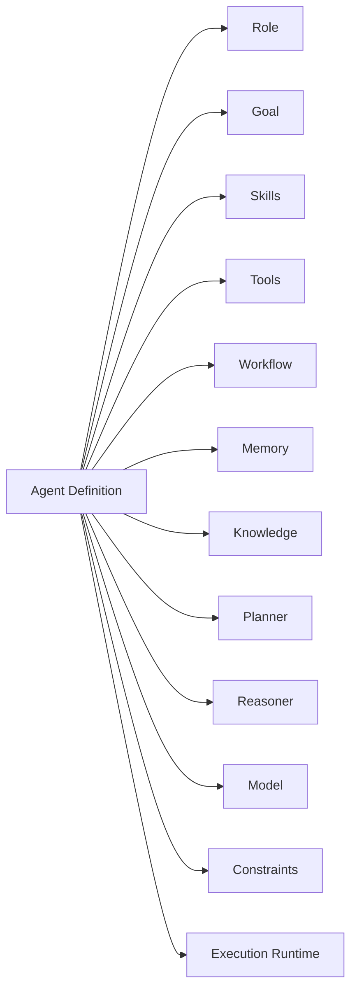

**Why this matters:** The same conceptual agent can be executed locally, through a cloud model, synchronously, asynchronously, inside a workflow, through A2A, with different memory/tool implementations, and different execution budgets. The definition is declarative; the runtime is operational.

## 2.3 Principle 2 — Abstraction Before Implementation

Wayang places important system boundaries behind interfaces and SPIs. Explicit abstractions include:

```text
Agent
AgentPipeline
Memory / MemoryProvider
Provider
Tool
Execution
EventLedger
Checkpoint
ContextPlanner
ModelRouter
```

The architectural rule:

$$
\text{Core} \rightarrow \text{Interface}
$$

rather than:

$$
\text{Core} \rightarrow \text{Concrete Implementation}
$$

## 2.4 Principle 3 — Composition Over Monolithic Agents

Wayang does not require every capability inside one enormous agent class. Instead, an agent is assembled from cooperating capabilities.

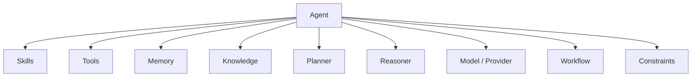

## 2.5 Principle 4 — Provider and Model Independence

The runtime resolves providers and can use model-routing infrastructure when available. The current runtime implementation includes an optional `ModelRouter`, with a default router used when no explicit router is configured.

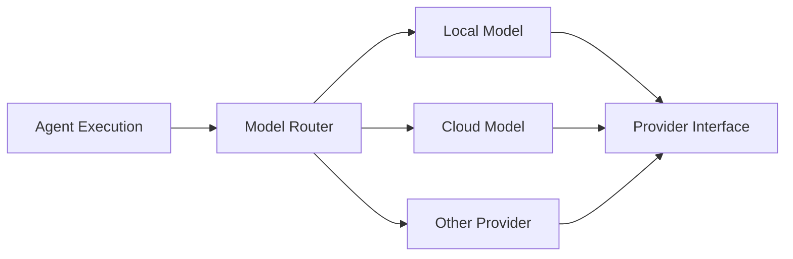

This separates:

$$
\text{Agent Logic} \neq \text{Inference Infrastructure}
$$

## 2.6 Principle 5 — Budget-Aware Execution

A reasoning loop can consume model tokens, tool calls, execution time, memory, retries, and external resources. Wayang therefore models execution budgets explicitly.

A conceptual execution constraint:

$$
C_{execution} = (T_{max},\, N_{steps},\, N_{tools},\, B_{tokens},\, R_{retries},\, M_{memory})
$$

The runtime should be able to answer: **How much work is this execution allowed to perform?** — rather than allowing an agent loop to consume resources without an explicit boundary.

## 2.7 Principle 6 — Context Is Compiled, Not Simply Concatenated

Wayang treats runtime context as something that can be **planned and compiled**. The runtime has a `RuntimeContextPlanner` and supports planning context against an `ExecutionBudget` and available `ContextProvider` instances.

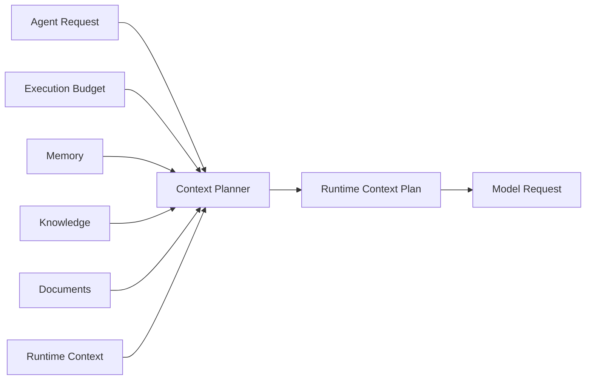

The conceptual transformation:

$$
\text{Available Context} \rightarrow \text{Relevant Context} \rightarrow \text{Budgeted Context} \rightarrow \text{Model Input}
$$

## 2.8 Principle 7 — Execution Is Stateful

An execution has lifecycle state and phases. Execution states:

```text
INITIALIZED, VALIDATING, LOADING, PLANNING, REASONING, EXECUTING,
EVALUATING, COMPLETED, FAILED, CANCELLED, PAUSED, RETRYING, ERROR
```

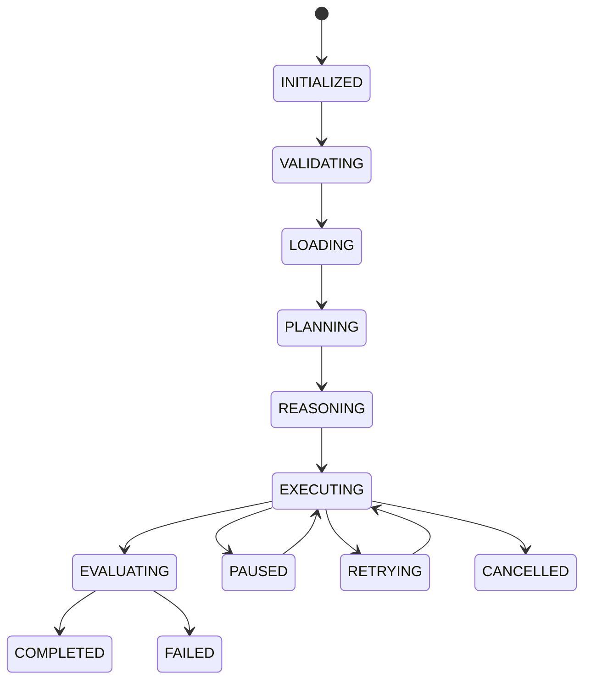

## 2.9 Principle 8 — Durable Execution Semantics

Wayang distinguishes four concepts that are often incorrectly treated as the same thing:

| Concept    | Question answered           |
| ---------- | --------------------------- |
| Event      | What happened?              |
| Checkpoint | Where can execution resume? |
| Cache      | What work can be reused?    |
| Artifact   | What did execution produce? |

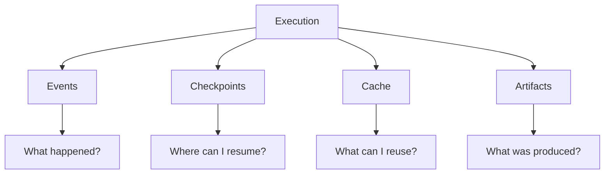

This separation prevents logs, state snapshots, cached results, and generated outputs from becoming mixed together.

## 2.10 Principle 9 — Event-Driven Observability

Wayang has a durable event abstraction through `EventLedger`. The event ledger is explicitly different from ephemeral callbacks and is intended to support persistent execution history and auditing.

Canonical event categories include:

- execution lifecycle
- context compilation
- model requests/responses
- model routing
- tool requests/approval/execution/failure/timeout
- retries
- memory retrieval/storage
- checkpoints
- artifacts
- A2A activity
- cache

## 2.11 Principle 10 — Verbatim Context, Never Summarized

Wayang never summarizes context. It reduces *scope* (which members are shown), never *fidelity* (how they're shown). Every surviving character is a substring of the original source.

Three tiers, each narrowing scope but preserving fidelity:

| Tier | Name | Scope reduced | Fidelity |
|------|------|---------------|----------|
| 1 | Full Source | none | verbatim |
| 2 | Skeleton | bodies stripped | verbatim |
| 2b | Pruned Skeleton | unused members removed | verbatim |
| 3 | Signature Digest | one line per member | verbatim |

## 2.12 Principle 11 — Protocol Agnosticism

Canonical models live in `wayang-communication-api`. A2A, ANP, and local protocols are *projections* of those canonical models — never the reverse.

Zero protocol leakage into core. Adding a new protocol never touches the kernel.

## 2.13 Principle 12 — Fail-Closed Security

Security decisions default to **deny**. The `DefaultObligationPipeline` is fail-closed: an unhandled obligation halts execution. The `DefaultPolicyEngine` defaults to `DENY` if no matching rule is found.

The only explicitly fail-open path is the guardrail timeout (`DefaultToolGuardrailCheck`), which can be flipped to fail-closed in production.

## 2.14 Principle 13 — Blind Spots Disclosed, Not Hidden

When static analysis cannot resolve a call (reflection, event annotations, name collisions), the resolver reports it as a diagnostic. An incomplete map with explicit warnings beats a complete map that is silently wrong.

Three disclosed blind spots:

1. **Reflection** — `Class.forName`, `Method.invoke`
2. **Event annotations** — `@Observes`, `@ConsumeEvent`, `@Incoming`, `@Outgoing`
3. **Name collisions** — two types declaring the same method name

## 2.15 Principle 14 — SPI-First Extension Model

Every integration point is an SPI. The runtime can remain small while optional functionality is packaged independently. Separate domains for:

```text
agent, coordination, gamelan, inference, interaction,
memory, observability, orchestration, resilience,
security, skills, tools
```

The skill system supports ServiceLoader/plugin discovery.

## 2.16 Summary Matrix

| # | Principle | Enforced By |
|---|-----------|-------------|
| 1 | Separation of definition and execution | `AgentDefinition` + runtime |
| 2 | Abstraction before implementation | SPIs at every layer |
| 3 | Composition over monolithic agents | `AgentDefinition` references |
| 4 | Provider and model independence | `ModelRouter`, `Provider` |
| 5 | Budget-aware execution | `ExecutionBudget` |
| 6 | Context is compiled | `RuntimeContextPlanner` |
| 7 | Execution is stateful | `AgentContextState`, phases |
| 8 | Durable execution semantics | `EventLedger`, `CheckpointStore`, `ExecutionCache` |
| 9 | Event-driven observability | `EventLedger` |
| 10 | Verbatim context | `Skeletonizer` (never summarizes) |
| 11 | Protocol agnosticism | `AgentDescriptor` + projections |
| 12 | Fail-closed security | `DefaultObligationPipeline`, `DefaultPolicyEngine` |
| 13 | Blind spots disclosed | `ReachabilityResult` diagnostics |
| 14 | SPI-first extension | ServiceLoader + CDI |

---

# Chapter 3 — Runtime Execution Model

## 3.1 Agent Execution

The runtime source contains:

- `AgentExecution`
- `AgentExecutionService`
- `ExecutionBudget`
- `RuntimeBehavior`
- `AgentDefinition`
- `AgentRequest`
- `AgentResponse`

The standalone runner demonstrates the intended lifecycle:

```java
AgentExecution execution =
    executionService.create(definition, request, budget);

AgentResponse response =
    execution.executeSync();
```

The same runtime also supports asynchronous execution via `execute()` returning a `CompletionStage<AgentResponse>`.

## 3.2 Runtime Behavior Profiles

The standalone runner exposes four runtime-behavior profiles. These are **runtime-behavior profiles**, not model names.

```text
FAST
BALANCED
THOROUGH
DEBUG
```

Conceptually:

```text
RuntimeBehavior
       │
       ▼
ExecutionBudget
       │
       ├── step limit
       ├── token limit
       ├── timeout
       ├── retry budget
       └── other resource limits
```

The supplied runner currently maps the behavior values to default budgets, so finer-grained behavior-specific budget profiles should be treated as an extension point rather than assumed to be fully implemented.

## 3.3 Execution Budget Model

`ExecutionBudget` is a record with the following dimensions:

| Field | Default (BALANCED) | Purpose |
|-------|-------------------|---------|
| `maxDuration` | 5 minutes | Wall-clock timeout |
| `maxSteps` | 25 | ReAct loop iterations |
| `maxToolCalls` | 50 | Tool invocations |
| `maxInputTokens` | 200,000 | Total input tokens |
| `maxOutputTokens` | 50,000 | Total output tokens |
| `contextTokens` | 32,768 | Context window budget |
| `maxRetries` | 3 | Retry attempts |
| `maxConcurrentTools` | 2 | Parallel tool calls |
| `toolCacheEnabled` | true | Tool result caching |
| `toolCacheTtl` | 30 min | Tool cache TTL |
| `retrievalCacheEnabled` | true | RAG retrieval caching |
| `retrievalCacheTtl` | 30 min | Retrieval cache TTL |
| `researchCacheEnabled` | false | Research task caching |
| `researchCacheTtl` | null | Research cache TTL |
| `maxA2ARequests` | 10 | A2A calls |
| `maxResearchSources` | 20 | Research sources |

Four preset profiles:

| Profile | maxSteps | maxToolCalls | contextTokens | toolCacheTtl |
|---------|----------|--------------|---------------|--------------|
| FAST | 15 | 30 | 8,192 | 5 min |
| BALANCED (default) | 25 | 50 | 32,768 | 30 min |
| THOROUGH | 50 | 100 | 128,000 | 2 hrs |
| DEBUG | 25 | 50 | 32,768 | disabled |

## 3.4 Execution Events

The runtime supports execution events for streaming and observability. Typical agent-loop events include:

```text
THOUGHT
ACTION
OBSERVATION
FINAL_ANSWER
```

For production execution, additional lifecycle events can include:

```text
STARTED
CHECKPOINT_SAVED
TOOL_STARTED
TOOL_COMPLETED
WAITING
RESUMED
FAILED
CANCELLED
COMPLETED
```

Only the event types actually exposed by a given implementation should be treated as contractual.

## 3.5 Streaming Execution

The runtime snapshot shows:

```java
Multi<AgentEvent> events = orchestrator.stream(request);
```

A consumer can process events as they arrive:

```java
events.subscribe().with(event -> {
    switch (event.getType()) {
        case THOUGHT -> ...
        case ACTION -> ...
        case OBSERVATION -> ...
        case FINAL_ANSWER -> ...
    }
});
```

For security-sensitive deployments, internal reasoning events should be filtered before being exposed to end users.

## 3.6 Core Domain Model

### 3.6.1 AgentDefinition

`AgentDefinition` describes the agent itself. Used by the runtime to define identity, metadata, goal, model information, and capabilities/configuration.

```java
AgentDefinition definition =
    AgentDefinition.builder()
        .metadata(
            Metadata.builder()
                .name("sales-agent")
                .description("Analyzes sales information")
                .now()
                .build()
        )
        .goal("Analyze sales information and produce actionable findings.")
        .build();
```

Compositional structure:

```text
AgentDefinition
├── role
├── goal
├── skills (References)
├── tools (References)
├── workflow (Reference)
├── memory (Reference)
├── knowledge (Reference)
├── planner (Reference)
├── reasoner (Reference)
├── model (Reference)
├── constraints (Map)
└── configuration (Map)
```

### 3.6.2 AgentRequest

An `AgentRequest` represents one invocation. Typical information includes:

- request ID
- input type
- content/prompt
- user/session information
- tenant context
- requested strategy
- requested skills
- runtime limits

```java
AgentRequest request = AgentRequest.builder()
    .id("req-123")
    .sessionId("sess-456")
    .tenantId("acme")
    .userId("user-789")
    .type(InputType.TEXT)
    .content("Analyze Q3 sales data")
    .metadata(Map.of("priority", "high"))
    .build();
```

### 3.6.3 AgentResponse

An `AgentResponse` contains the result of an execution. Conceptually:

```text
AgentResponse
├── success
├── content
├── error
├── artifacts
└── execution metadata
```

```java
AgentResponse response = AgentResponse.builder()
    .id("resp-123")
    .sessionId("sess-456")
    .content("Q3 sales grew 15%...")
    .type("text")
    .success(true)
    .responseTimeMs(1234)
    .build();
```

### 3.6.4 Artifact

Artifacts represent produced or exchanged resources. Examples:

- generated files
- reports
- code
- documents
- structured output
- binary resources

A2A mapping also exposes Wayang artifacts as A2A artifacts.

```java
public interface Artifact extends Resource {
    ArtifactId id();
    ResourceType type();
    ArtifactFormat format();
    Object content();
    String asString();
    byte[] asBytes();
    Metadata metadata();
}
```

### 3.6.5 AgentContext

`AgentContext` is the universal context for agent execution. It carries all state, variables, and artifacts between phases.

```text
AgentContext
├── id (ResourceId)
├── sessionId
├── tenantId
├── namespace
├── request (AgentRequest)
├── response (AgentResponse)
├── variables (Map<String, Object>)
├── attributes (Map<String, Object>)
├── artifacts (List<Artifact>)
├── contextData (ContextData)
├── outputResult (OutputResult)
├── state (AgentContextState)
├── currentPhase (AgentContextPhase)
├── createdAt / updatedAt
├── version
├── startTime / elapsedTime
├── phaseTimings (Map<String, Long>)
├── completedPhases (Set<String>)
└── history (List<AgentContext>)
```

Key features:

- **Immutable by default** — every modification creates a new instance via `with*` methods
- **Thread-safe** — can be shared across threads safely
- **Versioned** — tracks state changes for audit and replay
- **Type-safe** — strongly typed accessors for variables
- **Observable** — emits events for every state change

### 3.6.6 AgentExecution

`AgentExecution` is the permanent lifecycle bridge connecting physical execution state with semantic agent state.

```java
public interface AgentExecution {
    String id();
    AgentContext agentContext();
    ExecutionStatus status();
    CompletionStage<AgentResponse> execute();
    AgentResponse executeSync();
    AgentResponse join();
    void pause();
    void resume();
    void cancel();
}
```

## 3.7 Agent Lifecycle

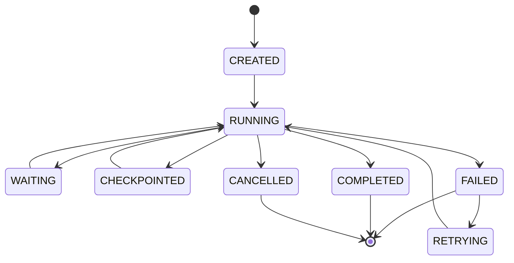

The exact state vocabulary varies by subsystem. Durable A2A tasks explicitly distinguish:

- `PENDING`
- `RUNNING`
- `WAITING_FOR_TOOL`
- `WAITING_FOR_APPROVAL`
- `COMPLETED`
- `FAILED`
- `CANCELLED`

A run should not be modeled as a single synchronous function call. Instead:

```text
Run
 ├── identity
 ├── tenant
 ├── request
 ├── state
 ├── execution history
 ├── checkpoints
 ├── budget
 ├── tool interactions
 ├── workflow interactions
 ├── A2A interactions
 └── final response
```

## 3.8 Execution State Machine

The `AgentContextState` enum defines the full state vocabulary:

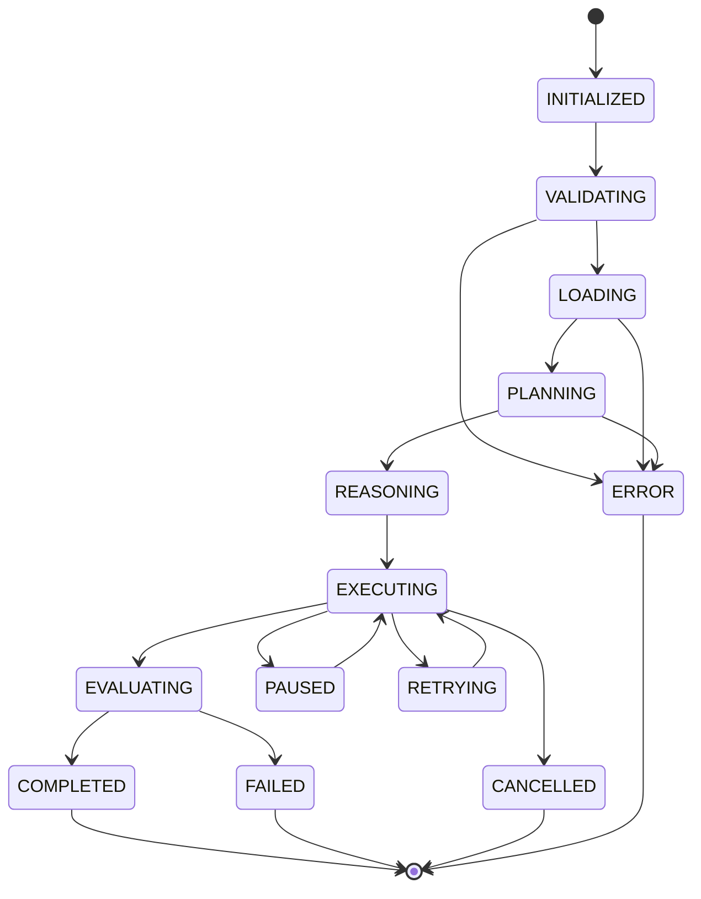

| State | Meaning |
|-------|---------|
| `INITIALIZED` | Context created, not yet validated |
| `VALIDATING` | Validating input/context |
| `LOADING` | Loading data |
| `PLANNING` | Planning phase |
| `REASONING` | Reasoning phase |
| `EXECUTING` | Executing (tool/model loop) |
| `EVALUATING` | Evaluating results |
| `COMPLETED` | Successfully completed |
| `FAILED` | Failed |
| `CANCELLED` | Cancelled |
| `PAUSED` | Paused (HITL, debugging) |
| `RETRYING` | Retrying after failure |
| `ERROR` | Error state |

## 3.9 Execution Phases

The `AgentContextPhase` enum defines the finer-grained phase vocabulary:

| Phase | Purpose |
|-------|---------|
| `INIT` | Initial phase before processing |
| `TRIGGER` | Receiving trigger events |
| `INPUT` | Receiving input |
| `CONTEXT` | Loading context data |
| `PLANNING` | Creating plans |
| `REASONING` | Performing reasoning |
| `INFERENCE` | Calling LLM |
| `TOOLS` | Executing tools |
| `MEMORY` | Storing/retrieving memory |
| `EVALUATION` | Evaluating results |
| `GUARDRAIL` | Safety checks |
| `OUTPUT` | Sending output |
| `COMPLETE` | Finalizing execution |
| `CUSTOM` | Custom phase |

Phase transitions are tracked in `AgentContext.phaseTimings` and `AgentContext.completedPhases`, enabling:

- Per-phase duration analysis
- Phase completion auditing
- Time-travel debugging
- Performance profiling

## 3.10 Execution Durability Concepts

The core distinction that Wayang makes:

| Concept | Question | Interface | Persistence |
|---------|----------|-----------|-------------|
| **Event** | What happened? | `EventLedger` | Append-only |
| **Checkpoint** | Where can I resume? | `CheckpointStore` | Keyed by execution |
| **Cache** | What work can I reuse? | `ExecutionCache` | Keyed by input hash |
| **Artifact** | What did execution produce? | `Artifact` | Immutable resource |
| **Journal** | What steps were taken? | `ExecutionJournal` | Append-only |

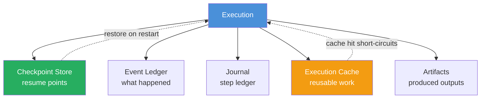

### 3.10.1 Event Ledger

```java
public interface EventLedger {
    void record(ExecutionEvent event);
    List<ExecutionEvent> events(String executionId);
    List<ExecutionEvent> events(String executionId, ExecutionEventType type);
    Optional<ExecutionMetrics> metrics(String executionId);
    void purge(String executionId);
    long totalEventCount();
}
```

### 3.10.2 Checkpoint Store

```java
public interface CheckpointStore {
    void save(String executionId, AgentContext context);
    Optional<AgentContext> load(String executionId);
    List<AgentContext> history(String executionId);
    void delete(String executionId);
}
```

### 3.10.3 Execution Cache

```java
public interface ExecutionCache {
    Optional<ExecutionCacheEntry> lookup(CacheNamespace namespace, String tenantId, String userId, String inputHash);
    void store(ExecutionCacheEntry entry);
    void invalidateByExecution(String executionId);
    void invalidateByNamespace(CacheNamespace namespace, String tenantId);
    List<ExecutionCacheEntry> listByExecution(String executionId);
    CacheStats stats();

    static String hashInputs(Map<String, Object> arguments) { ... }
    static String hashString(String input) { ... }
    static String hashTool(String toolName, Map<String, Object> arguments) { ... }
}
```

Cache namespaces:

| Namespace | Caches |
|-----------|--------|
| `TOOL` | Tool invocation results |
| `RETRIEVAL` | RAG / vector / keyword search results |
| `CONTEXT` | Compiled prompt-context blocks |
| `RESEARCH` | Full research task ledger entries |
| `MODEL` | Model response for identical prompt+params |

### 3.10.4 Execution Journal

```java
public interface ExecutionJournal {
    void append(String executionId, JournalEvent event);
    List<JournalEvent> read(String executionId);

    record JournalEvent(
        String eventId,
        String type,
        String summary,
        Instant timestamp,
        Object metadata
    ) {}
}
```

---

# Chapter 21 — Skills Subsystem

## 21.1 Definition

A **Skill** is a self-contained, versioned, discoverable unit of agent capability.

Skills:

- implement `AgentSkill`
- declare metadata using `@SkillDescriptor`
- define input/output schemas
- are discoverable through ServiceLoader or plugin loading

## 21.2 Skill Architecture

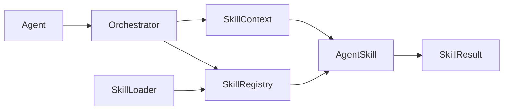

## 21.3 Skill Descriptor

Conceptually:

```java
@SkillDescriptor(
    id = "inference",
    name = "LLM Inference",
    description = "Execute natural language inference",
    version = "1.0.0",
    category = SkillCategory.REASONING,
    triggers = {"infer", "generate", "llm"}
)
public class InferenceSkill implements AgentSkill {
    // implementation
}
```

The exact annotation members should follow the current source API.

## 21.4 Built-in Skills

The source catalogs capabilities including:

| Skill | Purpose |
|-------|---------|
| `inference` | Direct LLM inference |
| `rag` | Retrieval-Augmented Generation |
| `code-execution` | Sandboxed code execution |
| `web-search` | Search/content extraction |
| `http-call` | Authenticated HTTP API calls |
| `summarization` | Multi-document summarization |
| `embedding` | Vector embeddings |
| `memory-store` | Long-term memory access |
| `sql-query` | SQL/database queries |
| `document-qa` | Question answering over documents |

## 21.5 Skill Execution Contract

```text
SkillContext
     │
     ├── tenant
     ├── run
     ├── inputs
     ├── execution metadata
     └── runtime constraints
           │
           ▼
       AgentSkill
           │
           ▼
      SkillResult
```

A skill should:

1. validate its input
2. enforce its own authorization constraints
3. execute asynchronously where possible
4. return structured results
5. avoid leaking tenant data
6. emit useful execution metadata

## 21.6 Skill Repository

The `SkillRepository` SPI supports multiple backends:

```java
public interface SkillRepository {
    String name();
    Uni<SkillMetadata> save(SkillContent content);
    Uni<Optional<SkillContent>> get(String skillId);
    Uni<Optional<SkillMetadata>> getMetadata(String skillId);
    Uni<Boolean> delete(String skillId);
    Uni<List<SkillMetadata>> list(int offset, int limit);
    Uni<List<SkillMetadata>> search(String query, int offset, int limit);
    Uni<List<SkillMetadata>> getByCategory(String category);
    Uni<List<SkillMetadata>> getByTags(List<String> tags, boolean matchAll);
    Uni<Boolean> exists(String skillId);
    Uni<Boolean> setEnabled(String skillId, boolean enabled);
    Uni<RepositoryStats> getStats();
    Uni<Void> clearCache();
    Uni<Void> initialize();
}
```

Storage backends:

- **File-based** — `~/.wayang/skills/`
- **Database** — PostgreSQL, etc.
- **Hybrid** — file + DB

## 21.7 `skills.md` Convention

The runtime direction supports skill descriptions as documentation/configuration artifacts:

```text
skills/
  sales-analysis/
    skills.md
    schema.json
    implementation.jar
```

The attached snapshots establish skill metadata and discovery mechanisms; a complete file-based `skills.md` loader should be treated as a separate implementation layer unless present in the current source tree.

## 21.8 Skill Adapter

A skill can be adapted into a tool:

```text
AgentSkill
    │
    ▼
SkillAsToolAdapter / ToolAdapter
    │
    ▼
ToolDescriptor
    │
    ▼
LLM tool-calling interface
```

This is how the LLM sees skills — as callable tools with JSON schemas.

---

# Chapter 22 — Tools Subsystem

## 22.1 Skill vs Tool

| Aspect | Skill | Tool |
|--------|-------|------|
| **Nature** | Internal, versioned Wayang capability | Callable capability exposed to agent |
| **Discovery** | ServiceLoader / plugin | ToolRegistry |
| **Schema** | Skill descriptor | Tool descriptor |
| **Adaptation** | Can become a tool | Direct use |

## 22.2 Tool Sources

```text
INTERNAL_SKILL
MCP_SERVER
REST_API
CLI_COMMAND
GRPC_SERVICE
DATABASE
```

## 22.3 Tool Descriptor

```java
record ToolDescriptor(
    String id,
    String name,
    String description,
    JsonSchema schema,
    ToolSource source,
    Map<String, Object> metadata,
    List<String> tags
) {}
```

## 22.4 Tool Context

```java
record ToolContext(
    String toolId,
    String tenantId,
    String runId,
    int stepNumber,
    Map<String, Object> inputs,
    Map<String, Object> context,
    Duration timeout
) {}
```

## 22.5 Tool Result

```java
record ToolResult(
    boolean success,
    Object data,
    String error,
    Map<String, Object> metadata,
    long durationMs
) {}
```

## 22.6 Tool Execution Flow

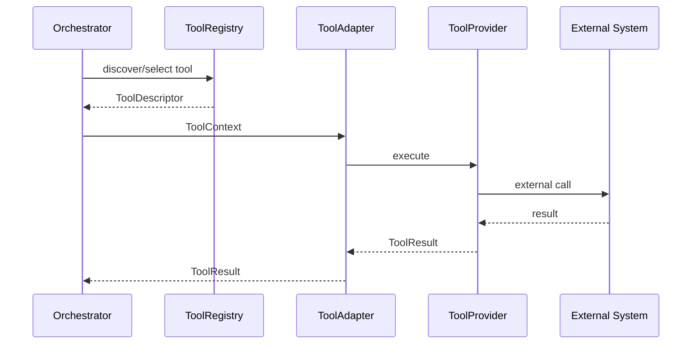

## 22.7 MCP Integration

MCP is treated as one external tool source rather than as the definition of the Wayang tool system.

```text
Wayang Tool SPI
       │
       ├── MCP
       ├── REST/OpenAPI
       ├── CLI
       ├── gRPC
       └── Database
```

### 22.7.1 MCP Transports

```java
public enum McpTransportType {
    HTTP,
    SSE,
    STDIO
}
```

### 22.7.2 MCP Client

```java
public interface McpToolClient {
    Uni<List<McpToolDescriptor>> listTools(McpServerConfig server);
    Uni<McpToolCallResult> callTool(McpToolInvocation invocation);
    default Uni<Void> disconnect(String serverId) { return Uni.createFrom().voidItem(); }
}
```

### 22.7.3 MCP Configuration Tiers

MCP configs are merged from four tiers (highest priority last):

1. Classpath built-in — `resources/mcp/mcp.json`
2. User home — `~/.wayang/mcp/mcp.json`
3. SPI providers — registered `McpConfigPathProvider` extensions
4. Workspace — `.mcp.json` in workspace root

## 22.8 Capability-Aware Tools

Tools can declare capabilities that the registry uses for filtering:

```java
public interface Capability {
    String id();
    boolean satisfies(Capability requested);
    default boolean requiresApproval() { return false; }
}
```

Example: `DomainScope("git")`, `RequiresNetwork`, `RequiresFilesystem`.

## 22.9 Abstract EIP Tool

For enterprise integration patterns, `AbstractEipTool` provides dual-persona support:

```java
public class HttpGetTool extends AbstractEipTool {
    public HttpGetTool() {
        super("http-get", "Performs an HTTP GET", Map.of(
            "type", "object",
            "properties", Map.of("url", Map.of("type", "string")),
            "required", List.of("url")
        ));
    }

    @Override
    public CompletableFuture<ToolResult> executeEip(
            Map<String, Object> args, ToolContext context) {
        // implement
    }
}
```

## 22.10 Tool Registry

```java
public interface ToolRegistry extends Registry<Tool> {
    Optional<Tool> findByName(String name);
    List<Tool> listTools();
    List<Tool> getToolsByCapability(CapabilityRequest request);
    void registerProvider(ToolProvider provider);
}
```

## 22.11 A2A Client Tool

The `A2AClientTool` wraps a remote A2A agent as a local tool:

```java
A2AClientTool tool = new A2AClientTool(a2aClient, "remote-research-agent");
// Now the local agent can invoke the remote agent as a tool
```

This is how Wayang achieves **agent-as-tool** composition.

---

# Chapter 23 — Memory Subsystem

## 23.1 Four Memory Layers

The runtime documentation defines four memory layers:

| Layer | Purpose | Typical storage |
|-------|---------|-----------------|
| **Working** | Current reasoning/run scratch state | memory / Redis |
| **Conversation** | Session transcript | Redis / PostgreSQL |
| **Vector** | Semantic retrieval | Qdrant / pgvector |
| **Episodic** | Long-term session/episode data | PostgreSQL |

## 23.2 Memory Architecture

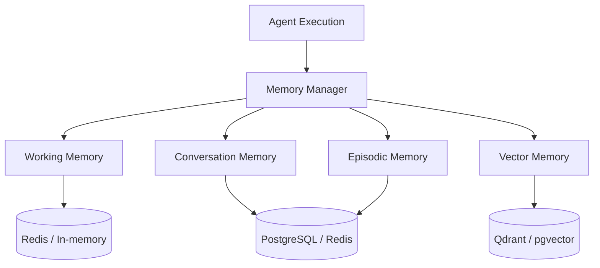

## 23.3 Memory SPI

The runtime source contains an `AgentMemoryService` with operations such as:

```java
Uni<Void> storeInteraction(
    String agentId,
    String sessionId,
    String userId,
    String userInput,
    String response
);

Uni<String> getContextPrompt(
    String agentId,
    int limit
);
```

The broader memory SPI also describes operations for:

- working memory
- conversation memory
- vector embeddings
- episodic storage
- statistics
- health

## 23.4 MemoryProvider SPI

```java
public interface MemoryProvider extends Extension {
    String name();
    void save(MemoryRecord record) throws Exception;
    void save(List<MemoryRecord> records) throws Exception;
    List<MemoryRecord> search(MemoryQuery query) throws Exception;
    Optional<MemoryRecord> get(String key) throws Exception;
    void delete(String key) throws Exception;
    void clear() throws Exception;
    default CompletableFuture<List<MemoryRecord>> searchAsync(MemoryQuery query) { ... }
    default MemoryStats getStats() throws Exception { ... }
    default List<MemoryRecord> exportAll(String agentId) throws Exception { ... }
    default int importAll(List<MemoryRecord> records, boolean overwrite) throws Exception { ... }
}
```

## 23.5 Memory Record

```java
public record MemoryRecord(
    String id,
    String type,
    String key,
    String value,
    Map<String, Object> metadata,
    Instant timestamp,
    double relevance,
    long ttlSeconds,
    String sessionId,
    String userId
) { ... }
```

## 23.6 Memory Scope

```java
public enum MemoryScope {
    EXECUTION,     // Only useful while a single run is executing
    CONVERSATION,  // Useful inside one conversation
    PROJECT,       // Available across conversations inside a project
    USER,          // User-level preferences spanning projects
    TENANT         // Organization-level knowledge
}
```

## 23.7 Memory Policy

```java
public record MemoryPolicy(
    MemoryScope scope,
    Duration retention,
    double initialImportance,
    boolean isSensitive
) {
    public static MemoryPolicy ephemeral(MemoryScope scope) { ... }
    public static MemoryPolicy permanent(MemoryScope scope) { ... }
}
```

## 23.8 Tenant-Scoped Memory

Every persistent memory operation should carry tenant identity where the implementation supports tenancy.

Conceptually:

$$
K = f(\text{tenantId}, \text{agentId}, \text{sessionId}, \text{memoryType}, \text{key})
$$

This prevents a memory key from becoming globally ambiguous.

## 23.9 Memory Retrieval Pipeline

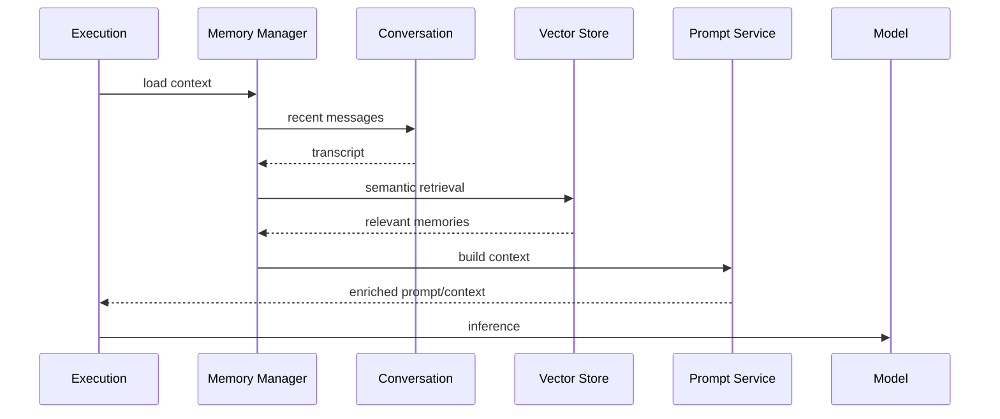

## 23.10 Memory Snapshot

A portable, self-describing snapshot of all memory records across one or more scopes/tiers:

```java
public record MemorySnapshot(
    int schemaVersion,
    String snapshotId,
    String agentId,
    String userId,
    String tenantId,
    Instant capturedAt,
    List<String> tiers,
    List<MemoryRecord> records,
    Map<String, Object> exportMetadata
) {
    public static final int CURRENT_SCHEMA = 1;
    public static Builder builder() { ... }
}
```

## 23.11 Conversation Windowing

`ConversationMemory` trims history to fit both message count and token budget:

```java
ConversationMemory memory = new ConversationMemory(
    50,    // maxMessages
    8000   // maxTokenBudget
);
```

When either limit is exceeded, oldest messages are dropped first.

## 23.12 Tool Result Compression

Large tool results are compressed before being added to memory:

```java
if (result.length() > 6000) {
    stored = result.substring(0, 3000)
        + "\n\n...[result compressed]...\n\n"
        + result.substring(result.length() - 1500);
}
```

This keeps the first and last portions (typically most informative) while dropping the middle.

---

# Chapter 24 — Orchestration Patterns

Wayang separates the runtime from the orchestration algorithm.

## 24.1 Supported Patterns

The source documents:

- **ReAct** — Reason → Act → Observe loop
- **Plan-and-Execute** — Plan → Execute steps
- **Chain-of-Thought** — Step-by-step reasoning
- **Reflexion** — Attempt → Critique → Reflect loop

The framework snapshot also contains tool-calling orchestration classes.

## 24.2 ReAct

```text
Thought
  ↓
Action
  ↓
Observation
  ↓
Thought
  ↓
Action
  ↓
...
  ↓
Final Answer
```

Best suited to tasks requiring iterative tool interaction.

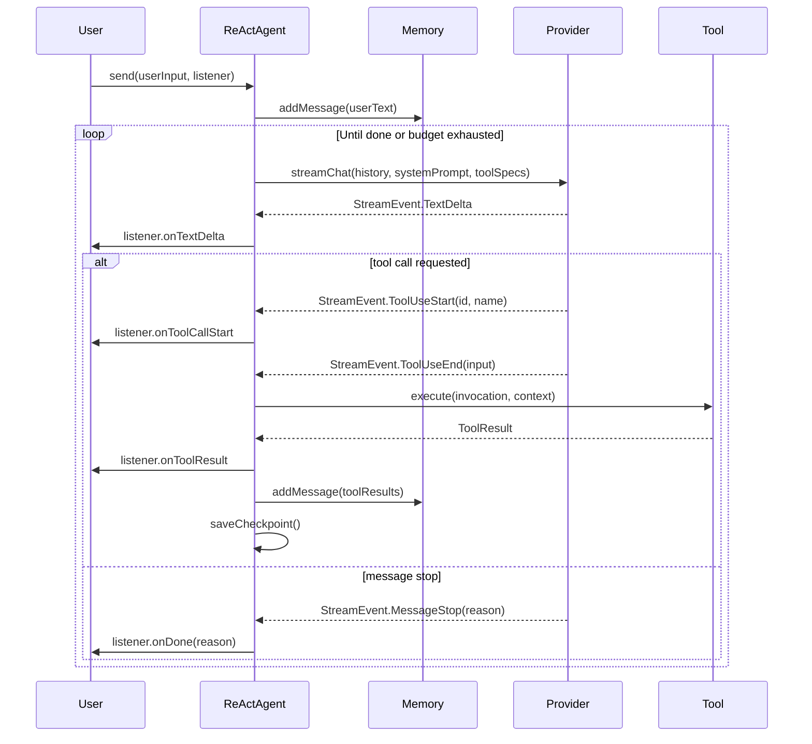

## 24.3 Plan-and-Execute


Three-phase loop: **Plan → Solve → Reflect**. Up to 2 reflection rounds, 10 steps per sub-plan.

## 24.4 Reflexion

```text
Attempt
   ↓
Critique
   ↓
Reflection
   ↓
Improved Attempt
   ↓
...
```

Generate → Critique → Refine loop. Configurable `maxRounds` (default 2).

## 24.5 Chain-of-Thought

The source lists CoT as a logical reasoning strategy. Internal reasoning should be treated as private runtime state unless an application explicitly defines a safe public representation.

## 24.6 Tool-Calling Loop

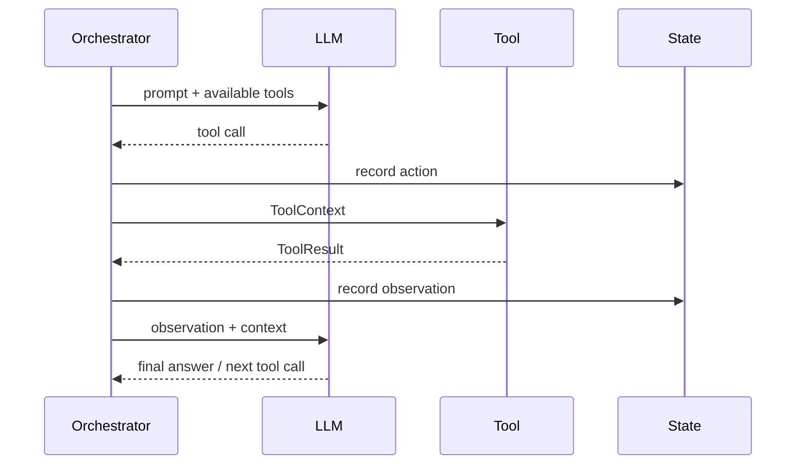

## 24.7 Multi-Agent Orchestration

`AgentOrchestrator` supports sequential, parallel, and routed dispatch.

### 24.7.1 Sequential

Each agent receives the previous output as input.

```java
AgentOrchestrator orchestrator = new AgentOrchestrator()
    .register("researcher", researcher)
    .register("analyst", analyst)
    .register("writer", writer);

orchestrator.sequential("Analyze the AI chip market", listener);
```

### 24.7.2 Parallel Fan-Out

All agents run concurrently; results merged.

```java
AgentOrchestrator parallel = new AgentOrchestrator()
    .register("bull", bullAgent)
    .register("bear", bearAgent)
    .withMerger(results -> mergeViews(results));

parallel.parallel("Should we invest in NVDA?", listener);
```

### 24.7.3 Routed Dispatch

A router selects which agent handles the input.

```java
AgentOrchestrator routed = new AgentOrchestrator()
    .register("code", codeAgent)
    .register("docs", docAgent)
    .withRouter(input -> input.contains("code") ? "code" : "docs");

routed.routed("Fix the null pointer", listener);
```

### 24.7.4 State-Machine Graph

For complex coordination, use `WorkflowGraph` (see Chapter 12).

## 24.8 Orchestration Comparison

| Pattern | Best for | Concurrency |
|---------|----------|-------------|
| ReAct | Tool-iterative tasks | Sequential |
| Plan-and-Execute | Multi-step tasks | Sequential |
| Reflexion | Quality-sensitive | Sequential |
| CoT | Reasoning tasks | Sequential |
| Parallel | Independent sub-tasks | Concurrent |
| Routed | Specialized handling | Single agent |

---

# Chapter 25 — Inference Planning & Model Routing

## 25.1 Why Routing Is Separate

A runtime may have:

```text
Local model
Cloud provider A
Cloud provider B
Specialized OCR model
Embedding model
Speech model
Diffusion model
```

The runtime therefore derives requirements and creates an inference plan.

## 25.2 ModelRouter

```java
InferencePlan plan(
    AgentRequest request,
    AgentDefinition agentDefinition,
    InferenceRequirements requirements,
    InferencePolicy policy,
    List<Provider> availableProviders
);
```

## 25.3 DIRECT Strategy

`DIRECT` is the default in the supplied implementation. Its purpose is to respect an explicitly requested provider/model path rather than replacing it with adaptive budget logic.

```text
Request
  │
  ├── explicit model/provider
  │
  ▼
DIRECT ROUTER
  │
  ▼
selected provider/model
```

## 25.4 ADAPTIVE Strategy

`ADAPTIVE` adds:

- capability filtering
- budget boundaries
- multi-criteria scoring
- telemetry feedback

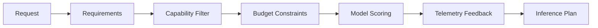

## 25.5 Component Wiring

```text
DefaultModelRouter
 ├── DirectModelRouter
 └── AdaptiveModelRouter
       ├── ModelRegistry
       ├── ModelDeploymentRegistry
       ├── ConstraintEvaluator
       ├── ModelScorer
       ├── ModelRoutingTelemetry
       └── FallbackPlanner
```

## 25.6 Routing Configuration

```properties
wayang.router.strategy=direct
# or
wayang.router.strategy=adaptive
# or
wayang.router.strategy=advanced  # maps to adaptive
```

Or via environment:

```bash
WAYANG_ROUTER_STRATEGY=adaptive
```

## 25.7 Capability-Based Selection

A conceptual constraint:

$$
M^* = \arg\max_{m \in M,\; C(m)\supseteq R} Score(m)
$$

where:

- \(M\) = registered models
- \(C(m)\) = model capabilities
- \(R\) = request requirements
- \(Score(m)\) = routing score

Budget is a hard constraint:

$$
Cost(m) \le B
$$

## 25.8 Routing Objectives

| Objective | Quality | Cost | Latency | Notes |
|-----------|---------|------|---------|-------|
| `QUALITY_FIRST` | 0.85 | 0.05 | 0.10 | Best model wins |
| `COST_MINIMIZING` | 0.15 | 0.65 | 0.20 | Cheapest wins |
| `LATENCY_FIRST` | 0.20 | 0.15 | 0.65 | Fastest wins |
| `LOCAL_FIRST` | 0.25 | 0.40 | 0.35 | +0.30 local bonus |
| `BALANCED` | 0.40 | 0.35 | 0.25 | Default |

## 25.9 Fallback Strategies

| Strategy | Behavior |
|----------|----------|
| `ORDERED_FALLBACK` | Next top-3 candidates |
| `LOCAL_TO_CLOUD` | Local → best cloud |
| `CHEAP_TO_SMART` | Cheap → highest quality |
| `STRICT_NO_FALLBACK` | No fallback |

## 25.10 The Model Catalog

`DefaultModelCatalog` seeds 25+ models across seven categories:

1. **Frontier LLM & Multimodal** — GPT-4o, Claude 3.5 Sonnet, Gemini 2.0 Flash
2. **Reasoning** — o1, o3-mini, DeepSeek-R1
3. **Vision & OCR** — Nougat, Florence-2
4. **Speech & Audio** — Whisper, ElevenLabs
5. **Image & Video** — Flux, DALL-E 3, Stable Video Diffusion
6. **3D Spatial & Mesh** — Trellis, Shap-E, Tripo3D
7. **Embeddings & Local** — text-embedding-3-small, BGE-M3, Gollek

## 25.11 Model Registration

A production registration system should expose:

```text
model ID
provider ID
capabilities
modalities
context window
input/output limits
pricing
latency observations
availability
local/cloud placement
health
tenant policy
```

## 25.12 Telemetry Feedback

`ModelRoutingTelemetry` records per-model success/failure/latency and computes health multipliers:

| Error Rate | Health Multiplier |
|-----------|-------------------|
| ≥ 50% | 0.1 |
| ≥ 20% | 0.5 |
| ≥ 5% | 0.85 |
| < 5% | 1.0 |
| < 3 samples | 1.0 (insufficient data) |

---

# Chapter 26 — Workflow Backend & Gamelan

## 26.1 Backend-Neutral Workflow Abstraction

Wayang uses a `WorkflowBackend` SPI.

```text
GamelanBackendProvider
        │
        ▼
GamelanBackendAdapter
        │
        ▼
GamelanClient
```

## 26.2 Why the Adapter Exists

Wayang should understand workflow semantics such as:

- create run
- start
- suspend
- resume
- cancel
- signal
- status
- history

It should not need to know the internal classes of Gamelan.

## 26.3 Workflow Lifecycle

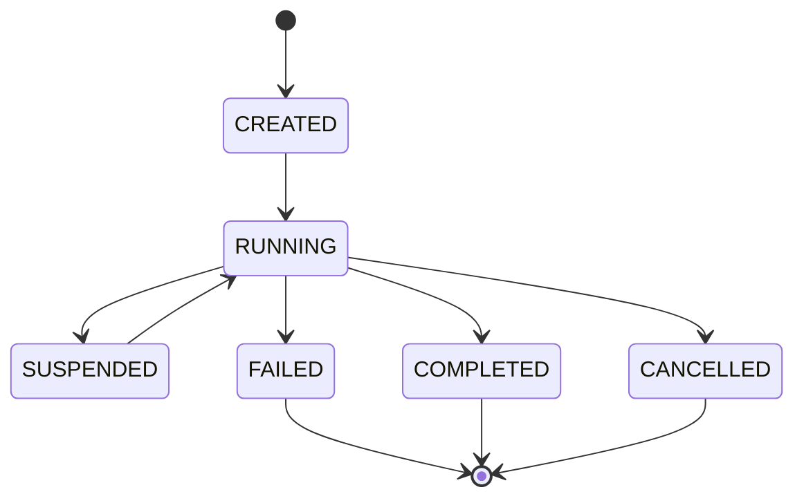

## 26.4 Gamelan Adapter Operations

```text
createRun()
startRun()
suspendRun()
resumeRun()
cancelRun()
signalRun()
getRunHistory()
getRunStatus()
listRuns()
```

Some operations, notably listing runs, are represented as stubs in the supplied adapter and therefore should be treated as incomplete integration rather than guaranteed production behavior.

## 26.5 Agent + Workflow Composition

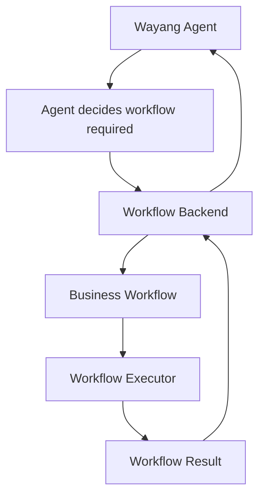

## 26.6 Coordination Workflow Registry

The `GamelanCoordinationWorkflowRegistry` compiles a `CoordinationPlan` into a native Gamelan `WorkflowDefinition`, using SHA-256 fingerprinting for deduplication:

```java
CoordinationPlan plan = strategy.plan(request);
CoordinationWorkflowDefinition compiled = compiler.compile(plan);
String definitionId = registry.getOrCreate(compiled, "acme").await().indefinitely();
```

The registry reuses existing definitions when the fingerprint matches, avoiding duplicate deployments.

## 26.7 Wayang Agent Node Executor

`WayangAgentNodeExecutor` lets Gamelan invoke Wayang agents as workflow steps:

```json
{
  "agentId": "code-reviewer",
  "parameters": {
    "content": "${workflow.prDiff}"
  }
}
```

Gamelan calls `WayangAgentNodeExecutor.execute(task)`. The executor resolves bindings, builds `AgentRequest`, invokes runtime.

## 26.8 Workflow Capabilities

```java
WorkflowCapabilities caps = backend.capabilities();
// caps.supportsSuspension()
// caps.supportsSignals()
// caps.supportsHistory()
// caps.supportsVersioning()
// caps.maxConcurrentRuns()
// caps.supportedTransports()
```

## 26.9 Comparing the Two Workflow Engines

| Aspect | State-Machine Graph | Workflow Definition |
|--------|---------------------|---------------------|
| **Model** | Nodes + edges + reducers | Steps + transitions |
| **State** | `GraphState` (Map + reducers) | Context map |
| **Branching** | `ConditionalEdge` | Condition strings |
| **Persistence** | `CheckpointStrategy` | `WorkflowEngine` |
| **HITL** | Native via exception | Via step retry |
| **Best for** | LLM-driven, dynamic flows | Business process, deterministic |

---

# Chapter 27 — A2A & Distributed Agents

## 27.1 A2A Boundary

Wayang supports exposing agents and consuming remote agents through A2A abstractions.

```text
A2AClient
A2AServer
A2AAgentRegistry
AgentCard
A2AMessage
A2ATask
```

## 27.2 A2A Server

A local Wayang agent can expose:

```java
AgentCard getAgentCard();
CompletionStage<A2ATask> sendMessage(A2AMessage message);
CompletionStage<A2ATask> getTask(String taskId);
CompletionStage<Void> cancelTask(String taskId);
```

## 27.3 A2A Client

A remote agent can be consumed through the same basic operations.

## 27.4 Agent Discovery

`A2AAgentRegistry` supports:

```text
discover(endpoint)
register(card)
find(agentId)
findByCapability(capability)
findBySkill(skill)
```

Discovery is capability/skill oriented.

## 27.5 A2A Execution Flow

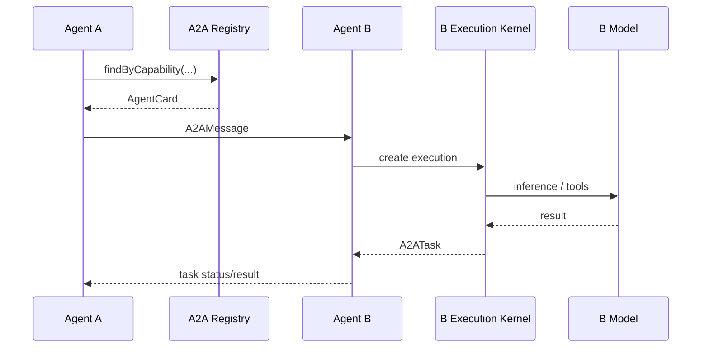

## 27.6 Agent Card Projection

The `A2AAgentCardMapper` projects a canonical `AgentDescriptor` into an A2A 1.0 `AgentCard`:

```java
A2AAgentCard card = A2AAgentCardMapper.fromWayang(descriptor, "https://example.com");
```

```mermaid
graph LR
    CANON[AgentDescriptor<br/>canonical] --> MAP[A2AAgentCardMapper]
    MAP --> CARD[A2AAgentCard<br/>protocol-specific]
    CARD --> SERVED[Served at<br/>/.well-known/agent-card.json]

    CANON --> CAP[AgentCapability]
    CAP --> SKILL[A2ASkill]
    CANON --> EP[AgentEndpointDescriptor]
    EP --> IFACE[A2AInterface]
```

## 27.7 Durable A2A Tasks

The framework contains `DurableA2ATask`. The durable record adds:

- `callerExecutionId`
- `checkpointId`
- `lastEventSeq`
- `remoteEndpoint`
- `createdAt`
- `completedAt`
- `retryCount`

This ties a remote task to local execution state.

## 27.8 Durable Task Ledger

`DurableA2ATaskLedger` tracks tasks and remote-agent wait states.

Responsibilities:

- create tasks
- update state
- complete
- fail
- cancel
- retry
- update checkpoint
- update event sequence
- query pending tasks
- query tasks by caller execution
- resolve waiting executions

## 27.9 Remote Waiting State

`RemoteAgentWaitState` represents the local execution's waiting state while a remote A2A operation is in progress.

It can resolve through:

```text
remote completion
remote failure
remote cancellation
timeout
explicit cancellation
```

## 27.10 Durable A2A Flow

```mermaid
sequenceDiagram
    participant A as Agent A
    participant K as Execution Kernel
    participant L as Durable Task Ledger
    participant B as Agent B
    participant W as Remote Wait State
    participant J as Journal/Store

    A->>K: invoke remote agent
    K->>J: checkpoint
    K->>L: create durable task
    L-->>K: taskId
    K->>B: A2A message
    K->>W: create wait state

    B-->>L: RUNNING
    B-->>L: COMPLETED
    L->>W: resolve
    W-->>K: remote result
    K->>J: resume/continue
    K-->>A: final result
```

## 27.11 Distributed Event Relay

`DistributedEventRelay` provides an in-process relay abstraction. It can:

- publish control events
- receive remote status updates
- update the durable task ledger
- update checkpoint information
- notify subscribers

The source explicitly notes that true distributed observability can replace the in-process relay with a pub/sub backend such as Kafka or Redis Streams while preserving the interface concept.

## 27.12 ANP (Agent Network Protocol)

ANP 1.1 uses **DID:WBA** (Web-Based Agent) identities and HTTP signatures. Disabled by default (`AnpProtocolConfig.disabled()`).

```mermaid
graph TB
    DID[DID:WBA Identity] --> DOC[DID Document]
    DID --> DESC[Agent Description<br/>/.well-known/agent.json]
    KEY[AnpIdentityKeyPair] --> AUTH[AnpAuthenticator]
    AUTH --> SIG[AnpHttpSignature]
    SIG --> HTTP[HTTP Request]

    META[AnpMetaProtocolNeg