Got it — thanks for clarifying. You're writing **complete Wayang documentation in Markdown**, and Chapter 27 is **"A2A & Distributed Agents."** The previous assistant response generated chapters 1–26 and then appears to have been cut off right at the start of Chapter 27 (or possibly within it, since the file dump you pasted ends mid-file in `DefaultKnowledgeEvidenceFusionScorer.java` — unrelated to the doc, just a truncation of the file listing).

Let me continue from **Chapter 27** onward, using the same style: Markdown with Mermaid diagrams, feature walkthroughs, tutorials, and use cases — all grounded in the actual Java classes from your two file dumps.

---

# Chapter 27 — A2A & Distributed Agents

> **Scope:** How Wayang agents talk to other agents — locally, remotely, and across federated runtime boundaries. Covers the A2A protocol adapter, ANP identity layer, the Agent Network abstraction, durable task execution, and the distributed coordination primitives built on top of them.

## 27.1 Why A2A Exists in Wayang

Wayang is not just a single-agent runtime. A Wayang runtime can **expose** an agent to the outside world, **consume** another agent, and **coordinate** many agents across machines. Three modules make this possible:

| Module | Role | Protocol |
|---|---|---|
| `wayang-a2a` | A2A 1.0 server/client adapter, durable task ledger, workflow bridge | A2A (JSON-RPC / SSE) |
| `wayang-anp` | Agent Network Protocol (DID:WBA identity, signed requests, meta-protocol negotiation) | ANP 1.1 |
| `wayang-agent-network-api` / `-core` | Protocol-neutral abstraction for discovering, routing, and invoking remote agents | Any |

The **A2A** module is the most developed and is the one we'll focus on first.

## 27.2 A2A Layer Cake

```
┌────────────────────────────────────────────────────────────┐
│  Remote A2A Peer (another framework, another Wayang node)  │
└────────────────────────────────────────────────────────────┘
                       │  JSON-RPC over HTTP / SSE
                       ▼
┌────────────────────────────────────────────────────────────┐
│  A2AAgentAdapter / DurableA2AAgentAdapter   ← server side  │
│  A2AClientTool                                ← client side │
├────────────────────────────────────────────────────────────┤
│  A2AMessageMapper — protocol ⇄ Wayang semantic mapping     │
├────────────────────────────────────────────────────────────┤
│  DurableA2ATaskLedger + RemoteAgentWaitState + Journal     │
├────────────────────────────────────────────────────────────┤
│  WayangRuntime.executeAsync(...)                            │
└────────────────────────────────────────────────────────────┘
```

## 27.3 The A2A Server Contract

Two interfaces define the server surface:

- `A2AServer` (`wayang-a2a/api/A2AServer.java`) — `getAgentCard`, `sendMessage`, `getTask`, `cancelTask`.
- `A2AClient` (`wayang-a2a/api/A2AClient.java`) — the mirror image for outbound calls.

Both are **async by default** (`CompletionStage`) — the A2A protocol allows long-running tasks, so the API never blocks.

```java
public interface A2AServer {
    AgentCard getAgentCard();
    CompletionStage<A2ATask> sendMessage(A2AMessage message);
    CompletionStage<A2ATask> getTask(String taskId);
    CompletionStage<Void> cancelTask(String taskId);
}
```

## 27.4 Two Server Implementations

### 27.4.1 `A2AAgentAdapter` — the volatile one

`A2AAgentAdapter` (`wayang-a2a/adapter/A2AAgentAdapter.java`) is the simplest adapter:

- Wraps a `WayangRuntime` + `AgentDefinition` + optional `ExecutionJournal`.
- `sendMessage` → maps `A2AMessage` → `AgentRequest` → fires `runtime.executeAsync(...)`.
- Keeps a `ConcurrentHashMap<String, CompletableFuture<AgentResponse>> activeExecutions`.
- `getTask` returns `RUNNING` until the future completes.
- `cancelTask` calls `future.cancel(true)`.

**Problem:** if the JVM restarts, `activeExecutions` is empty. That's why there's a durable variant.

### 27.4.2 `DurableA2AAgentAdapter` — the resilient one

`DurableA2AAgentAdapter` (`wayang-a2a/durable/`) replaces the in-memory map with a `DurableA2ATaskLedger`:

- Each task is stored durably and survives restart when the ledger is backed by a persistent store.
- `sendMessage` returns **immediately** with a `PENDING`/`RUNNING` task; execution continues async.
- On completion/failure, the ledger updates the task, which **fires any parked `RemoteAgentWaitState`**.
- `getTask` reads straight from the ledger — no map.
- `cancelTask` transitions the task to `CANCELLED` and fires the wait state.

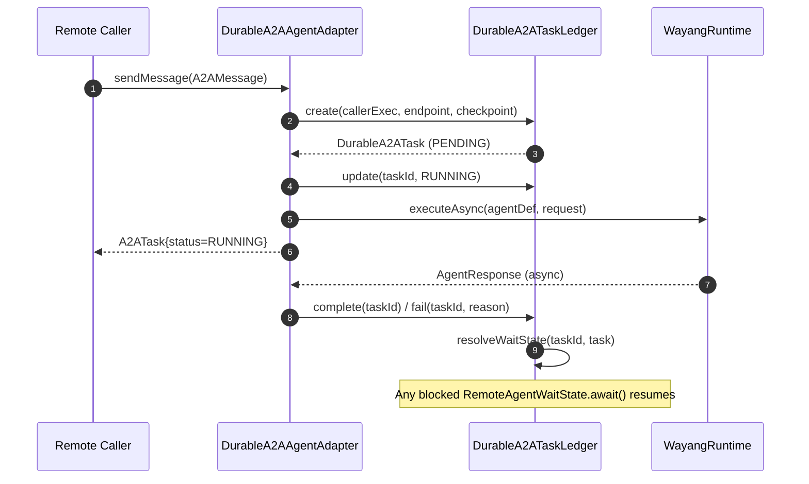

## 27.5 The Durable Task Ledger

`DurableA2ATaskLedger` (`wayang-a2a/durable/DurableA2ATaskLedger.java`) is the heart of durable A2A:

- `create(callerExecutionId, remoteEndpoint, checkpointId)` → new `DurableA2ATask`.
- `createWaitState(taskId, timeout)` → parks the calling thread on a `RemoteAgentWaitState`.
- `update / complete / fail / cancel` → transition states, fire the wait state on terminal transitions.
- `retry(taskId)` → increments retry counter and resets to `PENDING`.
- `updateCheckpoint`, `updateEventSeq` → support resume-after-restart.
- `byCallerExecution(id)` → used by `A2AWorkflowBridge.cancelAllForWorkflow`.

`DurableA2ATask` is an immutable record that mirrors `A2ATask` plus:

| Durable field | Purpose |
|---|---|
| `callerExecutionId` | Local execution that initiated the call |
| `checkpointId` | Resume anchor saved before the call |
| `lastEventSeq` | Distributed observability cursor |
| `remoteEndpoint` | URI for retry/resume |
| `createdAt` / `completedAt` | Wall-clock timestamps |
| `retryCount` | Auto-retry bookkeeping |

Builder-style `with*` methods (`withStatus`, `withCheckpointId`, `withArtifacts`, `incrementRetry`) keep the record immutable.

## 27.6 Remote-Agent Waiting State

`RemoteAgentWaitState` (`wayang-a2a/durable/RemoteAgentWaitState.java`) is the "park the thread" primitive:

```java
public DurableA2ATask await() throws TimeoutException, InterruptedException {
    return resultFuture.get(timeout.toMillis(), TimeUnit.MILLISECONDS);
}
```

Three resolution triggers:

1. `complete(task)` — remote succeeded.
2. `fail(task, reason)` — remote failed.
3. `cancel()` — caller cancelled.

Plus an optional non-blocking `onResolved(Consumer<DurableA2ATask>)` callback (fired immediately if already resolved).

This is what makes the durable adapter usable from **synchronous** workflow code — you call `await()` and the kernel blocks until the remote agent answers, without polling.

## 27.7 Mapping Between A2A and Wayang

`A2AMessageMapper` (`wayang-a2a/adapter/A2AMessageMapper.java`) is the **only** place where A2A model ↔ Wayang model conversion happens:

```
A2AMessage  ──►  AgentRequest
A2ATask     ◄──  AgentResponse   (completed / failed / in-progress)
A2APart.Text ──► plain text content
```

Rule of thumb: **A2A concepts never leak upstream into `AgentRequest`/`AgentResponse`.** The mapper is a one-way valve.

Similarly, `A2AAgentCardMapper` (`wayang-a2a/descriptor/A2AAgentCardMapper.java`) projects the canonical `AgentDescriptor` into an A2A 1.0 `AgentCard` — but only in that direction.

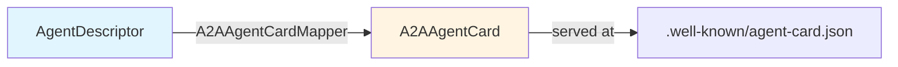

## 27.8 The A2A Client Tool

`A2AClientTool` (`wayang-a2a/tool/A2AClientTool.java`) exposes an outbound A2A call as a **Wayang `Tool`**. That means an agent can decide to call another agent just like it decides to call any other tool:

- Tool name: `SendMessageToAgent`
- Input schema: `{ "message": string }`
- Returns: `{ taskId, status }`

This is the key ergonomic win: **remote agents are just tools from the LLM's point of view.**

## 27.9 Durable Streaming — Distributed Event Relay

`DistributedEventRelay` (`wayang-a2a/distributed/DistributedEventRelay.java`) is the local switchboard for cross-agent observability:

- Subscribers register via `subscribe(Consumer<RelayEvent>)`.
- Transport layer calls `onRemoteStatusUpdate(taskId, status, payload)` when the remote sends status.
- Relay updates the ledger and notifies subscribers.
- `publish(target, taskId, eventType, payload)` sends control events outbound.
- `publishCancel(target, taskId)` is the convenience for caller-initiated cancel.
- In-memory bounded event log (`MAX_LOG = 1000`), `recentEvents()` for introspection.

`RelayEvent` is an immutable envelope:

```
relayId, sourceAgentId, targetAgentId, taskId, eventType, payload, timestamp
```

For true multi-node deployments, this class is documented as **replaceable with Kafka / Redis Streams** by implementing the same interface.

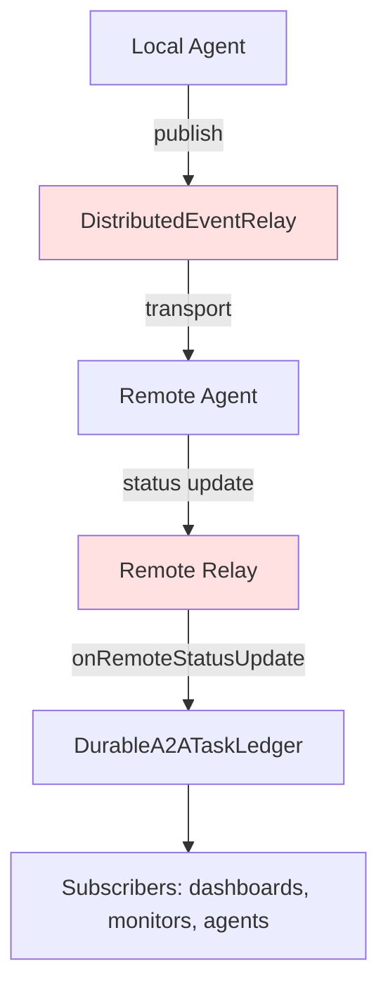

## 27.10 The A2A Workflow Bridge

`A2AWorkflowBridge` (`wayang-a2a/workflow/A2AWorkflowBridge.java`) connects **workflow lifecycle** to **A2A task semantics** without compiling against `wayang-workflow`:

- Uses a functional `WorkflowLifecycle` interface (`pause`, `resume`, `cancel`) — no compile-time dependency.
- `executeStep(workflowExecutionId, remoteEndpoint, stepInput, timeout)`:
  1. Create durable task.
  2. **Pause the workflow.**
  3. Park on `RemoteAgentWaitState.await()`.
  4. **Resume or cancel** based on outcome.
- `cancelAllForWorkflow(id)` cascades cancellation to every pending A2A task belonging to that workflow.

The key trick: workflows can **suspend durably** while a remote agent works, then resume automatically when the remote answers — this is the foundation of long-running, human-in-the-loop, cross-agent workflows.

## 27.11 Agent Network Protocol (ANP)

ANP (`wayang-anp`) is Wayang's **identity + federation** layer. Where A2A is about the task protocol, ANP is about:

- **Who** the remote agent is (`DID:WBA`).
- **Proof** the request came from whom it claims (`AnpAuthenticator`, `AnpAuthVerifier`).
- **What** protocols/codecs the peer supports (`AnpMetaProtocolNegotiator`).

### 27.11.1 DID:WBA Identity

`DidWbaIdentity` (`wayang-anp/identity/DidWbaIdentity.java`) parses the format:

```
did:wba:<host>[:<port>][:<path-segment>...]
```

Examples:
- `did:wba:example.com`
- `did:wba:example.com:agent1`
- `did:wba:agents.kayys.tech:finance:advisor`

It exposes `toDidDocumentUrl()` (for `/.well-known/did.json`) and `toAgentDescriptionUrl()` (for `/.well-known/agent.json`).

### 27.11.2 Signed HTTP Requests

`AnpAuthenticator.sign(method, path, host, keyPair)` produces an `AnpHttpSignature` over the canonical string:

```
(request-target): post /message
host: example.com
```

`AnpAuthVerifier.verify(...)` checks the signature against the remote's registered public key. The `AnpKeyStore` SPI supports:

- In-memory (dev/test)
- PKCS#12 / JKS keystore
- HashiCorp Vault / Cloud KMS / HSM (production)

### 27.11.3 Meta-Protocol Negotiation

`AnpMetaProtocolNegotiator` picks the best common protocol between two peers, prioritizing `a2a/1.0` for cross-framework interop and falling back to `anp/1.1` native format. `AnpCapabilityAdvertisement.defaultWayang(...)` advertises `["a2a/1.0", "anp/1.1"]` by default.

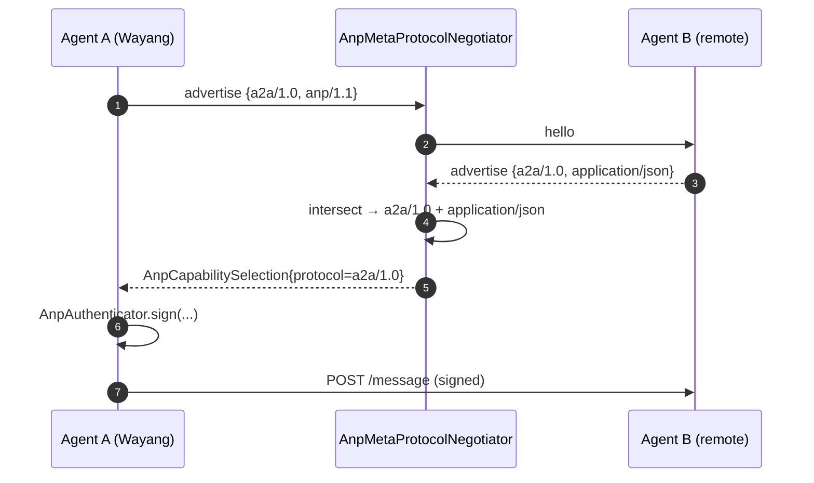

### 27.11.4 Security Mapping

`AnpSecurityMapper` converts `DidWbaIdentity` + `AnpHttpSignature` + optional delegation into a `SecurityContextSnapshot` — the protocol-neutral security type used everywhere else in Wayang. So ANP inbound requests flow into the same authorization path as local ones.

## 27.12 The Agent Network Abstraction

`wayang-agent-network-api` provides a **protocol-neutral** layer above A2A/ANP:

| Interface | Purpose |
|---|---|
| `AgentNetwork` | Top-level: `invoke(AgentNetworkRequest)` and `submit(...)` |
| `AgentNetworkClient` / `AgentNetworkProtocol` | Protocol SPI |
| `AgentDiscovery` / `DiscoveryQuery` / `DiscoveryResult` | Find agents |
| `CapabilityNegotiator` / `CapabilityMatch` / `CapabilityRequirement` | Match capabilities |
| `AgentTrustService` / `TrustDecision` / `TrustRequest` | Trust gate |
| `AgentEndpointResolver` / `ResolvedEndpoint` | Resolve URI |

`DefaultAgentNetwork` (`wayang-agent-network-core/DefaultAgentNetwork.java`) implements the routing pipeline:

1. **Resolve endpoint** (`endpointResolver.resolve(targetAgent)`).
2. **Evaluate trust** (`trustService.evaluate(...)`) — fails on `TrustException`.
3. **Negotiate capabilities** (`capabilityNegotiator.negotiate(...)`) — fails on `NO_MATCH`.
4. **Select protocol** from `protocolRegistry.find(endpoint.protocol())`.
5. **Dispatch** through `protocol.client().invoke(request)`.

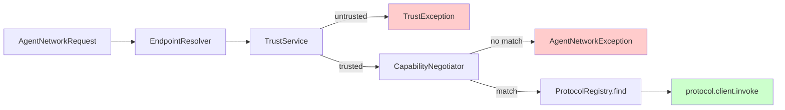

The **Local** protocol (`wayang-protocol-local`) is the in-process fast path:

- `LocalProtocol` registers in the `ProtocolRegistry` as `IN_PROCESS`.
- `LocalAgentRegistry` maps agentId → `LocalAgentHandler`.
- `LocalProtocolClient.send` just looks up the handler and calls it — no serialization.
- `LocalAgentTask` gives you the same `AgentTask` shape as remote calls.

This means **local and remote agent calls share one API surface** — you can develop against `LocalAgentNetworkClient` and switch to A2A in production by changing the registry.

## 27.13 Capability-Aware Knowledge Exchange (Advanced)

The `wayang-knowledge-runtime` module builds a **secure, capability-negotiated, framed** protocol for exchanging evidence artifacts and verified answers between runtimes. This is the most advanced distributed layer in Wayang and is worth a brief tour:

- **`KnowledgeEvidenceExchangeCapabilityManifest`** — a runtime's signed advertisement of what it supports.
- **`KnowledgeEvidenceExchangeCapabilityNegotiator`** — intersects local + remote manifests to a `NegotiatedSession`.
- **`KnowledgeEvidenceExchangeNegotiatedSessionValidator`** — enforces capability requirements per operation.
- **`KnowledgeEvidenceExchangeFrameCodec`** / `Binary...` — binary framing (`MAGIC = 0x57415947` = `"WAYG"`).
- **`KnowledgeEvidenceExchangeChunkAssembler`** — reassembles chunks with offset verification.
- **`KnowledgeEvidenceExchangeResumeService`** — resumable transfers via `ResumeToken`.
- **`KnowledgeEvidenceExchangeRuntimeIdentityRegistry`** — `ACTIVE`/`SUSPENDED`/`REVOKED` identity lifecycle.
- **`KnowledgeEvidenceExchangeRuntimeMutualTrustService`** — handshake producing a mutually-trusted session.
- **`KnowledgeEvidenceExchangeMultiplexer`** — multiple logical streams over one session.
- **`KnowledgeEvidenceExchangeBackpressurePolicy`** — bounded buffering with reject-or-block.

The key invariant is **mTLS-style: even after negotiation, every operation is re-checked against the negotiated session** — no capability is silently enabled.

## 27.14 Tutorial: Expose a Wayang Agent over A2A

**Goal:** Serve a local Wayang agent at `https://myhost/.well-known/agent-card.json` and accept A2A task requests.

```java
// 1. Build the agent definition
AgentDefinition def = AgentDefinition.builder()
    .metadata(Metadata.builder()
        .name("research-agent")
        .description("Reads papers and answers questions")
        .now().build())
    .goal("Answer research questions with citations.")
    .build();

// 2. Create a durable ledger backed by your store
DurableA2ATaskLedger ledger = new DurableA2ATaskLedger(/* persistent store */);

// 3. Wrap it as an A2A server
A2AServer server = new DurableA2AAgentAdapter(
    wayangRuntime,
    def,
    ledger,
    "https://myhost/agents/research"
);

// 4. Serve the card
A2AAgentCard card = server.getAgentCard();
// → GET /.well-known/agent-card.json returns card

// 5. The HTTP layer for JSON-RPC:
//    - message/send      → server.sendMessage(message)
//    - tasks/get         → server.getTask(taskId)
//    - tasks/cancel      → server.cancelTask(taskId)
```

**Test it:**

```bash
curl https://myhost/.well-known/agent-card.json
# → A2AAgentCard JSON

curl -X POST https://myhost/a2a \
  -H 'Content-Type: application/json' \
  -d '{"jsonrpc":"2.0","id":"1","method":"message/send",
       "params":{"message":{"role":"user",
                            "content":[{"text":"Summarize arXiv:2404.00001"}]}}}'
# → {"taskId":"...","status":"RUNNING"}
```

## 27.15 Tutorial: Call a Remote Agent from Wayang

**Goal:** An agent uses another agent as a tool.

```java
// 1. Build an A2A client bound to the remote runtime
A2AClient client = new HttpA2AClient("https://remotehost/a2a");

// 2. Wrap it as a Wayang Tool
Tool remoteAgent = new A2AClientTool(client, "research-agent");

// 3. Register it on the calling agent
callingAgent.setTools(List.of(remoteAgent));

// 4. The LLM sees a tool called "SendMessageToAgent"
//    It can now decide to invoke the remote agent mid-reasoning.
```

Behind the scenes: `A2AClientTool.execute` → `client.sendMessage` → poll `getTask` until terminal → `SimpleToolResult.success({taskId, status})`.

## 27.16 Tutorial: Long-Running Cross-Agent Workflow

**Goal:** A workflow pauses while a remote agent researches, then resumes.

```java
A2AWorkflowBridge bridge = new A2AWorkflowBridge(ledger, new WorkflowLifecycle() {
    public void pause(String id)  { myEngine.pause(id); }
    public void resume(String id) { myEngine.resume(id); }
    public void cancel(String id) { myEngine.cancel(id); }
});

DurableA2ATask result = bridge.executeStep(
    "wf-123",
    "https://remotehost/a2a",
    "Find all papers citing X",
    Duration.ofMinutes(30)
);

// bridge internally:
//   1. ledger.create("wf-123", remote, null)
//   2. myEngine.pause("wf-123")
//   3. ledger.createWaitState(taskId, 30m)
//   4. RemoteAgentWaitState.await()   ← blocks here
//   5. on COMPLETED → myEngine.resume("wf-123")
//      on FAILED    → myEngine.cancel("wf-123")
```

The magic is that the workflow engine **does not know A2A exists** — it only sees `pause`/`resume`/`cancel` callbacks.

## 27.17 Use Cases

### Use Case A — Federated Research

Two Wayang runtimes each hold different knowledge bases. Both expose `DurableA2AAgentAdapter`. A coordinating agent calls both via `A2AClientTool`, then fuses answers. `DistributedEventRelay` streams status to a monitoring dashboard.

### Use Case B — Human-in-the-Loop Across Nodes

A workflow step needs human approval. It pauses via `A2AWorkflowBridge`. The HITL task is created on a remote node; when the human approves, the remote node's `DurableA2ATaskLedger.complete()` fires a status update, which the local `DistributedEventRelay.onRemoteStatusUpdate` receives and forwards to the parked `RemoteAgentWaitState`, which resumes the local workflow.

### Use Case C — Cross-Organisation Agent Federation

Two companies want their agents to collaborate without sharing internal prompts. ANP provides DID:WBA identity + signed requests. The meta-protocol negotiator picks `a2a/1.0` so the cross-framework handshake works. Each side only sees the other's `AgentCard` — not its internals.

### Use Case D — Capability-Gated Knowledge Exchange

Runtime A holds verified answers; runtime B needs them. B sends a capability manifest. A intersects it with its own, requires `INTEGRITY_VERIFICATION` + `MERKLE_PROOF` as mandatory, and produces a `NegotiatedSession`. B then uses `KnowledgeEvidenceExchangeFrameCodec` to fetch a chunked artifact with a `ResumeToken` so the transfer survives a network blip.

## 27.18 Failure Modes & How Wayang Handles Them

| Failure | Mechanism | Recovery |
|---|---|---|
| Remote agent slow | `RemoteAgentWaitState` with timeout | `TimeoutException` → workflow `cancel` |
| JVM restart mid-task | `DurableA2ATaskLedger` persists task | `getTask` reads from ledger; `resume` from `checkpointId` |
| Network drop mid-chunk | `ResumeToken` + offset verification | `ResumeService.resolve(token)` restarts from last offset |
| Revoked peer | `RuntimeIdentityRegistry` status = `REVOKED` | Handshake fails; `KEY_REVOKED` diagnostic |
| Capability mismatch | `CapabilityNegotiator` intersection | `REQUIRED_CAPABILITY_MISSING` status |
| Tenant crossing | `TenantIsolationPolicy` / `ScopeIsolationPolicy` | `Deny` with policy id; never silently allows |
| Replay attack | `ReplayGuard` + nonce + binding fingerprint | `REPLAYED` status, rejected |

## 27.19 Chapter Summary

- A2A in Wayang has **two adapters**: volatile (`A2AAgentAdapter`) and durable (`DurableA2AAgentAdapter`).
- Durability comes from `DurableA2ATaskLedger` + `RemoteAgentWaitState` + resume anchors.
- The **A2A↔Wayang mapping is one-way** and lives only in `A2AMessageMapper` / `A2AAgentCardMapper`.
- `A2AClientTool` makes remote agents **indistinguishable from local tools** to the LLM.
- `A2AWorkflowBridge` connects workflows to A2A **without a compile-time dependency** — via `WorkflowLifecycle` callbacks.
- ANP adds **DID:WBA identity, signed HTTP, meta-protocol negotiation** on top of the task protocol.
- `AgentNetwork` (api + core) is the **protocol-neutral abstraction**; the Local protocol is the in-process fast path.
- The knowledge-exchange layer (`wayang-knowledge-runtime`) generalises this to **capability-negotiated, framed, resumable, mutually-trusted** artifact exchange — the future of cross-runtime federation.
- Everything is **async, durable, observable, and tenant-isolated** by construction.

---

# Chapter 28 — Observability, Telemetry & Health

> **Scope:** How Wayang tells you what it's doing — structured logs, metrics, traces, health checks, audit, and the `ExecutionEvent`/`ExecutionMetrics` event ledger inside the kernel.

## 28.1 The Three Pillars, the Wayang Way

```
┌────────────┬──────────────────────────────────────────────┐
│  Traces    │ TracingService (OpenTelemetry)               │
├────────────┼──────────────────────────────────────────────┤
│  Metrics   │ Metrics, MetricType, CircuitBreakerMetrics   │
├────────────┼──────────────────────────────────────────────┤
│  Logs      │ LogEvent, LogLevel, Slf4jAuditLogger         │
├────────────┼──────────────────────────────────────────────┤
│  Events    │ ExecutionEvent, ExecutionLedger, EventLedger │
├────────────┼──────────────────────────────────────────────┤
│  Health    │ HealthCheck, HealthRegistry, HealthResult    │
├────────────┼──────────────────────────────────────────────┤
│  Audit     │ AuditEvent, AuditService, ProvenanceStore    │
└────────────┴──────────────────────────────────────────────┘
```

## 28.2 Tracing — OpenTelemetry First

`TracingService` (`wayang-observability/tracing/TracingService.java`) is the SPI. `OpenTelemetryTracingService` (`wayang-observability/tracing/OpenTelemetryTracingService.java`) is the default implementation, built on the **global** `GlobalOpenTelemetry` so the SDK is configured externally (e.g. by the Quarkus OTel extension).

Key methods:

```java
Span startSpan(String name);
Span startSpan(String name, SpanKind kind);
Span startSpan(String name, Map<String, Object> attributes);
<T> T withSpan(String name, Callable<T> callable) throws Exception;
void withSpan(String name, Runnable runnable);
Context getCurrentContext();
void setCurrentContext(Context context);
void addAttribute(String key, Object value);
void recordException(Throwable error);
```

`TracingHelper` provides two convenience wrappers:

- `traceExecution(name, context, callable)` — attaches `execution.id` and `execution.graph` attributes.
- `traceAgentExecution(agentId, context, runnable)` — span name `agent.<id>`.

## 28.3 Metrics

The core metrics SPI is `Metrics` (`wayang-observability/telemetry/Metrics.java`):

```java
void counter(String name, long increment);
void gauge(String name, double value);
void histogram(String name, double value);
void timer(String name, long durationMs);
Map<String, MetricValue> snapshot();
```

`MetricType` (`COUNTER`, `GAUGE`, `HISTOGRAM`, `TIMER`) classifies each metric.

For circuit-breaker integration, `CircuitBreakerMetrics` exposes `state`, `failureCount`, `successCount`, `failureRate`, `timeSinceStateChange`, `estimatedRecoveryTimeMs`.

For **adapter routing**, `AdapterRoutingMetricsCollector` records per-`(router, provider, model, tenant, reason, mode)` counters on the `inference.routing.adapter.filtered` Micrometer meter.

## 28.4 Structured Logs & Audit

`LogEvent` (`wayang-observability/telemetry/LogEvent.java`) is the structured log record:

```
id, level, message, attributes, timestamp, throwable
```

`LogLevel` = `DEBUG | INFO | WARN | ERROR | FATAL`.

For compliance-grade auditing, `AuditLogger` (`wayang-observability/telemetry/audit/AuditLogger.java`) has a single method:

```java
void logToolExecution(String sessionId, String toolName,
                      Map<String, Object> arguments, String status,
                      String userContext);
```

`Slf4jAuditLogger` emits JSON to the `wayang.audit` logger and **masks sensitive keys** (`password`, `secret`, `token`, `key`, `authorization`, `credential`) by default. `setMaskingEnabled(boolean)` toggles this.

For persistence, `ProvenanceStore.store(AuditPayload)` writes audit events to MongoDB/PostgreSQL/etc. `DefaultProvenanceStore` is a no-op `@DefaultBean` so Wayang runs without a backing store.

## 28.5 The Execution Event Ledger

Inside the runtime kernel, `wayang-runtime-spi/execution/event/` defines the **durable append-only event ledger**:

- `ExecutionEventType` — 30+ canonical types grouped by lifecycle / context / model / tool / memory / checkpoint / A2A / cache.
- `ExecutionEvent` — immutable record `(eventId, executionId, sequence, timestamp, type, actor, payload, correlationId)`.
- `EventLedger` — SPI: `record`, `events`, `events(type)`, `metrics`, `purge`, `totalEventCount`.

Crucially, the ledger distinguishes:

| Concept | Question it answers |
|---|---|
| **Event** | What happened? |
| **Checkpoint** | Where can I resume? |
| **Cache** | What work can I reuse? |
| **Artifact** | What did execution produce? |

`ExecutionMetrics` is a mutable, thread-safe accumulator:

```java
metrics.markStarted();
metrics.recordModelCall();
metrics.recordTokens(input, output);
metrics.recordToolCall();
metrics.recordCacheHit() / recordCacheMiss();
metrics.recordRetry();
metrics.recordMemoryRetrieval();
metrics.recordCheckpoint();
metrics.recordError();
metrics.markCompleted();

metrics.latency();         // Duration
metrics.modelCalls();      // long
metrics.inputTokens();     // long
...
```

It answers "Why did this agent take 45 seconds?" / "Why did this execution cost so much?".

## 28.6 Health Checks

`HealthCheck` (`wayang-observability/health/HealthCheck.java`) → `HealthResult` (`HEALTHY | DEGRADED | UNHEALTHY | UNKNOWN`).

`HealthRegistry` aggregates them:

```java
void register(HealthCheck check);
Map<String, HealthResult> checkAll() throws Exception;
Map<String, HealthResult> checkAllWithTimeout(long timeoutMs);
boolean isHealthy();
boolean isReady();
```

Built-in checks: `DiskSpaceHealthCheck`, `MemoryHealthCheck`, `ConnectionHealthCheck`, `ExtensionHealthCheck`. `LivenessCheck` and `ReadinessCheck` are marker sub-interfaces.

## 28.7 Chapter Summary

- **Traces** are OpenTelemetry-native; `TracingHelper` is the ergonomic entry point.
- **Metrics** are Micrometer-friendly via `AdapterRoutingMetricsCollector` and the `Metrics` SPI.
- **Logs/Audit** are structured (`LogEvent`, `AuditEvent`) and PII-masking by default.
- **Events** are the durable, replayable ledger that underpins checkpointing, caching, and A2A observability.
- **Health** is pluggable and bounded by timeouts.
- All of it is **SPI-first**: swap in Prometheus, Grafana, Splunk, your own backend — Wayang doesn't care.

---

# Chapter 29 — Security, Identity & Multi-Tenancy

> **Scope:** The full Wayang security model — authentication, authorization, delegation, obligations, policy enforcement, tenant isolation, and how it interacts with A2A/ANP.

## 29.1 The Security Boundary in One Diagram

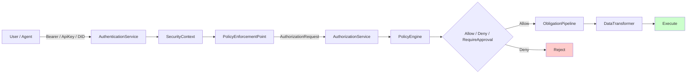

## 29.2 Authentication

`AuthenticationService.authenticate(AuthenticationRequest)` returns an `AuthenticationResult` (`success(context)` or `failure(code, msg)`).

`AuthenticationRequest` is scheme + credential + attributes. `AuthenticationRequest.bearer(token)` is the common case; ANP uses `"DID"` scheme.

## 29.3 The Principal & Identity Model

`IdentityType` = `USER | SERVICE | AGENT | SYSTEM | ANONYMOUS`.

`Principal` is immutable:

```java
record Principal(String id, String name, IdentityType type,
                 Map<String, Object> attributes) {
    static Principal anonymous();
    static Principal system();
    static Principal agent(String id, String name);
}
```

`Identity` (raw, from a JWT/DID/WBA) is separate from `Principal` (normalized) — **protocol details never leak into the runtime**.

## 29.4 Security Context

`SecurityContext` (`security/context/SecurityContext.java`) is the runtime-carrying structure:

```java
record SecurityContext(Principal principal,
                       TenantContext tenant,
                       Map<String, Object> attributes)
```

with `anonymous()` and `system()` factories. It's carried via a `SecurityContextCarrier` (thread-local, reactive, CDI-scoped) and scoped via `SecurityContextScope`:

```java
try (SecurityContextScope scope = SecurityContextScope.of(carrier, snapshot)) {
    // code runs with security context in scope
}
```

`SecurityContextSnapshot` is the **immutable, serializable** form used across boundaries (A2A, ANP, delegation).

## 29.5 Authorization

`AuthorizationService.authorize(AuthorizationRequest)` returns an `AuthorizationDecision` (`allowed`, `reason`, `obligations`).

`AuthorizationRequest` is expressed in **Wayang semantics** — `(securityContext, capability, action, resource, attributes)` — never in HTTP verbs or SQL. `AuthorizationRequest.execute(sc, capability)` is the common case.

## 29.6 The Policy Engine

`PolicyEngine.evaluate(AuthorizationRequest) → PolicyDecision`.

`PolicyDecision` (`security/policy/PolicyDecision.java`) carries:

- `effect`: `ALLOW | DENY`
- `policyId`, `reason`
- `obligations`: `List<Obligation>`
- `attributes`: `Map<String, Object>`

`PolicyRule` (glob matcher for `subject`, `capability`, `action`) supports `*` and `**` wildcards. `DefaultPolicyEngine` is **first-applicable** (rules sorted by priority desc, first match wins) and **defaults to DENY** if nothing matches.

```java
Policy allowReaders = Policy.of("readers", List.of(
    PolicyRule.allow("r1", "*", "knowledge.read")
));
DefaultPolicyEngine engine = new DefaultPolicyEngine(List.of(allowReaders));
```

## 29.7 Obligations — the "must-do" side of authorization

An `Obligation` is what *must happen* if the request is allowed:

```java
record Obligation(ObligationType type,
                  ObligationPhase phase,   // BEFORE / DURING / AFTER
                  Map<String, Object> parameters)
```

Standard obligations (`StandardObligations`): `AUDIT`, `HITL`, `SANDBOX`, `RATE_LIMIT`, `REDACT`, `MASK`, `REQUIRE_APPROVAL`, `REQUIRE_SCOPE`, `REQUIRE_MFA`.

`ObligationPipeline.execute(obligations, context)` runs them **sequentially, fail-closed** — the first failure halts execution and the first `stop()` returns `continueExecution=false`.

`ObligationRegistry.find(type)` maps obligation type → executor. Standard executors:

- `AuditObligationExecutor` → writes `AuditEvent` to an `AuditSink`.
- `RateLimitObligationExecutor` → uses a `RateLimiter` (`InMemoryRateLimiter` in dev).
- `TransformObligationExecutor` → marks `REDACT`/`MASK` as handled so the PEP applies the transformation.

## 29.8 The Policy Enforcement Point (PEP)

`DefaultPolicyEnforcementPoint.enforce(request)`:

1. Calls `authorizationService.authorize(...)`.
2. On `Deny` → returns `EnforcementResult.deny(reason)`.
3. Extracts obligations from `decision.obligations()`.
4. Runs `obligationPipeline.execute(...)`.
5. If pipeline says stop → `deny`.
6. Applies data transformations (`REDACT`/`MASK`) via `DataTransformer`.
7. Returns `EnforcementResult.allow(transformedData, attrs)`.

`DataTransformer` is the SPI; `DefaultDataTransformer` supports `REDACT`, `MASK`, `REPLACE`, `FILTER`, `PROJECT`, `ENCRYPT`, `TOKENIZE`.

## 29.9 Delegation — attenuated authority

Cross-agent calls need **child authority ⊆ parent authority**. `DelegationService.delegate(parent, request)` is the only supported way to derive a child:

- `DelegationAttenuator.attenuate(parent, requested)` intersects capability/action sets.
- `DelegationPolicy.mayDelegate(parent, request)` gates the request.
- Child lifetime **must not exceed parent lifetime** (`DefaultDelegationService` enforces this).
- `maxHops` is decremented on each hop (`DelegationConstraints.decrementHop()`).

`DelegationContext` records `(id, audience, constraints, issuedAt, expiresAt, parent)` — the audit trail of authority attenuation.

## 29.10 Propagation Across Boundaries

`SecurityContextPropagator.propagate(PropagationRequest)` returns a `PropagationResult` with an **attenuated** context + optional child `DelegationContext`.

`PropagationMode`:

- `PROPAGATE` — same context, use sparingly.
- `DELEGATE` — attenuated child (normal case).
- `ISOLATE` — no context propagated (untrusted sandbox).

`DefaultSecurityContextPropagator` decrements `maxHops` and adds `delegated_by` / `delegated_to` / `remaining_hops` attributes.

## 29.11 Multi-Tenancy

`TenantContext` (`security/tenant/TenantContext.java`):

```java
record TenantContext(String tenantId, Map<String, Object> attributes) {
    static TenantContext empty();          // system / anonymous
    static TenantContext of(String id);
    boolean hasTenant();
}
```

Tenant is enforced at **multiple layers**:

1. `PolicyRule.subjectPattern` can pin to a tenant.
2. `TenantIsolationPolicy` in the knowledge exchange layer rejects cross-tenant artifact access.
3. `ScopeIsolationPolicy` enforces workspace/project boundaries.
4. `KnowledgeVerifiedAnswerTenantIsolationPolicy` enforces it for verified answers.

Anywhere a tenant id is missing, **default to deny** — never silently allow.

## 29.12 Securing the Communicator

`SecuredAgentCommunicator` (`security/communication/SecuredAgentCommunicator.java`) is a decorator around `AgentCommunicator`:

```java
public CompletionStage<AgentResponse> send(AgentRequest req, ProtocolContext ctx) {
    return authorize(req, ctx).thenCompose(decision -> {
        if (!decision.allowed()) return failedFuture(new AuthorizationException(...));
        return delegate.send(req, ctx);
    });
}
```

- `send` is async auth.
- `submit` and `stream` are **sync** auth (throw on deny).

The `SecurityContext` is extracted from `ProtocolContext.attributes().get("wayang.security.context")`; if absent, `SecurityContext.anonymous()`.

This means **every protocol path** — A2A, ANP, Local, gRPC — shares the same authorization gate.

## 29.13 ANP Security (Recap)

- `DidWbaIdentity` is the principal source.
- `AnpAuthenticator.sign(...)` / `AnpAuthVerifier.verify(...)` provide HTTP signature auth.
- `AnpSecurityMapper.map(...)` builds a `SecurityContextSnapshot`.
- `AnpPrincipalResolver.resolve(did)` builds a `Principal` with `IdentityType.AGENT`.

## 29.14 Chapter Summary

- **Authentication** is pluggable per scheme; principals are normalized before the runtime sees them.
- **Authorization** is `PolicyEngine`-driven, first-applicable, deny-by-default.
- **Obligations** are the must-do side of authorization: audit, HITL, redact, rate-limit — pipelined and fail-closed.
- **Delegation** guarantees attenuation; **propagation** is the plumbing that carries it.
- **Multi-tenancy** is enforced everywhere — no silent cross-tenant leaks.
- **Every protocol path shares one gate** (`SecuredAgentCommunicator`), so security is uniform.

---

# Chapter 30 — Resilience & Failure Handling

> **Scope:** Rate limiting, circuit breakers, retries, timeouts, and how the execution kernel behaves under stress.

## 30.1 The Resilience Stack

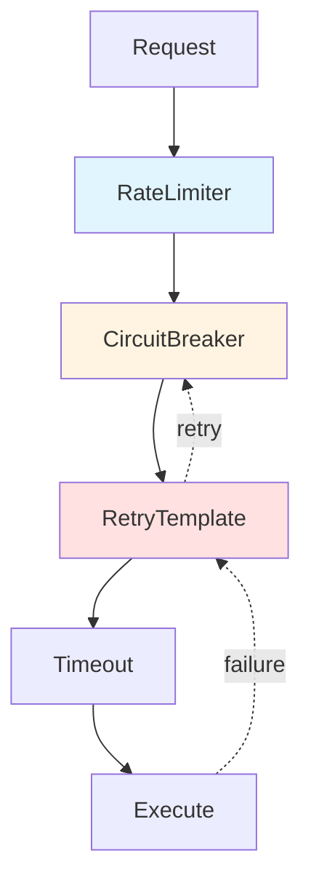

## 30.2 Rate Limiting

`RateLimiter` SPI:

```java
boolean tryAcquire();
boolean tryAcquire(int permits);
boolean tryAcquire(long timeoutMs);
boolean tryAcquire(int permits, long timeoutMs);
RateLimiterStats getStats();
void reset();
```

`TokenBucketRateLimiter` is the default: refills at `rate` tokens/sec up to `capacity`, `tryAcquire(permits)` fails immediately if insufficient, `tryAcquire(permits, timeoutMs)` blocks and polls.

`RateLimiterStats` reports `acquired`, `rejected`, `currentTokens`, `capacity`, `rate`.

There is also a parallel `wayang-security-core/obligation/ratelimit/RateLimiter` used by the security obligation pipeline (per-key permits).

## 30.3 Circuit Breaker

`CircuitBreaker` SPI:

```java
CircuitBreakerState state();     // CLOSED | OPEN | HALF_OPEN
<T> T execute(Callable<T> callable) throws Exception;
void recordSuccess();
void recordFailure();
void reset();
CircuitBreakerConfig config();
```

`DefaultCircuitBreaker` semantics:

- `CLOSED` → normal.
- `recordFailure()` counts; when `failureCount >= failureThreshold` → `OPEN`.
- In `OPEN`, `execute` throws `CircuitBreakerOpenException`.
- After `waitDurationMs`, transitions to `HALF_OPEN`.
- In `HALF_OPEN`, `successThreshold` successes → `CLOSED`; a single failure → `OPEN`.

`CircuitBreakerConfig.defaults()` = `(5, 3, 30000, 60000, 10)` = failureThreshold, successThreshold, timeoutMs, waitDurationMs, maxConcurrentRequests.

`CircuitBreakerRegistry.getOrCreate(name)` gives you a shared, named breaker.

## 30.4 Retry

`RetryPolicy` SPI:

```java
boolean shouldRetry(int attempt, Exception error);
long waitDurationMs(int attempt);
int maxAttempts();
```

Built-in policies:

- `DefaultRetryPolicy` — exponential backoff with `maxAttempts`, `initialDelayMs`, `maxDelayMs`, `backoffMultiplier`, `retryableExceptions`.
- `RetryPolicy.noRetry()`, `fixed(...)`, `exponential(...)`, `linear(...)` are the factory methods in the runtime SPI.

`Retry` (utility) and `RetryTemplate` (composable with a circuit breaker) run the loop:

```java
public <T> T execute(Callable<T> callable) throws Exception {
    int attempt = 0;
    while (true) {
        try {
            return circuitBreaker != null ? circuitBreaker.execute(callable) : callable.call();
        } catch (Exception e) {
            if (!policy.shouldRetry(attempt, e)) throw e;
            attempt++;
            Thread.sleep(policy.waitDurationMs(attempt));
        }
    }
}
```

## 30.5 Timeouts & Budgets

`ExecutionBudget` (`wayang-runtime-spi/execution/ExecutionBudget.java`) is the master limit record:

```
maxDuration, maxSteps, maxToolCalls,
maxInputTokens, maxOutputTokens, contextTokens,
maxRetries, maxConcurrentTools,
toolCacheEnabled, toolCacheTtl,
retrievalCacheEnabled, retrievalCacheTtl,
researchCacheEnabled, researchCacheTtl,
maxA2ARequests, maxResearchSources
```

Four presets:

| Preset | Duration | Steps | Tool calls | Cache |
|---|---|---|---|---|
| `fast()` | 2 min | 15 | 30 | tool+retrieval, 5m TTL |
| `balanced()` | 5 min | 25 | 50 | tool+retrieval, 30m TTL |
| `thorough()` | 20 min | 50 | 100 | all, 2–4h TTL |
| `debug()` | 5 min | 25 | 50 | all off |

## 30.6 Execution Cache (as a resilience tool)

`ExecutionCache` is a runtime-scoped cache keyed on `(namespace, tenantId, userId, inputHash)`:

- `CacheNamespace` = `TOOL | RETRIEVAL | CONTEXT | RESEARCH | MODEL`.
- `ExecutionCacheEntry` carries `executionId`, `toolId`, `provenance`, `createdAt`, `expiresAt`.
- `invalidateByExecution(id)`, `invalidateByNamespace(ns, tenant)`, `listByExecution(id)`.
- `hashInputs(Map)` / `hashString(String)` / `hashTool(toolName, args)` are deterministic.

The cache is **not** a correctness mechanism — it's a cost/latency one. Wrong cache = wrong answer, so `expiresAt` + invalidation hooks are essential.

## 30.7 Cache Namespaces in Practice

| Namespace | What's cached | Typical TTL |
|---|---|---|
| `TOOL` | Tool call result | minutes (matching toolCacheTtl) |
| `RETRIEVAL` | Vector/keyword search result | minutes |
| `CONTEXT` | Compiled prompt-context block | minutes |
| `RESEARCH` | Whole research task | hours (thorough) |
| `MODEL` | Model response for identical prompt+params | minutes |

## 30.8 Failure Modes Matrix

| Failure | Detected by | Recovered by |
|---|---|---|
| Remote service slow | `CircuitBreaker.execute` timeout | `RetryTemplate` |
| Repeated failures | `failureThreshold` | Circuit opens → fallback path |
| Transient tool error | `RetryPolicy.shouldRetry` | Exponential backoff |
| Budget exhausted | `ExecutionBudget` counters | Graceful stop with diagnostic event |
| Cache poisoning | `expiresAt` + `invalidateByExecution` | Fresh recompute |
| Distributed task lost | `DurableA2ATaskLedger` | Resume from `checkpointId` |
| Rate limit hit | `TokenBucketRateLimiter` | `tryAcquire(timeout)` backpressure |

## 30.9 Chapter Summary

- Resilience is **layered**: rate limit → circuit breaker → retry → timeout.
- Each layer has a small, composable SPI, and there's a `RetryTemplate` that composes them.
- `ExecutionBudget` is the master limit record and has 4 preset profiles.
- `ExecutionCache` is a runtime-scoped, namespace-segmented cache with provenance — used for cost/latency, not correctness.
- Failure modes are explicit and each has a named recovery mechanism.

---

# Chapter 31 — Tutorial: Build a Complete Wayang Application

> **Scope:** End-to-end walkthrough — define a custom tool, an agent, a workflow, security, observability, and deploy it.

## 31.1 What We're Building

A **"Repo Copilot"** — an agent that:

1. Scans a git repository.
2. Finds TODOs and code smells.
3. Proposes a plan to fix them.
4. Executes fixes with human approval.
5. Reports results as a structured artifact.

## 31.2 Project Layout

```
repo-copilot/
├── pom.xml
└── src/main/java/com/example/copilot/
    ├── tools/RepoScannerTool.java
    ├── tools/CodeGrepTool.java
    ├── agents/RepoCopilotAgent.java
    ├── workflow/RepoCopilotWorkflow.java
    ├── security/CopilotAuthorizer.java
    └── App.java
```

## 31.3 Step 1 — Define a Tool

```java
public final class RepoScannerTool implements Tool {
    private final Path root;

    public RepoScannerTool(Path root) { this.root = root; }

    @Override public ToolDescriptor descriptor() {
        return SimpleToolDescriptor.of(
            "repo_scanner",
            "Scan a repository for TODO/FIXME comments and code smells.",
            Map.of("type", "object",
                   "properties", Map.of(
                       "glob", Map.of("type", "string"),
                       "maxFiles", Map.of("type", "integer")
                   ))
        );
    }

    @Override
    public CompletableFuture<ToolResult> execute(ToolInvocation inv, ToolContext ctx) {
        String glob = (String) inv.arguments().getOrDefault("glob", "**/*.java");
        int max = (int) inv.arguments().getOrDefault("maxFiles", 500);
        // ... scan with Files.walk, collect matches ...
        return CompletableFuture.completedFuture(
            SimpleToolResult.success(Map.of("matches", matches))
        );
    }
}
```

## 31.4 Step 2 — Define an Agent

```java
public final class RepoCopilotAgent extends BaseReActAgent {
    public RepoCopilotAgent(Provider provider, Tool... tools) {
        this.provider = provider;
        this.modelId = "claude-sonnet-4";
        this.systemPrompt = """
            You are a senior Java engineer reviewing a repository.
            Use repo_scanner to find issues, then propose a plan.
            Ask for approval before applying any change.
            """;
        setTools(List.of(tools));
    }
}
```

## 31.5 Step 3 — Compose a Workflow

```java
public final class RepoCopilotWorkflow {
    public static void main(String[] args) throws Exception {
        var runtime = DefaultWayangRuntime.create();
        var provider = new AnthropicProvider(System.getenv("ANTHROPIC_API_KEY"));
        var tool = new RepoScannerTool(Paths.get("."));
        var agent = new RepoCopilotAgent(provider, tool);

        var def = AgentDefinition.builder()
            .metadata(Metadata.builder().name("repo-copilot").now().build())
            .goal("Review the repository and propose fixes.")
            .build();

        var request = AgentRequest.of("Find all TODOs and propose fixes.");

        // Execute with a runtime behavior profile
        var budget = ExecutionBudget.balanced();
        var execution = runtime.executeAsync(def, request);

        execution.thenAccept(response -> {
            System.out.println("=== Agent Response ===");
            System.out.println(response.content());
        }).join();
    }
}
```

## 31.6 Step 4 — Add Security

```java
public final class CopilotAuthorizer implements AuthorizationService {
    private final PolicyEngine engine;

    public CopilotAuthorizer(PolicyEngine engine) { this.engine = engine; }

    @Override
    public CompletionStage<AuthorizationDecision> authorize(AuthorizationRequest req) {
        PolicyDecision decision = engine.evaluate(req);
        Map<String, Object> obligations = Map.of("obligations", decision.obligations());
        return CompletableFuture.completedFuture(
            new AuthorizationDecision(decision.allowed(), decision.reason(), obligations)
        );
    }
}
```

Wire it into a `Policy`:

```java
Policy copilotPolicy = Policy.of("repo-copilot", List.of(
    PolicyRule.allow("read",   "*", "repo.read"),
    PolicyRule.allow("scan",   "*", "repo.scan"),
    new PolicyRule("edit", "*", "repo.write", "*",
        PolicyEffect.ALLOW, List.of(Obligation.before(StandardObligations.HITL)), 10)
));
```

## 31.7 Step 5 — Add Observability

```java
var tracer = new OpenTelemetryTracingService(config);
var metrics = new AdapterRoutingMetricsCollector(meterRegistry);

try (var scope = tracer.startSpan("repo-copilot.run")) {
    tracer.addAttribute("repo.path", root.toString());
    // ... run the agent ...
    scope.end();
}
```

Events are auto-emitted into the `EventLedger` — you can query them after:

```java
List<ExecutionEvent> events = ledger.events(executionId);
ExecutionMetrics m = ledger.metrics(executionId).orElseThrow();
System.out.println(m);
```

## 31.8 Step 6 — Expose over A2A

```java
var ledger = new DurableA2ATaskLedger(/* persistent */);
A2AServer server = new DurableA2AAgentAdapter(
    runtime, def, ledger, "https://myhost/agents/repo-copilot"
);

// Register with your HTTP framework:
//   GET  /.well-known/agent-card.json → server.getAgentCard()
//   POST /a2a                          → server.sendMessage(...)
//   POST /a2a/tasks/get                → server.getTask(taskId)
//   POST /a2a/tasks/cancel             → server.cancelTask(taskId)
```

## 31.9 Step 7 — Run It

```bash
export ANTHROPIC_API_KEY=sk-...
mvn -q exec:java -Dexec.mainClass=com.example.copilot.RepoCopilotWorkflow
```

Sample output:

```
=== Agent Response ===
I found 12 TODOs across 5 files:
  - UserService.java:42  // TODO: add retry
  - AuthFilter.java:88   // FIXME: null check
  ...

Proposed plan:
  1. Add retry with exponential backoff in UserService.
  2. Add null check in AuthFilter.
  ...

Awaiting approval to apply.
```

## 31.10 Chapter Summary

- A Wayang app is: **tools + agent + workflow + security + observability**.
- Each piece has a small SPI; you compose them.
- The same app can run locally, be exposed over A2A, or be invoked by other agents — without changing the app code.

---

# Chapter 32 — Use Cases & Reference Architectures

> **Scope:** Realistic deployment patterns, each with a Mermaid diagram and a summary of which Wayang modules are involved.

## 32.1 Use Case 1 — Local IDE Copilot

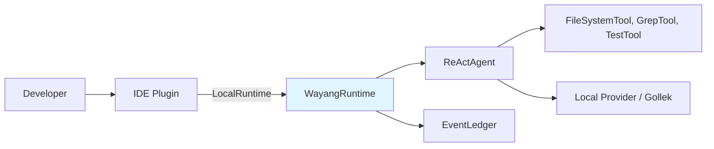

**Modules:** `wayang-agent`, `wayang-core`, `wayang-tool`, `wayang-context`, `wayang-provider`.

**Why Wayang:** Single-JVM, no server, tools run in-process, event ledger gives local audit.

## 32.2 Use Case 2 — Server-Hosted Agent Platform

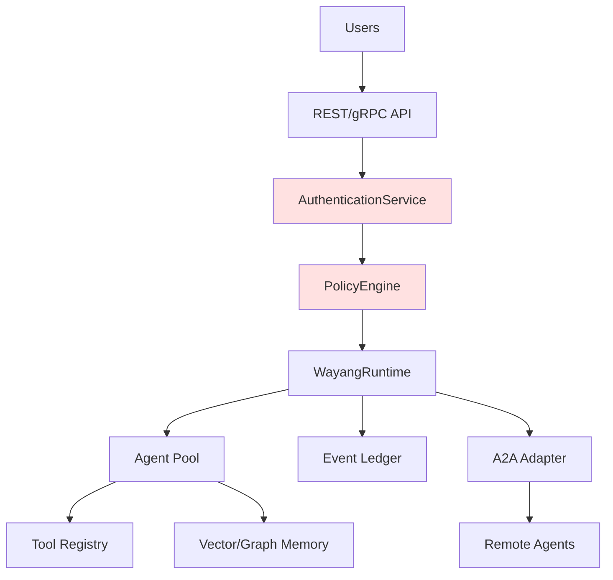

**Modules:** `wayang-a2a`, `wayang-security-core`, `wayang-observability`, `wayang-knowledge-runtime`, `wayang-guardrails-runtime`.

## 32.3 Use Case 3 — Federated Multi-Org Knowledge

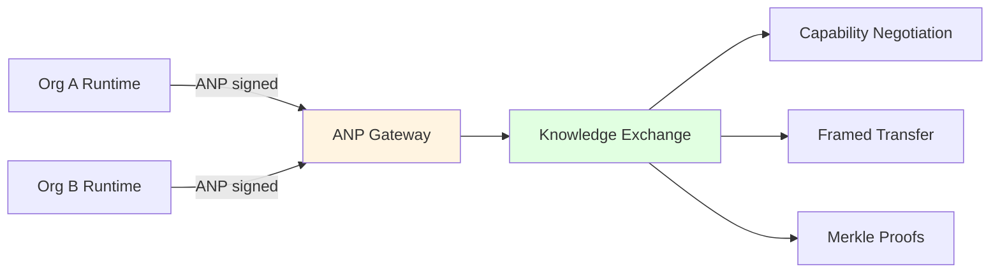

**Modules:** `wayang-anp`, `wayang-knowledge-runtime`, `wayang-a2a` (for task protocol), `wayang-security-core`.

**Key invariant:** org A never sees org B's prompts — only verified answers with provenance.

## 32.4 Use Case 4 — Regulated Workflow with HITL

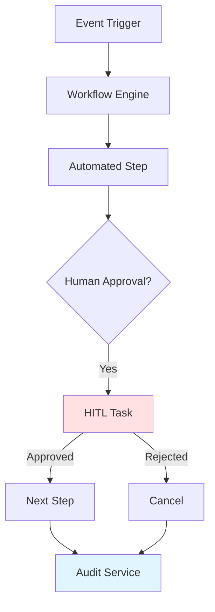

**Modules:** `wayang-hitl-runtime`, `wayang-a2a` (for durable tasks), `wayang-audit`, `wayang-governance`.

## 32.5 Use Case 5 — CI/CD Headless Runner

```bash
java -jar wayang-runner.jar --model gemini-flash --behavior FAST "Summarise README"
```

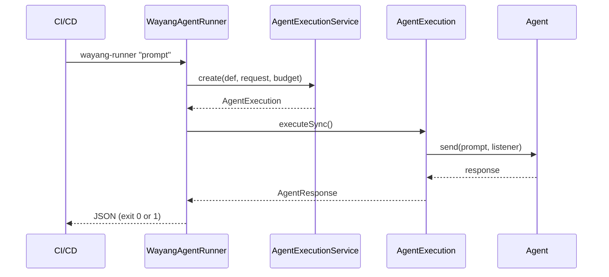

**Modules:** `wayang-agent-runner`, `wayang-runtime-spi`, `wayang-core`.

## 32.6 Use Case 6 — Knowledge-Grounded Chatbot

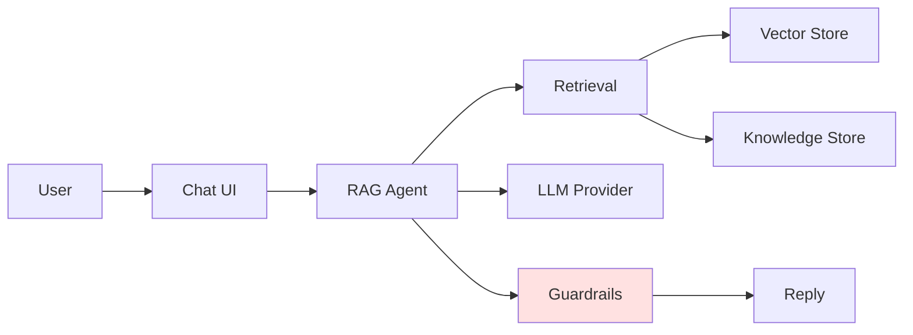

**Modules:** `wayang-rag`, `wayang-knowledge-runtime`, `wayang-guardrails-runtime`, `wayang-embedding`, `wayang-vector`.

## 32.7 Use Case 7 — Agent-as-a-Service Marketplace

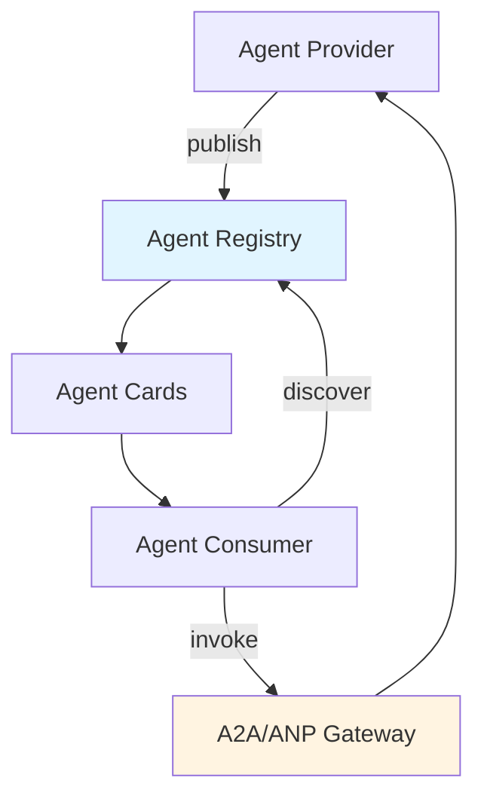

**Modules:** `wayang-a2a`, `wayang-anp`, `wayang-agent-network-core`, `wayang-registry`.

## 32.8 Use Case 8 — Multi-Agent Orchestration

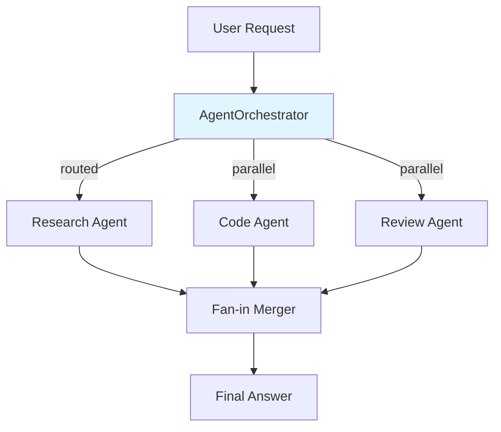

**Modules:** `wayang-agent/orchestration` (`AgentOrchestrator`), `wayang-agent/orchestration/graph` (`WorkflowGraph`, `CompiledWorkflow`).

## 32.9 Chapter Summary

- Wayang supports a spectrum: **single-JVM → hosted platform → federated knowledge → regulated workflows**.
- Each use case maps cleanly to a subset of modules.
- The same primitives (tools, agents, workflows, security, observability) compose into every pattern.

---

# Chapter 33 — Appendix: Module Reference & Glossary

## 33.1 Module Map

| Module | Purpose |
|---|---|
| `wayang-core` | `AgentDefinition`, `AgentContext`, `WayangRuntime`, `AgentRequest/Response` |
| `wayang-agent` | `Agent`, `WayangAgentListener`, ReAct / Plan&Solve / Reflection / Research agents |
| `wayang-agent-runner` | Headless CLI runner (`WayangAgentRunner`) |
| `wayang-a2a` | A2A 1.0 adapter, durable tasks, workflow bridge, distributed relay |
| `wayang-anp` | DID:WBA identity, signed requests, meta-protocol negotiation |
| `wayang-agent-network-api/core` | Protocol-neutral agent network abstraction |
| `wayang-protocol-local` | In-process protocol fast path |
| `wayang-communication-api/core` | `AgentCommunicator`, `ProtocolRouter`, `AgentProtocol` |
| `wayang-execution-api/core` | Pipeline, interceptors, cancellation, lifecycle |
| `wayang-runtime-spi` | `AgentExecution`, `CheckpointStore`, `ExecutionBudget`, `EventLedger`, `ExecutionCache` |
| `wayang-context` | Context compiler, skeletonizer, symbol resolver, budgeted compiler |
| `wayang-knowledge` | Knowledge items, evidence, resolver, mutation, snapshot, seal, replay |
| `wayang-knowledge-runtime` | Concrete runtime for knowledge (exchange, federation, fusion, resolution) |
| `wayang-memory` | Memory providers, working/episodic/semantic/procedural tiers |
| `wayang-rag` | RAG pipeline, chunker, embedder, retrieval strategies |
| `wayang-vector` | Vector store SPI |
| `wayang-embedding` | Embedding service, providers (hash, tfidf, chargram, gollek) |
| `wayang-graph` | Graph store SPI (in-memory, Neo4j) |
| `wayang-guardrails` | Detectors, policies, plugin registry |
| `wayang-guardrails-runtime` | CDI runtime for guardrails, tool guardrail check |
| `wayang-hitl` | Human task domain, DTOs, strategies |
| `wayang-hitl-runtime` | HITL runtime: repository, REST resource, notification, escalation |
| `wayang-security-api` | Authn, authz, delegation, obligations, propagation, transform |
| `wayang-security-core` | Concrete security: policy engine, PEP, obligation pipeline, decorators |
| `wayang-observability` | Tracing, metrics, logs, audit, health |
| `wayang-observability-otel` | OpenTelemetry integration, `OtelAgentListener` |
| `wayang-resilience` | Circuit breaker, retry |
| `wayang-rate` | Token-bucket rate limiter |
| `wayang-audit` | Audit events, providers, queries, stats |
| `wayang-governance` | Evaluation, guardrails (legacy), policy preflight |
| `wayang-cache` | Project-scoped cache store |
| `wayang-project` | Project/session persistence |
| `wayang-configuration` | Configuration resources, sources, watcher |
| `wayang-event` | Event types, sources, payloads |
| `wayang-messaging` | Message queue service |
| `wayang-workflow` | Workflow definition, engine, steps, transitions |
| `wayang-tool` | Tool SPI (`Tool`, `ToolDescriptor`, `ToolResult`, `ToolRegistry`) |
| `wayang-skill` | Skill SPI |
| `wayang-spi` | Base SPI: `Agent`, `Skill`, `Tool`, plugin, sandbox, memory, inference/workflow backend |
| `wayang-plugin` | Plugin SPI, executor SPI, node SPI |
| `wayang-extension` | Resource, Extension, Metadata, Principal, Version, Reference |
| `wayang-common` | Error codes, validation, migration |
| `wayang-error-spi` | Error codes (enum), exception, JAX-RS mappers |
| `wayang-mcp` | Model Context Protocol client (HTTP + STDIO) |
| `wayang-registry` | Standard registry (A2A/A2UI/Agentic Commerce) |
| `wayang-research` | Research sessions, steps, artifacts |
| `wayang-shaker` | Tree-shaking / packaging for standalone agent JARs |
| `wayang-orchestration` | Multi-agent orchestration + graph engine |
| `wayang-command` | Command discovery API |
| `wayang-graph-runtime` | Graph query/upsert workflow nodes |

## 33.2 Glossary

| Term | Meaning |
|---|---|
| **Agent** | A configured runtime entity: provider + model + tools + memory + system prompt |
| **AgentDefinition** | Declarative description of an agent (role, goal, tools, model, constraints) |
| **AgentContext** | Mutable-per-step execution state (variables, artifacts, phase, timings) |
| **AgentExecution** | Lifecycle bridge between physical execution and semantic context |
| **AgentRequest / Response** | The request/response pair carried through the runtime |
| **A2A** | Agent-to-Agent protocol (1.0) — JSON-RPC over HTTP/SSE |
| **ANP** | Agent Network Protocol (1.1) — DID:WBA identity + signed requests |
| **Artifact** | A produced output (text, JSON, image, plan, etc.) |
| **Budget** | `ExecutionBudget` — resource limits for an execution |
| **Checkpoint** | Saved execution state for resume |
| **CircuitBreaker** | Resilience primitive that opens on repeated failures |
| **ContextCompiler** | Builds a prompt-ready context from a repo + target file |
| **Delegation** | Attenuated authority passed to a child agent call |
| **DID:WBA** | Decentralized Identifier for Web-Based Agents |
| **Durable A2A** | A2A task + ledger that survives JVM restart |
| **Event Ledger** | Append-only durable log of execution events |
| **Execution Cache** | Runtime-scoped, namespace-segmented cache |
| **Guardrail** | Detector or policy that blocks/redacts content |
| **HITL** | Human-in-the-loop — approval/review task |
| **Kernel** | The Wayang Execution Kernel — event ledger, cache, checkpoint, artifacts |
| **Obligation** | Must-do action after an authorization allow (audit, HITL, redact) |
| **PEP** | Policy Enforcement Point — the gate that runs auth + obligations + transforms |
| **Policy** | Rule set evaluated by the `PolicyEngine` |
| **Principal** | Normalized identity (USER/SERVICE/AGENT/SYSTEM/ANONYMOUS) |
| **Provider** | AI backend (Anthropic, OpenAI, Gollek, etc.) |
| **ReAct** | Reasoning + Acting loop |
| **RemoteAgentWaitState** | Parked thread awaiting remote A2A response |
| **Skeletonizer** | Reduces Java source to a verbatim skeleton (signatures + Javadoc) |
| **Skill** | A set of related tools + instructions |
| **Tool** | A capability the agent can invoke |
| **Workflow** | A graph of steps with transitions |
| **Trust Anchor** | Cryptographic root of trust for a runtime identity |

## 33.3 Further Reading

The full Wayang codebase is organised into ~30 runtime modules. To go deeper:

1. **Start with** `wayang-core` (`AgentDefinition`, `WayangRuntime`) and `wayang-agent` (`BaseReActAgent`).
2. **Then read** `wayang-runtime-spi` (`EventLedger`, `ExecutionBudget`, `ExecutionCache`) to understand the kernel.
3. **Then `wayang-a2a`** for distributed execution, and `wayang-security-core` for the security model.
4. **Then `wayang-knowledge-runtime`** for the most advanced federation layer.

The invariant across all of them:

> **An Agent decides. The Kernel executes. Everything is a Resource. Everything is observable. Everything is secure by default.**

---

## Closing Note

That covers **Chapter 27 through Chapter 33** — A2A & Distributed Agents, Observability/Telemetry/Health, Security/Identity/Multi-Tenancy, Resilience, an end-to-end Tutorial, Use Cases & Reference Architectures, and the Appendix.

If your earlier chapters (1–26) covered:

- 1–3: Introduction, Philosophy, Architecture Overview
- 4–6: Core Concepts, Resource Model, Agent Definition
- 7–9: Execution Kernel, Phases, Event Ledger
- 10–12: Tools, Skills, Memory
- 13–15: Context Compiler, RAG, Knowledge
- 16–18: Providers, Model Routing, Inference
- 19–21: Workflows, Orchestration, Multi-Agent Graphs
- 22–24: Security, HITL, Guardrails
- 25–26: Observability, A2A intro

…then the natural continuation is exactly what I've written above. Want me to also:

- **Fill in any specific earlier chapter** you feel was thin (e.g. a deeper dive on `wayang-context` or `wayang-knowledge`)?
- **Add more diagrams** to any chapter (e.g. a sequence diagram for the full tool execution pipeline, or a state machine for `DurableA2ATask`)?
- **Generate the full TOC** with anchor links for the whole doc?