# Wayang — Agent Runtime & Framework Documentation

> **Document status:** Consolidated architecture and developer documentation  
> **Snapshot date represented by the source files:** 2026-09-09  
> **Primary implementation language:** Java / Quarkus  
> **Documentation format:** Markdown + Mermaid + LaTeX  
>
> This document describes the Wayang runtime/framework as represented by the supplied source snapshots. The snapshots contain some legacy `Gollek Agentic Core` terminology and package paths alongside the current `tech.kayys.wayang.*` implementation. Where that occurs, this document preserves the underlying architecture and calls out the terminology rather than silently inventing a different implementation.

---

## Table of Contents

1. [What is Wayang?](#1-what-is-wayang)
2. [Design Principles](#2-design-principles)
3. [Architecture](#3-architecture)
4. [Runtime Execution Model](#4-runtime-execution-model)
5. [Core Domain Model](#5-core-domain-model)
6. [Agent Lifecycle](#6-agent-lifecycle)
7. [Skills](#7-skills)
8. [Tools](#8-tools)
9. [Memory](#9-memory)
10. [Orchestration](#10-orchestration)
11. [Inference Planning and Model Routing](#11-inference-planning-and-model-routing)
12. [Workflow Backend and Gamelan](#12-workflow-backend-and-gamelan)
13. [A2A and Distributed Agents](#13-a2a-and-distributed-agents)
14. [Execution Durability and Resilience](#14-execution-durability-and-resilience)
15. [Knowledge, Policy and Rules](#15-knowledge-policy-and-rules)
16. [Multi-Tenancy and Security](#16-multi-tenancy-and-security)
17. [Observability](#17-observability)
18. [Extension and SPI Architecture](#18-extension-and-spi-architecture)
19. [APIs](#19-apis)
20. [Configuration](#20-configuration)
21. [Tutorials](#21-tutorials)
22. [Use Cases](#22-use-cases)
23. [Deployment Models](#23-deployment-models)
24. [Performance and Resource Governance](#24-performance-and-resource-governance)
25. [Testing](#25-testing)
26. [Troubleshooting](#26-troubleshooting)
27. [Project Structure](#27-project-structure)
28. [Architecture Decision Summary](#28-architecture-decision-summary)
29. [Implementation Status and Gaps](#29-implementation-status-and-gaps)
30. [Glossary](#30-glossary)

---

# 1. What is Wayang?

Wayang is an extensible agent runtime/framework for building, executing, integrating, and operating AI agents.

The runtime combines:

- agent definitions;
- agent execution;
- orchestration strategies;
- inference-provider abstraction;
- model routing;
- skills;
- tools;
- memory;
- workflow execution;
- durable execution state;
- checkpoint/resume;
- A2A agent-to-agent communication;
- multi-agent coordination;
- human interaction;
- security and tenant isolation;
- observability;
- extension SPIs.

The central architectural idea is:

> **Wayang owns agent execution semantics, while inference engines, workflow engines, tools, storage systems, and external agents remain replaceable integrations.**

The supplied implementation contains a backend-neutral workflow abstraction and a concrete Gamelan backend adapter. It also contains a backend-neutral inference abstraction and a configurable model router with `DIRECT` and `ADAPTIVE` routing strategies.

The runtime snapshot describes an agentic core around skills, tools, memory, orchestration, and multi-tenancy. The framework snapshot extends that model with Wayang-specific execution, A2A durability, routing, coordination, security, resilience, and integration packages.

## 1.1 Architectural boundary

Wayang should not be understood as:

- an LLM;
- a model-serving implementation;
- a database;
- a workflow engine tied to one vendor;
- an API gateway;
- a single orchestration algorithm.

Instead:

```text
                         WAYANG
┌──────────────────────────────────────────────────────────┐
│ Agent semantics                                          │
│ Execution lifecycle                                      │
│ Orchestration                                            │
│ Skills / Tools                                           │
│ Memory abstraction                                       │
│ Inference planning                                       │
│ Workflow abstraction                                     │
│ Durable execution / checkpoint                           │
│ A2A / multi-agent coordination                           │
│ Security / tenancy / policy                              │
│ Observability                                            │
│ Extension SPIs                                           │
└──────────────────────────────────────────────────────────┘
        │             │              │              │
        ▼             ▼              ▼              ▼
     Gollek        Gamelan       MCP/REST       External
    inference     workflows       /gRPC          agents
```

---

# 2. Design Principles

## 2.1 Backend agnostic

The runtime should not encode a particular inference or workflow implementation into the agent programming model.

The source snapshot explicitly implements:

```text
Wayang WorkflowBackend
        │
        └── GamelanBackendAdapter
                │
                └── GamelanClient
```

The same pattern is used for inference providers.

## 2.2 Capability over implementation

Agent requirements should describe what is needed rather than hard-code how it is implemented.

Examples of capability-oriented requirements include:

- text generation;
- multimodal input;
- OCR;
- speech-to-text;
- text-to-speech;
- embeddings;
- structured output;
- code execution;
- retrieval;
- tool calling.

A model/provider can then advertise capabilities, and routing can select an implementation that satisfies them.

## 2.3 Explicit execution semantics

An agent run is more than a model request.

A real execution can contain:

```text
request
  → context
  → inference
  → tool call
  → observation
  → state update
  → checkpoint
  → another inference
  → workflow/agent delegation
  → final response
```

Therefore Wayang treats execution as a first-class runtime concern.

## 2.4 Extension without mandatory runtime overhead

The framework uses interfaces/SPIs and dynamically discovered providers. The runtime can therefore remain small while optional functionality is packaged independently.

The source inventory includes separate domains for:

- agent;
- coordination;
- Gamelan;
- inference;
- interaction;
- memory;
- observability;
- orchestration;
- resilience;
- security;
- skills;
- tools.

The skill system supports ServiceLoader/plugin discovery.

## 2.5 Reactive APIs

The source uses:

- `Uni<T>`;
- `Multi<T>`;
- `CompletionStage<T>`;
- asynchronous execution.

This allows integrations to remain compatible with Quarkus/reactive execution models.

---

# 3. Architecture

## 3.1 Logical architecture

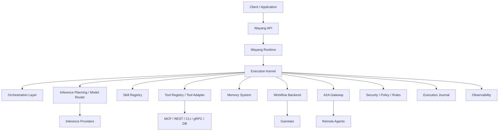

## 3.2 Runtime layers

| Layer | Responsibility |
|---|---|
| API | REST, WebSocket and programmatic entry points |
| Runtime | Creates and coordinates agent executions |
| Execution Kernel | Owns execution lifecycle/state |
| Orchestration | Chooses reasoning/execution pattern |
| Inference Planning | Selects provider/model according to requirements/policy |
| Skills | Reusable internal capabilities |
| Tools | Callable external capabilities |
| Memory | Working, conversation, vector, episodic state |
| Workflow | Durable/business workflow integration |
| A2A | Agent-to-agent communication |
| Policy/Security | Access, tenant, validation, rate limits |
| Journal | Execution history and recovery evidence |
| Observability | Metrics, traces, audit and events |

## 3.3 High-level request sequence

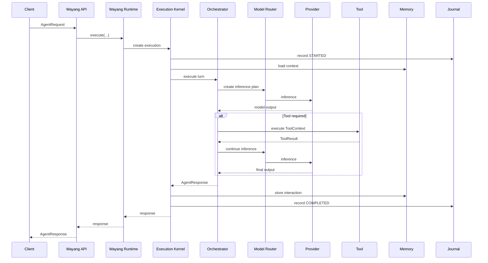

## 3.4 Execution state

A conceptual execution state can be represented as:

\[
S_{n+1}=F(S_n, I_n, A_n, O_n, P_n)
\]

where:

- \(S_n\) = current execution state;
- \(I_n\) = inference result;
- \(A_n\) = action/tool invocation;
- \(O_n\) = observation;
- \(P_n\) = policy/runtime constraints.

A checkpoint records sufficient durable state to reconstruct the next executable state.

---

# 4. Runtime Execution Model

## 4.1 Agent execution

The runtime source contains:

- `AgentExecution`;
- `AgentExecutionService`;
- `ExecutionBudget`;
- `RuntimeBehavior`;
- `AgentDefinition`;
- `AgentRequest`;
- `AgentResponse`.

The standalone runner demonstrates the intended lifecycle:

```java
AgentExecution execution =
    executionService.create(definition, request, budget);

AgentResponse response =
    execution.executeSync();
```

The same runtime also supports asynchronous execution.

## 4.2 Runtime behavior

The standalone runner exposes:

```text
FAST
BALANCED
THOROUGH
DEBUG
```

These are runtime-behavior profiles, not model names.

Conceptually:

```text
RuntimeBehavior
       │
       ▼
ExecutionBudget
       │
       ├── step limit
       ├── token limit
       ├── timeout
       ├── retry budget
       └── other resource limits
```

The supplied runner currently maps the behavior values to default budgets, so finer-grained behavior-specific budget profiles should be treated as an extension point rather than assumed to be fully implemented.

## 4.3 Execution events

The runtime supports execution events for streaming and observability.

Typical agent-loop events include:

```text
THOUGHT
ACTION
OBSERVATION
FINAL_ANSWER
```

For production execution, additional lifecycle events can include:

```text
STARTED
CHECKPOINT_SAVED
TOOL_STARTED
TOOL_COMPLETED
WAITING
RESUMED
FAILED
CANCELLED
COMPLETED
```

Only the event types actually exposed by a given implementation should be treated as contractual.

## 4.4 Streaming

The runtime snapshot shows:

```java
Multi<AgentEvent> events = orchestrator.stream(request);
```

A consumer can process events as they arrive:

```java
events.subscribe().with(event -> {
    switch (event.getType()) {
        case THOUGHT -> ...
        case ACTION -> ...
        case OBSERVATION -> ...
        case FINAL_ANSWER -> ...
    }
});
```

For security-sensitive deployments, internal reasoning events should be filtered before being exposed to end users.

---

# 5. Core Domain Model

## 5.1 AgentDefinition

`AgentDefinition` describes the agent itself.

It is used by the runtime to define:

- identity;
- metadata;
- goal;
- model information;
- capabilities/configuration associated with the agent.

Example:

```java
AgentDefinition definition =
    AgentDefinition.builder()
        .metadata(
            Metadata.builder()
                .name("sales-agent")
                .description("Analyzes sales information")
                .now()
                .build()
        )
        .goal("Analyze sales information and produce actionable findings.")
        .build();
```

## 5.2 AgentRequest

An `AgentRequest` represents one invocation.

Typical information includes:

- request ID;
- input type;
- content/prompt;
- user/session information;
- tenant context;
- requested strategy;
- requested skills;
- runtime limits.

## 5.3 AgentResponse

An `AgentResponse` contains the result of an execution.

Conceptually:

```text
AgentResponse
├── success
├── content
├── error
├── artifacts
└── execution metadata
```

## 5.4 Artifact

Artifacts represent produced or exchanged resources.

Examples:

- generated files;
- reports;
- code;
- documents;
- structured output;
- binary resources.

A2A mapping also exposes Wayang artifacts as A2A artifacts.

---

# 6. Agent Lifecycle

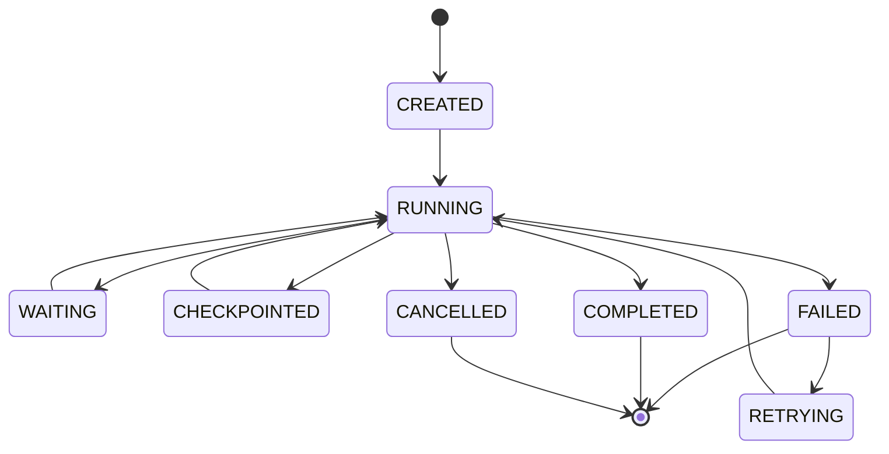

The exact state vocabulary varies by subsystem. Durable A2A tasks explicitly distinguish:

- `PENDING`;
- `RUNNING`;
- `WAITING_FOR_TOOL`;
- `WAITING_FOR_APPROVAL`;
- `COMPLETED`;
- `FAILED`;
- `CANCELLED`.

## 6.1 Lifecycle principle

A run should not be modeled as a single synchronous function call.

Instead:

```text
Run
 ├── identity
 ├── tenant
 ├── request
 ├── state
 ├── execution history
 ├── checkpoints
 ├── budget
 ├── tool interactions
 ├── workflow interactions
 ├── A2A interactions
 └── final response
```

---

# 7. Skills

## 7.1 Definition

A Skill is a self-contained, versioned, discoverable unit of agent capability.

The source describes skills as:

- implementing `AgentSkill`;
- declaring metadata using `@SkillDescriptor`;
- defining input/output schemas;
- discoverable through ServiceLoader or plugin loading.

## 7.2 Skill architecture

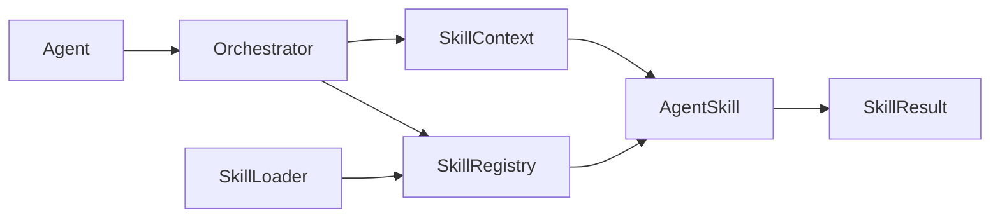

## 7.3 Skill descriptor

Conceptually:

```java
@SkillDescriptor(
    id = "inference",
    name = "LLM Inference",
    description = "Execute natural language inference",
    version = "1.0.0",
    category = SkillCategory.REASONING,
    triggers = {"infer", "generate", "llm"}
)
public class InferenceSkill implements AgentSkill {
    // implementation
}
```

The exact annotation members should follow the current source API.

## 7.4 Built-in skills

The source catalogs capabilities including:

| Skill | Purpose |
|---|---|
| `inference` | Direct LLM inference |
| `rag` | Retrieval-Augmented Generation |
| `code-execution` | Sandboxed code execution |
| `web-search` | Search/content extraction |
| `http-call` | Authenticated HTTP API calls |
| `summarization` | Multi-document summarization |
| `embedding` | Vector embeddings |
| `memory-store` | Long-term memory access |
| `sql-query` | SQL/database queries |
| `document-qa` | Question answering over documents |

The runtime snapshot also contains Java implementations for several built-in skills.

## 7.5 Skill execution contract

```text
SkillContext
     │
     ├── tenant
     ├── run
     ├── inputs
     ├── execution metadata
     └── runtime constraints
           │
           ▼
       AgentSkill
           │
           ▼
      SkillResult
```

A skill should:

1. validate its input;
2. enforce its own authorization constraints;
3. execute asynchronously where possible;
4. return structured results;
5. avoid leaking tenant data;
6. emit useful execution metadata.

---

# 8. Tools

## 8.1 Skill versus Tool

The architectural distinction is:

- **Skill:** an internal, versioned unit of Wayang capability.
- **Tool:** a callable capability exposed to an agent/orchestrator.

A skill can be adapted into a tool.

```text
AgentSkill
    │
    ▼
SkillAsToolAdapter / ToolAdapter
    │
    ▼
ToolDescriptor
    │
    ▼
LLM tool-calling interface
```

## 8.2 Tool sources

The source defines tool sources including:

```text
INTERNAL_SKILL
MCP_SERVER
REST_API
CLI_COMMAND
GRPC_SERVICE
DATABASE
```

## 8.3 Tool descriptor

```java
record ToolDescriptor(
    String id,
    String name,
    String description,
    JsonSchema schema,
    ToolSource source,
    Map<String, Object> metadata,
    List<String> tags
) {}
```

## 8.4 Tool context

```java
record ToolContext(
    String toolId,
    String tenantId,
    String runId,
    int stepNumber,
    Map<String, Object> inputs,
    Map<String, Object> context,
    Duration timeout
) {}
```

## 8.5 Tool result

```java
record ToolResult(
    boolean success,
    Object data,
    String error,
    Map<String, Object> metadata,
    long durationMs
) {}
```

## 8.6 Tool execution flow

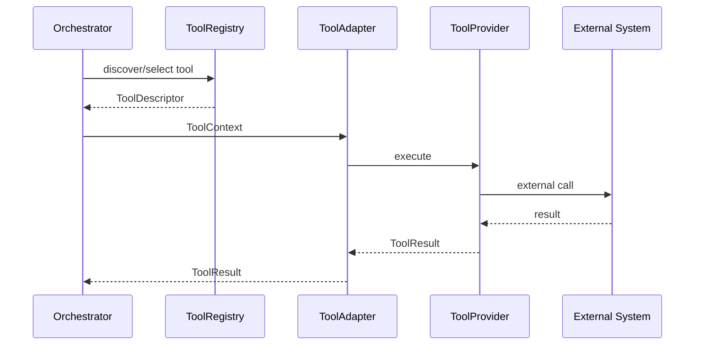

## 8.7 MCP

MCP is treated as one external tool source rather than as the definition of the Wayang tool system.

This preserves the architecture:

```text
Wayang Tool SPI
       │
       ├── MCP
       ├── REST/OpenAPI
       ├── CLI
       ├── gRPC
       └── Database
```

---

# 9. Memory

## 9.1 Four memory layers

The runtime documentation defines four memory layers:

| Layer | Purpose | Typical storage |
|---|---|---|
| Working | Current reasoning/run scratch state | memory / Redis |
| Conversation | Session transcript | Redis / PostgreSQL |
| Vector | Semantic retrieval | Qdrant / pgvector |
| Episodic | Long-term session/episode data | PostgreSQL |

## 9.2 Memory architecture

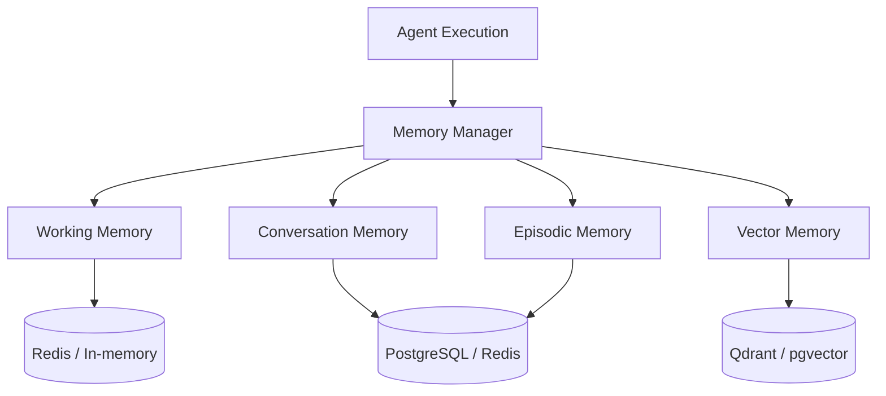

## 9.3 Memory SPI

The runtime source contains an `AgentMemoryService` with operations such as:

```java
Uni<Void> storeInteraction(
    String agentId,
    String sessionId,
    String userId,
    String userInput,
    String response
);

Uni<String> getContextPrompt(
    String agentId,
    int limit
);
```

The broader memory SPI also describes operations for:

- working memory;
- conversation memory;
- vector embeddings;
- episodic storage;
- statistics;
- health.

## 9.4 Tenant-scoped memory

Every persistent memory operation should carry tenant identity where the implementation supports tenancy.

Conceptually:

\[
K = f(\text{tenantId}, \text{agentId}, \text{sessionId}, \text{memoryType}, \text{key})
\]

This prevents a memory key from becoming globally ambiguous.

## 9.5 Memory retrieval pipeline

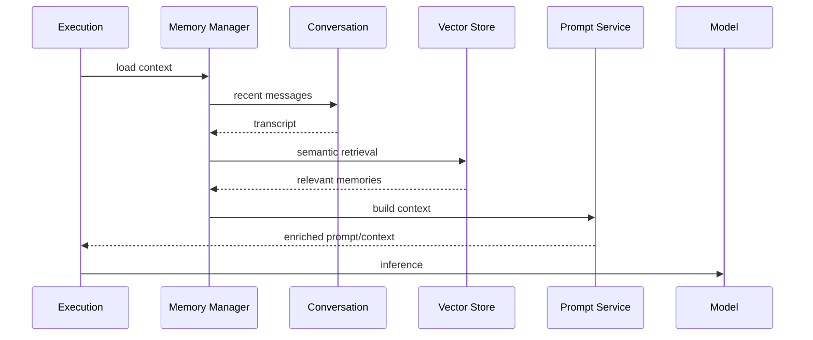

---

# 10. Orchestration

Wayang separates the runtime from the orchestration algorithm.

## 10.1 Supported patterns in the source

The source documents:

- ReAct;
- Plan-and-Execute;
- Chain-of-Thought;
- Reflexion.

The framework snapshot also contains tool-calling orchestration classes.

## 10.2 ReAct

```text
Thought
  ↓
Action
  ↓
Observation
  ↓
Thought
  ↓
Action
  ↓
...
  ↓
Final Answer
```

Best suited to tasks requiring iterative tool interaction.

## 10.3 Plan-and-Execute


## 10.4 Reflexion

```text
Attempt
   ↓
Critique
   ↓
Reflection
   ↓
Improved Attempt
   ↓
...
```

## 10.5 Chain-of-Thought

The source lists CoT as a logical reasoning strategy. Internal reasoning should be treated as private runtime state unless an application explicitly defines a safe public representation.

## 10.6 Tool-calling loop

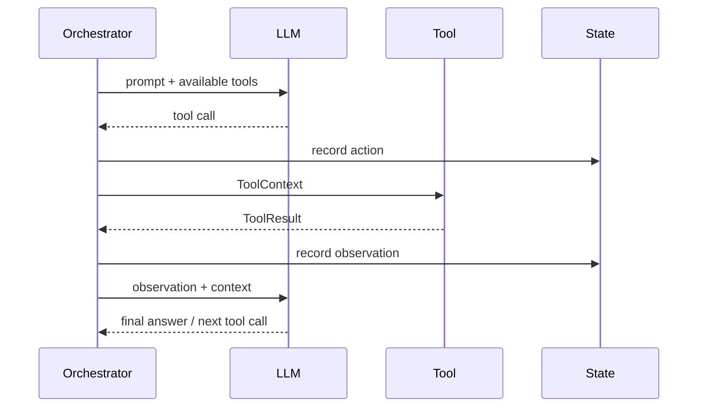

---

# 11. Inference Planning and Model Routing

## 11.1 Why routing is separate

Wayang should not force every agent to use one inference provider.

A runtime may have:

```text
Local model
Cloud provider A
Cloud provider B
Specialized OCR model
Embedding model
Speech model
Diffusion model
```

The runtime therefore derives requirements and creates an inference plan.

## 11.2 ModelRouter

The framework source defines:

```java
InferencePlan plan(
    AgentRequest request,
    AgentDefinition agentDefinition,
    InferenceRequirements requirements,
    InferencePolicy policy,
    List<Provider> availableProviders
);
```

It also exposes provider routing operations.

## 11.3 DIRECT strategy

`DIRECT` is the default in the supplied implementation.

Its purpose is to respect an explicitly requested provider/model path rather than replacing it with adaptive budget logic.

```text
Request
  │
  ├── explicit model/provider
  │
  ▼
DIRECT ROUTER
  │
  ▼
selected provider/model
```

## 11.4 ADAPTIVE strategy

`ADAPTIVE` adds:

- capability filtering;
- budget boundaries;
- multi-criteria scoring;
- telemetry feedback.

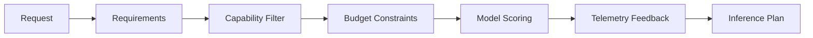

The framework implementation wires:

```text
DefaultModelRouter
 ├── DirectModelRouter
 └── AdaptiveModelRouter
       ├── ModelRegistry
       ├── ModelScorer
       └── ModelRoutingTelemetry
```

## 11.5 Routing configuration

The router reads:

```text
wayang.router.strategy
```

or:

```text
WAYANG_ROUTER_STRATEGY
```

Supported values in the source include:

```text
direct
adaptive
advanced
```

`advanced` maps to the adaptive strategy.

## 11.6 Capability-based model selection

A useful conceptual constraint is:

\[
M^* = \arg\max_{m \in M,\; C(m)\supseteq R}
Score(m)
\]

where:

- \(M\) = registered models;
- \(C(m)\) = model capabilities;
- \(R\) = request requirements;
- \(Score(m)\) = routing score.

Budget can be represented as a hard constraint:

\[
Cost(m) \le B
\]

rather than treating cost as an implicit model identity.

## 11.7 Model registration

A production registration system should expose model metadata such as:

```text
model ID
provider ID
capabilities
modalities
context window
input/output limits
pricing
latency observations
availability
local/cloud placement
health
tenant policy
```

The source already references `ModelRegistry`; concrete registration persistence is an implementation concern and should not be assumed to be complete merely because the interface exists.

---

# 12. Workflow Backend and Gamelan

## 12.1 Backend-neutral workflow abstraction

Wayang uses a `WorkflowBackend` SPI.

The supplied implementation includes:

```text
GamelanBackendProvider
        │
        ▼
GamelanBackendAdapter
        │
        ▼
GamelanClient
```

## 12.2 Why the adapter exists

Wayang should understand workflow semantics such as:

- create run;
- start;
- suspend;
- resume;
- cancel;
- signal;
- status;
- history.

It should not need to know the internal classes of Gamelan.

## 12.3 Workflow lifecycle

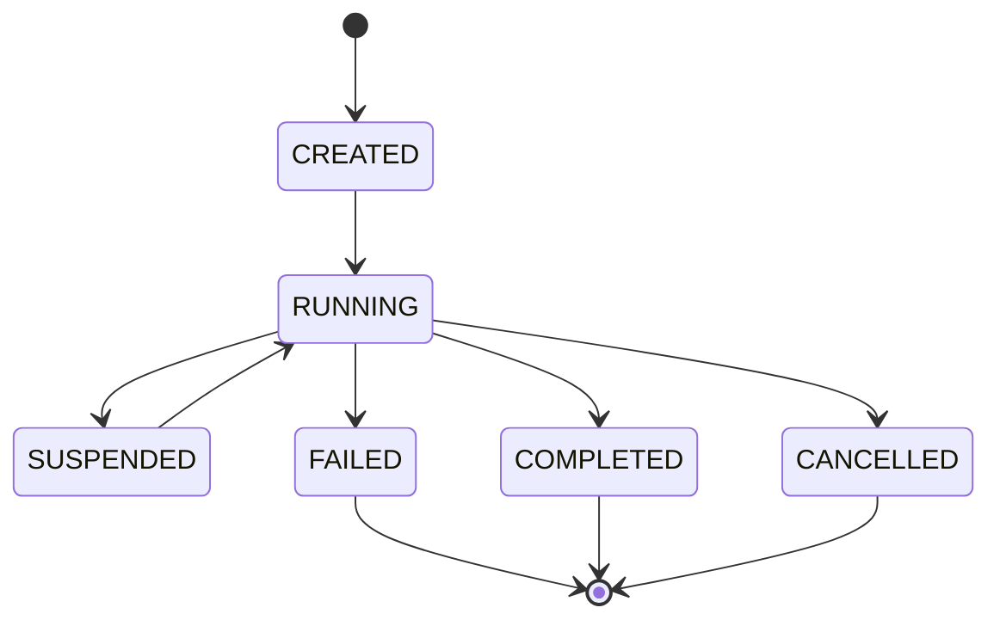

## 12.4 Gamelan adapter operations

The source adapter maps:

```text
createRun()
startRun()
suspendRun()
resumeRun()
cancelRun()
signalRun()
getRunHistory()
getRunStatus()
listRuns()
```

Some operations, notably listing runs, are represented as stubs in the supplied adapter and therefore should be treated as incomplete integration rather than guaranteed production behavior.

## 12.5 Agent + workflow

A typical composition is:

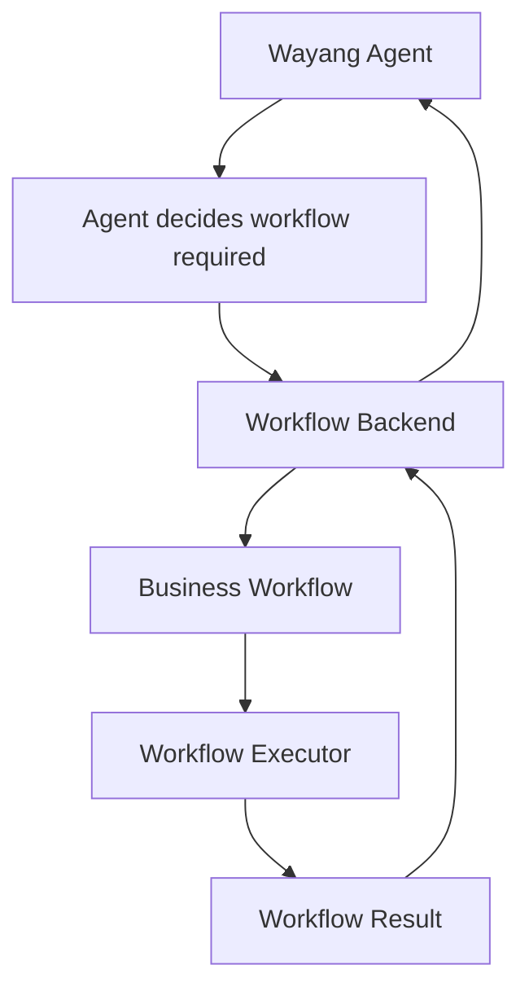

This separation is especially useful when a business process needs durable workflow semantics while the agent remains responsible for reasoning.

---

# 13. A2A and Distributed Agents

## 13.1 A2A boundary

Wayang supports exposing agents and consuming remote agents through A2A abstractions.

The framework defines:

```text
A2AClient
A2AServer
A2AAgentRegistry
AgentCard
A2AMessage
A2ATask
```

## 13.2 A2A server

A local Wayang agent can expose:

```java
AgentCard getAgentCard();

CompletionStage<A2ATask> sendMessage(A2AMessage message);

CompletionStage<A2ATask> getTask(String taskId);

CompletionStage<Void> cancelTask(String taskId);
```

## 13.3 A2A client

A remote agent can be consumed through the same basic operations.

## 13.4 Agent discovery

`A2AAgentRegistry` supports:

```text
discover(endpoint)
register(card)
find(agentId)
findByCapability(capability)
findBySkill(skill)
```

Therefore discovery is capability/skill oriented.

## 13.5 A2A execution flow

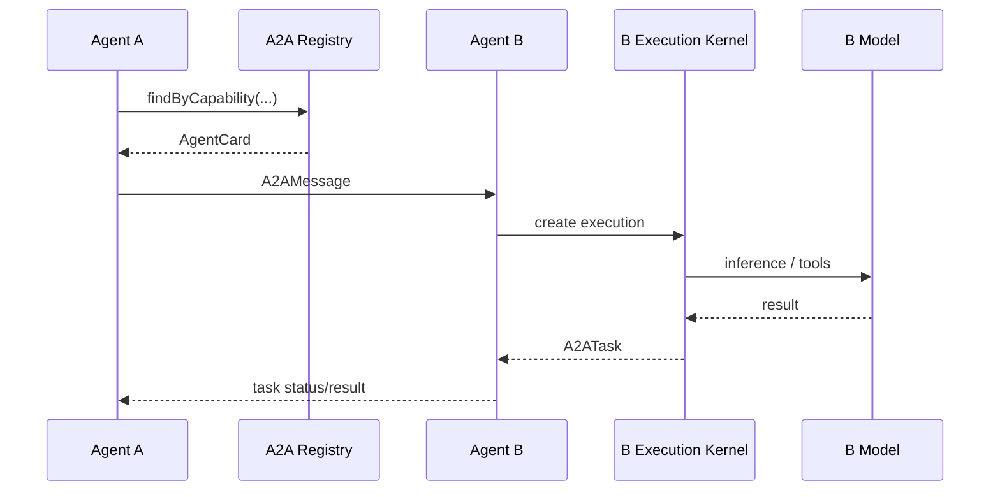

---

# 14. Execution Durability and Resilience

## 14.1 Durable A2A tasks

The framework contains `DurableA2ATask`.

The durable record adds:

- `callerExecutionId`;
- `checkpointId`;
- `lastEventSeq`;
- `remoteEndpoint`;
- `createdAt`;
- `completedAt`;
- `retryCount`.

This ties a remote task to local execution state.

## 14.2 Durable task ledger

`DurableA2ATaskLedger` tracks tasks and remote-agent wait states.

Responsibilities include:

- create tasks;
- update state;
- complete;
- fail;
- cancel;
- retry;
- update checkpoint;
- update event sequence;
- query pending tasks;
- query tasks by caller execution;
- resolve waiting executions.

## 14.3 Remote waiting state

`RemoteAgentWaitState` represents the local execution's waiting state while a remote A2A operation is in progress.

It can resolve through:

```text
remote completion
remote failure
remote cancellation
timeout
explicit cancellation
```

## 14.4 Durable A2A flow

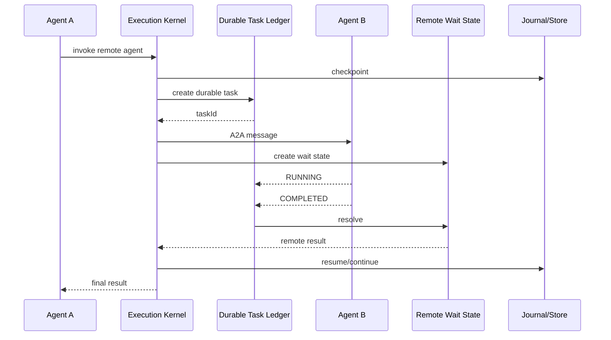

## 14.5 Distributed event relay

`DistributedEventRelay` provides an in-process relay abstraction.

It can:

- publish control events;
- receive remote status updates;
- update the durable task ledger;
- update checkpoint information;
- notify subscribers.

The source explicitly notes that true distributed observability can replace the in-process relay with a pub/sub backend such as Kafka or Redis Streams while preserving the interface concept.

## 14.6 Exactly-once versus at-least-once

A durable execution framework should distinguish:

\[
\text{delivery semantics} \neq \text{business side-effect semantics}
\]

A retryable tool invocation can produce duplicate external side effects unless the external operation is idempotent or protected by an idempotency key.

Therefore:

```text
Execution retry
      ↓
Tool retry
      ↓
External side effect
      ↓
Requires idempotency boundary
```

The presence of a journal/checkpoint does not by itself prove exactly-once external execution.

## 14.7 Retry model

A robust retry operation should conceptually be:

```text
FAILED
  ↓
policy check
  ↓
retry budget available?
  ├── no  → terminal failure
  └── yes
        ↓
restore checkpoint
        ↓
increment retry count
        ↓
resume
```

---

# 15. Knowledge, Policy and Rules

The Wayang runtime architecture treats knowledge and policy as runtime concerns.

A useful separation is:

```text
Knowledge
  = information available to the agent

Policy
  = constraints on what the agent may do

Rule
  = deterministic decision logic

Skill/Tool
  = mechanism for performing an action
```

## 15.1 Policy pipeline

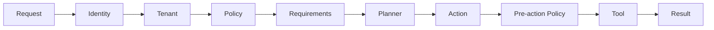

## 15.2 Skills as knowledge consumers

A RAG skill may use:

```text
query
  ↓
embedding
  ↓
vector search
  ↓
retrieved documents
  ↓
context construction
  ↓
inference
```

## 15.3 `skills.md`

The runtime direction supports skill descriptions as documentation/configuration artifacts. A skill definition can therefore be represented conceptually by:

```text
skills/
  sales-analysis/
    skills.md
    schema.json
    implementation.jar
```

The attached snapshots establish skill metadata and discovery mechanisms; a complete file-based `skills.md` loader should be treated as a separate implementation layer unless present in the current source tree.

---

# 16. Multi-Tenancy and Security

## 16.1 Tenant isolation

The source runtime explicitly describes:

- tenant-scoped memory;
- tenant-scoped tools;
- per-tenant quotas;
- isolated execution contexts;
- configurable access control.

## 16.2 Tenant context

A conceptual request context:

```text
Request
├── tenantId
├── principal
├── roles/permissions
├── agentId
├── sessionId
└── executionId
```

## 16.3 Security pipeline

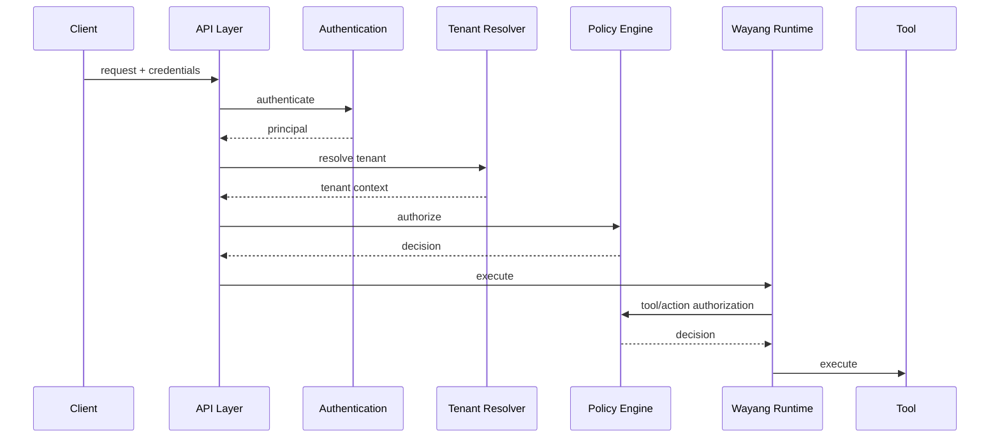

## 16.4 Input validation

The source inventory includes:

```text
AgentSecurityEnforcer
InputSanitizer
RateLimiter
```

Security must be applied at multiple boundaries:

1. external request;
2. agent input;
3. tool selection;
4. tool arguments;
5. external output;
6. artifact access;
7. tenant data access.

---

# 17. Observability

The source inventory contains:

- `AgentAuditLogger`;
- `AgentTelemetry`;
- metrics collectors;
- workflow metrics;
- tool metrics;
- distributed A2A events;
- execution journal/history.

## 17.1 Three observability layers

```text
Metrics
  └── counters, durations, token usage, failures

Tracing
  └── request → execution → inference → tool → workflow

Audit
  └── who/tenant/action/policy/result
```

## 17.2 Execution trace

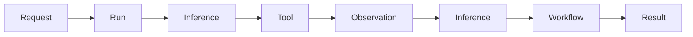

Recommended correlation identifiers:

```text
tenantId
agentId
sessionId
executionId
requestId
toolCallId
workflowRunId
a2aTaskId
traceId
```

---

# 18. Extension and SPI Architecture

## 18.1 Extension philosophy

Wayang uses interfaces at important integration boundaries.

The framework inventory demonstrates this pattern for:

- memory;
- skills;
- tools;
- providers;
- workflow backends;
- inference routing;
- A2A;
- coordination.

## 18.2 ServiceLoader

The Gamelan provider demonstrates Java ServiceLoader registration:

```text
META-INF/services/
  tech.kayys.wayang.agent.spi.BackendProvider
```

containing:

```text
tech.kayys.wayang.agent.backend.gamelan.GamelanBackendProvider
```

## 18.3 Provider lifecycle

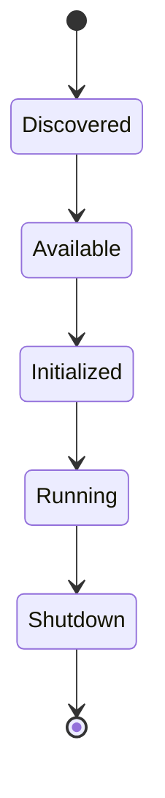

## 18.4 Backend provider contract

A provider can expose:

```text
name()
priority()
createInferenceBackend(config)
createWorkflowBackend(config)
isAvailable()
supportedBackends()
```

The Gamelan provider is workflow-only and returns no inference backend.

## 18.5 Extension dependency principle

Prefer:

```text
wayang-runtime-core
       │
       ├── wayang-backend-gamelan
       ├── wayang-backend-gollek
       ├── wayang-a2a
       ├── wayang-mcp
       └── optional domain extensions
```

rather than embedding all integrations into the runtime core.

---

# 19. APIs

## 19.1 Programmatic API

The runtime snapshot shows an orchestration API of the form:

```java
AgentRequest request = AgentRequest.builder()
    .prompt("Analyze Q3 sales data and find top 5 customers")
    .strategy(OrchestrationStrategy.REACT)
    .skills("sql-query", "data-analysis", "summarization")
    .maxSteps(15)
    .tenantId("enterprise")
    .build();

Uni<AgentResponse> response =
    orchestrator.execute(request);
```

The exact builder methods should follow the current compiled API.

## 19.2 REST API

The source documentation demonstrates:

```http
POST /api/v1/agents/run
Content-Type: application/json
X-Tenant-ID: enterprise

{
  "prompt": "Research recent AI papers and summarize key findings",
  "strategy": "react",
  "skills": ["web-search", "summarization"],
  "maxSteps": 15,
  "stream": true
}
```

This endpoint should be considered an example contract from the supplied documentation; production deployments should verify the current resource class and route annotations.

## 19.3 Streaming

A WebSocket API is represented in the source module structure as:

```text
AgentWebSocket
```

Streaming events can represent execution progress.

## 19.4 CLI

The standalone runner demonstrates:

```bash
wayang-runner "Summarise the README"
```

Model override:

```bash
wayang-runner \
  --model gemini-pro \
  "Analyse the repository"
```

Runtime behavior:

```bash
wayang-runner \
  --behavior THOROUGH \
  "Perform a detailed analysis"
```

Plain text:

```bash
wayang-runner \
  --no-json \
  "What is 2 + 2"
```

The runner returns exit code `0` on successful execution and `1` on failure.

---

# 20. Configuration

The supplied runtime documentation uses YAML configuration.

## 20.1 Example

```yaml
quarkus:
  application:
    name: wayang-agent
    version: 1.0.0

  http:
    port: 8080
    cors:
      ~: true
      origins: "*"
      methods: GET,POST,PUT,DELETE,OPTIONS
      headers: Content-Type,Authorization,X-Tenant-Id,X-API-Key

  opentelemetry:
    enabled: true
    tracer:
      exporter:
        otlp:
          endpoint: http://localhost:4317

wayang:
  router:
    strategy: direct
```

> The supplied runtime snapshot contains historical `gollek.agent.*` configuration. The current Wayang package structure uses `tech.kayys.wayang.*`. Configuration namespaces should therefore be verified against the current application module before deployment.

## 20.2 Agent configuration represented in the source

Historical runtime configuration includes:

```yaml
agent:
  enabled: true
  default-strategy: react
  default-max-steps: 15
  default-timeout-seconds: 120
```

## 20.3 Memory

```yaml
memory:
  backend: hybrid

  redis:
    url: redis://localhost:6379
    key-prefix: wayang:agent:
    ttl-seconds: 3600

  conversation:
    max-history-per-session: 50
    session-ttl-seconds: 7200

  vector:
    enabled: true
    provider: qdrant
    endpoint: http://localhost:6333

  episodic:
    enabled: true
    backend: postgresql
    retention-days: 90
```

## 20.4 Tool configuration

Historical runtime configuration demonstrates:

```yaml
tools:
  mcp:
    enabled: true
    servers:
      - name: filesystem
        command: npx
        args:
          - "-y"
          - "@modelcontextprotocol/server-filesystem"
          - "/data"

  rest:
    enabled: true
```

CLI tools can be explicitly disabled and restricted by allow-list.

## 20.5 Routing

```yaml
wayang:
  router:
    strategy: direct
```

or:

```yaml
wayang:
  router:
    strategy: adaptive
```

---

# 21. Tutorials

# Tutorial 1 — Build a Minimal Agent

## Step 1: Define the agent

```java
AgentDefinition definition =
    AgentDefinition.builder()
        .metadata(
            Metadata.builder()
                .name("hello-agent")
                .description("A minimal Wayang agent")
                .now()
                .build()
        )
        .goal("Answer the user's request accurately.")
        .build();
```

## Step 2: Create a request

```java
AgentRequest request =
    AgentRequest.of("Explain what Wayang is.");
```

## Step 3: Execute

```java
AgentExecution execution =
    executionService.create(
        definition,
        request,
        ExecutionBudget.defaults()
    );

AgentResponse response =
    execution.executeSync();
```

## Step 4: Inspect

```java
if (response.success()) {
    System.out.println(response.content());
} else {
    System.err.println(response.error());
}
```

---

# Tutorial 2 — Use a Skill

```java
AgentRequest request =
    AgentRequest.builder()
        .prompt("Analyze the sales dataset.")
        .skills(
            "sql-query",
            "summarization"
        )
        .build();
```

The runtime should:

```text
Request
  ↓
Orchestrator
  ↓
Skill discovery
  ↓
Skill selection
  ↓
Tool/skill execution
  ↓
Observation
  ↓
Inference
  ↓
Response
```

---

# Tutorial 3 — Add a Custom Skill

## Step 1: Implement the SPI

```java
public final class CurrencyConversionSkill
        implements AgentSkill {

    @Override
    public Uni<SkillResult> execute(SkillContext context) {
        String from =
            context.getInput("from", String.class).orElseThrow();

        String to =
            context.getInput("to", String.class).orElseThrow();

        BigDecimal amount =
            context.getInput("amount", BigDecimal.class).orElseThrow();

        // Domain-specific implementation here.

        return Uni.createFrom().item(
            SkillResult.success(
                Map.of(
                    "from", from,
                    "to", to,
                    "amount", amount
                )
            )
        );
    }
}
```

## Step 2: Describe it

Use the current `SkillDescriptor` mechanism.

```text
id
name
description
version
category
triggers
inputs
outputs
```

## Step 3: Register

Register through the supported registry/ServiceLoader mechanism.

## Step 4: Validate

Confirm:

```text
skillRegistry.listAll()
```

contains the new skill.

---

# Tutorial 4 — Add a Tool Provider

A provider should implement the tool provider SPI.

Conceptually:

```java
public interface ToolProvider {

    String name();

    boolean isAvailable();

    Uni<List<ToolDescriptor>> discover();

    Uni<ToolResult> execute(ToolContext context);
}
```

Then register it using the project's provider-discovery mechanism.

The provider should:

1. advertise tools;
2. provide JSON schemas;
3. validate inputs;
4. execute with timeout;
5. return structured output;
6. preserve tenant context.

---

# Tutorial 5 — Configure Gamelan

```yaml
wayang:
  workflow:
    backend: gamelan
    endpoint: http://localhost:8081
    tenantId: enterprise
    transport: REST
    timeout: PT30S
```

The Gamelan provider requires an endpoint and tenant ID in the supplied adapter.

The provider creates:

```text
GamelanClientConfig
        ↓
GamelanClient
        ↓
GamelanBackendAdapter
        ↓
WorkflowBackend
```

---

# Tutorial 6 — Invoke a Remote Agent

```text
1. Discover AgentCard
2. Select by capability/skill
3. Send A2AMessage
4. Receive A2ATask
5. Poll/subscribe for status
6. Retrieve result
```

Conceptually:

```java
AgentCard card =
    registry.findByCapability("document-analysis")
            .stream()
            .findFirst()
            .orElseThrow();

A2ATask task =
    client.sendMessage(message)
          .toCompletableFuture()
          .join();
```

For durable execution, use the durable task ledger and checkpoint-aware adapter.

---

# Tutorial 7 — Durable Remote-Agent Execution

The durable path is:

```text
local execution
      ↓
checkpoint
      ↓
DurableA2ATask
      ↓
remote call
      ↓
WAITING
      ↓
remote status update
      ↓
resume local execution
```

This is especially useful when:

- remote execution is slow;
- the local process may restart;
- the call is part of a long-running task;
- the result must be correlated to an execution.

---

# Tutorial 8 — Build a Multi-Agent System

A multi-agent system can separate roles:

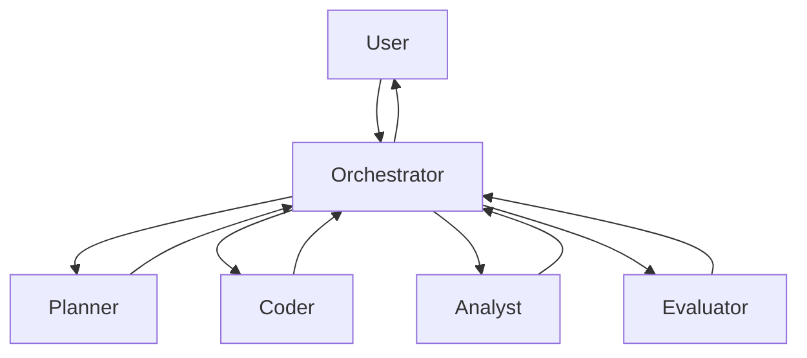

The framework inventory includes:

```text
MultiAgentCoordinator
AgentMessage
ResultAggregator
```

A coordinator should remain responsible for communication semantics, while individual agents retain independent execution contexts.

---

# 22. Use Cases

## 22.1 Coding agent

```text
User
 ↓
Coding Agent
 ├── repository tool
 ├── shell/code execution
 ├── search
 ├── test runner
 ├── memory
 └── inference
```

Typical flow:

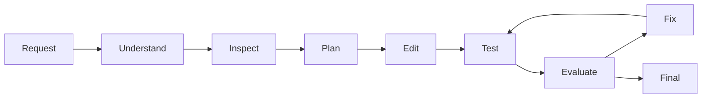

## 22.2 Customer-support agent

Capabilities:

- conversation memory;
- CRM tool;
- knowledge retrieval;
- policy checking;
- human escalation.

## 22.3 Marketing campaign agent

Possible decomposition:

```text
MarketingCampaignAgent
 ├── LeadQualificationAgent
 ├── TelemarketingAgent
 ├── FollowUpAgent
 └── CampaignOptimizationAgent
```

The architecture can combine:

- memory;
- CRM tools;
- social-media tools;
- ecommerce tools;
- policy;
- approval;
- workflows;
- analytics.

## 22.4 Enterprise document agent

```text
Document
  ↓
OCR
  ↓
Extraction
  ↓
Embedding
  ↓
Vector store
  ↓
RAG
  ↓
Inference
  ↓
Artifact/report
```

## 22.5 Data analyst

```text
User question
   ↓
Planner
   ↓
SQL tool
   ↓
Data result
   ↓
Analysis
   ↓
Visualization/artifact
   ↓
Summary
```

## 22.6 Agent-to-agent enterprise network

```mermaid
flowchart TB
    Sales[Sales Agent]
    Finance[Finance Agent]
    Legal[Legal Agent]
    Support[Support Agent]
    Orchestrator[Enterprise Orchestrator]

    Orchestrator <--> Sales
    Orchestrator <--> Finance
    Orchestrator <--> Legal
    Orchestrator <--> Support
```

A2A provides the communication boundary, while Wayang provides execution semantics.

## 22.7 Long-running business process

```text
Agent
 ↓
Gamelan Workflow
 ↓
Wait
 ↓
Human approval
 ↓
Resume
 ↓
External system
 ↓
Completion
```

This combines agentic reasoning with deterministic workflow execution.

---

# 23. Deployment Models

## 23.1 Embedded

```text
Application
   └── Wayang Runtime
        ├── local inference
        ├── local tools
        └── local storage
```

Useful for:

- desktop;
- development;
- edge;
- local automation.

## 23.2 Server

```text
Clients
  ↓
Wayang API
  ↓
Wayang Runtime
  ├── inference
  ├── tools
  ├── memory
  └── workflow
```

## 23.3 Distributed

```mermaid
flowchart TB
    Gateway --> W1[Wayang Node 1]
    Gateway --> W2[Wayang Node 2]
    Gateway --> W3[Wayang Node 3]

    W1 --> Redis
    W2 --> Redis
    W3 --> Redis

    W1 --> Vector
    W2 --> Vector
    W3 --> Vector

    W1 --> Workflow
    W2 --> Workflow
    W3 --> Workflow
```

## 23.4 Hybrid inference

```text
                    Wayang
                       │
              Inference Planning
                 /           \
                /             \
          Local Provider     Cloud Provider
          ├── GGUF           ├── Provider A
          ├── ONNX           └── Provider B
          └── ... 
```

The router determines which configured provider/model satisfies the request.

---

# 24. Performance and Resource Governance

## 24.1 Main resource dimensions

An execution can consume:

- model tokens;
- model latency;
- tool calls;
- network bandwidth;
- memory;
- CPU;
- external API quota;
- workflow capacity.

## 24.2 Budget model

Let:

\[
B=(T,L,C,R)
\]

where:

- \(T\) = token budget;
- \(L\) = latency/time budget;
- \(C\) = monetary/cost budget;
- \(R\) = execution/retry budget.

The execution should remain inside the configured envelope.

## 24.3 Practical controls

Use:

```text
max steps
max tokens per step
timeout
tool timeout
retry limit
concurrency limit
memory limits
provider quotas
tenant quotas
```

## 24.4 Token-cost reduction

The source troubleshooting guidance recommends:

- reducing max steps;
- lowering max tokens per step;
- making skill descriptions more specific;
- early termination;
- caching frequent responses.

---

# 25. Testing

## 25.1 Unit testing

Test independently:

```text
AgentDefinition
AgentRequest
Skill
Tool
ModelRouter
Policy
Memory implementation
Workflow adapter
A2A mapper
Durable task ledger
```

## 25.2 Integration testing

Recommended integration boundaries:

```text
Wayang Runtime
   ↔ Gollek provider
   ↔ Gamelan
   ↔ Redis
   ↔ PostgreSQL
   ↔ Qdrant
   ↔ MCP
   ↔ REST
   ↔ remote A2A agent
```

## 25.3 Failure testing

Test:

- provider unavailable;
- model timeout;
- tool timeout;
- tool failure;
- workflow failure;
- remote A2A failure;
- process restart;
- checkpoint recovery;
- cancellation;
- duplicate events;
- duplicate external operations;
- tenant authorization failure.

## 25.4 Durable A2A tests

At minimum:

```text
create task
→ RUNNING
→ checkpoint
→ remote completion
→ ledger completion
→ wait-state resolution
```

and:

```text
create task
→ RUNNING
→ remote failure
→ retry
→ resume
```

---

# 26. Troubleshooting

## 26.1 Skill not found

Check:

1. registry contents;
2. ServiceLoader configuration;
3. plugin JAR placement;
4. exact skill ID;
5. configured scan packages.

## 26.2 Memory backend unavailable

Symptoms:

```text
Redis/Qdrant connection refused
```

Check:

- backend service;
- URL;
- credentials;
- network;
- tenant configuration.

For development, the source documentation describes an in-memory backend as a fallback.

## 26.3 Excessive token usage

Check:

```text
maxSteps
maxTokensPerStep
tool loop termination
skill descriptions
response caching
```

## 26.4 Gamelan backend unavailable

Check:

```text
Gamelan SDK dependency
endpoint
tenantId
transport
timeout
```

The supplied provider explicitly requires the Gamelan SDK and endpoint/tenant configuration.

## 26.5 A2A task not found

For non-durable execution, task tracking may be in memory.

For durable execution, use the durable ledger.

If process restart is a requirement, the ledger itself must use persistent storage; an in-memory ledger does not provide restart durability.

---

# 27. Project Structure

The supplied source inventories show the following major Wayang domains.

```text
wayang/
├── agent/
│   ├── AgentBuilder
│   ├── AgentClient
│   ├── AgentConfig
│   ├── AgentHealthCheck
│   ├── AgenticInferenceService
│   ├── AgentCheckpointManager
│   ├── ProviderAwareInference
│   ├── StatefulAgentExecutor
│   └── ToolEnabledAgentExecutor
│
├── coordination/
│   ├── AgentMessage
│   ├── MultiAgentCoordinator
│   └── ResultAggregator
│
├── gamelan/
│   ├── AgentGamelanService
│   ├── WorkflowMetrics
│   ├── WorkflowQueryCriteria
│   └── graph/
│       ├── WorkflowExecutionStatistics
│       ├── WorkflowGraphService
│       └── WorkflowStepDefinition
│
├── inference/
│   └── EmbeddingService
│
├── interaction/
│   └── AgentHitlService
│
├── memory/
│   ├── AgentMemory
│   └── AgentMemoryService
│
├── observability/
│   ├── AgentAuditLogger
│   └── AgentTelemetry
│
├── orchestration/
│   ├── NativeToolCallingOrchestrator
│   ├── ReActOrchestrator
│   ├── ReflexionOrchestrator
│   ├── ToolCallExecutor
│   ├── ToolCallingAgentLoop
│   └── ToolMetrics
│
├── prompt/
│   └── AgentPromptService
│
├── registry/
│   ├── AgentProviderRegistry
│   ├── AgentMetricsCollector
│   └── AdaptiveStrategySelector
│
├── resilience/
│   ├── AgentResilience
│   └── FailureRecoveryStrategy
│
├── security/
│   ├── AgentSecurityEnforcer
│   ├── InputSanitizer
│   └── RateLimiter
│
├── skills/
│   ├── adapter/
│   ├── builtin/
│   └── loader/
│
├── tools/
│   ├── AgentToolService
│   ├── ToolSelector
│   ├── ToolCacheManager
│   └── ...
│
└── a2a/
    ├── adapter/
    ├── api/
    ├── distributed/
    └── durable/
```

## 27.1 Important integration modules

The supplied files also show:

```text
wayang-backend-gamelan
wayang-backend-gollek
wayang-a2a
wayang-agent-runtime
wayang-runtime-core
wayang-provider
```

The exact Gradle/Maven module graph should be generated from the current build files rather than inferred solely from this documentation snapshot.

---

# 28. Architecture Decision Summary

## 28.1 Wayang is the runtime boundary

```text
                    Agent Application
                           │
                           ▼
                    ┌─────────────┐
                    │    Wayang   │
                    │   Runtime   │
                    └─────────────┘
                       │  │  │
              ┌────────┘  │  └────────┐
              ▼            ▼           ▼
           Inference    Workflow      Tools
              │            │           │
           Gollek       Gamelan    MCP/REST/etc.
```

## 28.2 Inference is replaceable

```text
ModelRouter
   ├── DIRECT
   └── ADAPTIVE
          │
          └── Provider / Model Registry
```

## 28.3 Workflow is replaceable

```text
WorkflowBackend
   └── GamelanBackendAdapter
```

## 28.4 Tools are protocol-neutral

```text
Tool
 ├── Internal Skill
 ├── MCP
 ├── REST
 ├── CLI
 ├── gRPC
 └── Database
```

## 28.5 Agents are independently composable

```text
Agent
 ├── local execution
 ├── workflow invocation
 ├── tool invocation
 └── A2A invocation
```

## 28.6 Durability is an execution concern

Checkpointing should belong to the execution kernel rather than to one particular agent strategy.

```text
Orchestrator
     │
     ▼
Execution Kernel
     │
     ├── journal
     ├── checkpoint
     ├── retry
     ├── timeout
     ├── cancellation
     └── recovery
```

---

# 29. Implementation Status and Gaps

This section is intentionally explicit because the supplied files contain both implemented classes and documentation describing future/remaining work.

## 29.1 Clearly represented in the supplied implementation

The snapshots contain concrete implementations for:

- agent request/response models;
- agent execution service usage;
- skills and skill discovery structures;
- tool abstraction;
- multiple orchestration classes;
- memory interfaces;
- Gamelan workflow backend adapter/provider;
- inference model router;
- A2A client/server abstractions;
- A2A registry;
- durable A2A task;
- durable task ledger;
- remote-agent wait state;
- distributed event relay;
- security/resilience/observability package structures;
- standalone CLI runner.

## 29.2 Explicitly incomplete or represented as stubs

The supplied runtime documentation states that remaining work includes concrete memory backends, external tool providers, and additional orchestrator implementations.

The same snapshot lists pending items such as:

```text
MCPToolProvider
RESTToolProvider
CLIToolProvider
DatabaseToolProvider

PlanAndExecuteOrchestrator
ChainOfThoughtOrchestrator
ReflexionOrchestrator

MemoryManager
TenantContext
MemoryConfig
```

The Gamelan adapter also contains a `listRuns` implementation returning an empty list as a stub.

Therefore this document distinguishes:

```text
SPI exists
        ≠
production implementation exists
```

## 29.3 Durability qualification

The durable A2A implementation is explicitly designed so that the ledger can survive JVM restart **when backed by a persistent store**. The supplied `DurableA2ATaskLedger` itself uses `ConcurrentHashMap`, so the shown implementation is in-memory unless another persistence wrapper/implementation is supplied.

## 29.4 Terminology qualification

Some runtime documentation is still named:

```text
Gollek Agentic Core System
gollek.agent.*
inference-gollek/plugins/agent/agent-core
```

while the framework implementation uses:

```text
tech.kayys.wayang.*
wayang-runtime-core
wayang-provider
wayang-a2a
wayang-backend-gamelan
```

This indicates historical migration/lineage in the supplied snapshot. The architecture described in this document follows the current Wayang package/model naming while preserving the capabilities found in the legacy runtime documentation.

---

# 30. Glossary

| Term | Meaning |
|---|---|
| Agent | Runtime entity executing an intelligent task |
| AgentDefinition | Static/configured definition of an agent |
| AgentRequest | One invocation/input |
| AgentResponse | Execution result |
| AgentExecution | Runtime instance of one agent run |
| Execution Kernel | Lifecycle/state/durability authority for a run |
| Skill | Internal versioned capability |
| Tool | Callable capability exposed to orchestration |
| ToolProvider | Adapter for an external tool source |
| Orchestrator | Controls the agent reasoning/execution loop |
| Memory | Persistent or transient agent context |
| ModelRouter | Selects inference provider/model |
| InferencePlan | Explainable planned inference selection |
| Provider | Inference or integration implementation |
| WorkflowBackend | Wayang abstraction over workflow engines |
| Gamelan | Concrete workflow backend integration |
| A2A | Agent-to-agent communication |
| AgentCard | Discoverable remote-agent metadata |
| DurableA2ATask | Persistent-aware remote task representation |
| Checkpoint | Resume anchor for an execution |
| Journal | Append/history record of execution events |
| Policy | Constraint/authorization decision |
| Rule | Deterministic decision logic |
| Tenant | Isolation boundary for enterprise execution |
| Artifact | File/resource/result produced or exchanged by execution |
| SPI | Service Provider Interface |
| `Uni` | Reactive single-result type |
| `Multi` | Reactive stream type |

---

# Appendix A — Canonical Architecture Diagram

```mermaid
flowchart TB

    subgraph Clients
        UI[Web / Desktop / Mobile]
        APIClient[API Client]
        CLI[CLI / CI]
        RemoteAgent[Remote A2A Agent]
    end

    subgraph Wayang["Wayang Runtime"]
        API[REST / WebSocket / Programmatic API]

        subgraph Core["Execution Core"]
            Runtime[WayangRuntime]
            Execution[AgentExecution]
            Budget[ExecutionBudget]
            Journal[Execution Journal]
            Checkpoint[Checkpoint Manager]
            Recovery[Resilience / Recovery]
        end

        subgraph Intelligence["Agent Intelligence"]
            Orchestrator[Orchestrator]
            Prompt[Prompt Service]
            Router[Inference Planning]
            ModelRegistry[Model Registry]
        end

        subgraph Capabilities["Capabilities"]
            SkillRegistry[Skill Registry]
            ToolRegistry[Tool Registry]
            ToolAdapter[Tool Adapter]
        end

        subgraph State["State"]
            Memory[Memory System]
            Policy[Security / Policy]
        end

        subgraph Integration["Integrations"]
            Workflow[WorkflowBackend]
            A2A[A2A]
        end

        subgraph Observability["Observability"]
            Metrics[Metrics]
            Trace[Tracing]
            Audit[Audit]
            Events[Event Relay]
        end
    end

    subgraph External["External Systems"]
        Gollek[Gollek / Inference Providers]
        Gamelan[Gamelan]
        MCP[MCP]
        REST[REST/OpenAPI]
        GRPC[gRPC]
        DB[Databases]
        Vector[Vector Store]
        Remote[Remote Agents]
    end

    UI --> API
    APIClient --> API
    CLI --> Runtime

    API --> Runtime
    Runtime --> Execution
    Execution --> Budget
    Execution --> Journal
    Execution --> Checkpoint
    Execution --> Recovery
    Execution --> Orchestrator
    Execution --> Router
    Execution --> SkillRegistry
    Execution --> ToolRegistry
    Execution --> Memory
    Execution --> Policy
    Execution --> Workflow
    Execution --> A2A
    Execution --> Metrics
    Execution --> Trace
    Execution --> Audit

    Orchestrator --> Prompt
    Router --> ModelRegistry
    Router --> Gollek

    ToolRegistry --> ToolAdapter
    ToolAdapter --> MCP
    ToolAdapter --> REST
    ToolAdapter --> GRPC
    ToolAdapter --> DB

    Memory --> Vector
    Workflow --> Gamelan
    A2A --> Remote

    RemoteAgent --> A2A
```

---

# Appendix B — Complete Agent Execution Sequence

```mermaid
sequenceDiagram
    autonumber

    participant Client
    participant API as Wayang API
    participant Runtime as Wayang Runtime
    participant Kernel as Execution Kernel
    participant Policy as Policy/Security
    participant Memory as Memory
    participant Orch as Orchestrator
    participant Router as Model Router
    participant Model as Provider/Model
    participant Tool as Tool System
    participant Workflow as Workflow Backend
    participant A2A as A2A
    participant Journal as Journal

    Client->>API: AgentRequest
    API->>Policy: authenticate/authorize
    Policy-->>API: allowed
    API->>Runtime: create execution
    Runtime->>Kernel: create
    Kernel->>Journal: STARTED

    Kernel->>Memory: load context
    Memory-->>Kernel: context

    loop Agent execution
        Kernel->>Orch: next step
        Orch->>Router: derive inference plan
        Router-->>Orch: provider/model plan
        Orch->>Model: inference
        Model-->>Orch: output

        alt Tool call
            Orch->>Policy: authorize tool
            Policy-->>Orch: allowed
            Orch->>Tool: execute
            Tool-->>Orch: ToolResult
            Kernel->>Journal: tool event
        else Workflow call
            Orch->>Workflow: create/start run
            Workflow-->>Orch: workflow status
        else Remote agent
            Orch->>A2A: send message
            A2A-->>Orch: A2ATask
            Orch->>Kernel: WAITING
            A2A-->>Kernel: remote completion
            Kernel->>Journal: resumed
        end

        Kernel->>Journal: checkpoint/event
    end

    Kernel->>Memory: store interaction
    Kernel->>Journal: COMPLETED
    Kernel-->>Runtime: AgentResponse
    Runtime-->>API: AgentResponse
    API-->>Client: result
```

---

# Appendix C — Conceptual Failure/Recovery Sequence

```mermaid
sequenceDiagram
    participant K as Execution Kernel
    participant J as Journal
    participant C as Checkpoint
    participant X as External Tool
    participant R as Recovery

    K->>J: record STARTED
    K->>C: save checkpoint
    K->>X: execute side effect
    X--xK: timeout/failure
    K->>J: record FAILED
    K->>R: evaluate recovery
    R-->>K: retry allowed
    K->>C: restore checkpoint
    K->>X: retry with idempotency key
    X-->>K: success
    K->>J: record COMPLETED
```

---

# Appendix D — Design Rules for Extension Authors

1. Do not couple an extension to the concrete runtime implementation if an SPI exists.
2. Preserve tenant context.
3. Preserve execution correlation IDs.
4. Return structured results.
5. Use asynchronous/reactive APIs for I/O.
6. Enforce timeouts.
7. Make external side effects idempotent where retries are possible.
8. Emit useful metrics and execution events.
9. Keep configuration explicit.
10. Keep optional integrations out of the core runtime dependency graph.
11. Version extension contracts carefully.
12. Do not expose private model reasoning as a public API accidentally.
13. Treat capability metadata as part of discovery.
14. Separate policy decisions from tool implementations.
15. Treat persistence and durability as explicit deployment properties.

---

# Appendix E — Recommended Mental Model

The simplest way to understand Wayang is:

```text
             WHAT
              │
        Agent Definition
              │
              ▼
            WHY
              │
        Orchestration
              │
              ▼
            WHICH
              │
       Inference Planning
              │
              ├──────────────┐
              ▼              ▼
           MODEL           TOOL
              │              │
              └──────┬───────┘
                     ▼
                  RESULT
                     │
                     ▼
                   STATE
                     │
          ┌──────────┼──────────┐
          ▼          ▼          ▼
       Memory     Workflow     A2A
          │          │          │
          └──────────┼──────────┘
                     ▼
                 Execution
                  Journal
                     │
                     ▼
                Recovery /
                Checkpoint
```

Wayang therefore sits between **agent intent** and **production execution**.

It provides the runtime semantics necessary to turn an agent from a simple LLM loop into an operable system capable of:

- tool use;
- memory;
- workflow interaction;
- remote-agent interaction;
- policy enforcement;
- durable execution;
- model/provider selection;
- multi-tenant operation;
- observability;
- extension.

---

## Source Notes

This document was derived primarily from the supplied Wayang runtime/framework source inventories. The runtime snapshot explicitly documents a skill-driven agent core, multi-layer memory, external tool integration, multiple orchestration strategies, multi-tenancy, REST/WebSocket usage, and configuration. The framework snapshot adds concrete Wayang A2A durability, model routing, workflow backend integration, coordination, security, resilience, and observability structures.

Where the source files contain explicit stubs or describe remaining work, this document marks those areas as incomplete instead of presenting the interfaces as completed production implementations.
