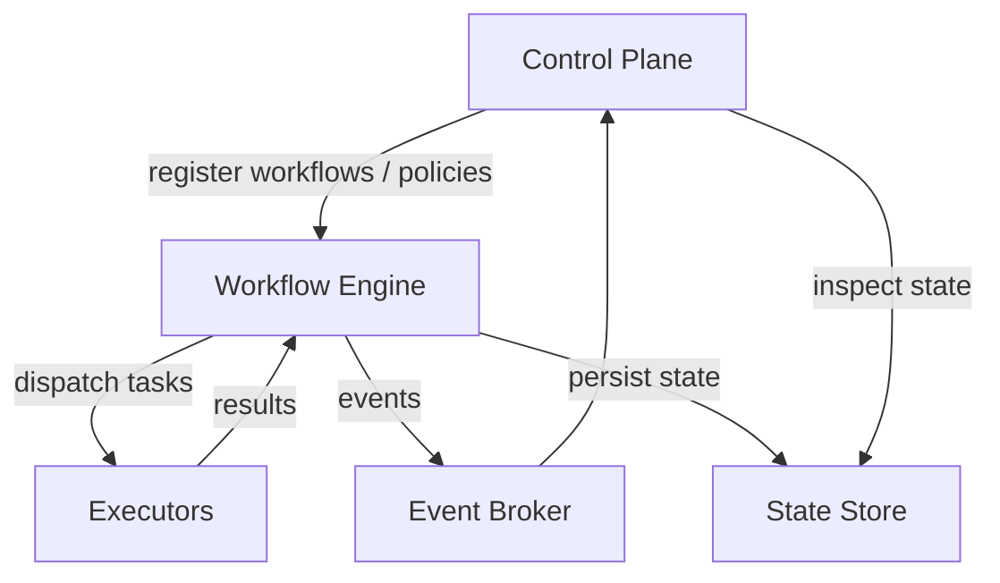
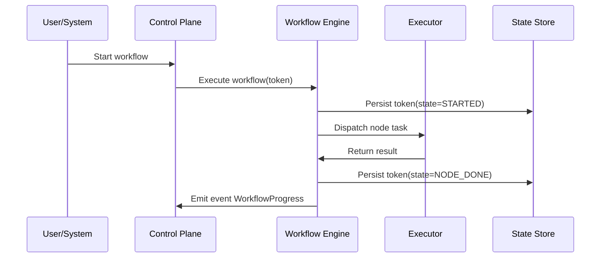
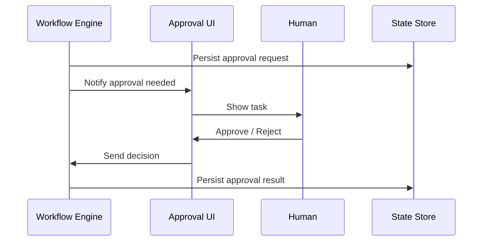
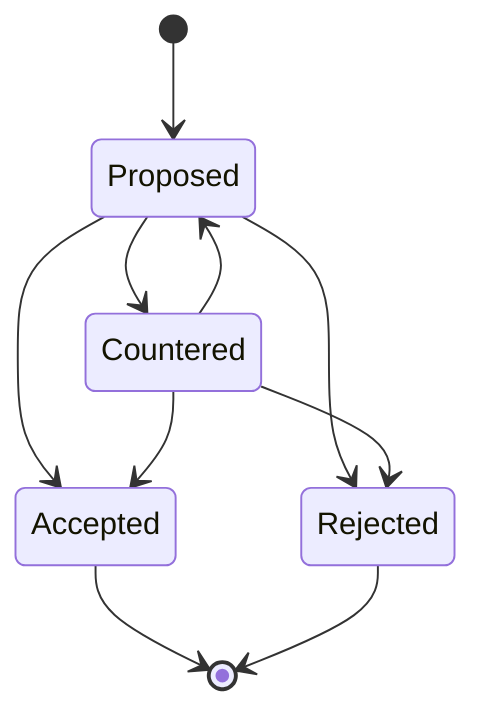
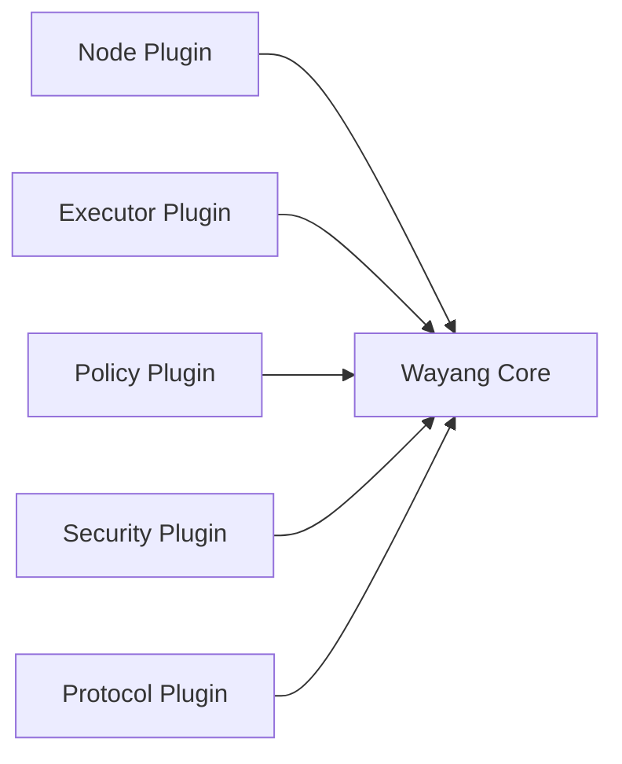
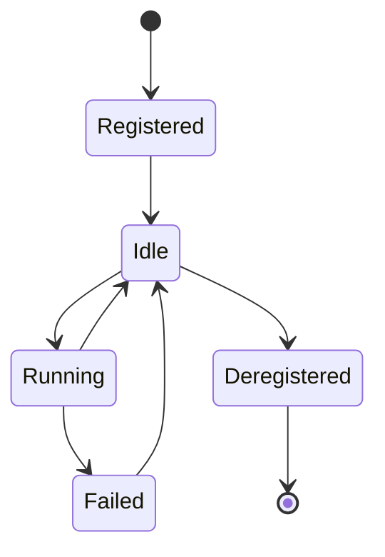
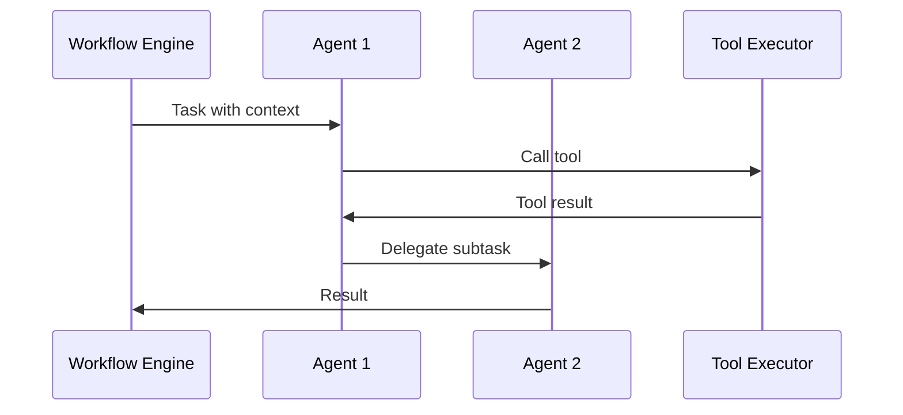

## 1. High-Level Architecture



---

## 2. Workflow Execution Flow



---

## 3. Approval (Human-in-the-Loop)



---

## 4. Negotiation Flow



---

## 5. Plugin Model



---

## 6. Executor Lifecycle



---

## 7. Agent-Oriented Workflow



---

Next and final doc:

**8️⃣ `README.md`** — top-level project introduction
(vision, what Wayang is, quick start, structure)

Say **Next** and I’ll generate your `README.md` 🚀


Boom 💥
Here is your **8️⃣ `README.md`** — the front door of the Wayang platform.

This is written as:

* Clear
* Technical but visionary
* Repo-ready
* Open-source friendly

---

```md
# Wayang Platform

Wayang is a **distributed orchestration and negotiation platform** designed to coordinate workflows, agents, humans, and services across heterogeneous systems.

Wayang acts as:
- A workflow engine  
- A control plane  
- A negotiation coordinator  
- An executor fabric  
- An AI agent orchestrator  

All in one coherent system.

---

## ✨ Key Features

- Workflow orchestration (DAG and cyclic)
- Human-in-the-loop approvals
- Negotiation and marketplace logic
- Pluggable executors (services, agents, humans)
- Event-driven execution
- Plugin-based extensibility
- Multi-tenant and policy-aware
- AI and agent-native design

---

## 🧠 Core Concepts

Wayang is built around:

- **Workflows** – Directed graphs of steps  
- **Nodes** – Executable units  
- **Executors** – Workers that perform tasks  
- **Tokens** – Stateful execution instances  
- **Policies** – Rules governing execution  
- **Approvals** – Human decisions  
- **Negotiation** – Multi-party agreement  
- **Plugins** – Extension mechanism  

See [`CONCEPTS.md`](./CONCEPTS.md) for details.

---

## 🏗 Architecture

Wayang uses a layered architecture:

```

Control Plane
↓
Workflow Engine
↓
Executors

```

With:
- State store
- Event bus
- Plugin system
- Security layer

See [`ARCHITECTURE.md`](./ARCHITECTURE.md).

---

## 🔌 Plugin System

Wayang is plugin-first.

Everything extensible:
- Node types
- Executors
- Policies
- Protocols
- Persistence
- Security

See [`PLUGINS.md`](./PLUGINS.md).

---

## 🧑‍💻 Executors

Executors may be:
- Microservices
- Containers
- Serverless
- AI agents
- Humans
- External systems

See [`EXECUTORS.md`](./EXECUTORS.md).

---

## 📡 Protocols

Wayang supports:
- REST
- gRPC
- Kafka / NATS / AMQP
- Webhooks
- Streaming

See [`PROTOCOLS.md`](./PROTOCOLS.md).

---

## 🔐 Security

Wayang is secure-by-design:
- Identity for all actors
- Policy-driven execution
- Auditable state
- Isolated plugins
- Trusted executors

See [`SECURITY.md`](./SECURITY.md).

---

## 🧩 Skills

Wayang exposes its capabilities as **skills**:

- `workflow.orchestrate`
- `executor.dispatch`
- `policy.evaluate`
- `agent.orchestrate`
- `negotiation.coordinate`
- `state.manage`

See [`SKILLS.md`](./SKILLS.md).

---

## 📊 Diagrams

Architecture and flow diagrams are available in Mermaid format.

See:
- `ARCHITECTURE.md`
- Mermaid diagrams section

---

## 🚀 Getting Started (Conceptual)

1. Define a workflow
2. Register executors
3. Configure policies
4. Start execution
5. Observe results
6. Handle approvals
7. Persist state

(Concrete implementation coming soon.)

---

## 🧭 Design Philosophy

Wayang follows:

- Protocol agnostic design
- Event-driven execution
- Plugin-first architecture
- Human + AI cooperation
- Explicit state transitions
- Federation-ready

Wayang treats:
> **orchestration as a first-class system capability**

---

## 🗂 Repository Structure

```

/docs
ARCHITECTURE.md
CONCEPTS.md
EXECUTORS.md
PLUGINS.md
PROTOCOLS.md
SECURITY.md
SKILLS.md
/src
/plugins
/examples

```

---

## 🛣 Roadmap

- Workflow DSL
- Executor SDK
- Plugin registry
- UI for approvals
- Federation support
- Cost and SLA optimization
- Compliance plugins
- Agent marketplace

---

## 📜 License

Apache 2.0 (or your choice)

---

## 🌏 Vision

Wayang is designed to be:

- A workflow engine  
- A negotiation engine  
- A marketplace coordinator  
- An agent orchestration platform  
- A distributed control plane  

Wayang is not just about running tasks.

It is about coordinating **intent**, **actors**, and **state** across systems.

---

## 🤝 Contributing

Contributions are welcome.

You can help by:
- Writing plugins
- Improving docs
- Building executors
- Creating workflows
- Adding integrations

---

## 🧠 Name Meaning

*Wayang* refers to traditional shadow puppetry:
- Many actors
- One story
- Coordinated movement
- Hidden control

Just like this system.

---