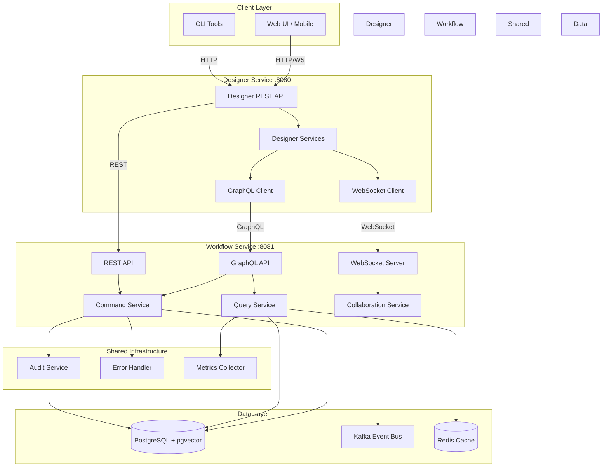
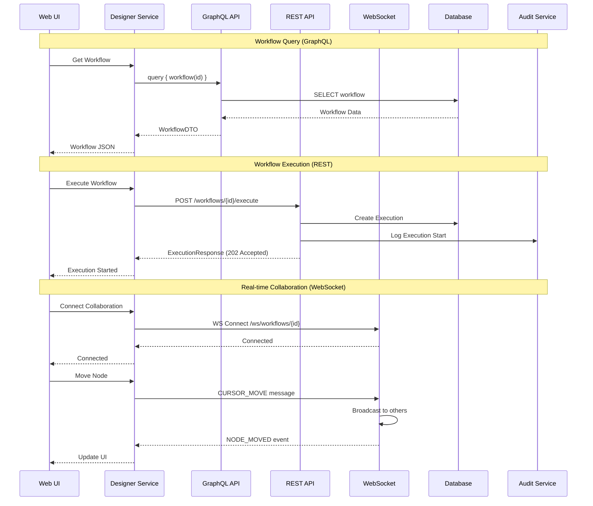
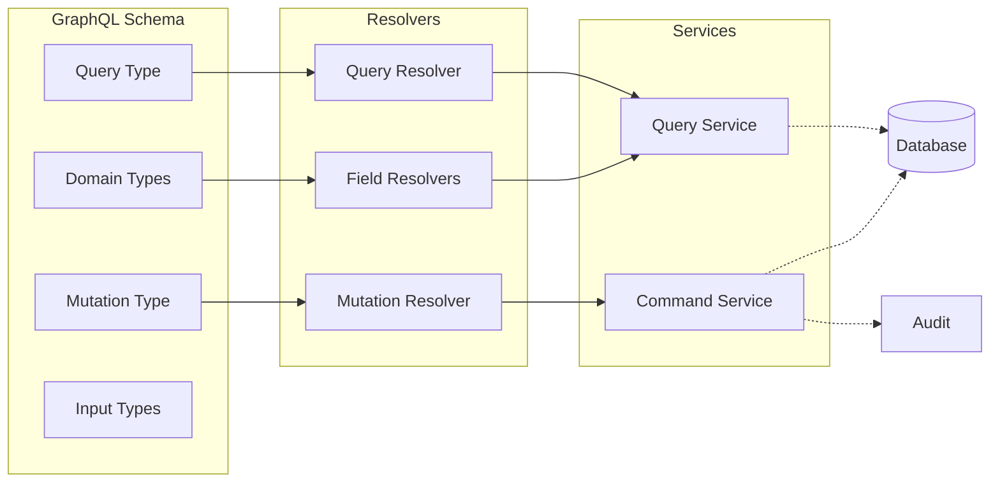
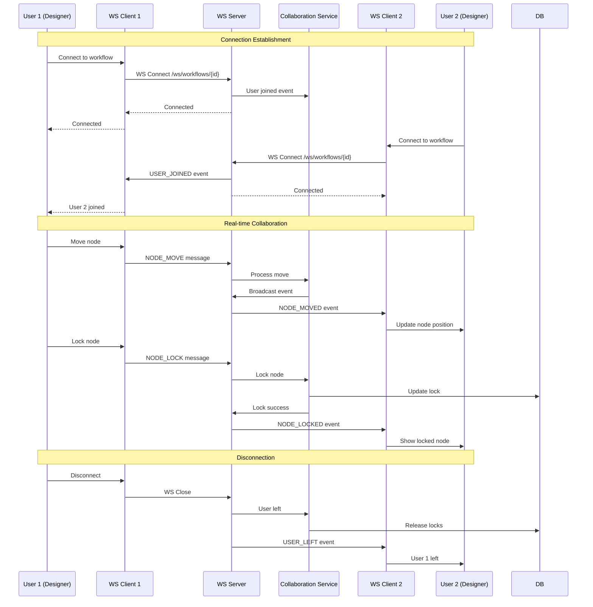
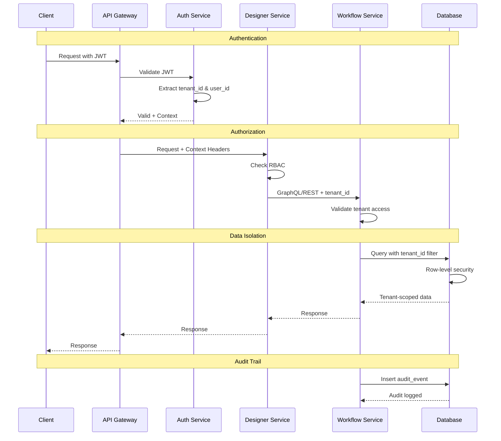
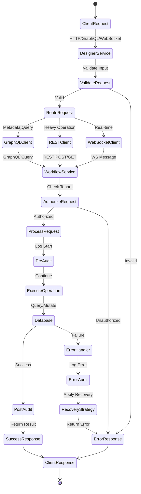
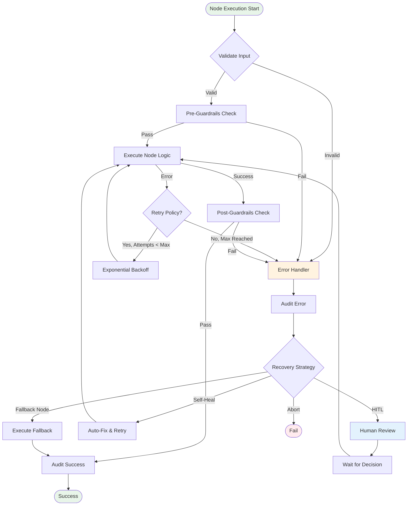

# Wayang Platform - Architecture Diagrams

## 1. High-Level Service Architecture



## 2. API Communication Flow



## 3. Designer Service Internal Architecture

```mermaid
graph LR
    subgraph "Designer Service"
        API[REST Controllers]
        
        subgraph "Service Layer"
            WF_SVC[Workflow Service]
            NODE_SVC[Node Service]
            VAL_SVC[Validation Service]
            DIFF_SVC[Diff Service]
        end
        
        subgraph "Client Layer"
            GQL_CLIENT[GraphQL Client]
            REST_CLIENT[REST Client]
            WS_CLIENT[WebSocket Client]
        end
        
        subgraph "Support"
            MAPPER[DTO Mapper]
            CACHE[Local Cache]
            ERROR[Error Handler]
        end
    end
    
    API --> WF_SVC
    API --> NODE_SVC
    API --> VAL_SVC
    API --> DIFF_SVC
    
    WF_SVC --> GQL_CLIENT
    WF_SVC --> REST_CLIENT
    WF_SVC --> WS_CLIENT
    
    NODE_SVC --> GQL_CLIENT
    VAL_SVC --> GQL_CLIENT
    DIFF_SVC --> GQL_CLIENT
    
    WF_SVC --> MAPPER
    WF_SVC --> CACHE
    WF_SVC --> ERROR
    
    GQL_CLIENT -.->|GraphQL| WORKFLOW_SERVICE
    REST_CLIENT -.->|REST| WORKFLOW_SERVICE
    WS_CLIENT -.->|WebSocket| WORKFLOW_SERVICE
    
    style "Designer Service" fill:#e1f5ff
```

## 4. Workflow Service Internal Architecture

```mermaid
graph TB
    subgraph "Workflow Service"
        subgraph "API Layer"
            GQL_API[GraphQL API<br/>Queries & Mutations]
            REST_API[REST API<br/>Operations]
            WS_API[WebSocket API<br/>Collaboration]
        end
        
        subgraph "Service Layer"
            CMD[Command Service<br/>Write Operations]
            QRY[Query Service<br/>Read Operations]
            COLLAB[Collaboration Service<br/>Real-time]
            VAL[Validation Service]
        end
        
        subgraph "Domain Layer"
            MAPPER[Entity Mapper]
            VALIDATOR[Workflow Validator]
            DIFF[Diff Engine]
        end
        
        subgraph "Infrastructure"
            REPO[Repository Layer]
            AUDIT[Audit Service]
            ERROR[Error Handler]
            LOCK[Lock Manager]
        end
        
        subgraph "Data Store"
            PG[(PostgreSQL)]
            REDIS[(Redis Cache)]
            KAFKA[Kafka Events]
        end
    end
    
    GQL_API --> CMD
    GQL_API --> QRY
    REST_API --> CMD
    WS_API --> COLLAB
    
    CMD --> VAL
    CMD --> MAPPER
    CMD --> REPO
    CMD --> AUDIT
    CMD --> ERROR
    CMD --> LOCK
    
    QRY --> MAPPER
    QRY --> REPO
    QRY --> ERROR
    
    COLLAB --> CMD
    COLLAB --> LOCK
    COLLAB --> KAFKA
    
    VAL --> VALIDATOR
    QRY --> DIFF
    
    REPO --> PG
    QRY --> REDIS
    AUDIT --> PG
    
    style "Workflow Service" fill:#fff4e1
```

## 5. GraphQL API Structure



## 6. WebSocket Collaboration Flow



## 7. Error Handling & Audit Flow

```mermaid
graph TB
    subgraph "Request Flow"
        REQ[Client Request]
        SVC[Service Method]
        REPO[Repository]
    end
    
    subgraph "Error Handling"
        CATCH[Try-Catch Block]
        TRANSFORM[Exception Transformer]
        HANDLER[Error Handler Service]
        RECOVERY[Recovery Strategy]
    end
    
    subgraph "Audit Trail"
        PRE_AUDIT[Pre-Operation Audit]
        POST_AUDIT[Post-Operation Audit]
        ERROR_AUDIT[Error Audit]
        AUDIT_DB[(Audit Database)]
    end
    
    subgraph "Response"
        SUCCESS[Success Response]
        ERROR_RESP[Error Response]
    end
    
    REQ --> SVC
    SVC --> PRE_AUDIT
    PRE_AUDIT --> REPO
    
    REPO -->|Success| POST_AUDIT
    POST_AUDIT --> SUCCESS
    
    REPO -->|Error| CATCH
    CATCH --> TRANSFORM
    TRANSFORM --> HANDLER
    HANDLER --> ERROR_AUDIT
    ERROR_AUDIT --> RECOVERY
    RECOVERY --> ERROR_RESP
    
    PRE_AUDIT --> AUDIT_DB
    POST_AUDIT --> AUDIT_DB
    ERROR_AUDIT --> AUDIT_DB
    
    style "Error Handling" fill:#ffebee
    style "Audit Trail" fill:#e8f5e9
```

## 8. Data Model Relationships

```mermaid
erDiagram
    WORKFLOW ||--o{ NODE : contains
    WORKFLOW ||--o{ CONNECTION : contains
    WORKFLOW ||--|| UI_DEFINITION : has
    WORKFLOW ||--|| RUNTIME_CONFIG : has
    WORKFLOW ||--o{ VERSION : has
    WORKFLOW ||--o{ EXECUTION : executes
    
    NODE ||--o{ PORT_DESCRIPTOR : has
    NODE ||--o{ NODE_LOCK : locked_by
    
    CONNECTION }o--|| NODE : from
    CONNECTION }o--|| NODE : to
    
    EXECUTION ||--o{ NODE_EXECUTION : contains
    EXECUTION ||--o{ AUDIT_EVENT : logs
    
    WORKFLOW {
        uuid id PK
        string version
        string name
        string tenant_id
        enum status
        timestamp created_at
        jsonb logic
        jsonb ui
        jsonb runtime
    }
    
    NODE {
        string id PK
        string type
        string name
        jsonb properties
        boolean locked
        string locked_by
    }
    
    CONNECTION {
        string id PK
        string from FK
        string to FK
        string from_port
        string to_port
        string condition
    }
    
    EXECUTION {
        uuid id PK
        uuid workflow_id FK
        enum status
        timestamp started_at
        timestamp completed_at
        jsonb outputs
    }
    
    AUDIT_EVENT {
        uuid id PK
        string event_type
        string entity_id
        string user_id
        string tenant_id
        jsonb metadata
        timestamp created_at
    }
```

## 9. Deployment Architecture

```mermaid
graph TB
    subgraph "Load Balancer"
        LB[Nginx / ALB]
    end
    
    subgraph "Designer Service Cluster"
        DS1[Designer Pod 1]
        DS2[Designer Pod 2]
        DS3[Designer Pod 3]
    end
    
    subgraph "Workflow Service Cluster"
        WF1[Workflow Pod 1]
        WF2[Workflow Pod 2]
        WF3[Workflow Pod 3]
    end
    
    subgraph "Data Layer"
        PG_PRIMARY[(PostgreSQL Primary)]
        PG_REPLICA[(PostgreSQL Replica)]
        REDIS_CLUSTER[(Redis Cluster)]
        KAFKA_CLUSTER[Kafka Cluster]
    end
    
    subgraph "Observability"
        PROMETHEUS[Prometheus]
        GRAFANA[Grafana]
        JAEGER[Jaeger Tracing]
    end
    
    LB --> DS1
    LB --> DS2
    LB --> DS3
    
    DS1 --> WF1
    DS1 --> WF2
    DS1 --> WF3
    
    DS2 --> WF1
    DS2 --> WF2
    DS2 --> WF3
    
    DS3 --> WF1
    DS3 --> WF2
    DS3 --> WF3
    
    WF1 --> PG_PRIMARY
    WF2 --> PG_REPLICA
    WF3 --> PG_REPLICA
    
    WF1 --> REDIS_CLUSTER
    WF2 --> REDIS_CLUSTER
    WF3 --> REDIS_CLUSTER
    
    WF1 --> KAFKA_CLUSTER
    WF2 --> KAFKA_CLUSTER
    WF3 --> KAFKA_CLUSTER
    
    DS1 -.->|Metrics| PROMETHEUS
    DS2 -.->|Metrics| PROMETHEUS
    DS3 -.->|Metrics| PROMETHEUS
    
    WF1 -.->|Metrics| PROMETHEUS
    WF2 -.->|Metrics| PROMETHEUS
    WF3 -.->|Metrics| PROMETHEUS
    
    PROMETHEUS --> GRAFANA
    
    WF1 -.->|Traces| JAEGER
    WF2 -.->|Traces| JAEGER
    WF3 -.->|Traces| JAEGER
    
    style "Designer Service Cluster" fill:#e1f5ff
    style "Workflow Service Cluster" fill:#fff4e1
    style "Data Layer" fill:#e8f5e9
    style "Observability" fill:#f3e5f5
```

## 10. Security & Multi-tenancy Flow



## 11. Complete Request Lifecycle



## 12. Node Execution with Error Handling



---

## Summary

These diagrams cover:

1. **High-level architecture** - Service boundaries and communication
2. **API flows** - GraphQL, REST, WebSocket interactions
3. **Internal architectures** - Designer and Workflow service internals
4. **Collaboration** - Real-time WebSocket messaging
5. **Error handling** - Comprehensive error flow with audit
6. **Data model** - Entity relationships
7. **Deployment** - Kubernetes cluster architecture
8. **Security** - Multi-tenancy and authentication flow
9. **Request lifecycle** - Complete end-to-end state machine
10. **Node execution** - Error handling and recovery patterns

Each diagram provides a different view of the system for different stakeholders (developers, architects, DevOps, security teams).