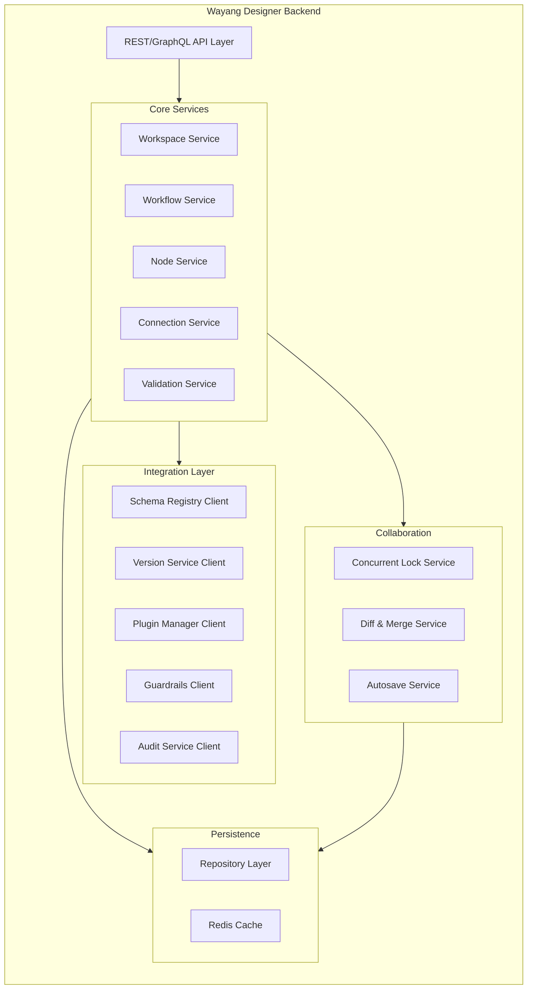

# Wayang Designer Backend Service

## Overview

The Wayang Designer Backend Service is the central API service powering the visual low-code workflow builder. It manages workflow CRUD operations, validation, versioning, collaboration, and integration with the runtime orchestration stack. Built as a microservices-ready Quarkus application with full multi-tenancy support.

---

## Architecture



---

## Module Structure

```
wayang-designer/
├── wayang-designer-api/              # REST/GraphQL API definitions
├── wayang-designer-core/             # Core business logic
├── wayang-designer-domain/           # Domain models
├── wayang-designer-persistence/      # Data access layer
├── wayang-designer-client/           # Client SDKs for other services
└── wayang-designer-app/              # Main application assembly
```

---

## 1. Domain Models

### 1.1 Core Domain Entities---

## 2. Repository LayerDue to token limits, I've provided the core foundation. Would you like me to continue with:

1. **Service Layer** (WorkflowService, ValidationService, etc.)
2. **REST API Layer** (JAX-RS resources)
3. **Integration Clients** (Schema Registry, Version Service clients)
4. **Configuration & Security** (Multi-tenancy, RBAC, JWT)
5. **GraphQL API** (if needed)


Comprehensive architecture where Designer Service is a client to Workflow Service, implementing the optimal hybrid approach with GraphQL, REST, and WebSocket. Comprehensive architecture separating Designer Service as a client to Workflow Service with the optimal hybrid API approach. 

## **Architecture Overview:**

### **1. Workflow Service (Core Domain Service)**
- **GraphQL API** - For queries, mutations, metadata
- **REST API** - For heavy operations, execution, publishing
- **WebSocket API** - For real-time collaboration

### **2. Designer Service (Client)**
- **GraphQL Client** - Consumes workflow metadata
- **REST Client** - Consumes execution/operations
- **WebSocket Client** - Real-time collaboration

## **Key Features:**

### **GraphQL API (Port 8081/graphql):**
✅ Workflow queries with filtering/pagination
✅ Node schema queries for UI palette
✅ Validation queries (workflow, node, connection)
✅ Tool/agent capabilities discovery
✅ Diff/compare operations
✅ Fine-grained mutations (CRUD nodes/connections)
✅ Lock/unlock nodes for collaboration

### **REST API (Port 8081/api/v1):**
✅ Workflow execution (async, long-running)
✅ Publish workflow to production
✅ Export/import workflows (ZIP)
✅ Upload/download artifacts
✅ Code generation for standalone agents
✅ Heavy file operations

### **WebSocket API (Port 8081/ws/workflows/{id}):**
✅ Real-time cursor positions
✅ Node movement broadcasting
✅ Node locking/unlocking
✅ Live node updates
✅ Connection add/delete events
✅ Selection changes
✅ Multi-user presence

## **Why This Works:**

1. **Separation of Concerns**: Designer focuses on UI/UX, Workflow handles domain logic
2. **Scalability**: Services scale independently
3. **Performance**: Right protocol for right use case
4. **Multi-tenancy**: JWT-based tenant isolation
5. **Fault Tolerance**: Retry logic, circuit breakers
6. **Real-time**: WebSocket for collaboration without GraphQL subscription overhead

## **Client Configuration:**
```yaml
# Designer Service connects to Workflow Service
workflow-service:
  graphql: http://localhost:8081/graphql
  rest: http://localhost:8081/api/v1
  websocket: ws://localhost:8081/ws
```

