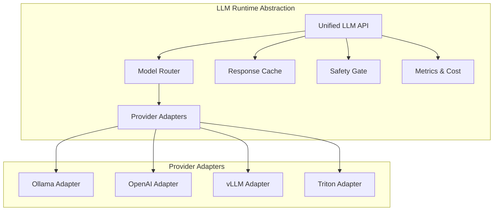

## Architecture Overview

```mermaid
flowchart TB
    subgraph "LLM Runtime Abstraction"
        API[Unified LLM API]
        Router[Model Router]
        Adapters[Provider Adapters]
        Cache[Response Cache]
        Safety[Safety Gate]
        Metrics[Metrics & Cost]
    end
    
    subgraph "Provider Adapters"
        Ollama[Ollama Adapter]
        OpenAI[OpenAI Adapter]
        vLLM[vLLM Adapter]
        Triton[Triton Adapter]
    end
    
    API --> Router
    Router --> Adapters
    Adapters --> Ollama
    Adapters --> OpenAI
    Adapters --> vLLM
    Adapters --> Triton
    API --> Cache
    API --> Safety
    API --> Metrics
```