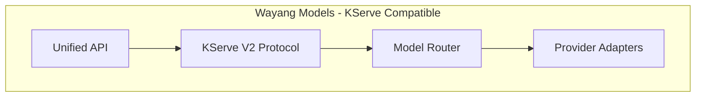

## 6. Example KServe Requests

**File:** `examples/kserve-inference-request.json`

```json
{
  "id": "550e8400-e29b-41d4-a716-446655440000",
  "model_name": "llama3-8b",
  "model_version": "1.0",
  "inputs": [
    {
      "name": "prompt",
      "shape": [1],
      "datatype": "BYTES",
      "data": ["Explain quantum computing in simple terms."]
    }
  ],
  "parameters": {
    "max_tokens": 200,
    "temperature": 0.7,
    "top_p": 0.9,
    "tenant_id": "acme-corp"
  }
}
```

**File:** `examples/kserve-chat-request.json`

```json
{
  "id": "550e8400-e29b-41d4-a716-446655440001",
  "model_name": "gpt-4",
  "inputs": [
    {
      "name": "messages",
      "shape": [3, 2],
      "datatype": "BYTES",
      "data": [
        {"role": "system", "content": "You are a helpful assistant."},
        {"role": "user", "content": "What is the capital of France?"},
        {"role": "assistant", "content": "The capital of France is Paris."},
        {"role": "user", "content": "What is its population?"}
      ]
    }
  ],
  "parameters": {
    "max_tokens": 150,
    "temperature": 0.5
  }
}
```

---

## 7. Documentation

**File:** `wayang-models/KSERVE.md`

```markdown
# KServe V2 Protocol Support

Wayang Models implements the KServe V2 inference protocol, making it compatible with KServe deployments and model serving infrastructure.

## Protocol Specification

Based on: https://kserve.github.io/website/docs/concepts/architecture/data-plane/v2-protocol

## Endpoints

### Server Health

```bash
# Liveness
curl http://localhost:8080/v2/health/live

# Readiness
curl http://localhost:8080/v2/health/ready
```

### Server Metadata

```bash
curl http://localhost:8080/v2
```

### Model Operations

```bash
# Model metadata
curl http://localhost:8080/v2/models/llama3-8b

# Model readiness
curl http://localhost:8080/v2/models/llama3-8b/ready

# Model inference
curl -X POST http://localhost:8080/v2/models/llama3-8b/infer \
  -H "Content-Type: application/json" \
  -d @examples/kserve-inference-request.json
```

## Tensor Formats

### Input Tensors

- **prompt**: Text prompt (BYTES, shape: [1])
- **messages**: Chat messages (BYTES, shape: [-1, -1])

### Output Tensors

- **text_output**: Generated text (BYTES, shape: [-1])
- **token_count**: Token usage (INT64, shape: [1])

## Parameters

Supported parameters in the `parameters` field:

- `max_tokens`: Maximum tokens to generate
- `temperature`: Sampling temperature (0.0 - 2.0)
- `top_p`: Nucleus sampling parameter
- `top_k`: Top-K sampling parameter
- `stream`: Enable streaming (boolean)
- `tenant_id`: Tenant identifier
- `type`: Request type (chat, completion, embedding)

## Example Usage

### Python Client

```python
import requests
import json

url = "http://localhost:8080/v2/models/llama3-8b/infer"

payload = {
    "id": "req-123",
    "inputs": [{
        "name": "prompt",
        "shape": [1],
        "datatype": "BYTES",
        "data": ["Hello, world!"]
    }],
    "parameters": {
        "max_tokens": 100,
        "temperature": 0.7
    }
}

response = requests.post(url, json=payload)
print(json.dumps(response.json(), indent=2))
```

### curl

```bash
curl -X POST http://localhost:8080/v2/models/llama3-8b/infer \
  -H "Content-Type: application/json" \
  -d '{
    "id": "req-123",
    "inputs": [{
      "name": "prompt",
      "shape": [1],
      "datatype": "BYTES",
      "data": ["Hello, world!"]
    }],
    "parameters": {
      "max_tokens": 100,
      "temperature": 0.7
    }
  }'
```

## Deployment with KServe

### InferenceService YAML

```yaml
apiVersion: serving.kserve.io/v1beta1
kind: InferenceService
metadata:
  name: wayang-models
spec:
  predictor:
    containers:
    - name: kserve-container
      image: kayys/wayang-models:latest
      ports:
      - containerPort: 8080
        protocol: TCP
      env:
      - name: PROTOCOL
        value: "v2"
```

## Compatibility

- ✅ KServe V2 Protocol
- ✅ Triton Inference Server compatible
- ✅ TorchServe compatible
- ✅ TensorFlow Serving compatible

## Features

- Full V2 protocol implementation
- Text generation support
- Chat completion support
- Embedding support
- Streaming responses
- Multi-tenant support
- Cost tracking
- Safety filtering
- Metrics and observability
```
