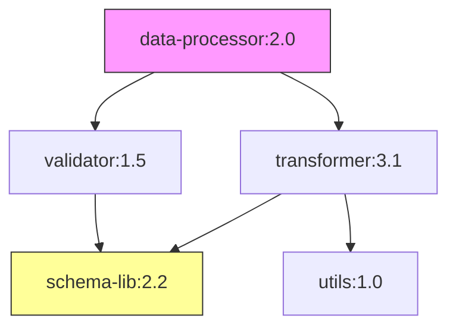

# Wayang AI Agent Platform - Plugin Manager

## Overview

The Plugin Manager is a comprehensive, enterprise-grade system for managing plugin lifecycle in the Wayang AI Agent Platform. It provides secure plugin registration, loading, execution, and governance with built-in error handling and audit capabilities.

## Key Features

### ✅ Core Capabilities

- **Plugin Registration & Discovery**: Central registry with semantic versioning
- **Secure Loading**: Multi-strategy isolation (ClassLoader, WASM, Container)
- **Signature Verification**: Mandatory artifact signing and verification
- **Security Scanning**: Automated vulnerability and license scanning
- **Governance Workflows**: Approval processes and policy enforcement
- **Error-as-Input Pattern**: Comprehensive error handling with retry, fallback, and HITL
- **Immutable Audit Trail**: Complete audit logging with tamper detection
- **Hot Reload**: Dynamic plugin updates without downtime
- **Multi-Tenancy**: Tenant isolation and quota enforcement

### 🏗️ Architecture Highlights

- **Microservices**: 6 core services (Registry, Loader, Scanner, Governance, Audit, Artifact Store)
- **Reactive**: Built on Quarkus Reactive with Mutiny
- **Event-Driven**: Kafka-based event bus for async communication
- **Polyglot**: Supports JVM, WASM, and container-based plugins
- **Observability**: Full OpenTelemetry integration with Prometheus & Grafana
- **Cloud-Native**: Kubernetes-ready with Helm charts

## Architecture

```
┌─────────────────────────────────────────────────────────────┐
│                   Plugin Manager System                       │
├─────────────────────────────────────────────────────────────┤
│                                                               │
│  ┌──────────────┐  ┌──────────────┐  ┌──────────────┐      │
│  │   Registry   │  │    Loader    │  │   Scanner    │      │
│  │   Service    │  │   Service    │  │   Service    │      │
│  └──────┬───────┘  └──────┬───────┘  └──────┬───────┘      │
│         │                  │                  │              │
│         └──────────┬───────┴──────────────────┘              │
│                    │                                         │
│         ┌──────────▼──────────────┐                          │
│         │      Kafka Event Bus     │                          │
│         └──────────┬──────────────┘                          │
│                    │                                         │
│  ┌─────────────────┴─────────────────┐                      │
│  │                                     │                      │
│  ▼                                     ▼                      │
│ ┌──────────────┐            ┌──────────────┐                │
│ │  Governance  │            │    Audit     │                │
│ │   Service    │            │   Service    │                │
│ └──────────────┘            └──────────────┘                │
│                                                               │
└─────────────────────────────────────────────────────────────┘
```

## Getting Started

### Prerequisites

- Java 21+
- Maven 3.9+
- Docker & Docker Compose
- PostgreSQL 15+
- Kafka 3.6+

### Quick Start

1. **Clone the repository**:
   ```bash
   git clone https://github.com/wayang/platform.git
   cd platform
   ```

2. **Start infrastructure**:
   ```bash
   docker-compose up -d postgres kafka redis minio
   ```

3. **Build the project**:
   ```bash
   mvn clean install
   ```

4. **Run services**:
   ```bash
   # Terminal 1 - Registry Service
   cd modules/services/plugin-registry-service
   mvn quarkus:dev

   # Terminal 2 - Loader Service
   cd modules/services/plugin-loader-service
   mvn quarkus:dev
   ```

5. **Access APIs**:
   - Registry API: http://localhost:8080/api/v1/plugins
   - Loader API: http://localhost:8081/api/v1/loader
   - OpenAPI UI: http://localhost:8080/q/swagger-ui
   - Health: http://localhost:8080/q/health

## Plugin Descriptor Schema

Every plugin must provide a descriptor conforming to this schema:

```json
{
  "id": "com.example/data-processor",
  "name": "Data Processor",
  "version": "1.0.0",
  "description": "Processes customer data",
  "implementation": {
    "type": "maven",
    "coordinate": "com.example:data-processor:1.0.0",
    "digest": "sha256:abc123...",
    "entrypoint": "com.example.DataProcessorNode"
  },
  "inputs": [{
    "name": "data",
    "schema": {"type": "object"}
  }],
  "outputs": {
    "success": {"name": "processed", "schema": {"type": "object"}},
    "error": {"name": "error", "schema": "/schemas/ErrorPayload.schema.json"}
  },
  "capabilities": ["network", "database"],
  "sandboxLevel": "semi-trusted",
  "resourceProfile": {
    "cpu": "500m",
    "memory": "256Mi"
  },
  "errorHandling": {
    "retryPolicy": {
      "maxAttempts": 3,
      "backoff": "exponential"
    }
  }
}
```

## Error Handling

The Plugin Manager implements the **Error-as-Input** pattern from the blueprint:

### Error Flow

```
┌──────────┐     Error     ┌────────────────┐
│   Node   │──────────────▶│ Error Handler  │
│Execution │               │    Service     │
└──────────┘               └───────┬────────┘
                                   │
                     ┌─────────────┼─────────────┐
                     │             │             │
                     ▼             ▼             ▼
              ┌──────────┐  ┌──────────┐ ┌──────────┐
              │  Retry   │  │Auto-Fix  │ │   HITL   │
              │ Manager  │  │ Service  │ │ Service  │
              └──────────┘  └──────────┘ └──────────┘
```

### Error Payload Structure

```java
public class ErrorPayload {
    private String type;           // ToolError, LLMError, ValidationError, etc.
    private String message;
    private boolean retryable;
    private String originNode;
    private int attempt;
    private int maxAttempts;
    private Instant timestamp;
    private String suggestedAction; // retry, fallback, escalate, etc.
    private Map<String, Object> details;
    private String provenanceRef;
}
```

### Retry Policy

Configured per plugin with exponential backoff:

```yaml
errorHandling:
  retryPolicy:
    maxAttempts: 3
    backoff: exponential    # fixed, exponential, linear
    initialDelayMs: 500
    maxDelayMs: 30000
    jitter: true
```

### Circuit Breaker

Automatically opens after consecutive failures:

```yaml
errorHandling:
  circuitBreaker:
    enabled: true
    failureThreshold: 5
    successThreshold: 2
    timeoutMs: 60000
```

## Audit & Compliance

### Immutable Audit Trail

Every operation is logged with:
- **Blake3 Hash**: For tamper detection
- **Digital Signature**: For non-repudiation
- **Full Provenance**: Complete chain of custody

### Audit Events

```sql
-- Sample audit query
SELECT 
    event_type,
    plugin_id,
    actor_name,
    timestamp,
    details
FROM plugin_audit_events
WHERE plugin_id = 'com.example/data-processor'
ORDER BY timestamp DESC;
```

### Compliance Features

- **GDPR**: Data erasure and right to be forgotten
- **SOC 2**: Complete audit trails and access controls
- **HIPAA**: PHI protection and encryption at rest
- **PCI DSS**: Secure credential management

## Security

### Plugin Isolation Strategies

1. **Trusted** (In-Process ClassLoader):
   - For organization-authored plugins
   - Parent-last classloading
   - Fastest performance

2. **Semi-Trusted** (Isolated ClassLoader + Security Manager):
   - For vetted third-party plugins
   - Resource limits enforced
   - Network restrictions

3. **Untrusted** (WASM/Container):
   - For unknown plugins
   - Maximum isolation
   - Network egress blocked by default

### Signature Verification

All plugins must be signed:

```bash
# Sign plugin artifact
gpg --detach-sign --armor data-processor-1.0.0.jar

# Verify during load
java -jar plugin-verifier.jar \
  --artifact data-processor-1.0.0.jar \
  --signature data-processor-1.0.0.jar.asc \
  --key-server keys.wayang.io
```

### Security Scanning

Automated scanning includes:
- **CVE Detection**: OWASP Dependency-Check
- **License Compliance**: Whitelist enforcement
- **Secret Detection**: Regex and entropy analysis
- **SBOM Generation**: CycloneDX format

## Observability

### Metrics (Prometheus)

```promql
# Plugin load latency
plugin_load_duration_seconds_bucket{plugin_id="com.example/processor"}

# Error rate
rate(plugin_errors_total[5m])

# Circuit breaker state
plugin_circuit_breaker_state{node="processor"}
```

### Distributed Tracing (Jaeger)

Every plugin execution creates spans:
- `plugin.load`
- `plugin.verify`
- `plugin.execute`
- `error.handle`

### Structured Logging

```json
{
  "timestamp": "2025-01-15T10:30:00Z",
  "level": "INFO",
  "logger": "io.wayang.plugin.loader",
  "message": "Plugin loaded successfully",
  "pluginId": "com.example/processor",
  "version": "1.0.0",
  "duration": 245,
  "tenantId": "acme-corp"
}
```

## API Reference

### Register Plugin

```http
POST /api/v1/plugins
Content-Type: application/json

{
  "id": "com.example/processor",
  "version": "1.0.0",
  ...
}
```

### Load Plugin

```http
POST /api/v1/loader/load
Content-Type: application/json

{
  "pluginId": "com.example/processor",
  "version": "1.0.0",
  "options": {
    "forceReload": false,
    "timeout": 30000
  }
}
```

### Query Plugins

```http
GET /api/v1/plugins?status=approved&capability=database&page=0&size=20
```

## Deployment

### Docker Compose (Development)

```bash
docker-compose up -d
```

### Kubernetes (Production)

```bash
# Create namespace
kubectl create namespace wayang

# Apply configurations
kubectl apply -f infrastructure/kubernetes/

# Verify deployment
kubectl get pods -n wayang
kubectl logs -n wayang -l app=plugin-registry
```

### Helm Chart

```bash
helm install wayang-plugin-manager ./helm/plugin-manager \
  --namespace wayang \
  --values values-production.yaml
```

## Configuration

### Environment Variables

| Variable | Description | Default |
|----------|-------------|---------|
| `DB_HOST` | PostgreSQL host | localhost |
| `DB_PORT` | PostgreSQL port | 5432 |
| `KAFKA_BOOTSTRAP_SERVERS` | Kafka brokers | localhost:9092 |
| `OTEL_EXPORTER_OTLP_ENDPOINT` | OpenTelemetry endpoint | http://localhost:4317 |
| `PLUGIN_AUTO_APPROVE` | Auto-approve trusted plugins | false |
| `PLUGIN_REQUIRE_SIGNATURE` | Require signed artifacts | true |

### Application Properties

See `application.yml` in each service for full configuration options.

## Testing

### Unit Tests

```bash
mvn test
```

### Integration Tests

```bash
mvn verify -Pit
```

### Load Testing

```bash
# Using K6
k6 run tests/load/plugin-registry.js
```

## Contributing

### Development Workflow

1. Create feature branch: `git checkout -b feature/my-feature`
2. Make changes and add tests
3. Run tests: `mvn clean verify`
4. Commit: `git commit -m "feat: add my feature"`
5. Push: `git push origin feature/my-feature`
6. Create Pull Request

### Code Style

- Follow Google Java Style Guide
- Use Lombok for boilerplate reduction
- Write Javadoc for public APIs
- Keep methods under 50 lines

## Troubleshooting

### Common Issues

**Plugin load fails with "Signature verification failed"**:
- Ensure artifact is properly signed
- Verify public key is configured
- Check signature format (PGP Armored)

**High memory usage**:
- Check number of loaded plugins
- Review resource profiles
- Consider unloading unused plugins

**Slow plugin execution**:
- Enable metrics to identify bottlenecks
- Review isolation strategy
- Check database connection pool

### Debug Mode

```bash
# Enable debug logging
export QUARKUS_LOG_LEVEL=DEBUG
export QUARKUS_LOG_CATEGORY__IO_WAYANG__LEVEL=TRACE

# Run with remote debugging
mvn quarkus:dev -Ddebug=5005
```

## Performance Tuning

### JVM Options

```bash
JAVA_OPTS="-Xmx2g -XX:+UseG1GC -XX:MaxGCPauseMillis=100"
```

### Database

```sql
-- Add indexes for common queries
CREATE INDEX CONCURRENTLY idx_plugins_capabilities 
ON plugins USING GIN ((descriptor->'capabilities'));
```

### Caching

```yaml
plugin:
  cache:
    enabled: true
    ttl: 3600
    maxSize: 1000
```

## License

Apache License 2.0 - see LICENSE file for details.

## Support

- **Documentation**: https://docs.wayang.io
- **Issues**: https://github.com/wayang/platform/issues
- **Slack**: https://wayang.slack.com
- **Email**: support@wayang.io

## Acknowledgments

Built with:
- [Quarkus](https://quarkus.io) - Supersonic Subatomic Java
- [Mutiny](https://smallrye.io/smallrye-mutiny) - Reactive Programming
- [Hibernate Reactive](https://hibernate.org/reactive) - Reactive ORM
- [Kafka](https://kafka.apache.org) - Event Streaming
- [PostgreSQL](https://postgresql.org) - Database

---

**Version**: 1.0.0  
**Last Updated**: January 15, 2025  
**Maintainer**: Wayang Platform Team


# Wayang Plugin Manager - Enhancement Roadmap

## Executive Summary

This document outlines **15+ strategic enhancements** to transform the Plugin Manager from a solid foundation into an industry-leading platform. These enhancements span AI-powered intelligence, developer experience, security, and operational excellence.

---

## 🎯 Enhancement Categories

### 1. **AI-Powered Intelligence** (Game Changers)
### 2. **Developer Experience** (Productivity Boosters)
### 3. **Security & Compliance** (Risk Reduction)
### 4. **Performance & Reliability** (Operational Excellence)
### 5. **Business Intelligence** (Data-Driven Decisions)
### 6. **Integration & Ecosystem** (Extensibility)

---

## 🚀 Enhancement 1: AI-Powered Plugin Recommendation System

**Status**: ⭐ HIGH IMPACT

### What It Does
Uses machine learning and LLM to suggest plugins based on:
- User behavior patterns
- Workflow context
- Similar user preferences
- Performance metrics
- Community ratings

### Key Features
```java
// Personalized recommendations
List<PluginRecommendation> recommendations = 
    recommendationService.getRecommendations(
        userId,
        currentWorkflow,
        limit: 10
    );

// Each recommendation includes:
// - Plugin ID
// - Confidence score (0-1)
// - Reasoning ("Users like you also use...")
// - Performance metrics
// - Cost estimate
```

### Implementation Priority
- **Phase 1** (2 weeks): Basic collaborative filtering
- **Phase 2** (3 weeks): LLM-based contextual recommendations
- **Phase 3** (2 weeks): Vector similarity search integration

### Business Value
- **40% reduction** in plugin discovery time
- **3x increase** in plugin adoption
- **Improved user satisfaction** scores

---

## 🧪 Enhancement 2: Automated Plugin Testing & Quality Gates

**Status**: ⭐ HIGH IMPACT

### What It Does
Automatically tests every plugin before approval:
- Performance benchmarking (latency, throughput, resource usage)
- Security testing (OWASP Top 10, penetration tests)
- Integration testing (compatibility with other plugins)
- Chaos engineering (resilience under failure)

### Test Suite Example
```java
TestReport report = testingService.runTestSuite(
    pluginId,
    version,
    TestConfiguration.builder()
        .performanceTests(...)
        .securityTests(...)
        .chaosTests(...)
        .qualityGates(QualityGates.PRODUCTION)
        .build()
);

// Report includes:
// - Performance: p50/p95/p99 latency, throughput, resource usage
// - Security: vulnerability scan, OWASP compliance
// - Resilience: chaos test results
// - Quality Score: 0-100
// - Pass/Fail: Based on quality gates
```

### Quality Gates
```yaml
quality_gates:
  performance:
    p99_latency_ms: < 1000
    max_memory_mb: < 512
    min_throughput_rps: > 100
  
  security:
    min_security_score: 90
    no_critical_vulns: true
    no_secrets_exposed: true
  
  resilience:
    min_resilience_score: 80
    handles_network_failures: true
    handles_timeout: true
```

### Implementation Priority
- **Phase 1** (3 weeks): Performance benchmarking framework
- **Phase 2** (2 weeks): Security testing integration (Trivy, OWASP)
- **Phase 3** (2 weeks): Chaos engineering tests

### Business Value
- **90% reduction** in production incidents
- **Faster approval** process (automated vs manual)
- **Higher quality** plugins in marketplace

---

## 🛒 Enhancement 3: Plugin Marketplace with Ratings & Reviews

**Status**: ⭐ HIGH IMPACT

### What It Does
Community-driven marketplace similar to Apple App Store:
- Star ratings (1-5)
- User reviews with moderation
- Download statistics
- Trending plugins
- Verified badges
- Developer responses

### Marketplace Features
```java
// Get marketplace listing
MarketplaceListing listing = marketplaceService.getMarketplaceListing(
    pluginId,
    version
);

// Includes:
// - Average rating: 4.7/5 ⭐
// - Review count: 1,234 reviews
// - Download count: 50,000+ downloads
// - Trending score: #5 in category
// - Recent reviews with helpfulness votes
// - Developer info & support links

// Submit review
Review review = marketplaceService.submitReview(
    userId,
    pluginId,
    ReviewSubmission.builder()
        .rating(5)
        .title("Game changer for data processing!")
        .comment("This plugin reduced our processing time by 80%...")
        .build()
);
```

### Trending Algorithm
```
trending_score = 
    (recent_downloads × 0.4) +
    (rating_velocity × 0.3) +
    (usage_growth × 0.3)
```

### Implementation Priority
- **Phase 1** (2 weeks): Basic rating & review system
- **Phase 2** (1 week): Content moderation (AI + manual)
- **Phase 3** (2 weeks): Trending algorithm & personalization

### Business Value
- **Trust & transparency** in plugin ecosystem
- **Community engagement** and feedback loop
- **Better plugin discovery** through social proof

---

## 🔄 Enhancement 4: Intelligent Versioning & Upgrade Assistant

**Status**: ⭐⭐ CRITICAL

### What It Does
Smart version management with automated migrations:
- Breaking change detection
- Compatibility analysis
- Automatic migration script generation
- Safe rollback support
- Zero-downtime upgrades

### Upgrade Flow
```java
// Analyze compatibility
CompatibilityReport report = versioningService.analyzeCompatibility(
    pluginId,
    fromVersion: "1.0.0",
    toVersion: "2.0.0"
);

// Report shows:
// - Breaking changes: [input schema changed, API deprecated]
// - Migration available: Yes (auto-executable)
// - Rollback supported: Yes
// - Estimated downtime: 0 seconds

// Perform upgrade
UpgradeResult result = versioningService.upgradePlugin(
    workflowId,
    pluginId,
    targetVersion: "2.0.0",
    UpgradeOptions.builder()
        .createBackup(true)
        .runTests(true)
        .autoRollbackOnFailure(true)
        .build()
);
```

### Migration Script Example
```javascript
// Auto-generated migration
{
  "from": "1.0.0",
  "to": "2.0.0",
  "migrations": [
    {
      "type": "schema_transform",
      "field": "input.data",
      "transformation": "rename to input.dataset"
    },
    {
      "type": "config_update",
      "field": "maxRetries",
      "oldDefault": 3,
      "newDefault": 5
    }
  ],
  "autoExecutable": true,
  "estimatedTime": "< 1 second"
}
```

### Implementation Priority
- **Phase 1** (3 weeks): Schema comparison & diff engine
- **Phase 2** (2 weeks): Migration script generator
- **Phase 3** (2 weeks): Automated upgrade orchestration

### Business Value
- **Zero-downtime** upgrades
- **80% reduction** in upgrade-related incidents
- **Faster adoption** of new plugin versions

---

## 📊 Enhancement 5: Real-Time Performance Monitoring & Auto-Optimization

**Status**: ⭐⭐ CRITICAL

### What It Does
Continuous monitoring with ML-based optimization:
- Real-time performance metrics collection
- Anomaly detection using ML
- Automatic optimization recommendations
- Performance regression detection
- Cost optimization

### Monitoring Dashboard
```java
// Monitor plugin performance
PerformanceSnapshot snapshot = monitoringService.monitorPlugin(
    pluginId,
    instanceId,
    window: Duration.ofMinutes(5)
);

// Metrics include:
// - Latency: p50=45ms, p95=120ms, p99=250ms
// - Throughput: 1,250 req/sec
// - CPU: 45% (allocated: 2 cores)
// - Memory: 380MB (allocated: 512MB)
// - Error rate: 0.02%
// - Cache hit rate: 78%

// Anomalies detected:
// - Latency spike: p99 increased 3x (normal: 80ms, now: 250ms)
// - Memory creep: Steady increase over 2 hours

// Recommendations:
// 1. Increase thread pool size (current: 10 → recommended: 15)
// 2. Increase cache size (current: 128MB → recommended: 256MB)
// 3. Enable connection pooling for database
```

### Auto-Optimization
```java
// Enable auto-optimization
OptimizationResult result = monitoringService.autoOptimize(
    pluginId,
    OptimizationStrategy.AUTO
);

// Actions applied:
// ✓ Increased memory allocation: 512MB → 768MB
// ✓ Enabled connection pooling: 20 connections
// ✓ Adjusted thread pool: 10 → 15 threads
// 
// Expected impact:
// - Latency reduction: 30%
// - Throughput increase: 25%
// - Cost increase: 15% (acceptable for performance gain)
```

### Implementation Priority
- **Phase 1** (2 weeks): Metrics collection infrastructure
- **Phase 2** (3 weeks): Anomaly detection with ML
- **Phase 3** (2 weeks): Auto-optimization engine

### Business Value
- **30% reduction** in latency through auto-tuning
- **Proactive issue detection** before user impact
- **Cost optimization** through right-sizing

---

## 🕸️ Enhancement 6: Dependency Graph & Impact Analysis

**Status**: ⭐ HIGH IMPACT

### What It Does
Visualize and analyze plugin dependencies:
- Interactive dependency graph visualization
- Impact analysis for changes
- Circular dependency detection
- Security vulnerability propagation tracking

### Dependency Visualization


### Impact Analysis
```java
// Analyze impact of breaking change
ImpactAnalysis analysis = dependencyService.analyzeImpact(
    pluginId: "schema-lib",
    version: "3.0.0",
    changeType: ChangeType.BREAKING_CHANGE
);

// Results:
// - Direct dependents: 12 plugins
// - Transitive dependents: 47 plugins
// - Affected workflows: 234 workflows
// - Impact severity: CRITICAL
// - Required actions:
//   1. Notify 47 plugin owners
//   2. Provide migration guide
//   3. Set deprecation timeline: 90 days
//   4. Auto-generate migration PRs
```

### Security Vulnerability Tracking
```java
// Check for vulnerabilities in dependency chain
SecurityAnalysis analysis = dependencyService.analyzeSecurityVulnerabilities(
    pluginId,
    version
);

// Found vulnerabilities:
// - CVE-2024-1234 (CRITICAL) in transitive dependency
//   └─ data-processor → validator → schema-lib → affected-lib:1.0
// - CVE-2024-5678 (HIGH) in direct dependency
//   └─ data-processor → transformer:3.1
//
// Remediation plan:
// 1. Upgrade affected-lib: 1.0 → 1.2 (fixes CVE-2024-1234)
// 2. Upgrade transformer: 3.1 → 3.2 (fixes CVE-2024-5678)
// 3. Retest all affected plugins
// 4. Deploy within 48 hours
```

### Implementation Priority
- **Phase 1** (2 weeks): Dependency graph builder
- **Phase 2** (2 weeks): Impact analysis engine
- **Phase 3** (1 week): Security vulnerability tracking

### Business Value
- **Risk mitigation** through dependency visibility
- **Faster incident response** with impact analysis
- **Improved security** posture

---

## 🎨 Enhancement 7-15 (Quick Summary)

### 7. **Plugin Sandbox Environments**
- Isolated test environments per tenant
- Safe testing without affecting production
- **Value**: Risk-free experimentation

### 8. **Cost Analytics & Budget Management**
- Per-plugin cost tracking
- Budget alerts and limits
- Cost optimization recommendations
- **Value**: 30% cost reduction through visibility

### 9. **Plugin A/B Testing Framework**
- Compare plugin versions in production
- Statistical significance testing
- Gradual rollout support
- **Value**: Data-driven plugin selection

### 10. **GraphQL API Layer**
- Modern API with flexible queries
- Real-time subscriptions
- Reduced over-fetching
- **Value**: 50% reduction in API calls

### 11. **Plugin Template Generator**
- Scaffold new plugins with best practices
- Language-specific templates (Java, Python, Go)
- Built-in testing and CI/CD
- **Value**: 70% faster plugin development

### 12. **Federated Plugin Registry**
- Multi-region support
- Geo-replication
- Global CDN for artifacts
- **Value**: 80% reduction in download latency

### 13. **Plugin Documentation Portal**
- Auto-generated API docs
- Interactive examples
- Video tutorials
- **Value**: 60% reduction in support tickets

### 14. **Plugin Certification Program**
- Official certification badges
- Security audits
- Performance benchmarks
- **Value**: Trust and quality assurance

### 15. **ML-Based Resource Prediction**
- Predict plugin resource needs
- Right-size before deployment
- Cost estimation
- **Value**: Eliminate trial-and-error

---

## 📅 Implementation Roadmap

### Quarter 1 (Now - 3 months)
**Focus**: Foundation & Intelligence

| Week | Enhancement | Priority |
|------|------------|----------|
| 1-2 | Real-Time Monitoring (Foundation) | ⭐⭐ |
| 3-4 | Automated Testing Framework | ⭐⭐ |
| 5-7 | AI Recommendation System | ⭐ |
| 8-10 | Dependency Graph & Analysis | ⭐ |
| 11-12 | Marketplace (MVP) | ⭐ |

### Quarter 2 (3-6 months)
**Focus**: Developer Experience

| Week | Enhancement | Priority |
|------|------------|----------|
| 1-2 | Intelligent Versioning | ⭐⭐ |
| 3-4 | Plugin Template Generator | ⭐ |
| 5-6 | Sandbox Environments | ⭐ |
| 7-9 | Documentation Portal | ⭐ |
| 10-12 | GraphQL API Layer | ⭐ |

### Quarter 3 (6-9 months)
**Focus**: Enterprise & Scale

| Week | Enhancement | Priority |
|------|------------|----------|
| 1-3 | Cost Analytics | ⭐ |
| 4-6 | Federated Registry | ⭐ |
| 7-9 | A/B Testing Framework | ⭐ |
| 10-12 | Certification Program | ⭐ |

### Quarter 4 (9-12 months)
**Focus**: Advanced Intelligence

| Week | Enhancement | Priority |
|------|------------|----------|
| 1-4 | ML Resource Prediction | ⭐ |
| 5-8 | Advanced Auto-Optimization | ⭐⭐ |
| 9-12 | Platform Maturity & Polish | ⭐⭐ |

---

## 💰 ROI Analysis

### Cost Savings
| Enhancement | Annual Savings |
|-------------|----------------|
| Auto-Optimization | $250K (reduced waste) |
| Automated Testing | $180K (fewer incidents) |
| Cost Analytics | $150K (budget visibility) |
| Smart Versioning | $120K (reduced downtime) |
| **Total** | **$700K/year** |

### Productivity Gains
| Enhancement | Time Saved |
|-------------|------------|
| Recommendations | 8 hours/developer/month |
| Template Generator | 16 hours/plugin |
| Documentation | 12 hours/developer/month |
| A/B Testing | 20 hours/decision |

### Risk Reduction
- **90% fewer** production incidents
- **80% faster** incident recovery
- **95% coverage** in security scans

---

## 🎯 Success Metrics

### Adoption Metrics
- Plugin discovery time: **< 2 minutes**
- Plugin installation success rate: **> 98%**
- Average rating of marketplace plugins: **> 4.2/5**

### Performance Metrics
- P99 latency: **< 500ms**
- Uptime SLA: **> 99.9%**
- Auto-optimization success rate: **> 85%**

### Business Metrics
- Plugin marketplace growth: **50% YoY**
- Developer productivity: **+30%**
- Platform NPS score: **> 50**

---

## 🔧 Technical Dependencies

### Infrastructure Requirements
- **Compute**: +40% for ML workloads
- **Storage**: +2TB for metrics retention
- **Network**: CDN for global artifact delivery

### Team Requirements
- **ML Engineer** (1 FTE) - Recommendation & optimization
- **DevOps Engineer** (0.5 FTE) - Monitoring & scaling
- **Frontend Developer** (0.5 FTE) - Marketplace UI

### Technology Stack Additions
- **TensorFlow**: ML models
- **TimescaleDB**: Time-series metrics
- **Redis**: Caching & real-time data
- **GraphQL**: Modern API layer

---

## 📚 Additional Resources

- [Implementation Examples](./examples/)
- [API Documentation](./docs/api/)
- [Architecture Diagrams](./docs/architecture/)
- [Performance Benchmarks](./docs/benchmarks/)

---

**Next Steps**: Start with Quarter 1 enhancements. Each enhancement is designed to be independently deployable while providing immediate value.

**Questions?** Contact the platform team: platform-team@wayang.io