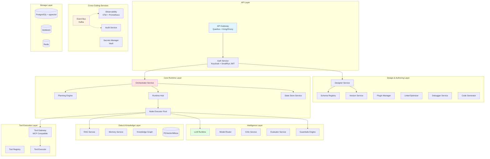

# Wayang AI Agent Workflow Platform - Complete Implementation Guide

## Executive Summary

This is a comprehensive implementation guide for building a production-ready, multi-tenant AI Agent Workflow Platform using **Quarkus 3.x** with a microservices architecture. The platform supports both full orchestration mode and standalone/portable agent generation, with shared modular runtime components.

---

## 1. High-Level Architecture Overview



---

## 2. Technology Stack

### 2.1 Core Framework
- **Quarkus 3.6+** - Supersonic Subatomic Java
- **GraalVM Native Image** - For standalone agents
- **Kotlin** (optional) - For DSL and type-safe builders

### 2.2 Key Quarkus Extensions

```xml
<!-- Core Platform -->
<dependency>
    <groupId>io.quarkus</groupId>
    <artifactId>quarkus-resteasy-reactive-jackson</artifactId>
</dependency>
<dependency>
    <groupId>io.quarkus</groupId>
    <artifactId>quarkus-hibernate-reactive-panache</artifactId>
</dependency>
<dependency>
    <groupId>io.quarkus</groupId>
    <artifactId>quarkus-reactive-pg-client</artifactId>
</dependency>

<!-- Security -->
<dependency>
    <groupId>io.quarkus</groupId>
    <artifactId>quarkus-oidc</artifactId>
</dependency>
<dependency>
    <groupId>io.quarkus</groupId>
    <artifactId>quarkus-smallrye-jwt</artifactId>
</dependency>

<!-- Messaging -->
<dependency>
    <groupId>io.quarkus</groupId>
    <artifactId>quarkus-smallrye-reactive-messaging-kafka</artifactId>
</dependency>

<!-- Observability -->
<dependency>
    <groupId>io.quarkus</groupId>
    <artifactId>quarkus-micrometer-registry-prometheus</artifactId>
</dependency>
<dependency>
    <groupId>io.quarkus</groupId>
    <artifactId>quarkus-opentelemetry</artifactId>
</dependency>

<!-- WebSocket -->
<dependency>
    <groupId>io.quarkus</groupId>
    <artifactId>quarkus-websockets-next</artifactId>
</dependency>

<!-- gRPC (for service-to-service) -->
<dependency>
    <groupId>io.quarkus</groupId>
    <artifactId>quarkus-grpc</artifactId>
</dependency>

<!-- LangChain4j Integration -->
<dependency>
    <groupId>io.quarkiverse.langchain4j</groupId>
    <artifactId>quarkus-langchain4j</artifactId>
</dependency>

<!-- Scheduler -->
<dependency>
    <groupId>io.quarkus</groupId>
    <artifactId>quarkus-scheduler</artifactId>
</dependency>

<!-- Vault -->
<dependency>
    <groupId>io.quarkus</groupId>
    <artifactId>quarkus-vault</artifactId>
</dependency>
```

### 2.3 Additional Libraries

```xml
<!-- CEL Expression Engine -->
<dependency>
    <groupId>dev.cel</groupId>
    <artifactId>cel</artifactId>
    <version>0.4.4</version>
</dependency>

<!-- JSON Schema Validator -->
<dependency>
    <groupId>com.networknt</groupId>
    <artifactId>json-schema-validator</artifactId>
    <version>1.0.87</version>
</dependency>

<!-- WASM Runtime (for untrusted plugins) -->
<dependency>
    <groupId>io.github.kawamuray.wasmtime</groupId>
    <artifactId>wasmtime-java</artifactId>
    <version>0.18.0</version>
</dependency>

<!-- Mermaid/PlantUML (for visualization) -->
<dependency>
    <groupId>net.sourceforge.plantuml</groupId>
    <artifactId>plantuml</artifactId>
    <version>1.2023.13</version>
</dependency>
```

---
